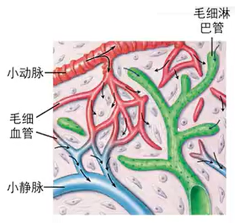
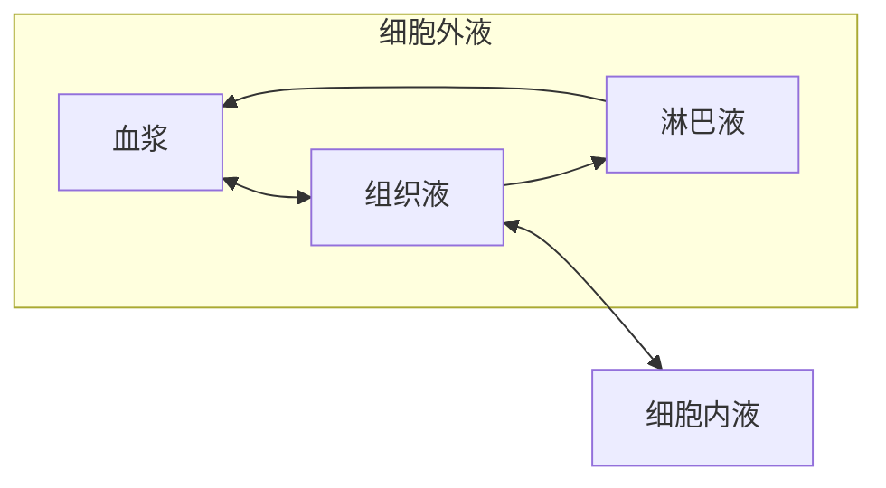

# 内环境

## 低级动物和高级动物

- **单细胞动物**、**简单的多细胞动物** 的细胞 **直接生活在外部环境** 中，与外部环境进行物质交换．
- **高等动物** 的绝大多数细胞生活在 **细胞外液** 中，通过细胞外液与外界进行物质交换．

## 人体的各种液体

### 人体的各种液体介绍

人体和其他动物 **体内** 含有大量以水为基础的液体，这些液体统称 **体液**．

:::warning 生物学上对「体内」的定义

生物学上对「体内」的定义是 **彻底不与外界相通的部分**．下面的部位归类于 **体外**：

- 双开口：消化系统（口腔、咽喉、胃、肠道、肛门）．
- 单开口：呼吸道，器官，支气管一路、尿道，膀胱一路、外耳道、皮肤上的毛孔、输精管、输卵管．

因此，**消化液（含唾液、胃液（含胃酸等）、胆汁、胰液、肠液等）、尿液、泪液、汗液、精液** 这一类 **外分泌液**（在激素调节学习）等均 **不属于体液**．

:::

体液的组成：

- **细胞内液**：存在于细胞内的部分．约占体液的 $\frac 2 3$（质量分数，下同），为体液中含量最多的部分．
- **细胞外液**：存在于细胞外的部分．约占体液的 $\frac 1 3$．细胞外液包含（含量从大到小排序）：
	- **组织液**：约占细胞外液的 $\frac 4 5$，为细胞外液中 **含量最多** 的部分．
	- **血浆**：为细胞外液中 **最活跃** 的部分．
	- **淋巴液**．
	- 脑脊液等……（其余高中阶段无需了解）．

:::warning 细胞内液 $\boldsymbol \ne$ 细胞液

- **细胞液** 专指植物细胞液泡内的液体．
- **细胞内液** 是动物细胞内的液体总称．

可以看出，这两个概念不仅不相等，没有从属关系，甚至交集为空．

:::

由 **细胞外液** 构成的液体环境称作 **内环境**．

:::note 如何理解「内」环境指细胞「外」液？

内环境的「内」指的是体内的「内」，将范围限定到了人体内的所有液体，即体液．

而内环境的「环境」意为细胞生存的环境，则排除了细胞内的液体（细胞内液），范围进一步缩小到细胞外液．

:::

**内环境是机体内细胞生活的直接环境**．

### 【考点】辨析生理过程是否发生在内环境

细胞外液 / 内环境处在中间位置：既不包含太内的，即 **细胞内**；也不包含太外的，即 **人体外**．

举例归类：

- 不发生在内环境的（**细胞内**）：**细胞呼吸**、**细胞内蛋白质，神经递质，激素等物质的合成**、**DNA 的复制，转录，翻译**、**血液运输 $\ce{O2}$**（$\ce{O2}$ 与红细胞结合运输）．
- 不发生在内环境的（**人体外**）：消化道中淀粉、脂肪、蛋白质等物质的 **消化**．
- 发生在内环境的：
	- 血液运输 $\ce{CO2}$（$\ce{CO2}$ 溶入血浆中运输）．
	- 乳酸与 $\ce{NaHCO3}$ 作用生成乳酸钠和 $\ce{H2CO3}$．
	- 神经递质与受体的结合（第二章《神经调节》学习）．
	- 激素与靶细胞的结合（第三章《体液调节》学习）．
	- 抗体与抗原的结合（第四章《免疫调节》学习）．

### 【考点】辨析物质是否存在于内环境

下面四种物质都不可能存在于内环境，需要排除．

- **太内的**：细胞内特有的物质，如 **血红蛋白**、DNA、RNA、DNA 聚合酶、DNA 解旋酶、糖原、呼吸酶等．
- **太外的**：与外界环境相通的物质（外分泌液）：消化液（含唾液、胃液（含胃酸等）、胆汁、胰液、肠液等）、尿液、泪液、汗液、精液等．
- **在细胞膜上的**：转运蛋白、受体．
- **不能被直接吸收的**：麦芽糖、纤维素、淀粉等．

下面四种物质存在于内环境．

- **营养物质**：水、无机盐、$\ce{O2}$、氨基酸、维生素、葡萄糖、甘油、脂肪酸等．
- **代谢废物**：$\ce{CO2}$、尿素、尿酸、肌酐等．
- **信息分子**：神经递质、激素、细胞因子等（后面学习）．
- **血浆蛋白**：纤维蛋白原、抗体（免疫球蛋白）等．

::::warning 血红蛋白 $\boldsymbol \ne$ 血浆蛋白

**血红蛋白** 存在于 **红细胞内部**，属于 **细胞内液** 的成分，是由珠蛋白和富含 $\ce{Fe^2+}$ 的血红素分子结合而成的复合蛋白质．一个红细胞约含 $\pu{2.6E8}$ 个血红蛋白分子．

**血浆蛋白** 为 **血浆内所有蛋白质的统称**，属于 **细胞外液（内环境）** 的成分，种类繁多，但不包含血红蛋白．

:::note 「血红蛋白不在内环境中」只是一个「应试知识点」

到目前为止，「血红蛋白不在内环境中」在一本合格的高中教辅资料中一定会有体现，在一本合格的练习册一定会有考题，甚至最近高考刚出现过这个考点．但是血红蛋白真的不在内环境中吗？事实上，**正常人的血浆本身是可以检验出血红蛋白的**，所以事实并非如此．

生物体是复杂的，并没有那么多绝对因素，对于爱出绝对概念性判断的高考生物，可能会遇到许多这样的问题．作为高考考生，这样错误的知识点也只能必须掌握了．

:::

:::note 「血红蛋白在血浆 / 内环境中出现得更多了」意味着什么？

意味着 **部分红细胞结构受到破坏**，内部的血红蛋白逸散到血浆中了．

注意：不意味着红细胞携带的血红蛋白分子总数变多．这种情况是血红蛋白在细胞内液中出现更多，而非血浆 / 内环境中．

:::

::::

## 细胞外液的各部分

### 细胞外液各部分介绍

- **血浆** 存在于血管中，为血细胞的生活环境．
- **组织液** 又称 **组织间隙液**，存在于组织细胞的间隙中，为大多数体细胞的生活环境（因此含量最多）．
- **淋巴液**，又称 **淋巴**，存在于淋巴管中，为淋巴细胞和吞噬细胞的生活环境．淋巴管组成的淋巴系统是遍布全身的，而不是某个特定部位的器官．

:::note 血液和血浆的关系

血液包括血浆和血细胞两部分．**血液不是体液，血浆才是**．血细胞主要包含红细胞（主要功能为运输氧气）、白细胞（血细胞中免疫细胞的统称）和血小板（主要功能为止血）三种细胞．

- 在血液中 **加入抗凝剂**（如柠檬酸钠），离心或静置分层后，位于上层的淡黄色半透明液体为 **血浆**，约含 $90\%$ 的水；中间一个薄层为 **白细胞和血小板**；而下方全部为 **红细胞**．
- 在血液中 **不加抗凝剂**，静置凝固后，血液中一部分会凝结为 **血凝块**，剩余的淡黄色透明液体为 **血清**．血清与血浆外观上相似，主要区别在于血清经历了血液凝固过程，其中的许多凝血因子（特别是纤维蛋白原）在凝血过程中被消耗．

:::

:::note 血浆运输物质的方式

$\ce{O2}$ 通过 **进入红细胞与血红蛋白结合形成氧合血红蛋白** 的方式被运输．

其它物质（如 $\ce{CO2}$ 等）主要 **直接溶入血浆** 运输．

:::

### 细胞外液各部分的联系

如图所示，小动脉与小静脉之间通过毛细血管网连接．毛细血管中靠近动脉的一部分称作毛细血管的 **动脉端**；靠近静脉的一部分称作毛细血管的 **静脉端**．右边绿色的管道为 **淋巴管**，最细的部分为 **毛细淋巴管**．

毛细血管的特点：

- **内径极小**，只允许 **红细胞单行通过**（一次只能通过一个）．
- 毛细血管壁由 **单层上皮细胞** 构成，只 **允许小分子物质**，如水，无机盐，葡萄糖，脂质等 **穿壁离开或进入毛细血管**，而 **不允许大分子物质**，如 **蛋白质** 穿壁（注意是「穿壁」而不是「通过」，血浆蛋白可以通过毛细血管，只是不能在毛细血管处穿壁离开）．

毛细淋巴管的特点：

- 血管处处为通路，整体构成一个闭环；而毛细淋巴管存在封闭的端点，称作 **盲端**．
- 毛细淋巴管壁由 **单层上皮细胞** 构成，呈瓦片状或鱼鳞状相互覆盖，其间有较大间隙．相邻细胞重叠的部分构成了单向活瓣，只允许 **组织细胞液单向流入淋巴液**，而不允许淋巴液回流入组织细胞液．

上图中血浆、组织液、淋巴液的关系如下（建议结合图看，为方便读者再放一次图）：

- **毛细吸管的动脉端处，有血浆渗出到细胞间隙，成为组织液**．这是组织液的主要来源．设单位时间内，这个渗出量为 $x$．这一部分渗出的液体主要包含水和无机盐，同时也富含 **营养物质**，如 $\ce{O2}$，葡萄糖，氨基酸等．
- **毛细血管静脉端处，有组织液回收到血浆中**．这一部分回收量为 $x$ 的 $90 \%$．这一部分回收的液体主要也包含水和无机盐，但富含 **代谢废物**，如 $\ce{CO2}$ 和尿素．这里回收是一个动脉血变静脉血的过程．
- **毛细淋巴管处，有组织液进入淋巴液**．这一部分的进入量为 $x$ 的 $10 \%$．

> 单位时间内，组织液的流入流出量平衡了，整体来说相当于血浆间接给了淋巴液 $x$ 的 $10 \%$ 的量．显然血浆不可能越来越少，淋巴液不可能越来越多，因此这部分多余的量一定会在某一刻被还回去！

的确如此，数条毛细淋巴管可以聚集成较大的淋巴管，最后汇集成两条最大的淋巴管，分别汇入左右锁骨的下静脉．那 $10\%$ 的量就是在这里从淋巴液回收到血浆的，于是三种体液均收支平衡了．这个流程称作 **淋巴循环**．锁骨处也是 **淋巴液单向通入血浆**，不能回流．

注意到淋巴循环和血液循环的差别：血液循环是在一个环中循环，而淋巴循环有多个起点和两个终点——起点为所有的毛细淋巴管盲端，终点为两条汇入左右锁骨下静脉的淋巴管．淋巴循环正是通过血浆涌入起点，又从终点流回血浆而完成的，因此淋巴循环的成因是血液循环，是血液循环的辅助途径．

**组织液和组织细胞的细胞内液也会进行物质交换**．组织细胞会从组织液中获取营养物质，并将代谢废物排到组织液中．

综上，我们可以绘制出血浆、组织液、淋巴液和组织细胞内液（由于大量细胞都是组织细胞，有时直接省略称为细胞内液）的关系图：

:::note 手掌或脚掌上磨出的水泡中的成分是什么？

**是组织液**．

皮肤在受到摩擦后，表皮与皮下组织分离形成间隙，组织液渗入形成水泡．一段时间后水泡会自行消失，是因为这部分组织液通过毛细血管壁流入血浆和淋巴液中，说明了内环境物质是不断更新的．

:::

### 【考点】辨析不同细胞直接生活的内环境部分

不易错：

- 红细胞：血浆．
- 毛细血管壁细胞：血浆和组织液．
- 毛细淋巴管壁细胞：淋巴液和组织液．
- 绝大多数组织细胞：组织液．

易错：**免疫细胞（包含淋巴细胞与吞噬细胞）** 不仅生活在淋巴液中，也生活在 **血浆** 中——白细胞正是血浆中包含的所有免疫细胞的总称．

### 【考点】穿膜计算

不考虑物质通过细胞间隙进出的情形，物质进入组织细胞至少需要穿过多少层生物膜？

一层生物膜 $=$ 一层细胞膜 $=$ 一层磷脂双分子层 $=$ 两层磷脂分子层．

肺泡壁、毛细血管壁、小肠绒毛壁、肾小管壁等均由单层上皮细胞构成，物质通过这些结构都需要穿过两层生物膜（进入壁细胞一次，离开壁细胞一次）．

养料（如葡萄糖）的穿膜过程：进出小肠绒毛上皮细胞，离开小肠（$2$ 层）$\to$ 进出毛细血管壁细胞，进入血浆（$2$ 层）$\to$ 进出毛细血管壁细胞，离开血浆（$2$ 层）$\to$ 进入组织细胞（$1$ 层）．共 $7$ 层．

$\ce{O2}$ 的穿膜过程：进出肺泡壁细胞，进入肺泡再出去（$2$ 层）$\to$ 进出毛细血管壁细胞，进入血浆（$2$ 层）$\to$ 进出红细胞（$2$ 层）$\to$ 进出毛细血管壁细胞，离开血浆（$2$ 层）$\to$ 进入组织细胞（$1$ 层）．共 $9$ 层．

如果要求 $\ce{O2}$ 进入组织细胞 **且被利用** 的穿膜次数，还需要加上进入线粒体（注意线粒体双层膜，因此为 $2$ 层），共 $11$ 层．

当然生物体是复杂的，实际的穿膜次数往往不是这么一个死板的精确的数字．所以这类不严谨的题目高考也从未考察过，不过阶段性测试倒是经常有考察．

### 【考点】不同给药方式中药物的运输路径

- 口服：药物 $\to$ 消化道 $\to$ 血浆 $\to$ 组织液 $\to$ 细胞内液．
- 肌肉注射：药物 $\to$ 组织液 $\to$ 血浆 $\to$ 组织液 $\to$ 细胞内液．
- 静脉滴注：药物 $\to$ 血浆 $\to$ 组织液 $\to$ 细胞内液．

## 内环境的成分

### 血浆的主要成分

- **水**（$90 \%$，质量分数，下同）：血液中营养物质和代谢废物的溶剂．
- **蛋白质**（$7 \% \sim 9 \%$）：包含血清白蛋白、纤维蛋白原、抗体、丙氨基酸氨基转移酶、蛋白质类激素等．
- **无机盐**（$1 \%$）：以 $\ce{Na+}$、$\ce{Cl-}$、$\ce{K+}$、$\ce{Ca^2+}$、$\ce{HCO3-}$ 和 $\ce{HPO4^2-}$ 为主．
- **血液运输的其它物质**（少量）：
	- **营养物质**：（上面的水、蛋白质、无机盐也属于营养物质）、$\ce{O2}$、葡萄糖、脂质、氨基酸、维生素等．
	- **代谢废物**：$\ce{CO2}$、蛋白质和核酸代谢产生的含氮废物（如氨、尿素、尿酸、肌酐等）．
	- **其它**：甲状腺激素、性激素等．

### 组织液和淋巴液的成分

考虑到组织液和淋巴液与血浆是相通的，所以组织液、淋巴液的成分与各成分的含量与血浆相近．但又不完全相同，因为：

- 毛细血管壁通常情况下不允许大量蛋白质大分子通过，因此 **血浆的蛋白质含量远高于组织液与淋巴液**．
- 从肠道吸收的甘油和脂肪酸绝大部分是经过淋巴液进入血浆的，因此淋巴液中甘油与脂肪酸的含量相对较高．

细胞内液中的蛋白质含量高于血浆．

:::note 为什么脂肪成分不直接吸收进血浆而要通过淋巴液？

因为脂肪成分与其它营养成分易溶于水不同，它是 **难溶于水** 的，因此很难进入血浆．

淋巴循环不是一个环，其起点在毛细淋巴管的盲端处，所以脂肪成分可以直接进入形成这里初始的淋巴液．也就是说 **不是淋巴液经过了脂肪成分吸收它，而是脂肪成分直接在毛细淋巴管处形成淋巴液**，这样就不会造成脂肪成分突然进入水溶液造成不溶解的突兀，方便了不溶于水的脂肪通过淋巴循环再进入血液循环．

这也是其它部位的淋巴液是无色的，而肠淋巴管内的淋巴液（又称乳糜液）是乳白色的原因．

:::

当然，血浆、组织液和淋巴液所浸泡的细胞也是截然不同的，但细胞并不是细胞外液的一部分，自然也不应被计入成分．

**从某种意义上说，细胞外液是一种类似于海水的盐溶液．这在一定程度上反映了生命起源于海洋**．

### 淋巴循环的意义

淋巴循环的意义与三种细胞外液的成分差异有关，所以这一节放在这里介绍．淋巴循环的意义主要有二：

一是 **免疫**．淋巴液混悬着大量的免疫细胞，可以协助机体抵御疾病．

二是 **调节**．淋巴循环是血液循环的辅助途径，可以调节血浆和组织液之间的平衡：

- 毛细淋巴管可以回收 **非正常情况下渗入组织液中的血浆蛋白** 等物质（其禁止让淋巴液回流组织液的特点也为这个功能提供保障），然后通过淋巴循环返还给血浆．
- 淋巴液还将由小肠绒毛吸收的 **大部分脂肪成分** 等运送到血浆．

### 【考点】内环境与细胞内液的气体浓度比较

前置知识：$\ce{O2}$ 和 $\ce{CO2}$ 的运输方式是 **自由扩散**，而自由扩散的方式是浓度高的地方到浓度低的地方．

- $\ce{O2}$ 的转移途径是血浆 $\to$ 组织液 $\to$ 细胞内液，因此 $\ce{O2}$ 的浓度应该为血浆 $>$ 组织液 $>$ 细胞内液．
- $\ce{CO2}$ 的转移途径是细胞内液 $\to$ 组织液 $\to$ 血浆，因此 $\ce{CO2}$ 的浓度应该为细胞内液 $>$ 组织液 $>$ 血浆．

### 【考点】血浆流经细胞成分变化

血浆流过绝大部分组织细胞后，营养成分（如 $\ce{O2}$，葡萄糖，脂肪等）减少（给予组织细胞营养），代谢废物（如 $\ce{CO2}$，尿素，尿酸等）增加（被组织细胞扔垃圾），从含氧丰富的动脉血变为主要含二氧化碳的静脉血．但存在一些特例：

- **小肠绒毛上皮细胞** 是汲取除 $\ce{O2}$ 外的营养的场所，因此血浆流过小肠绒毛上皮细胞时，除了 $\ce{O2}$ 外，**其它营养成分应当增加**（$\ce{O2}$ 仍然减少）．
- **肾脏细胞** 是代谢除 $\ce{CO2}$ 外的废物的场所，因此血浆流过肾脏细胞时，除了 $\ce{CO2}$ 外，**其它代谢废物应当减少**（$\ce{CO2}$ 仍然增加）．
- **肺部细胞** 是气体交换的场所，因此血浆流过肺部细胞时，$\ce{O2}$ 增加，$\ce{CO2}$ 减少，其余照常．这里也是静脉血变动脉血的场所．
- **肝脏细胞** 是合成或分解肝糖原的场所．**饥饿状态下**，肝糖原会分解释放葡萄糖，因此血浆内葡萄糖含量增加，其余照常；**饱腹状态下**，肝糖原合成汲取葡萄糖，因此血浆内葡萄糖含量减少，一切照常．不过，无论饥饿还是饱腹，营养物质的总量均下降．

## 内环境的理化性质

### 温度

人体内环境的温度一般维持在 $\pu{37 ^\circ C}$．

### 酸碱度

正常人的血浆近中性，$\mathrm{pH}$ 为 $7.35 \sim 7.45$．

### 渗透压

在无重力的环境下（去除高度差带来的压强影响），在 U 型管中间安置一个半透膜（只允许水通过，不允许溶质通过）后，将待测溶液与水分别注入 U 形管两侧，可见到水通过半透膜往溶液一端渗透，这就是渗透作用．

若于溶液端施加压强，此压强可刚好阻止水的渗透，则称此压强为 **渗透压**．其本质是化学势之差导致粒子有运动的趋势，高中阶段不需了解太多．

渗透压越大，说明阻止水的渗透越难，也即溶液中溶质对水的吸引力作用越大．因此，渗透压描述了 **溶液中溶质微粒对水的吸引力大小**．加粗部分同时也是高中阶段对渗透压的定义．

据范特霍夫定律，对于稀溶液（溶质分子两两距离较大，相互作用可忽略），有

$$
\pi = cR T
$$

其中 $\pi$ 是溶液的渗透压，$c$ 是溶液的物质的量浓度，$R$ 是理想气体常数（和 $pV = nR T$ 中的 $R$ 是一个），$T$ 为热力学温度．

也就是说，稀溶液的渗透压近似与 **该溶液物质的量浓度** 和 **热力学温度** 成正比．这个公式的发现让其发现者范特霍夫获得了第一届诺贝尔化学奖．

观察到 $pV = nR T$ 其实等价于 $p = cRT$，范特霍夫定律和理想气体状态方程的形式出乎意料地一致．背后的原因笔者也了解甚少，感兴趣的读者可以自行查阅相关资料或在评论区补充．

:::note 渗透压的影响因素是物质的量浓度而不是质量分数

渗透压的影响因素是 **物质的量浓度** $c$，而不是质量分数 $\omega$．

考虑 $\pu{0.3 mol * L-1}$ 的葡萄糖溶液和 $\pu{0.3 mol * L-1}$ 的蔗糖溶液，它们的渗透压相等．

考虑质量分数为 $30\%$ 的葡萄糖溶液和质量分数为 $30\%$ 的蔗糖溶液，前者渗透压大约为后者的两倍．因为蔗糖相对分子质量大约为葡萄糖的两倍，因此对于相同的质量分数，蔗糖溶液的物质的量浓度应大约为葡萄糖溶液的物质的量浓度的一半，渗透压也是一半．

:::

$\pu{37 ^\circ C}$ 时人血浆的渗透压约为 $\pu{770 kPa}$，与细胞内液渗透压相等．

两个溶液渗透压相等时，互称 **等渗溶液**；比溶液 $A$ 的渗透压高的溶液称为溶液 $A$ 的高渗溶液；低渗溶液同理．省略比较对象时（如「溶液 $A$ 是等渗溶液」），一般指的是与人血浆渗透压 $\pu{770 kPa}$ 比较．

质量分数为 $0.9 \%$ 的 $\ce{NaCl}$ 溶液（生理盐水）、质量分数为 $5 \%$ 的葡萄糖溶液均为人体血浆的等渗溶液．输液时必须使用等渗溶液，否则血细胞、组织细胞等会吸水或失水，无法保持正常形态，行使功能．

对于人体内环境，渗透压的影响因素：

- 血浆渗透压的大小主要与 **无机盐**、**蛋白质** 的含量有关（本句应背诵）．
- 综合来看，细胞外液渗透压的 $90\%$ 以上来源于 $\ce{Na+}$ 和 $\ce{Cl-}$（细胞外液中的无机盐离子主要是这两者）．

对于 **细胞内液**，其渗透压的因素则主要为 $\ce{K+}$ 和 $\ce{Cl-}$（细胞内液中的无机盐离子主要是这两者）．

:::note 为什么血浆中蛋白质含量比无机盐多，提供的渗透压却比无机盐少？

因为血浆中蛋白质含量比无机盐多，指的是 **质量分数** $\omega$ 更大，而非物质的量浓度 $c$．

由于 **蛋白质的相对分子质量远大于无机盐离子**，因此 **蛋白质的物质的量浓度远低于无机盐离子**，因此 **蛋白质提供的渗透压远低于无机盐离子**．

虽然如此，血浆中蛋白质的渗透压不能忽略不计．题目考察血浆渗透压大小的因素，**一定要写无机盐和蛋白质两者**．

:::

由晶体物质（如 $\ce{NaCl}$）形成的渗透压称作 **晶体渗透压**．三种细胞液和细胞内液的晶体渗透压都基本相同．该渗透压影响 **细胞内外的水平衡**，细胞内液为等渗溶液时，方能维持细胞正常的形态和功能．

由胶体物质（如血浆蛋白）形成的渗透压称作 **胶体渗透压**，人体内主要是血浆中血浆蛋白引起的渗透压．该渗透压主要影响 **毛细血管两侧的水平衡**．

## 细胞通过内环境与外界进行物质交换

**细胞与外界的物质交换** 是通过 **细胞与内环境的物质交换** 与 **内环境与外界的物质交换** 两步来进行的．

细胞与内环境的物质交换：

- 大多数体细胞为组织细胞，与组织液进行物质交换．
- 血细胞与血浆进行物质交换．
- 淋巴液中的免疫细胞与淋巴液进行物质交换．

关于内环境与外界的物质交换，直接相关的共有四个系统：循环系统、呼吸系统、消化系统、泌尿系统．

- **呼吸系统** 吸入营养物质氧气进入血浆（内环境），血浆内的代谢废物二氧化碳进入呼吸系统排出体外．血浆就是在这里从主要为二氧化碳的静脉血回变成含氧丰富的动脉血的．
- **消化系统** 消化吸收食物中的营养，易溶于水的营养物质（如葡萄糖）来到血浆，不易溶于水的营养物质（如脂肪）来到淋巴液，不能被消化吸收的则从来没有进入过内环境就被排出体外．
- 除二氧化碳通过呼吸作用排出体外以外，剩余其它代谢废物主要通过 **泌尿系统** 排出体外（也有部分通过 **皮肤** 排出）．
- 显然 **循环系统** 作为将物质循环运输的主要系统，在此发挥最基础的作用．

直接有关的共有四个器官：肺（呼吸系统）、肾（泌尿系统）、小肠（消化系统）、皮肤．

接下来是一些要背的官话．

内环境的作用有二：

- **内环境是机体内细胞生活的直接环境**．
- **细胞通过内环境与外界环境进行物质交换** / **内环境是细胞与外界进行物质交换的媒介**．

**细胞与内环境之间是相互影响、相互作用的．细胞不仅依赖于内环境，也参与了内环境的形成和维持**．

:::note 物质交换不一定必须通过内环境

并不是所有细胞与外界的物质交换都通过内环境为媒介，如 **小肠绒毛上皮细胞** 直接从外界吸收葡萄糖等营养物质、**肺泡壁细胞** 直接从外界吸收 $\ce{O2}$，向外界排出 $\ce{CO2}$、**口肠粘膜上皮细胞** 也可以直接与嘴中的食物进行物质交换．毕竟物质想进入内环境，也要先经过内环境的「壁细胞」．

不过，这些「壁细胞」不能通过与外界直接物质交换来交换到自己所需的全部物质，如肺泡壁细胞吸收葡萄糖仍然要通过血浆．因此，**体内所有细胞都要通过内环境与外界环境进行物质交换，是正确的**．

:::
