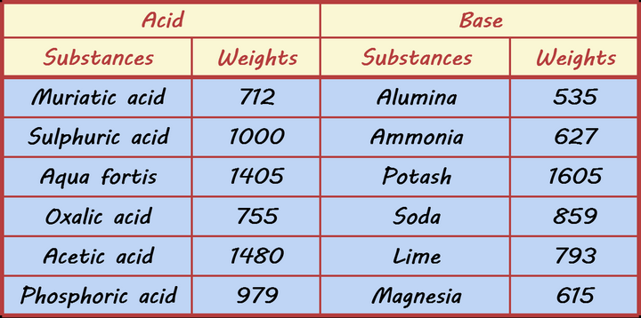
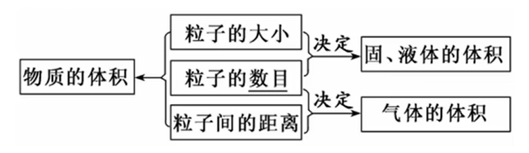

# 化学计量

## 物质的量

### 物质的量引入

利用化学反应制作期望的产品时，对反应物用量的把控是至关重要的，如 $\ce{Fe}$ 与 稀 $\ce{HCl}$ 的反应：

- 金属少了（少量），则酸剩余．
- 金属多了（过量），则金属剩余．
- 当金属恰好足量时，使得金属和酸都恰好反应完全．

从这个初中学过的例子就不难看出，**反应物的用量决定着反应结果**．

然而，在以前化学还不是很成熟的年代，对于量的把控是用 **天平称量质量** 来实现的（更早甚至不是天平，而是秤）．在那个原子、分子还没被发现的年代，人们是将各种反应物按照 **质量比投料** 来进行生产活动的，甚至在科研工作中也是如此．1802 年，化学家总结出了一张酸碱当量表：

在那个分子原子还未被发现的年代，对物质的认识都停留在宏观的概念，因此表中的物质都是用俗称表述的．

表中左半栏为酸，右半栏为碱，左半栏六种酸分别为 $\ce{HCl}$、$\ce{H2SO4}$、$\ce{HNO3}$、$\ce{H2C2O4}$（草酸）、$\ce{CH3COOH}$、$\ce{H3PO4}$；右半栏六种碱分别为 $\ce{Al2O3}$、$\ce{NH3}$、$\ce{K2CO3}$、$\ce{Na2CO3}$、$\ce{CaCO3}$、$\ce{MgO}$．

:::warning 提示

在现代化学的分类中，这六种物质都不能称之为碱，但均可与酸反应．在那个年代，这六种物质均被认为是碱．

:::

初中知识告诉我们，左半侧的六种酸的任一，均可与右半侧六种「碱」的任一反应，而表告诉了我们两个物质 **恰好完全反应时的质量比**，如 $712$ 份质量的 $\ce{HCl}$ 可与 $859$ 份质量的 $\ce{Na2CO3}$ 恰好完全反应．

先不说上面的量化数据是否准确，单说这样的研究方式就存在很多弊端．表中的数据 **毫无规律**，化学反应的数量又成千上万，远不止「酸碱中和」此类反应一种，难道对于每个反应，我们都需要一个个做实验称质量，得到一个更庞大的数据表吗？这显然不现实．

到了后来阿伏伽德罗的分子学说、以及道尔顿的原子论的提出，人们对物质的认知走向微观世界．对化学反应的微观认知也是我们在初中已经简单接触的内容，如

$$
\ce{Na2CO3 + 2HCl -> 2NaCl + H2O + CO2}
$$

本质上是每个 $\ce{CO3^2-}$（碳酸根离子）结合了两个 $\ce{H+}$（氢离子）、变成一个 $\ce{H2CO3}$ 分子，再分解为 $\ce{H2O}$ 和 $\ce{CO2}$ 的过程．

因此为了使得每个 $\ce{CO3^2-}$ 离子匹配 $2$ 个 $\ce{H+}$，$\ce{Na2CO3}$ 和 $\ce{HCl}$ 的投料比，在 **粒子数** 上满足 $1:2$，同时，这个 $1 : 2$ 也是方程式中两个反应物的 **化学计量数**（即配平系数）之比．

可以看到，在量化反应投料比上，**粒子数比** 显然比 **质量比** 要更加 **本质、简洁与精确**．只要我们明晰一个反应的 **反应原理**，或者至少，我们能将一个方程式 **成功配平**，那么我们就可以直接得到 **反应物的粒子数之比**，进而精确控制反应的产物．

但问题又来了：我们怎么配出 **粒子数比** 为 $1 : 2$ 的 $\ce{Na2CO3}$ 和 $\ce{HCl}$？按质量比投料虽然有诸多困难，但至少它是 **直接可行的**，因为质量至少 **直接可测**，但按粒子数比投料虽然有诸多优点，但即使是现在，我们也没有能精确测量物质内所含粒子数的仪器．也就是说，物质所含粒子数是一个 **不可直接测得** 的物理量．

但这里有一个聪明的做法：考虑两个物质的 **相对分子 / 原子质量**．$\ce{Na2CO3}$ 的相对分子质量为 $106$，而 $\ce{HCl}$ 的相对分子质量为 $36.5$．这意味着：一个 $\ce{Na2CO3}$ 粒子与一个 $\ce{HCl}$ 粒子，它们的质量比为 $106 : 36.5$．

那么，只要我们称量 $\pu{106 g}$ 的 $\ce{Na2CO3}$ 和 $2 \times \pu{36.5 g} = \pu{73 g}$ 的 $\ce{HCl}$，我们就可以获得 **粒子数比** 为 $1 : 2$ 的 $\ce{Na2CO3}$ 和 $\ce{HCl}$ 了！

换句话说，无论是 $\pu{36.5 g}$ 的 $\ce{HCl}$，还是 $\pu{106 g}$ 的 $\ce{Na2CO3}$，还是 $\pu{\mr g}$ 的 **任意粒子**（$\mr$ 是该粒子的相对分子 / 原子质量），理论上它们含有的粒子数应当相同．事实上确实如此，这个粒子数一般记作

$$
\na = \pu{6.02214076E23}
$$

- 直接考虑称量 **任意数目** 的某种粒子很困难，甚至不可做．
- 称量 **数目为 $\na$** 的某种粒子是简单的：只需称量这种粒子 $\pu{\mr g}$．
- 称量 **数目为 $k\na$** 的某种粒子也是简单的：只需称量这种粒子 $k\pu{\mr g}$．
- 上面的做法相当于称出了 $\na$ 个粒子的 $\ce{Na2CO3}$ 和 $2\na$ 个粒子的 $\ce{HCl}$，恰好达成了粒子数比 $1 : 2$ 的预期．

利用相对原子质量，可以很方便地 **按粒子数比** 称量物质，因此这种智慧的方案沿用至今．但上面的称量操作目前只有两种表述：

- 称量 $\pu{106 g}$ 的 $\ce{Na2CO3}$ 和 $\pu{73 g}$ 的 $\ce{HCl}$．
- 称量含有 $\pu{\na}$ 个粒子的 $\ce{Na2CO3}$ 和含有 $2\na$ 个粒子的 $\ce{HCl}$．

无论是哪种表述都不太好．第一种表述没有直观地体现出 $\ce{Na2CO3}$ 粒子集合与 $\ce{HCl}$ 粒子集合的粒子数之比为 $1 : 2$；而第二种表述又显得奇怪．于是化学家做出了智慧的定义：

定义 **粒子数为 $\na$ 的粒子集合** 含有 $\pu{1 mol}$（摩尔）这种粒子．

于是，上面的称量操作可以表示为：

- 称量 $\pu{1 mol}\ \ce{Na2CO3}$ 和 $\pu{2 mol}\ \ce{HCl}$．

也就是说，$\pu{mol}$ 是一个描述 **粒子集合所含粒子数** 的单位，$\pu{\it n mol}$ 任何粒子所含的 **粒子数** 完全相同，均为 $n \na$．

化学家将这个单位对应的物理量起名为 **物质的量**，我们可以说：$\pu{106g}\ \ce{Na2CO3}$ 的 **物质的量** 是 $\pu{1mol}$．

物质的量通常用字母 $n$ 来表示，粒子数通常用字母 $N$ 来表示．有公式

$$
N = n\na
$$

以及

$$
n = \df N {\na}
$$

一个细节是，从上面的公式可以看出，事实上 $\na$ 是有单位 $\pu{mol-1}$ 的，即严格的表述是

$$
\na = \pu{6.02214076E23 mol-1}
$$

计算时通常取小数点前两位，即

$$
\na = \pu{6.02E23 mol-1}
$$

化学反应在具体的投料粒子数上并无要求．比如，没有一种反应要求必须有 $\pu{1E5}$ 个粒子的 $\ce{Na2CO3}$ 和 $\pu{2E5}$ 个粒子的 $\ce{HCl}$ 参与反应．化学反应看重的是 **粒子数之比**，而非 **粒子数**．

因此当 **物质的量** 这个概念被提出后，具体的粒子数就很少再被提及了，因为我们有了这个更加方便的概念．

> $A$ 的物质的量是 $n_A$，$B$ 的物质的量是 $n_B$，$c$ 的物质的量是 $n_C$．

在这个例子中，它们的粒子数之比就是 $n_A: n_B: n_C$．至于具体的粒子数，化学很少再关心，如果真的关心（这种情况一般只有一种：题目考粒子数是多少），我们也可以通过 $N = n\na$ 来计算．甚至「粒子数之比」这种表述都会很少再用，更常用的表述会是「物质的量之比」．

:::warning 三个注意事项

- **物质的量** 这 4 个字是一个整体，**一个字都不能动、加、删**．
- **物质的量** 只用于计量 **微观粒子** 或 **微观粒子的特定组合**，不用于计量 **宏观物质**．
- **物质的量** 表述时注意 **指代明确**．禁止 $\pu{2 mol}$ 氧这种表述（不明确氧指代氧原子、氧离子、氧分子还是臭氧分子）．

:::

### 摩尔质量

对于某种粒子 $A$，单位物质的量的 $A$ 具有的质量称作 **摩尔质量**，符号 $M$，单位 $\pu{g * mol-1}$．

显然，当摩尔质量以 $\pu{g * mol-1}$ 为单位时，其数值与 $A$ 的 **相对分子 / 原子质量** 完全相等，因为 $\pu{1 mol}$ 就是这么定义出来的．

如：$\ce{Cu}$ 的摩尔质量为 $\pu{64 g * mol-1}$，$\ce{Na2CO3}$ 摩尔质量为 $\pu{106 g*mol-1}$．

:::warning 摩尔质量 $\ne$ 相对分子 / 原子质量

摩尔质量是有量纲量，相对质量是无量纲量（因为相对质量的本质是质量与质量的比值，参见定义）．

它们的关系仅为：摩尔质量以 $\pu{g * mol-1}$ 单位时，它们在数值上相等．

:::

:::info 例题 1.2

- $\pu{1.5mol}\ \ce{Na2SO4 * 10H2O}$ 含 $\ce{Na+}$ 的物质的量；含 $\ce{H2O}$ 的数目．
- 一定量 $\ce{Na2CO3}$ 中，碳原子和氧原子物质的量之比．
- 等质量 $\ce{N2}$、$\ce{CH4}$、$\ce{CO}$、$\ce{H2O}$ 中，含分子数最多的物质．
- $\pu{0.5 mol}\ \ce{NaOH}$ 中含有电子的物质的量；物质的量为 $n$ 的 $\ce{Na2CO3}$ 与 $\pu{0.5 mol}\ \ce{NaOH}$ 所含 $\ce{Na+}$ 数目相等，求 $n$．

:::

:::tip 例题 1.2 解答

- $\pu{3 mol}$；$15\na$．
- $1 : 3$．
- $\ce{CH4}$．
- $\pu{10 mol}$；$\pu{0.25 mol}$．

:::

### 气体摩尔体积

物质由微粒构成．

- 固体和液体的微粒 **相距较近**，因此主要影响它们体积的是 **微粒大小** 与 **微粒数目**．
- 而气体微粒之间通常 **相距较远**，因此主要影响它们体积的是 **微粒数目** 与 **微粒间间距**．

对于 **理想气体**，其压强 $p$，体积 $V$，热力学温度 $T$，物质的量 $n$ 满足方程：

$$
pV = nR T
$$

:::note 理想气体是什么？

理想气体的定义将在物理选必三学习，需要一定的前置知识，读者可以先不了解．

高中化学中可以认为所有气体均为理想气体．

:::

上面的方程称作 **理想气体状态方程**，$R$ 称作 **理想气体常数**，大小（不用记忆）为

$$
R = \pu{8.31446261815324 J * K-1 * mol-1}
$$

这个简短有力的方程指示了气体的诸多结论，包括一些耳熟能详的常识，比如：

- 当 $p$，$n$ 不变时，$V \propto T$（气体的 **热胀冷缩** 现象）．
- 当 $V$，$n$ 不变时，$V \propto p$（也可视作气体的 **热胀冷缩**）．
- 当 $n$，$T$ 不变时，$pV \propto 1$（压缩一定量气体，气体体积越小，压强越大，越难压）．

现在，让我们注意该方程导出的另一结论：

- 当 $p$，$T$ 不变时，$V \propto n$．

可以将方程对应变形为：

$$
\df V n = \dfrac{RT}{p}
$$

我们将在 **一定压强、一定温度** 下，气体体积与物质的量这一比值称作 **气体摩尔体积**，符号为 $\vm$，单位为 $\pu{L * mol-1}$．

很明显，气体摩尔体积只与 **压强**、**温度** 有关，而与 **气体种类**、**气体物质的量**、**气体体积** 均无关．

定义 **标准状况** 为 $\* \pu{0 ^\circ C}$、$\* \pu{1 atm} = \pu{101 kPa}$ 的环境，在 **标准状况下**，

$$
\vm = \pu{22.4 L *mol-1}
$$

这提示我们，如果我们已知 $\vm$ 的值，那么 **气体体积** 与 **气体物质的量** 之间可以互相推导．我们有

$$
V = n\vm
$$

$$
n = \df V {\vm}
$$

比如，标况下 $\pu{11.2 L}$ 的 $\ce{H2}$ 含有的物质的量是多少？答案是 $n = \df{V}{\vm} = \pu{0.5 mol}$．

这些 $\ce{H2}$ 的质量是多少？答案是 $m = nM = \pu{1 g}$．

:::warning 考升问题的陷阱

题目一旦出现 **气体体积**，先检查题目 **有没有设下这两个陷阱**！

一：**不谈标况耍流氓**．我们只知道 **标况下** 的 $\vm = \pu{22.4 L *mol-1}$，**任何未说明标况下就将气体体积与物质的量联系在一起的说法均错误**，因为只知道标况数据．

:::
