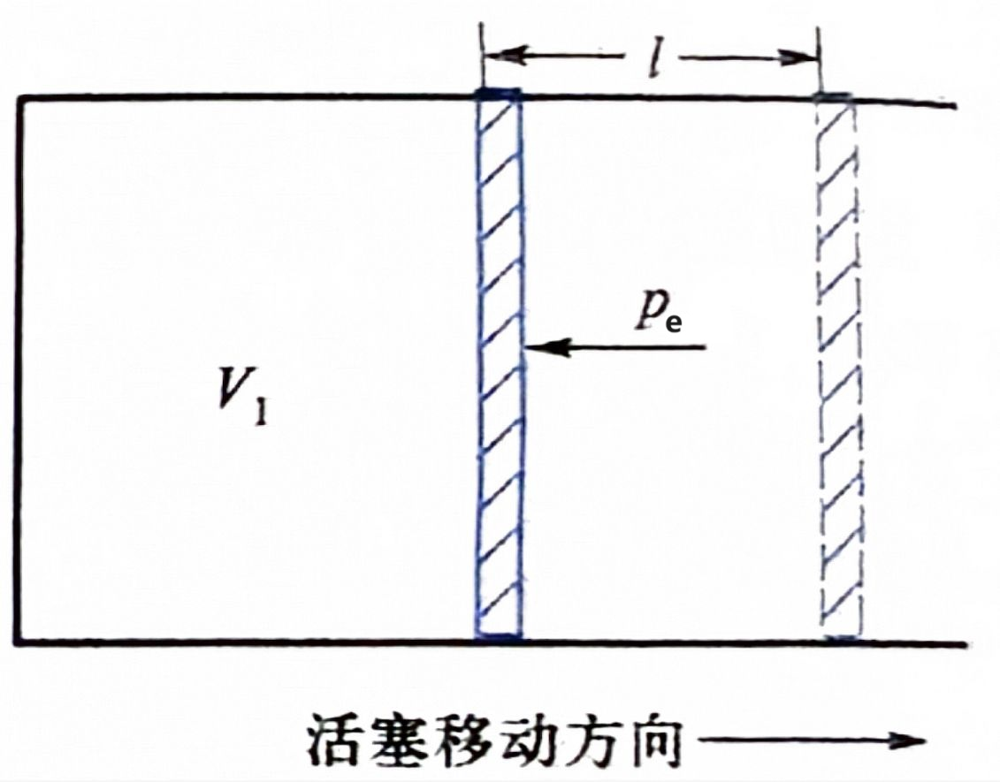

# 化学反应的热效应

## 热效应基本概念

### 系统和环境

在研究化学反应的热效应时，我们需要明确该反应的 **系统** 与 **环境**．下面以研究盐酸和 $\ce{NaOH}$ 溶液的反应为例．

**系统** 是与周围其他部分区分开来的，根据需要所研究的对象．如我们可将稀盐酸、$\ce{NaOH}$ 溶液及发生的反应等看作一个系统．

**环境** 是除了系统外其他全部物体的总和．盛装溶液的试管与溶液之外的空气就是环境的一部分．但通常所说的环境主要是指与系统有物质、能量交换的部分．

系统和环境一般是为了方便研究选取的，比如我们把上面的溶液看成环境，外界全部看成系统也是可以的．同时，也可以将试管看成系统的一部分．只需要保证系统和环境没有重叠地划分了宇宙即可．

不过通常来讲，在溶液发生的反应都是将整个溶液看作系统，溶液以外的看作环境．

### *状态和状态函数

由一系列表征体系性质的物理量所确定下来的体系的存在形式称作 **体系的状态**．借以确定体系状态的物理量称作体系的 **状态函数**．

如研究某理想气体，其物质的量 $n = \pu{1mol}$，压强 $p = \pu{1.01E5 Pa}$，体积 $V = \pu{22.4 dm3}$，温度 $\pu{0 ^\circ C}$，则认为它处于标准状况，这里 $n$，$p$，$V$，$T$ 就是体系的状态函数．

体系的状态和状态函数互相确定．体系的多个状态函数确定了，状态也就确定了；状态确定了，多个状态函数也就确定了．这里状态函数中的「函数」，指的就是它们是体系状态上的函数，比如 $p(标准状况) = \pu{1.01E5 Pa}$．

有些状态函数，如 $V$ 和 $n$ 等所表示的性质具有加和性，如一个体系的 $V$ 等于体系各部分的 $V$ 之和．体系的这类具有加和性的性质，称作体系的 **广度性质**，这类状态函数称作 **广度量**．

还有些状态函数，如 $p$ 和 $T$ 等所表示的性质无加和性，称作体系的强度性质，这类状态函数称作 **强度量**．大部分这类状态函数满足体系的该状态函数等于体系各部分的状态函数．

### *状态的变化

体系的一个状态函数或者几个状态函数发生了改变时，体系的状态发生变化，称体系经历了一个热力学过程，简称过程．

体系发生变化前的状态称作始态，变化后的状态称作终态．体系变化的始态和终态一旦确定，各状态函数的改变量也随之确定．状态函数的改变量用 $\Delta$ 表示，如始态温度 $T_1$，终态温度 $T_2$，我们有状态函数改变量 $\Delta T = T_2 - T_1$．

有一些过程具有值得研究的特殊性，如：

- **恒温条件**：体系始态和终态的温度相等，且等于环境的温度．满足该条件的过程称作 **恒温过程**．
- **恒压条件**：体系始态和终态的压强相等，且等于环境的压强．满足该条件的过程称作 **恒压过程**．
- **恒容条件**：体系始态和终态的体积相等．满足该条件的过程称作 **恒容过程**．

上面三个条件不互斥，可共存，如存在既满足恒温条件又满足恒压条件的过程——恒温恒压过程．

同种过程可以采取多种不同的具体方式实现，每种具体方式称作一种途径．

比如某理想气体从始态 $p = \pu{1E5 Pa}$，$V = \pu{2dm3}$ 经一恒温过程变为终态 $p = \pu{2e5 Pa}$，$V = \pu{1dm3}$．该过程存在无数种途径，其中两种如下：

- 先恒温膨胀为 $p = \pu{0.5E5 Pa}$，$V = \pu{4dm3}$，再恒温压缩为终态 $p = \pu{2e5 Pa}$，$V = \pu{1dm3}$．
- 先恒温压缩为 $p = \pu{2E5 Pa}$，$V = \pu{1dm3}$，再恒温压缩为终态 $p = \pu{2e5 Pa}$，$V = \pu{1dm3}$．

但当过程确定了，无论途径如何，每个状态函数的改变量都是相同的．也即，**状态函数的改变量与途径无关**．

过程的关键是始态和终态，途径则注重具体实施方式．

### *热量的定义

一个途径中，**热量** 指因温度不同而在系统与环境之间交换或传递的能量，用 $Q$ 表示．系统得到正热量（对应环境失去正热量）时，途径热量为正；系统失去正热量时，途径热量为负．

我们称「得到正热量」为「吸收热量」，「放出正热量」为「放出热量」．

### *热量，功与内能变化量的关系

系统与环境的总和就是宇宙．系统内能的增加量等于环境内能的减少量，对于宇宙来说能量守恒．根据热力学第一定律，对始终静止的系统，令 $\Delta U$ 为系统的内能变化，$Q$ 为热量，$W$ 为环境对系统做的功，则有

$$
\Delta U = Q + W
$$

:::note[提示]

在热力学中，我们不讨论系统进行宏观运动的情形，只讨论微观上分子的运动，因此能量的形式不包含动能和势能，只有内能．

:::

热学中涉及到的功可以分为两类：**体积功** 和 **非体积功**．

**体积功** 是由于系统体积变化从而环境对系统的做功．**非体积功** 指除了体积功以外其他所有形式的做功，如电功．

中学阶段并不研究非体积功，下面研究体积功．考虑下面的理想模型：

上面的活塞无质量，活塞与缸壁无摩擦．

设 $V_1$ 为系统先前的体积，$V_2$ 为系统之后的体积，$p_{\mathrm e}$ 为环境对活塞的压强（e 代表 external），活塞的位移为 $l$，$l$ 采用直线式，钦定 $p_{\mathrm e}$ 的方向为负方向，即活塞向外移动时 $l > 0$，向内移动时 $l < 0$，活塞面积为 $S$．上图是一个活塞向外移动，$l > 0$ 的示例．

不难看出，$V_2$ 相比 $V_1$ 的基础上多了 $Sl$ 的体积，即 $Sl = V_2 - V_1 = \Delta V$．

环境对活塞的压力为 $p_{\mathrm e}S$，对活塞做功为 $-p_{\mathrm e}Sl$，也即 $-p_{\mathrm e}\Delta V$．

对于体积不规则扩张的情形，可以切割成无数体积规则扩张的的情形，想象有无数微小的理想活塞在被做功．

综上，体积功的大小等于 $-p_{\mathrm e}\Delta V$．

### *定容反应热

在定容封闭系统发生的反应中，$\Delta V = 0$，体积功为 $0$，忽略非体积功，于是此时无做功，内能变化全部源自于热量，即

$$
\Delta U = Q_V
$$

上面的 $Q_V$ 代表定容反应热，$V$ 是体积符号．

### *定压反应热与焓值的引入

中学阶段更多的反应是在敞口容器下进行，环境压强始终等于系统压强，且通常情况下不变．此时系统交换得到的热量为 $Q_p$．

也即设系统压强先前为 $p_1$，后来为 $p_2$，环境压强为 $p_{\mathrm e}$，有 $p_1 = p_2 = p_{\mathrm e}$，不妨统一称为 $p$．此时有

$$
\begin{aligned}
\Delta U &= Q_p + W \\
U_2 - U_1 &= Q_p - p_{\mathrm e}(V_2 - V_1) \\
U_2 - U_1 &= Q_p - (p_2V_2 - p_1V_1) \\
Q_p &= (U_2 + p_2V_2) - (U_1 + p_1V_1) \\
Q_p &= (U_2 + pV_2) - (U_1 + pV_1)
\end{aligned}
$$

此时我们设 $H_1 = U_1 + pV_1$，$H_2 = U_2 + pV_2$．这里 $H_1$ 和 $H_2$ 就是一个量纲为能量的值，和内能一样，为系统的一种属性．我们称这样的一种物理量叫 **焓**．而 $\Delta H = H_2 - H_1$，为这个反应的 **焓变**．

我们刚刚已经推得 $Q_p = (U_2 + pV_2) - (U_1 + pV_1)$，根据上面的定义，进一步地，有 $Q_p = H_2 - H_1 = \Delta H$．即，**等压反应中，焓变等于反应热**．

焓并不具有实际的能量意义（它并不代表什么具体物质的某种能量），而是一个在等压反应中，为研究反应热方便，人为引入的物理量．

现在我们来探究焓变，即等压反应热的影响因素．根据焓的定义式 $U + pV$，不难发现焓与焓变的大小都取决于 **物质的种类**、**物质的量**、**聚集状态（物态）**、**温度**、**压强** 共五个因素（前四个为内能 $U$ 的影响因素）．至于体积，在这五个因素确定时该项通常也就确定了，因此一般不考虑．

虽然一个系统拥有内能和焓值，但由于组成系统的物质结构的复杂性和内部相互作用的多样性，目前尚不能测出它们的绝对大小，而只能测出一个反应的内能变化和焓变．因此在热力学中，内能变化（内能之间的相对大小）、焓变（焓值之间的相对大小）通常比内能和焓的绝对大小重要得多．

### *反应进度

对于反应

$$
\ce{\nu_A A + \nu_B B -> \nu_C C + \nu_D D}
$$

我们知道，这个反应进行到任意时刻时，消耗的 $\ce A$ 的物质的量，消耗的 $\ce B$ 的物质的量，生成的 $\ce C$ 的物质的量，生成的 $\ce D$ 的物质的量之比应该恰为 $\nu_A : \nu_B : \nu_C : \nu_D$．设某一个时刻，这四个物质的量分别为 $\xi\nu_A$，$\xi\nu_B$，$\xi\nu_C$，$\xi\nu_D$，则称 $\xi$ 为该时刻的 **反应进度**，量纲与物质的量相同．

如反应进度 $\xi = \pu{1 mol}$ 时，上面的反应消耗 $\nu_A\ \pu{mol}\ \ce{A}$，$\nu_B\ \pu{mol}\ \ce{B}$ 并生成 $\nu_C\ \pu{mol}\ \ce{C}$ 和 $\nu_D\ \pu{mol}\ \ce{D}$；再如反应进度 $\xi = \pu{2.3 mol}$ 时，上面的反应消耗 $2.3\nu_A\ \pu{mol}\ \ce{A}$，$2.3\nu_B\ \pu{mol}\ \ce{B}$ 并生成 $2.3\nu_C\ \pu{mol}\ \ce{C}$ 和 $2.3\nu_D\ \pu{mol}\ \ce{D}$．

更一般地，对于任意反应，反应进行到某个时刻时，对于反应涉及到的每种物质，其物质的量变化量的绝对值与该物质的计量数之比相等，即

$$
\dfrac{|\Delta n(\ce A)|}{\nu_A} = \dfrac{|\Delta n(\ce B)|}{\nu_B} = \dfrac{|\Delta n(\ce C)|}{\nu_C} = \ldots = \xi
$$

则 $\xi$ 为该时刻该反应的反应进度．容易看出，$\xi$ 可以是任意正实数．特别地，我们规定 $\xi = 0$ 表示反应尚未发生．

当 **研究一个反应的反应进度时，一个方程式和将其计量数扩大同一倍数得到的方程式不能再视作等价**．考虑 $\ce{2A + B -> C}$ 和 $\ce{A + 1/2 B -> 1/2 C}$，在之前我们会认为它们完全等价，但从反应进度的角度考虑，两个反应的反应进度均为 $\pu{1 mol}$ 时，实际反应的物质的量显然不同：前者会反应 $\pu{2 mol}\ \ce A$，而后者只会反应 $\pu{1 mol}\ \ce A$．

### 摩尔反应焓变

事实上，不局限于化学变化，等压条件下的物理变化也可以用焓变 $\Delta H$ 表示，如冰化成水时的焓变．而化学反应导致的焓变一般用 $\Delta_{\mathrm r}H$ 表示（r 表示 reaction）．

化学反应导致的焓变与化学反应的反应进度成正比．我们将一个化学反应的某个时刻的焓变与此时反应进度作比，可以得到一个量纲为 $\pu{kJ * mol-1}$ 的量．这个量称作 **摩尔反应焓变**，记作 $\Delta_{\mathrm r}H_{\mathrm m}$（m 表示 molar）．我们有

$$
\Delta_{\mathrm r}H_{\mathrm m} = \dfrac{\Delta_{\mathrm r}H}\xi
$$

决定一个化学反应的摩尔反应焓变的因素只有四个：**温度**、**压强**，**参与反应的物质的种类**、**聚集状态**．至于参与反应的物质的量的影响已经通过与反应进度的相除消去．

:::warning[高中阶段对「摩尔反应焓变」概念的简化处理]

高中阶段将「摩尔反应焓变」这个概念称呼为「焓变」，同时用 $\Delta H$ 表示焓变．然而事实上，这两个量的量纲和意义都显然不同，笔者认为这样的简化其实并不是很合理．

不合理归不合理，在阅读和作答高考试题时．我们仍需注意遵循这个简化规范．

:::

### 热化学方程式

表示出反应热效应的化学方程式称为热化学方程式．热化学方程式由方程式和摩尔反应焓变两部分组成．

还记得摩尔反应焓变的取决因素吗？

> **温度**、**压强**，**参与反应的物质的种类**、**聚集状态**．

由此我们可以得到热化学方程式的几个要点：

- **注明反应的温度和压强条件**．若反应是在 $\pu{298.15K} = \pu{25 ^\circ C}$ 下进行的则无需注明．
- **注明物质的聚集状态**；有些物质的聚集状态为固体时，还需注明晶形（因为晶形不同，内能不同，焓值也不同）．用 $\mathrm g$ 表示气态（gas），$\mathrm l$ 表示液态（liquid），$\mathrm s$ 表示固态（solid），$\mathrm{aq}$ 表示溶解在水溶液中的溶质（aqueous）．
- **化学计量数可以采用分数**．
- **同一反应的化学计量数等比例扩倍时，摩尔反应焓变也会扩倍**．
- **无需注明反应条件**，因为摩尔反应焓变与此无关．
- 高中阶段特有的简化处理：不用 $\Delta_{\mathrm r}H_{\mathrm m}$ 表达摩尔反应焓变，而直接用 $\Delta H$ 表达．

下面是一些例子：

$$
\begin{aligned}
\ce{C(石墨) + O2(g) -> CO2(g)} \quad \Delta H = \pu{-393.5 kJ * mol-1}\\
\ce{C(金刚石) + O2(g) -> CO2(g)} \quad \Delta H = \pu{-395.4 kJ * mol-1}\\
\ce{H2(g) + 1/2O2(g) -> H2O(g)} \quad \Delta H = \pu{-241.8 kJ * mol-1}\\
\ce{H2(g) + 1/2O2(g) -> H2O(l)} \quad \Delta H = \pu{-285.8 kJ * mol-1}\\
\ce{2H2(g) + O2(g) -> 2H2O(l)} \quad \Delta H = \pu{-571.6 kJ * mol-1}
\end{aligned}
$$

另外，逆反应的焓变与正反应的焓变数值相同，符号相反．

$$
\ce{2H2O(l) -> 2H2(g) + O2(g)} \quad \Delta H = \pu{571.6 kJ * mol-1}
$$

:::note[关于上述反应的发生条件]

或许读者会注意到，上面的反应未注明条件，温度取 $\pu{298.15K} = \pu{25 ^\circ C}$，这个温度下上面的反应真的可以发生吗？：

- 首先，这个温度下上面的反应可以发生，只是过于缓慢．然而速率并不影响它能反应．
- 其次，**温度对摩尔反应焓变的影响其实很小**，所以高中不用纠结温度对焓变的影响．

:::

## 盖斯定律

:::info[例题 ？？？]

已知：

$$
\ce{Fe2O3(s) + 3CO(g) -> 2Fe(s) + 3CO2(g)} \quad \Delta H_1 = \pu{-26.7 kJ * mol-1}
$$

$$
\ce{3Fe2O3(s) + CO(g) -> 2Fe3O4(s) + CO2(g)} \quad \Delta H_2 = \pu{-50.75 kJ * mol-1}
$$

$$
\ce{Fe3O4(s) + CO(g) -> 3FeO(s) + CO2(g)} \quad \Delta H_3 = \pu{-36.5 kJ * mol-1}
$$

求反应 $\ce{FeO(s) + CO(g) -> Fe(s) + CO2(g)}$ 的焓变 $\Delta H$．

:::

:::tip[例题 ？解答]

令 $\Delta H = a\Delta H_1 + b\Delta H_2 + c\Delta H_3$．

待计算方程有唯一物质 $\ce{FeO}$ 位于第三个反应，可得 $c = -\dfrac 1 3$．

$\pu{30 ^\circ C}$

:::
