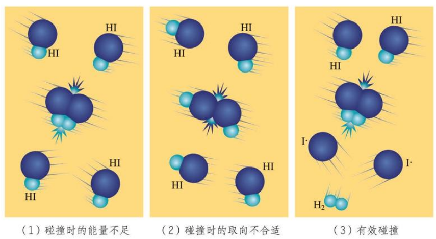

# 化学反应速率

## 化学反应速率的定义和计算

### 化学方程式书写约定

在本章中，化学方程式的书写规则和热化学方程式相仿，保留物质状态标记，去除气体沉淀符号．但也与热化学方程式的书写规则略有不同：

- 显然化学反应速率与反应条件有关，因此反应条件可能不省略．
- 化学反应速率与方程式整体扩倍的系数无关（方程式系数整体扩倍不影响反应速率，后面介绍），因此系数应该约成互质正整数的形式．

### 两种化学反应

化学反应速率相关的习题一般有两种反应：

- 以 **水溶液为基础的反应**，如 $\ce{Ba^2+(aq) + SO4^2-(aq) -> BaSO4(s)}$．
- 以 **气体为基础的反应**，如 $\ce{C(s) + O2(g) -> CO2(g)}$．

对于 **水溶液为基础的反应**：

- 对于 **溶液中的溶质**，其物质的量浓度为 **该溶质物质的量** 比上 **溶液的体积**．
- 对于 **不溶的固体（如沉淀）和气体**，**不讨论** 它们的物质的量浓度．

对于 **气体为基础的反应**：

- 对于 **气体**，其物质的量浓度为 **该气体物质的量** 比上 **容器容积**．
- 对于 **固体和液体**，**不讨论** 它们的物质的量浓度．

以气体为基础的反应通常都是混合气体在一个容器中发生反应．

:::warning 混合气体模型的合理构建

请读者把混合气体模型想象成 **混合物**，而不是某种气体组分占据一块体积，另外一种气体组分占据另一块体积！

混合气体为均一稳定的混合物！**每种气体的分子在容器内部都是无处不在的，每种气体实际占据的体积就是整个容器的容积**！

并不是容器的容积等于各种气体所占体积之和！而是 **容器的容积就是各种气体所占的体积**！

:::

### 化学反应速率的定义

化学反应速率是定量描述化学反应进行快慢程度的物理量．**通常情况下**，用 **单位时间内物质的量浓度的减少或生成物物质的量浓度的增加** 来表示．

$$
v = \dfrac{|\Delta c|}{t}
$$

注意这里 $\Delta c$ 两端套用了绝对值，因此 **化学反应速率是非负的**．

- 一段时间的化学反应速率为这段时间的 **平均反应速率**，而某一时刻开始的微小时间内的化学反应速率为这个时刻的 **瞬时反应速率**．
- 同一个化学反应的同一个过程，**选用不同物质表示化学反应速率，其数值可能不同**．
	- 如 $\ce{2H2(g) + O2(g) -> 2H2O(l)}$ 中，设在 $\pu{1L}$ 容积的容器内发生这个反应，$\pu{1min}$ 内反应掉 $\pu{2 mol}$ 的 $\ce{H2}$．
	- 则用 $\ce{H2}$ 描述这个过程的化学反应速率，应为 $\pu{2 mol * L-1 * min-1}$．
	- 但相同过程下，$\ce{O2}$ 只消耗了 $\pu{1mol}$．
	- 那么用 $\ce{O2}$ 描述这个过程的化学反应速率，则应为 $\pu{1 mol * L-1 * min-1}$．
	- 因此，**表示化学反应速率时，必须指明用哪种物质做标准**．上面这个过程的化学反应速率可以写成 $v(\ce{H2}) = \pu{2 mol * L-1 * min-1}$ 或 $v(\ce{O2}) = \pu{1 mol * L-1 * min-1}$．
- 更进一步，用不同反应物表示化学反应速率时，**化学反应速率之比应为化学计量数之比**．
	- 如：$\ce{\nu_A A(g) + \nu_B B(g) -> \nu_C C(g) + \nu_D D(g)}$ 中，对同一个过程描述反应速率．
	- 则一定有 $v(\ce A) : v(\ce B) : v(\ce C) : v(\ce D) = \nu_{\ce A} : \nu_{\ce B} : \nu_{\ce C} : \nu_{\ce D}$．
- **对于不讨论物质的量浓度的物质，不讨论选用它时的化学反应速率**．
	- 如 $\ce{2 A(g) + 3 B(g) -> 1 C(g) + 4 D(s)}$ 中，「已知 $\ce A$ 的反应速率是 $\pu{2 mol * L-1 * min-1}$，则 $\ce D$ 的反应速率是 $\pu{4 mol * L-1 * min-1}$」这句话是 **错误** 的，因为 $\ce D$ 作为一个固体，在以气体为基础的反应中不讨论物质的量浓度，也不讨论它的化学反应速率．
- **方程式扩倍不影响反应速率**．$\ce{2H2(g) + O2(g) -> 2H2O(l)}$ 中，设在 $\pu{1L}$ 容积的容器内发生这个反应，$\pu{1min}$ 内反应掉 $\pu{2 mol}$ 的 $\ce{H2}$．那么就算采用方程式 $\ce{H2(g) + 1/2 O2(g) -> H2O(l)}$ 讨论，该过程的反应速率仍然是 $v(\ce{H2}) = \pu{2 mol * L-1 * min-1}$．
	- 标准的化学反应速率定义并没有用到化学反应进度．**对于「化学反应进度除以时间」或「化学反应进度除以体积再除以时间」定义出的反应速率，反应速率与方程式的系数有关**．
- **反应速率具有强度特性**．对于一个均一稳定的正在发生反应的系统，插入一个隔板，则 **隔板两侧内部各自的反应速率均等于整个系统的反应速率**．

化学反应速率也有别的定义方式，如 **单位时间内物质的量的变化量除以时间**，即 $\dfrac{|\Delta n|}t$．

:::warning 其它定义方式可能不满足上面的性质！

如 $\dfrac{|\Delta n|}t$ 定义的反应速率 **适用于任何物质，没有不讨论的情形**．

因此，「$\ce{2 A(g) + 3 B(g) -> 1 C(g) + 4 D(s)}$ 中，用 $\ce D$ 表示的化学反应速率为 $\pu{1 mol * min-1}$」这句话可以是对的．

再比如，这种方式定义的反应速率没有强度特性，而是具有 **广度特性**．对于一个均一稳定的正在发生反应的系统，插入一个隔板，则 **隔板两侧内部各自的反应速率之和等于整个系统的反应速率**．

:::

在无特殊说明，且无单位提示（上面这个例子属于单位提示）的情形下，一般情况下指的化学反应速率都是 $\dfrac{|\Delta c|}{t}$．

### 化学反应速率大小的比较

对于同一个化学反应的两个过程，我们定义第一个过程的化学反应速率大于第二个过程，当且仅当 **采用同种物质（如 $\ce A$）讨论时**，$v_1(\ce A) > v_2(\ce A)$．

给定两个过程的以不同物质为基准的反应速率，比较方式如下：

- **归一法**：将同一反应的不同物质的反应速率转化为同一物质为基准后再比较．转化方式是不同物质为基准时的反应速率之比为化学计量数之比．
- **比值法**：直接将反应速率除以物质对应的化学计量数之后再比较，例如比较 $\dfrac{v_1(\ce A)}{\nu_{\ce A}}$ 和 $\dfrac{v_2(\ce B)}{\nu_{\ce B}}$．

比较速率时勿忘同时比较数值和单位，或者将单位统一后只比较数值．$\pu{1 mol * L-1 * s-1} = \pu{60 mol * L-1 * min-1}$．

### 三段式

三段式是一个针对化学反应速率计算问题的解题工具，步骤为：

- 对于一个反应过程涉及到的每种物质，列出这种物质在该反应过程中的三种量：**起始量、变化量和终止量**．对于已知项，直接写出；对于未知项，留空．
- 根据 **比值关系** 和 **变化量关系**，利用已知信息解出留空的数据，从而直观、高效地完成这种题目的计算．

上面的量可以选用两种：一种是 **物质的量**，一种是 **物质的量浓度**．选用前者，则「起始量」意为「这种物质起始时的物质的量」，选用后者，则「起始量」意为「这种物质起始时的物质的量浓度」，变化量和终止量同理．

下面是一个例子：

$$
\begin{array}{c}
& \ce{\nu_A A} & + & \ce{\nu_B B}& \ce{->} & \ce{\nu_C C}\\
起始量 & a& &b&&c\\
变化量 & -d && -e && +f\\
终止量 & g && h && i
\end{array}
$$

无论选取的是物质的量还是物质的量浓度，我们都有两种关系：**比值关系** 和 **变化量关系**．

- **比值关系** 给出 $d : e : f = \nu_{\ce A} : \nu_{\ce B} : \nu_{\ce C}$．利用这个关系，对于中间的「变化量」一行，我们可以 **知一求其它所有**（如果反应化学计量数均已知）．
- **变化量关系** 给出对于每种物质中起始量、变化量、终止量的关系式．对于 **反应物**（如 $\ce A$），我们有 **减法关系** $a - d = g$；对于 **生成物**（如 $\ce C$），我们有 **加法关系** $c + f = i$．利用这个关系，对于每一列，我们都可以 **知二求一**．

请再次注意三段式的灵活性：**不管这几个量（上面的例子中是九个）是物质的量还是物质的量浓度，上面的关系都是成立的**．当然，**所有的量要么都用物质的量，要么都用物质的量浓度，不能混乱**．

下面是一些做题经验：

- 如果 **已知或要求的信息中含有物质的量**，则量均采用 **物质的量** 表示；如果 **已知和要求均为物质的量浓度**，均采用 **物质的量浓度**．
- 如果采用物质的量列三段式，且反应过程已知体积和时间，将 **体积、时间与体积 $\boldsymbol \times$ 时间都顺手标在三段式方程式的旁边**．算体积 $\times$ 时间是为了方便从物质的量变化量直接算出化学反应速率．

笔者推荐读者看到这里，利用三段式去练习册上训练几道利用化学反应速率求反应过程信息的题目．**文化课切忌手生**．

## 化学反应速率的影响因素

### 化学反应速率的影响因素内容

**内因**：**反应物本身的性质**．这是 **最主要** 的因素．如相同条件下 $\ce{Mg}$、$\ce{Al}$ 与稀盐酸反应的速率大小关系为 $\ce{Mg} > \ce{Al}$．

**外因**：

- **浓度（物质的量浓度）**：增大反应物物质的量浓度，反应速率增大；反之，减小．
	- **对于不是反应物的任何其它物质（包括生成物），其物质的量浓度不直接影响反应速率**（但改变生成物浓度在可逆反应中可能通过平衡移动间接影响反应速率）．
	- **对于不讨论物质的量浓度的反应物**（如气体为基础的反应中的固体反应物），**该物质的物质的量不直接影响反应速率**．然而，其表面积对反应速率有影响（见下）．
- **温度**：升高温度，反应速率增大，反之，减小．
- **催化剂**：使用催化剂，反应速率增大．
- **其它**：固体或纯液体的表面积与溶液 / 容器体积之比（正相关，如粉碎固体有助于提高反应速率）；光照，超声波等．

:::note 关于催化剂是否都增大反应速率的问题

事实上在科研中，确实有减慢化学反应速率的物质，但很少将这种物质称作「催化剂」，更规范的说法是 **抑制剂**．

催化剂的作用原理是给出一条活化能更低的反应路径．但是，抑制剂的作用原理通常不是给出一条活化能更高的反应路径——如果是这样，物质为什么不按照原来的活化能的路径去反应呢？因此，抑制剂的原理和催化剂不同，通常我们不将两者合称．即，「催化剂」就是指「加快反应速率的物质」．

高考中遇到「催化剂」：

- 如果问「催化剂是不是都加快反应速率」，判否，**这里催化剂把抑制剂也考虑进去**．
- 如果说「……该反应使用了催化剂」，**默认催化剂只指加快反应速率的物质**．

:::

:::note 关于固体表面积对反应速率的影响

关于这一点，有资料说反应速率与固体表面积有关；有资料说反应速率与固体的比表面积（表面积比总质量）有关．但笔者更倾向于与固体的表面积与溶液的体积之比有关．高考对此考察很少，不用在意．

:::

:::note 反应速率与压强的关系

请见[压强与反应速率](#压强与反应速率)一节．

:::

### 有效碰撞理论

大多数化学反应并不是经过简单碰撞就能完成的，而往往经过多个反应步骤才能实现．每一步反应都成为 **基元反应**．如 $\ce{2HI -> H2 + I2}$ 是经过下面两步反应完成的：

$$
\begin{aligned}
\ce{2HI -> H2 + 2I.} \\
\ce{2I. -> I2}
\end{aligned}
$$

这里的 $\ce{I.}$ 是一种带有单电子的原子（那个点就代表未配对的电子）．我们将 **这种带有单电子的原子或原子团** 称作 **自由基**．**自由基的反应活性极强，稳定性极差，寿命极短**．

基元反应发生的必要条件是反应物的分子发生碰撞，但这不是充要条件．当反应物的分子碰撞时的能量不够，或者取向不合适时，这样的碰撞都不会触发基元反应，从而是无效的；只有那些碰撞时 **能量足够**，且 **取向合适** 的碰撞可以触发基元反应，这样的碰撞称作 **有效碰撞**．

这也就是为什么气体浓度为 $\pu{1 mol*L-1}$ 时，每立方厘米每秒内反应物分子之间的碰撞次数数量级能达到 $\pu{E28}$，然而并不是任一反应都是瞬间完成的．

发生有效碰撞的分子称作 **活化分子**，活化分子具有的平均能量与反应物分子具有的平均能量差称作反应的 **活化能**．

:::note 为什么这里对活化能的定义等价于上一章对活化能的定义？

上一章对活化能的定义是：物质断开化学键时吸收能量后达到的最高能量值．

:::

由此观之，由于化学反应速率的定义是单位体积单位时间反应的分子数，改变化学反应速率的思路就是 **改变每个时刻单位体积内的活化分子数**，或者说 **活化分子的物质的量浓度**．

活化分子的物质的量浓度，等于 **物质的量浓度**（因素一）乘上 **活化分子占比**（因素二）．我们从这个角度对先前提到的影响化学反应速率的因素探究它们的作用原理．

- **改变物质的量浓度**，不改变因素二，**改变了因素一**．因此，**反应速率与反应物的物质的量浓度正相关**．
- **改变温度**，不改变因素一，**改变了因素二**，且活化分子占比与温度正相关，因此 **反应速率与温度正相关**．
- **使用催化剂**，降低活化能，使得更多普通分子有机会变为活化分子．不改变因素一，**提高了因素二**，因此 **催化剂可以加快反应速率**．

### 压强与反应速率

严格意义上来说，**反应速率与压强无关**．然而 **化学书上写了反应速率与压强有关**．所以题目出这句话的判断性考察请判对．

我们可以退而求其次地说，以气体为基础的反应，速率与气体反应物的 **分压** 有关（与其它气体分压无关）．

对于混合气体，当某种气体组分保持原有浓度单独存在于系统中（即其余气体组分均删去）时，称该气体组分产生的压强为 **分压**．

根据分压的定义，设气体组分为理想气体，我们有

$$
p_分V = n_分\mathrm RT
$$

注意这里的 $V$ 指的就是 **容器的容积**．如果读者对此有疑问，请仔细阅读[两种化学反应](#两种化学反应)中的警告．

根据 $c = \dfrac n V$，又有

$$
p_分 = c_分\mathrm RT
$$

**温度相同时，气体占据的分压与它的物质的量浓度成正比**．因此，当某种气体占据的分压增大时，其物质的量浓度增大，反应速率加快．**增大分压的本质是增大物质的量浓度，真正与化学反应速率有关的量是物质的量浓度**．

另外，将每种组分的气体列出的方程相加后，可以得到

$$
\begin{split}
& \phantom{=} p_1 + p_2 + \ldots + p_n \\
& = c_1\mathrm R T + c_2\mathrm RT + \ldots + c_n \mathrm RT \\
& = (c_1 + c_2 + \ldots + c_n) \mathrm R T \\
& = c_总 \mathrm R T \\
& = p_总
\end{split}
$$

即，**混合气体产生的总压强等于各组分气体分压之和**．

如果说气体参与的化学反应速率与每种气体反应物的分压有关是一种不够本质但足够准确的说法，那么化学反应速率与压强有关就是一个比较错误的说法了．事实上，**化学反应速率与容器所受的压强无关**．

根据 $p_总 = c_总 \mathrm RT$，温度不变的情形下，$p_总$ 增大时，$c_总$ 也会增大．

然而，虽然这里的 $p_总$ 和 $c_总$ 呈正相关变化，$c_总$ 却不是反应速率的影响因素——反应速率真正的影响因素是 **每个参与反应的气体的物质的量浓度**．因此，如果每个参与反应的气体的物质的量浓度均不变，却因为充入无关气体使得 $c_总$ 升高，$p$ 升高，并不会影响反应速率的大小．

满足这个条件的最经典的实例：

:::info 例题 2.1

**恒温恒容** 的容器中，有一气体为基础的反应正在进行，现在向容器充入无关气体 / 惰性气体，反应速率如何变化？

:::

:::tip 例题 2.1 解答

**不变**．虽然 $p_总$ 升高，$c_总$ 升高，然而每个参与反应的气体物质的量不变，容积不变，因此物质的量浓度不变．于是，反应速率不变．

在这个示例中，每个气体反应物的分压也是不变的．整体压强的增多量完全来自于注入的惰性气体的分压．

:::

这就是一个非常典型的反应速率与整体压强无关的示例．然而我们可以对这个问题稍作修改：

:::info 例题 2.2

**恒温恒压** 的容器中，有一气体为基础的反应正在进行，现在向容器充入无关气体 / 惰性气体，反应速率如何变化？

:::

:::tip 例题 2.2 解答

**变小**．

充入气体后，根据 $pV = n\mathrm RT$，$n$ 增多，$p$ 不变，因此 $V$ 变大．每个参与反应的气体物质的量不变，容积变大，因此物质的量浓度均变小．于是，反应速率变小．

这里因为每个气体反应物的物质的量浓度均变小，因此分压也均变小．失去的这一部分总压被充入的惰性气体的分压弥补，总压强不变．

:::

TODO: merge

### 浓度对反应速率的影响

#### 化学反应速率与反应物浓度的关系式

在 $\ce{298 K}$ 时，实验测得溶液中的反应 $\ce{H2O2 + 2HI = 2H2O + I2}$ 在反应物浓度不同时的反应速率见下表。

<!--  -->

由上述实验数据可以发现：在 $\ce{HI}$ 浓度一定时，$\ce{H2O2}$ 浓度每增大一倍，反应速率就提高一倍；在 $\ce{H2O2}$ 浓度一定时，$\ce{HI}$ 浓度没增大一倍，反应速率也提高一倍。上述关系可表示为：
$$
v=kc(\ce{H2O2})\cdot c(\ce{HI})
$$
即反应速率 $v$ 与 $c(\ce{H2O2})$ 和 $c(\ce{HI})$ 成正比。

其中 $k$ 称为**反应速率常数**，表示单位浓度下的反应速率。反应速率常数与浓度**无关**，但受**温度**、**催化剂**、固体表面性质等因素的影响。通常，反应速率常数越大，反应进行的越快。反应速率常数可以通过上述等式列方程/直接计算求解。

 根据化学反应速率与反应物浓度的关系式，可以清楚地判断反应物浓度的改变对化学反应速率的影响。但是，**一个化学反应的速率与参与反应的物质的浓度的关系式是实验测定的结果，不能随意根据反应的方程式直接写出**。对于很多反应，这种关系式中浓度的方次与化学方程式中各物质化学式前的系数并无确定关系。

复杂反应中的速率控制步骤往往决定了该反应的速率，控制步骤中反应速率**最慢**的基元反应是决定整个反应速率的关键步骤。

#### 基元反应的化学反应速率与反应物浓度的关系式

当实验已经判定反应是基元反应时，反应速率方程很容易按化学方程式的计量数直接写出。基元反应的速率常数和平衡常数的关系是一目了然的，例如对于反应 $\ce{CO + NO2 = CO2 + NO}$ 而言：
$$
v_正 = k_正\cdot c(\ce{CO})\cdot c(\ce{NO2})\\
v_逆 = k_逆\cdot c(\ce{CO2})\cdot c(\ce{NO})
$$
当达到平衡时，$v_正 = v_逆$，浓度项都是平衡浓度。
$$
k_正 \cdot c(\ce{CO})\cdot c(\ce{NO2}) = k_逆\cdot c(\ce{CO2})\cdot c(\ce{NO})\ce{->} \dfrac{k_正}{k_逆} = \dfrac{c(\ce{CO2})\cdot c(\ce{NO})}{c(\ce{CO})\cdot c(\ce{NO2})}=K
$$
其中 $K$ 表示化学反应平衡常数。

> 注意：该公式只限于基元反应，非基元反应的速率方程必须由实验测定反应级数及反应速率常数后才能确定。

### 温度对反应速率的影响

对大部分反应而言，温度升高，化学反应速率加快，但加快程度不同。

以反应 $\ce{H2 + Cl2 = 2HCl}$ 所包含的一个基元反应 $\ce{H2 + Cl . -> HCl + H .}$ 为例。基元反应 $\ce{H2 + Cl . -> HCl + H.}$ 是 $\ce{Cl.}$ 与 $\ce{H2}$ 分子碰撞，导致 $\ce{H-H}$ 键断裂，$\ce{H-Cl}$ 形成的过程。研究表明，这个过程需要经历一个高能量的中间状态，此时形成一种旧键没有完全断裂、新建没有完全形成的过渡态 $\ce{H\cdots H\cdots Cl}$，如图所示。过渡态的能量与反应物的平均能量只差 $E_{a}$ 称为该基元反应的活化能。活化能的存在是化学反应通常需要获得能量才能实际发生的原因。不同的基元反应活化能大小不同，因此化学反应速率不同。显然，活化能越高，反应越难发生。

### 对活化能本质的认识

基元反应的过渡态理论：基元反应从反应物到产物的变化过程中要经历一个中间状态，这个状态称为过渡态。
$$
\begin{array}{}
\ce{AB + C}&\ce{->} &\ce{[A\cdots B\cdots C]}&\ce{->}&\ce{A + BC}\\
反应物&& 过渡态&& 反应产物
\end{array}
$$
过渡态是反应过程中具有最高能量的一种结构状态，过渡态能量与反应物的平均能量的差值相当于活化能。实验研究已证实过渡态确实存在。

### 阿伦尼乌斯公式

阿伦尼乌斯公式提出的反应速率常数与温度之间关系的经验公式：
$$
k=A\mathrm{e}^{-\frac{E_a}{RT}}
$$
式中，$k$ 为反应速率常数；$A$ 为比例常数；$\mathrm{e}$ 为自然对数的底；$R$ 为理想气体常数；$E_a$ 为活化能，单位为 $\ce{J . mol^{-1}}$ 或 $\pu{kJ*mol-1}$。

该经验公式表明，当 $E_a>0$ 时，升高温度，反应速率常数增大，反应速率随之提高。由该公式还可知，$E_a$ 值越大，改变温度对反应速率的影响程度就越大。这就是升高相同温度时，不同化学反应的速率提高的倍数不同的原因。对于一个 $E_{a正}> E_{a逆}$ 的反应，若温度升高，正逆反应的速率均增大，但是 $k_正$ 增大的幅度更大，所以 $v_正$ 增大的倍数也更大，所以反应正向移动，同时化学平衡常数 $K$ 也增大。

### 催化剂对反应速率的影响

1. 催化剂是能改变化学反应速率而在反应前后本身的质量和化学性质不变的物质；
2. 由于催化剂的质量和化学性质在反应前后不变，反应历程中必定既包含有催化剂参与的反应，又包括使得催化剂在生成的反应。催化剂通过参与反应改变反应历程、改变反应的活化能来改变化学反应速率。
3. 催化剂**不能改变**化学反应的平衡常数（因为根据阿伦尼乌斯公式无法改变 $k_正$ 和 $k_逆$），也不能改变化学平衡的转化率。
4. 催化剂是加入的物质然后参与反应最后又被生成，而中间产物是被生成的物质然后又被消耗，注意区分两者。
5. 催化剂具有**选择性**，对于某一反应活性很强的催化剂对于另外的反应不一定具有催化作用。根据这一特性，工业上可以用于选择恰当的催化剂来调控反应，提高生产效率。例如：乙烯和氧气有两个反应，一个生成环氧乙烷，一个生成二氧化碳和水，我们可以通过加入银催化剂，加快第一个反应的反应速率，但不改变第二个反应的反应速率，从而使得生成环氧乙烷的速率加快。
6. 催化剂的活性与自身成分、粒径、合成方法等因素以及反应温度、压强等条件的影响。通常情况下，催化剂发挥作用需要控制在**活性温度**范围内。有些物质的存在可能会使催化剂明显失效，这种现象称为催化剂中毒。

<!--  -->

## 反应机理与能量关系图的分析技巧

- 既是起点又是终点的物质是**催化剂**；
- 反应过程中被生成后又被消耗是**中间产物**；
- “只出不进”是**生成物**；
- “只进不出”是**反应物**。
- “有进有出”既可能是催化剂也可能是中间产物。
