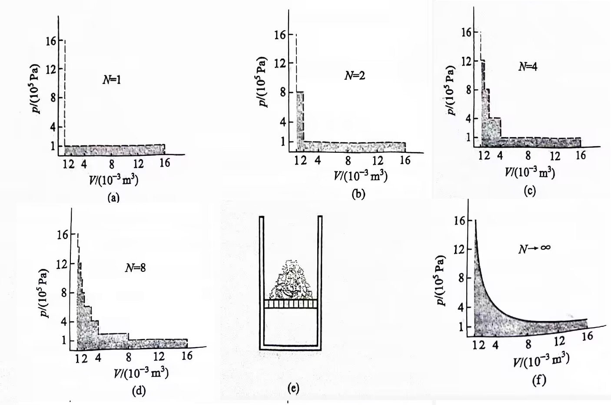

# 化学反应的方向

## 理想气体的恒温膨胀模型

### 热量与功不是状态函数

体系的常见状态函数有 **温度**、**压强**、**内能**、**物质的量** 等．

**热量** 和 **功** 可以是状态函数吗？换句话说，我们是否可以定义一个体系的状态函数——热量 $Q$，然后用「热量变化量」$\Delta Q$ 表示交换的热量？答案是不可以．

我们知道状态函数的变化量必须与途径无关，只与过程有关．然而，热与功并不满足这个特点，下面我们举出例证．

一定量的理想气体，从 $p_1 = \pu{16E5 Pa}$，$V_1 = \pu{1 L}$，在外界压强为 $p_{\mathrm e} = \pu{1E5 Pa}$ 的条件下，恒温膨胀至 $p_2 = \pu{1E5 Pa}$，$V_2 = \pu{16 L}$．

称这个途径为 **一次膨胀**．

一定量的理想气体，从 $p_1 = \pu{16E5 Pa}$，$V_1 = \pu{1 L}$，在外界压强为 $p_{\mathrm e} = \pu{8E5 Pa}$ 的条件下，恒温膨胀至 $p_2 = \pu{8E5 Pa}$，$V_2 = \pu{2 L}$；再在外界压强为 $p_{\mathrm e} = \pu{1E5 Pa}$ 的条件下，恒温膨胀至 $p_3 = \pu{1E5 Pa}$，$V_3 = \pu{16 L}$．

称这个途径为 **二次膨胀**．

我们会发现，两个途径实质上是同一种过程，然而两种途径所做的体积功是截然不同的．

体积功的表达式是 $-p_{\mathrm e}\Delta V$，由此计算：

- 一次膨胀中所做体积功为 $(\pu{16L} - \pu{1L}) \cdot \pu{1E5 Pa} = \pu{15E5 J}$．
- 二次膨胀中所做体积功为 $(\pu{2L} - \pu{1L}) \cdot \pu{8E5 Pa} + (\pu{16L} - \pu{2L}) \cdot \pu{1E5 Pa} = \pu{22E5 J}$．

同样都是膨胀 $\pu{15L}$，但是二次膨胀中，体系有 $\pu{1L}$ 是在 $\pu{8E5 Pa}$ 的环境下向外膨胀做功的，因此做的体积功更多．

同种过程的不同途径拥有了不同的功，因此 **功不可能是状态函数**．

理想气体的内能只是温度的函数，这里温度不变，因此理想气体内能不变，即

$$
\Delta U = 0
$$

又因为

$$
\Delta U = Q + W
$$

因此

$$
Q = -W
$$

于是上面两种途径对应的热量也不同，**热量也不可能是状态函数**．

### 可逆途径

定义 **四次膨胀** 为外压依次减小到 $\pu{12E5 Pa}$、$\pu{8E5 Pa}$、${4E5 Pa}$、${1E5Pa}$ 的情形；**八次膨胀** 为外压依次减小到 $\pu{14E5 Pa}$、$\pu{12E5 Pa}$、${10E5 Pa}$、${8E5Pa}$、$\pu{6E5 Pa}$、$\pu{4E5 Pa}$、${2E5 Pa}$、${1E5Pa}$ 的情形．

我们绘制出膨胀过程的 $p \text{-} V$ 图像：

膨胀时 $V$ 是递增的，因此上面横轴 $V$ 向右增加的过程就是膨胀的过程．不难看出，膨胀时体系所做体积功就是阴影部分的面积，为正（注意 $\Delta U = Q + W$ 中的 $W$ 指的是环境所做体积功，与这里体系所做体积功是相反数关系，环境所做体积功为负）．

最终的图 (f) 就是 $N \to +\infty$ 的结果，它的 $p \text - V$ 图线是一条曲线，每个点都表示了体系的平衡状态，所以这个曲线的方程就是

$$
pV = nRT
$$

恒温膨胀时后者为常数，因此这条曲线是反比例曲线在第一象限中的一支．

$N$ 次膨胀随着 $N$ 的无限增大，体积功也不断增大，$N \to \infty$ 时趋近于一个结果，此时体系所做的体积功是各种体积所做体积功的极限．我们可以用（e）所示的模型刻画 $N$ 无穷大的情形：

> 活塞上面堆放的砂粒代表外压，维持始态时的平衡．假如这些砂粒都是无限小的，则砂粒的个数是无穷多的．一粒一粒依次取走这无限小、无限多的砂粒，每取走一粒砂粒体系就经历一次膨胀，重新实现一次平衡．最终，体系经过无限多次平衡状态直至终态．

现在我们将这个理想气体想象成一个热机，则膨胀时，它对外界所做的功 $W$ 与它吸收的热量 $Q$ 完全相等．
