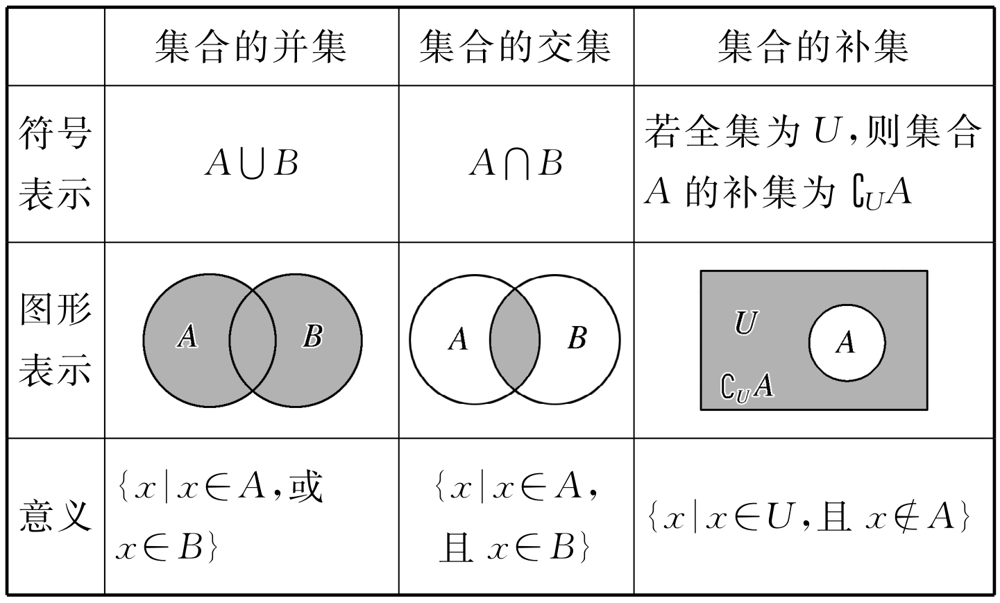

# 集合

## 集合的概念

一般地，我们把研究对象统称为 **元素**，把一些元素组成的总体叫做 **集合**（简称为 **集**），这些元素满足下面三个特征：

- **确定性**，即给定一个集合，那么在所研究的范围内，有哪些元素属于这个集合是确定的．
- **互异性**，即一个集合中的元素必须互不相同．
- **无序性**，即集合中元素的排列顺序是无关紧要的．

我们通常用大写拉丁字母 $A,B,C,\cdots$ 表示集合，用小写拉丁字母 $a,b,c,\cdots$ 表示集合中的元素．

如果组成两个集合的所有元素完全相同，则称这两个集合是 **相等** 的，用等号表示．

如果 $a$ 是集合 $A$ 的元素，则称 $a$ **属于** 集合 $A$，记作 $a\in A$；反之，则称 $a$ **不属于** 集合 $A$，记作 $a\not\in A$．根据集合的确定性，对于一个元素 $a$，其与给定的集合 $A$ 之间的关系只有属于或不属于两种可能性．

## 集合的表示

集合的表示有下面三种方法．

### 列举法

把集合的所有元素一一列举出来，并用花括号「$\{\}$」括起来，这种表示集合的方法叫做 **列举法**．如

- 「地球上的四大洋」组成的集合为 $\{太平洋,大西洋,印度洋,北冰洋\}$．
- 小于 $10$ 的所有自然数组成的集合为 $A=\{0,1,2,3,4,5,6,7,8,9\}$．
- 方程 $x^2=x$ 的所有实数根组成的集合为 $B=\{0,1\}$．

由于元素完全相同的两个集合相等，而与列举的顺序无关，因此一个集合可以有不同的列举方法．如上例中集合 $A$ 还可以写成 $A=\{2,1,4,7,8,3,6,9,0,5\}$ 等．

### 描述法

一般地，设 $A$ 是一个集合，我们把集合 $A$ 中所有具有共同特征 $P(x)$ 的元素 $x$ 所组成的集合表示为

$$
\{x\in A\mid P(x)\},
$$

这种表示集合的方法称为 **描述法**．例如：

- 小于 $10$ 的所有自然数组成的集合为 $A=\{x\in\N\mid x<10\}=\{0,1,2,3,4,5,6,7,8,9\}$．
- 方程 $x^2=x$ 的所有实数根组成的集合为 $B=\{x\in\R\mid x^2=x\}=\{0,1\}$．
- 平面直角坐标系中，中心为原点、半径为 $2$ 的圆形闭区域内的整点组成的集合为 $C=\{(x,y)\mid x^2+y^2\le2,x,y\in\Z\}$．

总之，竖线左侧表示集合中的 **元素（及其范围）**，竖线右侧表示各个变量所满足的 **条件**．

我们约定，如果从上下文看，$x\in\R,x\in\Z$ 是明确的，那么 $\in\R,\in\Z$ 可以省略．如 $\{x\mid x<10\}$ 表示 $\{x\in\R\mid x<10\}$（[复数](../../misc/complex-number/basics.md)无法与实数比较大小），$\{x\mid x=2k+1,k\in\Z\}$ 表示 $\{x\in\Z\mid x=2k+1,k\in\Z\}$．

注：竖线分隔符也可以用冒号代替．

#### 一些常见数集的记号

- 自然数集（或非负整数集）：$\N=\{0,1,2,3,\cdots\}$．
- 正整数集：$\N^\ast$ 或 $\N_+=\{1,2,3,\cdots\}$．
- 整数集：$\Z=\{\cdots,-2,-1,0,1,2,\cdots\}$．
- 有理数集：$\Q=\{a\in\R\mid a=\df qp,\;p,q\in\Z,(p,q)=1,p>0\}$ （Q 来源于 quotient（商））．
- 实数集：$\R$．
- 复数集：$\C$．
- 素数集：$\P=\{2,3,5,7,11,13,17,\cdots\}$．

对于 $\N,\Z,\Q,\R,\C$，右上角加星号表示去零．

对于 $\N,\Z,\Q,\R$，右下角加正号「$+$」表示范围为正．

*注：对于 $\N,\Z,\Q,\R$，右下角标可以用于表示对范围的限制，如 $\R_{\ge0}\coloneqq\{x\in\R\mid x\ge0\}$，$\N_{<k}\coloneqq\{0,1,\cdots,k-1\}$．（考试中请尽量不要使用．）

*注：在印刷体中，一般使用粗体 $\mathbf N$ 或黑板粗体 $\N$ 表示数集，如 ISO 80000-2 标准首选采用的就是正粗体 $\mathbf N$．在手写体中，一般应该使用黑板粗体．为了美观，本文档采用黑板粗体．

### 图示法

用 **Venn 图** 可以形象地表示集合以及集合间的包含关系．这种表示方法在小学、初中已经学过，不再赘述．

### 区间

另一种表示 **一个范围内的所有实数构成的数集** 的方法是 **区间**．其形如：

- $[a,b]=\{x\in\R\mid a\le x\le b\}$．
- $[a,b)=\{x\in\R\mid a\le x<b\}$．
- $(a,b]=\{x\in\R\mid a<x\le b\}$．
- $(a,b)=\{x\in\R\mid a<x<b\}$．
- $[a,+\infty)=\{x\in\R\mid x\ge a\}$．
- $(a,+\infty)=\{x\in\R\mid x>a\}$．
- $(-\infty,b]=\{x\in\R\mid x\le b\}$．
- $(-\infty,b)=\{x\in\R\mid x<b\}$．
- $(-\infty,+\infty)=\R$．

总之，我们用方括号表示包含端点，圆括号表示不包含端点．正、负无穷一般用圆括号．

两端包含端点的称为 **闭区间**，两端不包含端点的称为 **开区间**，一端包含一端不包含的称为 **半开半闭区间**．

另外，用区间的并表示「或」，如 $(-\infty,1)\cup[\df32,+\infty)=\{x\in\R\mid x<1\ 或\ x\ge\df32\}$，$(-\infty,2)\cup(2,+\infty)=\{x\in\R\mid x\ne2\}$．

注：正无穷 $+\infty$ 中的正号 $+$ 有时会被省略，但有时只用 $\infty$ 又表示 $\pm\infty$．具体意义须结合上下文理解．

## 集合间的基本关系

集合间的关系就是包含与被包含的关系．

一般地，对于两个集合 $A,B$，如果集合 $A$ 中任意一个元素都是集合 $B$ 中的元素，就称集合 $A$ 为集合 $B$ 的 **子集**，记作 $A\subseteq B$ 或 $B\supseteq A$，读作「$A$ 包含于 $B$」或「$B$ 包含 $A$」．

一般地，如果集合 $A$ 的任何一个元素都是集合 $B$ 的元素，同时集合 $B$ 的任何一个元素都是集合 $A$ 的元素，那么集合 $A$ 与集合 $B$ 相等，记作 $A=B$．也就是说，
$$
A\subseteq B\;\text{且}\;B\subseteq A\iff A=B.
$$

如果集合 $A\subseteq B$，但存在元素 $a\in A$，且 $a\notin B$，就称集合 $A$ 是集合 $B$ 的 **真子集**，记作 $A\subsetneqq B$ 或 $B\supsetneqq A$．

一般地，我们把不含任何元素的集合叫做 **空集**，记为 $\varnothing$，并规定：**空集是任何集合的子集**．

根据定义，可以得到下列结论：

- （自反性）任何一个集合是它本身的子集，即 $A\subseteq A$．
- （传递性）对于集合 $A,B,C$，若 $A\subseteq B$ 且 $B\subseteq C$，则 $A\subseteq C$．

集合间的包含关系 $\subseteq$ 是一种非严格偏序关系．

注：课本中用「$\subseteq$」和「$\subsetneqq$」分别表示子集和真子集，而有些人用「$\subseteq$」和「$\subset$」表示，还有些人用「$\subset$」和「$\subsetneqq$」表示．因此，对于一篇文章，应注意明确其使用的表示方式．

注：空集也可以表示为 $\{\}$．

注：为了叙述清晰，一般将以集合为元素的集合称为 **集族**．

## 集合的基本运算

### 并集、交集、补集的定义

一般地，由所有属于集合 $A$ *或*属于集合 $B$ 的元素组成的集合，称为集合 $A$ 与 $B$ 的 **并集**，记作 $A\cup B$（读作「$A$ 并 $B$」），即

$$
A\cup B\coloneqq\{x\mid x\in A\;\text{或}\;x\in B\}.
$$

一般地，由所有属于集合 $A$ *且*属于集合 $B$ 的元素组成的集合，称为集合 $A$ 与 $B$ 的 **交集**，记作 $A\cap B$（读作「$A$ 交 $B$」），即

$$
A\cap B\coloneqq\{x\mid x\in A\;\text{且}\;x\in B\}.
$$

若集合 $A,B$ 满足 $A\cap B=\varnothing$，则称 $A$ 与 $B$ **不相交**．

注：一系列集合的并集或交集可以用大运算符表示，其使用方法与求和符号相同：设集族 $\mathscr F=\{A_1,A_2,\cdots,A_n\}$，则定义记号

$$
\bal
\bigcup_{\mathscr F}=\bigcup_{i=1}^nA_i=A_1\cup\dots\cup A_n. \\
\bigcap_{\mathscr F}=\bigcap_{i=1}^nA_i=A_1\cap\dots\cap A_n.
\eal
$$

一般地，如果一个集合含有所研究问题中涉及的所有元素，那么就称这个集合为 **全集**，通常记作 $U$．通常也把给定的集合作为全集．

对于一个集合 $A$，由全集 $U$ 中不属于集合 $A$ 的所有元素组成的集合称为集合 $A$ 相对于全集 $U$ 的 **补集**，简称为集合 $A$ 的补集，记作 $\complement_UA$，即

$$
\complement_UA\coloneqq\{x \mid x\in U\;\text{且}\;x\notin A\}.
$$

如果从上下文看，所讨论的全集 $U$ 是显然的，那么 $U$ 可以省略，即将 $A$ 的补集表示为 $\complement A$．

*注：补集 $\complement_AB$ 与差集 $A\setminus B$ 的定义相同，都表示由集合 $A$ 中不属于集合 $B$ 的所有元素构成的集合，但补集一般用于 $B\subseteq A$ 的情形，而差集则不限制．（差集不属于高中范围．）

*注：补集 $\complement_UB$ 也可以简洁地记作 $B^{\mathrm C}$、$B'$ 或 $\overline B$．

### 并集、交集、补集的性质

集合的并与交运算具有下列一些性质：

- 交换律：$A\cup B=B\cup A$，$A\cap B=B\cap A$．
- 结合律：$(A\cup B)\cup C=A\cup(B\cup C)$，$(A\cap B)\cap C=A\cap(B\cap C)$．
- 幂等律：$A\cup A=A$，$A\cap A=A$．
- **分配律**：$A\cup(B\cap C)=(A\cup B)\cap(A\cup C)$，$A\cap(B\cup C)=(A\cap B)\cup(A\cap C)$．
- 吸收律：$A\cup(A\cap B)=A$，$A\cap(A\cup B)=A$．
- 单位元：$A\cup\varnothing=A$，$A\cup U=U$；$A\cap\varnothing=\varnothing$，$A\cap U=A$．
- $A\cup B=A\iff B\subseteq A$，$A\cap B=A\iff A\subseteq B$．

另外，有补集的性质如下：

- $\complement_U\varnothing=U$，$\complement_UU=\varnothing$．
- $A\cup(\complement_UA)=U$，$A\cap(\complement_UA)=\varnothing$．
- $\complement_U(\complement_UA)=A$．
- 若 $A\subseteq B$，则 $\complement_UB\subseteq\complement_UA$（逆否命题）．
- $\bal&\complement_U(A\cap B)=(\complement_UA)\cup(\complement_UB),\\&\complement_U(A\cup B)=(\complement_UA)\cap(\complement_UB),\eal$ 即 $\bal&\overline{A\cap B}=\overline A\cup\overline B,\\&\overline{A\cup B}=\overline A\cap\overline B,\eal$**（德摩根（de Morgan）定律）**．

*一般地，有 **对偶原理**：若有关集的并、交及补集运算的某一关系式成立，如果将式中的记号
$$
\cup,\cap,\subseteq,\supseteq
$$
分别换成
$$
\cap,\cup,\supseteq,\subseteq,
$$
等号保持不变，并将式中每个集换成它的补集，由此得到的关系式一定成立．

## 集合中的元素个数

用 $\card(A)$ 表示集合 $A$ 的基数（cardinality），即有限集合 $A$ 中元素的个数．

*注：也可以表示为 $|A|$，但此符号也同时表示实数的绝对值、复数的模以及向量的长度等．

### 容斥原理

在组合数学和概率与统计中经常用到．

对任意两个有限集合 $A,B$，有

$$
\card(A\cup B)=\card(A)+\card(B)-\card(A\cap B).
$$

三个集合的容斥原理：

$$
|A\cup B\cup C|=|A|+|B|+|C|-|A\cap B|-|A\cap C|-|B\cap C|+|A\cap B\cap C|.
$$

## 集合的子集个数

若集合 $A$ 中含有 $n$（$n\in\N$）个元素，则

- 它的子集个数为 $2^n$；
- 它的真子集个数为 $2^n-1$；
- 它的非空子集个数为 $2^n-1$；
- 它的非空真子集个数为 $2^n-2$（$n\ge1$）．

*注：因此集合 $A$ 的所有子集构成的集族常记为 $2^A$，称作集合 $A$ 的幂集．

## *数集的最大数与最小数

虽然未在教材中定义，但这两个记号在考试中经常出现．

设 $A$ 为数集，若数 $M\in A$ 满足对于任意 $x\in A$，有 $M\ge x$，则称 $M$ 为数集 $A$ 的最大数（maximum），记为
$$
M=\max A.
$$

类似地，若数 $m\in A$ 满足对于任意 $x\in A$，有 $m\le x$，则称 $m$ 为数集 $A$ 的最小数（minimum），记为
$$
m=\min A.
$$

例如，定义在 $(0,+\infty)$ 上的[函数](../function-basics/function.md)
$$
f(x)=\max\{1,x,\fr{x^2}2\}=\bcs1,&0<x\le1,\\x,&1<x\le2,\\\df{x^2}2,&x>2.\ecs
$$

## 有关集合的常见考点

### 集合元素的互异性

一般通过分类讨论解决．

:::info[例 1.1]

设 $a,b\in\R$，集合 $\{1,a+b,a\}=\{0,\df ba,b\}$，求 $a^{2023}+b^{2024}$ 的值．

:::

:::tip[例 1.1 解答]

首先 $a\ne0$，那么由两集合中元素的一一对应关系，可知 $a+b=0$．接下来分两种情况：

- 若 $1=\df ba$，$a=b$，由于 $a+b=0$，故 $a=0$，矛盾．
- 若 $1=b$，$a=\df ba$，可知 $a=-1$，因此左侧集合为 $\{1,0,-1\}$，右侧集合为 $\{0,-1,1\}$，成立．

综上所述，$a=-1,b=1$，因此 $a^{2023}+b^{2024}=0$．

:::

### 集合的基本关系与运算

这部分题目经常与函数的定义域、值域结合．

$\{x\mid y=f(x)\}$ 表示函数 $f(x)$ 的定义域，$\{y\mid y=f(x)\}$ 表示函数 $f(x)$ 的值域．

:::info[例 2.1]

已知集合 $A=\{y\mid y=2^{x-1},1\le x\le2\},B=\{x\mid y=\lg(2-x)\}$，则下列结论正确的是（　　）

- A. $A\subseteq B$
- B. $A\cap B=[0,2]$
- C. $A\cup B=(-\infty,2]$
- D. $(\complement_\R A)\cup B=\R$

:::

有关初等函数的性质，参见[初等函数](../elementary-function/index.md)部分．

:::tip[例 2.1 解答]

$A=[2^{1-1},2^{2-1}]=[1,2],B=\{x\mid 2-x>0\}=(-\infty,2)$．因此 C 选项正确．

:::

这部分题目也经常与解不等式相结合，例如，将区间的包含关系转化为端点之间的不等关系．

注意，可能需要讨论 **集合 $C$ 为空集** 的情况．

:::info[例 2.2]

已知集合 $A=\{x\mid-1\le x\le4\}$，$C=\{x\mid 2m<x<m+1\}$．若 $\exists\,x\in C,x\in A$ 为假命题，求实数 $m$​ 的取值范围．

:::

有关命题的知识，参见[基本逻辑](./fol.md)部分．

:::tip[例 2.2 解答]

$\exists\,x\in C,x\in A$ 为假命题，则 $\forall\,x\in C,x\notin A$ 为真命题，即 $C\cap A=\varnothing$．

若 $C=\varnothing$，则 $2m\ge m+1$，解得 $m\ge-1$．

若 $C\ne\varnothing$，则 $2m<m+1\le-1$ 或 $4\le2m<m+1$，解得 $m\le-2$​．

综上，实数 $m$ 的取值范围是 $(-\infty,-2]\cup[-1,+\infty)$．

:::

如果涉及抽象集合，很可能画出 Venn 图可以让信息变得更加直观．很多题目也会给出 Venn 图，求阴影部分的表达式．

### 集合的新定义问题

:::info[例 3.1]

设 $P,Q$ 是两个集合，定义集合 $P\setminus Q=\{x\mid x\in P\;\text{且}\;x\notin Q\}$，如果 $P=\{x\mid1<2^x<4\}$，$Q=\{y\mid y=2+\sin x,x\in\R\}$，请求出 $P\setminus Q$．

:::

:::tip[例 3.1 解答]

$P=(0,2)$，$Q=[1,3]$．根据定义，$P\setminus Q$ 就是从 $P$ 中去掉 $P$ 和 $Q$ 共有的部分后剩余的集合，因此 $P\setminus Q=(0,1)$．

:::

:::info[例 3.2]

**（多选题）** 设集合 $X$ 是实数集 $\R$ 的子集，如果 $x_0\in\R$ 满足对任意的 $a>0$，都存在 $x\in X$，使得 $0<|x-x_0|<a$，则称 $x_0$ 为集合 $X$ 的聚点．则下列集合中是以 $0$​ 为聚点的有（　　）

- A. $\{x\mid x\in\R,x\ne0\}$
- B. $\{x\mid x\in\Z,x\ne0\}$
- C. $\{x\mid x=\df1n,n\in\N^\ast\}$
- D. $\{x\mid x=\df n{n+1},n\in\N^\ast\}$​

:::

这道题的思想在高等数学中应用于证明集合的有界性，以及对极限的严谨定义．

::::tip[例 3.2 解答]

题意翻译一下也就是说：如果集合 $X$ 中的元素能 **任意地接近** $x_0$，或者说与 $x_0$ 的 **距离任意地小**，那么 $x_0$ 为 $X$​ 的聚点．

A 选项即为 $(-\infty,0)\cup(0,+\infty)$，其中的元素能任意地接近 $0$，因此 $0$ 是聚点．

B 选项，由于集合中的点是离散的整数点，其中的元素不能任意地接近 $0$，因此 $0$ 不是聚点．

C 选项，由于 $n$ 可以无限大，$1/n$ 可以无限接近 $0$，因此 $0$ 是聚点．

D 选项，由于正整数 $n\ge1$，$\df n{n+1}=1-\df1{n+1}\ge\df12$，则其不能无限接近 $0$，因此 $0$​ 不是聚点．

:::note[严谨证明]

对于 A，对任意的 $a$，集合中有 $x=\df a2$ 使得 $|x-0|=\df a2<a$，满足定义．

对于 B，取 $a=\df12$，则不存在集合中的元素 $x$ 使得 $|x-0|=|x|<a$​．

对于 C，对任意（小）的 $a$，取 $n=\lc\df1a\rc+1$，则 $|x-0|=\lv\df1{\lc1/a\rc+1}\rv<a$，满足定义．

对于 D，对任意 $n\in\N^\ast$，有 $x=\df n{n+1}\ge\df12$，取 $a=\df12$，则不存在 $n\in\N^\ast$ 所对应的 $x=\df n{n+1}$ 使得 $|x-0|=|x|<a$．

:::

综上，选 AC．

::::

:::info[例 3.3]

**（多选题）** 指示函数是一个重要的数学函数，通常用来表示某个条件的成立情况．已知 $U$ 为全集且元素个数有限，对于 $U$ 的任意一个子集 $S$，定义其指示函数 $1_S(x)=\bcs1,&x\in S,\\0,&x\in\complement_US.\ecs$ 若 $A,B,C\subseteq U$，则（　　）

注：$\sum_{x\in G}f(x)$ 表示集合 $G$ 中所有元素 $x$ 所对应的函数值 $f(x)$ 之和（其中 $G$ 是 $f$ 定义域的子集）．

- A. $\sum_{x\in A}1_A(x)<\sum_{x\in U}1_A(x)$
- B. $1_{A\cap B}(x)\le1_A(x)\le1_{A\cup B}(x)$
- C. $\sum_{x\in U}1_{A\cup B}(x)=\sum_{x\in U}1_A(x)+1_B(x)-1_A(x)1_B(x)$
- D. $\sum_{x\in U}(1-1_A(x))(1-1_B(x))(1-1_C(x))=\sum_{x\in U}1_U(x)-\sum_{x\in U}1_{A\cup B\cup C}(x)$

:::

:::tip[例 3.3 解答]

对子集的指示函数求和，事实上就等于求子集的元素个数，即 $\sum_{x\in U}1_S(x)=\card(S)$ 表示全集 $U$ 中有多少个元素在子集 $S$ 中．

对于 A，由于 $A\subseteq U$，有 $\sum_{x\in U}1_A(x)=\sum_{x\in A}1_A(x)+\sum_{x\in\complement_UA}1_A(x)$，由于 $\complement_UA$ 中没有元素在 $A$ 中，第二项为 $0$，因此 $\sum_{x\in U}1_A(x)=\sum_{x\in A}1_A(x)$．因此 A 错误．

对于 B，因为 $(A\cap B)\subseteq A\subseteq(A\cup B)$，若 $x$ 在集合 $G$ 的子集中，则 $x$ 一定在集合 $G$ 中，因此 $1_{A\cap B}(x)\le1_A(x)\le1_{A\cup B}(x)$ 成立．因此 B 正确．

对于 C，首先有 $1_A(x)1_B(x)=1_{A\cap B}(x)$，因此右边等于 $\card(A)+\card(B)-\card(A\cap B)=\card(A\cup B)$ 等于左边．因此 C 正确．

对于 D，有
$$
\bal
x\in A\cup B\cup C&\iff(1-1_A(x))(1-1_B(x))(1-1_C(x))=0,\\
x\notin A\cup B\cup C&\iff(1-1_A(x))(1-1_B(x))(1-1_C(x))=1,
\eal
$$
所以 $\text{Left Side}=\card(\complement_U(A\cup B\cup C))=\card(U)-\card(A\cup B\cup C)=\text{Right Side}$．因此 D 正确．

故选 BCD．

:::
