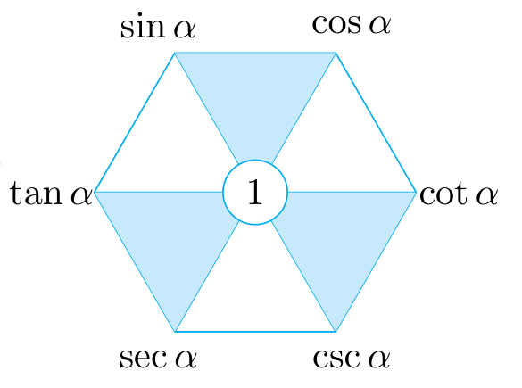

# 有关三角函数的计算

## 同角三角函数的关系

所谓同角三角函数，指的就是对同一个角 $\al$ 来说的 $\sin\al,\cos\al,\tan\al$ 三个值．下面研究它们之间的关系．

根据定义，设旋转角 $\al$ 的终边与单位圆的交点为 $P(x,y)$，$|OP|=r$，则 $\sin\al=\df yr,\cos\al=\df xr,\tan\al=\df yx$，且 $x^2+y^2=r^2$．故有：

:::info[三角恒等式]

$\sin^2\al+\cos^2\al=1$．

:::

:::info[推论]

$$
\bal
    &(\sin\al+\cos\al)^2=1+2\sin\al\cos\al, \\
    &(\sin\al-\cos\al)^2=1-2\sin\al\cos\al, \\
    &(\sin\al+\cos\al)^2+(\sin\al-\cos\al)^2=2, \\
    &(\sin\al-\cos\al)^2=(\sin\al+\cos\al)^2-4\sin\al\cos\al.
\eal
$$

:::

即 $\sin\al+\cos\al$、$\sin\al-\cos\al$、$\sin\al\cos\al$ 三式，知一可推二．

:::tip[切化弦公式]

$$
\tan\al=\df{\sin\al}{\cos\al},\quad\al\ne k\pi+\df\pi2,k\in\Z.
$$

:::

由此，可以将所有含 $\sin\al,\cos\al,\tan\al$ 的式子化成只含有 $\sin\al$ 和 $\cos\al$ 的式子．

*引入余割函数 $y=\csc x=\df1{\sin x}$、正割函数 $y=\sec x=\df1{\cos x}$、余切函数 $y=\cot x=\df1{\tan x}$，有如下完整版公式：

1. 平方关系：
   $$
    \sin^2\al+\cos^2\al=1,\quad\tan^2\al+1=\sec^2\al,\quad1+\cot^2\al=\csc^2\al.
   $$
2. 乘积关系：
   $$
   \bga
    \sin\al=\cos\al\cdot\tan\al,\quad\cos\al=\sin\al\cdot\cot\al,\quad\tan\al=\sin\al\cdot\sec\al,\\
    \csc\al=\sec\al\cdot\cot\al,\quad\sec\al=\csc\al\cdot\tan\al,\quad\cot\al=\csc\al\cdot\cos\al.
   \ega
   $$
3. 倒数关系：
   $$
    \tan\al\cdot\cot\al=1,\quad\sin\al\cdot\csc\al=1,\quad\cos\al\cdot\sec\al=1.
   $$

记忆方法：**平方看三角，乘积看中间，倒数看对角线．**

## 诱导公式

所谓诱导公式，其实就是 $\sin$、$\cos$、$\tan$ 的自变量为 $\pm\al+k\df\pi2$ 时，其值与 $\sin\al,\cos\al,\tan\al$ 之间的各种等量关系．

:::tip[诱导公式一（周期性）]

$\sin(\al+2k\pi)=\sin\al$，$\cos(\al+2k\pi)=\cos\al$，$\tan(\al+k\pi)=\tan\al$，其中 $k\in\Z$．

:::

:::tip[诱导公式二（奇偶性）]

$\sin(-\al)=-\sin\al$，$\cos(-\al)=\cos\al$，$\tan(-\al)=-\tan\al$．

:::

:::tip[诱导公式三]

$\sin(\pi+\al)=-\sin\al$，$\cos(\pi+\al)=-\cos\al$，$\tan(\pi+\al)=\tan\al$．

:::

:::tip[诱导公式四]

$\sin(\pi-\al)=\sin\al$，$\cos(\pi-\al)=-\cos\al$，$\tan(\pi-\al)=-\tan\al$．

:::

:::tip[诱导公式五]

$\sin\left(\df\pi2+\al\right)=\cos\al$，$\cos\left(\df\pi2+\al\right)=-\sin\al$，*$\tan\left(\df\pi2+\al\right)=\cot\al$．

:::

:::tip[诱导公式六]

$\sin\left(\df\pi2-\al\right)=\cos\al$，$\cos\left(\df\pi2-\al\right)=\sin\al$，*$\tan\left(\df\pi2-\al\right)=\cot\al$．

:::

口诀：**奇变偶不变，符号看象限．**

应用口诀的步骤：
1. 首先假设 $\al$ 是 **第一象限角**（不管真正的 $\al$ 多大）．
2. 「奇变偶不变」：如果 $k$ 为奇数，则 **函数名** 改变，否则不变，例如 $\sin$ 变成 $\cos$，$\tan$ 变成 $\cot$．
3. 「符号看象限」：将 $\al$ **旋转** 到自变量 $k\df\pi2\pm\al$ 的位置，看 **原函数名** 在当前的象限是正值还是负值，添加正负号．

例如：
- $\cos\left(\pi-\al\right)$：$k=2$ 为偶数，故结果为 $\cos$；将第一象限角 $\al$ 先对称到 $-\al$，再逆时针旋转 $\pi\,\mathrm{rad}$，最终落在第二象限，由于 $\cos$ 在第二象限为负值，所以加负号；因此，最终结果为 $-\cos\al$．
- $\sin\left(\df{3\pi}2+\al\right)$：$k=3$ 为奇数，故结果为 $\cos$；将第一象限角 $\al$ 逆时针旋转 $\df{3\pi}2\,\mathrm{rad}$，最终落在第四象限，由于 $\sin$ 在第四象限为负值，所以加负号；因此，最终结果为 $-\cos\al$．

## 三角恒等变换

### 和差角公式

:::tip[两角和与差的正弦、余弦、正切公式]

$$
\bal
    &\sin(\al\pm\be)=\sin\al\cos\be\pm\cos\al\sin\be, \\
	&\cos(\al\pm\be)=\cos\al\cos\be\mp\sin\al\sin\be, \\
	&\tan(\al\pm\be)=\fr{\tan\al\pm\tan\be}{1\mp\tan\al\tan\be}\quad\al,\be,\al\pm\be\ne k\pi+\fr\pi2,k\in\Z.
\eal
$$

:::

### 二倍角公式

:::tip[二倍角公式]

$$
\bal
    &\sin 2\al=2\sin\al\cos\al, \\
    &\cos 2\al=\cos^2\al-\sin^2\al, \\
    &\tan 2\al=\fr{2\tan\al}{1-\tan^2\al}.
\eal
$$

:::

:::tip[推论 1（升幂公式）]

$$
\bga
    \cos 2\al=\cos^2\al-\sin^2\al=2\cos^2\al-1=1-2\sin^2\al,\\
    \sin\2\al=2\sin\al\cos\al=(\sin\al+\cos\al)^2-1=1-(\sin\al-\cos\al)^2.
\ega
$$

:::

:::tip[推论 2（降幂公式）]

$$
\bga
    &\cos^2\al=\fr{1+\cos 2\al}2, \\
    &\sin^2\al=\fr{1-\cos 2\al}2, \\
    &\sin\al\cos\al=\fr12\sin 2\al, \\
    &\tan^2\al=\fr{1-\cos 2\al}{1+\cos 2\al}.
\ega
$$

:::

用升幂公式和降幂公式可以将式子中的各个三角函数的次数统一．

:::tip[推论 3]

$$
\bga
    \tan\al\pm\tan\be&=(\tan\al\pm\be)(1\mp\tan\al\tan\be),\\
    \tan\al\tan\be=1-\fr{\tan\al+\tan\be}{\tan(\al+\be)}=\fr{\tan\al-\tan\be}{\tan(\al-\be)}-1.
\ega
$$

:::

即 $\tan(\al\pm\be)$、$\tan\al\tan\be$、$\tan\al\pm\tan\be$ 三式，知二可推一．

:::tip[推论 4（万能公式）]

$$
\bal
    \sin2\al&=\fr{2\sin\al\cos\al}{\sin^2\al+\cos^2\al}=\fr{2\tan\al}{1+\tan^2\al},\\
    \cos2\al&=\fr{\cos^2\al-\sin^2\al}{\cos^2\al+\sin^2\al}=\fr{1-\tan^2\al}{1+\tan^2\al},\\
\eal
$$

:::

用万能公式可以将所有 $\sin x,\cos x,\tan x$ 都用 $u=\tan\df x2$ 换元，进而变为单变量的式子．

:::tip[推论 5]

$$
    \fr{\sin\al}{1+\cos\al}=\fr{1-\cos\al}{\sin\al}=\tan\fr\al2.
$$

:::

### 辅助角公式

:::tip[辅助角公式]

设 $ab\ne0$，则
$$
    a\sin\al+b\cos\al=\sqrt{a^2+b^2}\sin(\al+\ph),\quad\text{其中}\,\tan\ph=\fr ba.
$$

:::

例如：
- $\sin x+\cos x=\sqrt2\sin\left(x+\df\pi4\right)$；
- $\sin x+\sqrt3\cos x=2\sin\left(x+\df\pi3\right)$；
- $\sqrt3\sin x+\cos x=2\sin\left(x+\df\pi6\right)$．