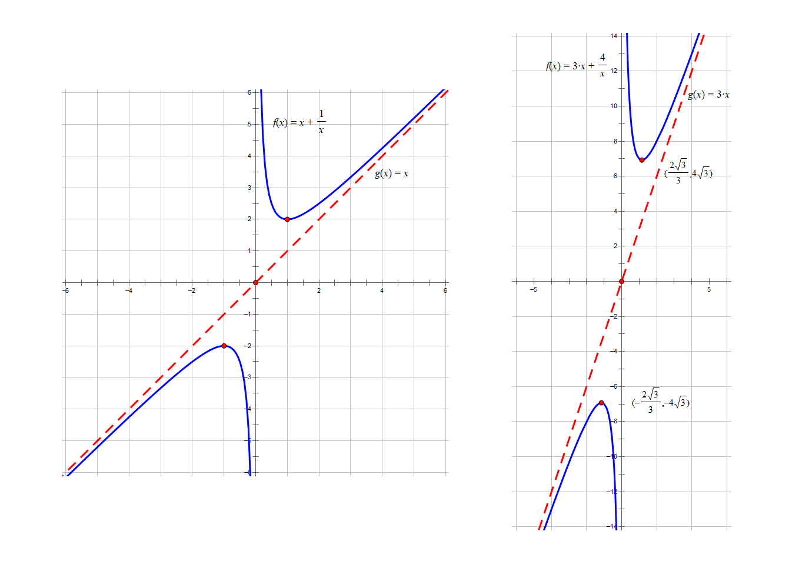
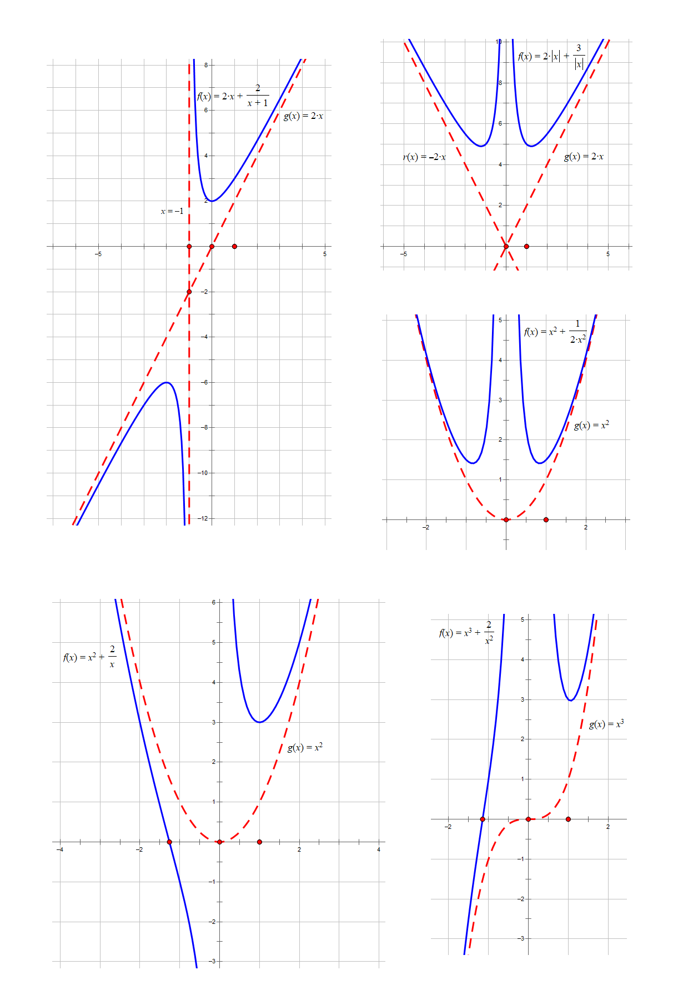

# 基本不等式

基本不等式，在高考数学中一般指代数-几何均值不等式（Inequality of Arithmetic and Geometric Means, AM-GM Inequality），是高中数学的重要不等式之一．在高中主要研究二元和三元情况．

## 基本不等式

[前一节](https://whk-wiki.github.io/whk-wiki/math/inequality/basic-properties#%E5%85%B6%E4%BB%96%E6%80%A7%E8%B4%A8)我们提到过一个重要的不等式：对于任意 $a,b\in\R$，有 $a^2+b^2\ge2ab$，当且仅当 $a=b$ 时等号成立．

特殊地，将 $a,b$ 分别替换为 $\sqrt a,\sqrt b$，其中 $a,b>0$，则可以推出基本不等式．

### 基本形式

对于任意 $a,b\in\R_+$，有
$$
\sqrt{ab}\le\fr{a+b}2,
$$
当且仅当 $a=b$ 时等号成立．

基本不等式表明：两个正数的算术平均数不小于它们的几何平均数．

### 直接证明

要证
$$
\sqrt{ab}\le\fr{a+b}2,
$$
只需证
$$
2\sqrt{ab}\le a+b,
$$
只需证
$$
a+b-2\sqrt{ab}\ge0,
$$
只需证
$$
(\sqrt a-\sqrt b)^2\ge0.
$$
上式显然成立，当且仅当 $a=b$ 时，上式中的等号成立．因此，原不等式成立．证毕．

这种「要证……只需证……」的写法常用于考试中的证明题．

### 均为负数的情况

对于任意 $a,b<0$，有
$$
a+b\le-2\sqrt{ab},
$$
当且仅当 $a=b$ 时等号成立．

证明：
$$
\bal
    (-a)+(-b)&\ge2\sqrt{(-a)(-b)},\\
    -(a+b)&\ge2\sqrt{ab},\\
    a+b&\le-2\sqrt{ab},
\eal
$$
当且仅当 $-a=-b$，即 $a=b$ 时等号成立．证毕．

### 三元及多元形式

对于任意 $n$ 个正实数 $a_1,a_2,\dots,a_n$，有
$$
\fr{\sum_{i=1}^na_i}n\ge\sqrt[n]{\textstyle\prod_{i=1}^na_i},
$$
当且仅当 $a_1=a_2=\dots=a_n$ 时等号成立．

在高中，常用基本不等式的三元形式：对于任意 $a,b,c\in\R_+$，有
$$
\fr{a+b+c}3\ge\sqrt[3]{abc},
$$
当且仅当 $a=b=c$ 时等号成立．

## 其他常用不等式

1. $ab\le\df{(a+b)^2}4$，其中 $a,b\in\R$，当且仅当 $a=b$ 时等号成立．

2. $\lv x+\df1x\rv\ge2$，其中 $x\ne0$，当且仅当 $x=\pm1$ 时等号成立．
   
3. $\lv\df ba+\df ab\rv\ge2$，其中 $a,b$ 满足 $ab\ne0$，当且仅当 $a=\pm b$ 时等号成立．

4. $\lv ax+\df bx\rv\ge2\sqrt{ab}$，其中 $x\ne0$，当且仅当 $x=\pm\sqrt{\df ba}$ 时等号成立．

5. $a^2+b^2+c^2\ge ab+bc+ca$，其中 $a,b,c\in\R$，当且仅当 $a=b=c$ 时等号成立．证明：两边乘 $2$ 后完全平方．

## 均值不等式

对于任意 $a,b>0$，有
$$
\fr2{\fr1a+\fr1b}\le\sqrt{ab}\le\fr{a+b}2\le\sqrt{\fr{a^2+b^2}{2}},
$$
当且仅当 $a=b$ 时四个式子相等．

上述不等式称为均值不等式（RMP-AM-GM-HM Inequality, or Mean Inequality Chain）．

用自然语言叙述为：调和平均数 ≤ 几何平均数 ≤ 算术平均数 ≤ 平方平均数（也称均方根）．简记为：**「调几算平」**．

### 证明

第一个不等号：
$$
\bal
    (a-b)^2&\ge0 \\
    (a+b)^2&\ge4ab \\
    a+b&\ge2\sqrt{ab} \\
    \fr1{a+b}&\le\fr1{2\sqrt{ab}} \\
    \fr{2ab}{a+b}&\le\sqrt{ab} \\
    \fr2{\fr1a+\fr1b}&\le\sqrt{ab}
\eal
$$
第三个不等号：
$$
\bal
    a^2+b^2&\ge2ab \\
    2a^2+2b^2&\ge(a+b)^2 \\
    \fr{a^2+b^2}2&\ge\fr{(a+b)^2}4 \\
    \sqrt{\fr{a^2+b^2}2}&\ge\fr{a+b}2
\eal
$$
证毕．

## 对勾函数与飘带函数

在解题的过程中，我们常常需要求 $ax\pm\df bx$ 的最值，且限制了 $x$ 的范围，使得无法直接应用基本不等式．因此我们需要熟知下面这两种函数的性质．有关函数的基本知识见 [?] 节．

**「对勾函数」** 指的是形如 $y=ax+\df bx$（$a,b>0$）的一类函数，其
- 位于第一、三象限；
- 分别在第一、三象限有一个极小值点和一个极大值点（通过基本不等式求出）；
- 渐近线为 $x=0$ 和 $y=ax$；
- 是一个奇函数．

$y=x+\df1x$ 和 $y=3x+\df4x$ 图象分别如下图所示：

**「飘带函数」** 指的是形如 $y=ax-\df bx$（$a,b>0$）的一类函数，其
- 在 $(-\infty,0)$ 和 $(0,+\infty)$ 上分别单调递增；
- 在 $x$ 轴正、负半轴上分别有一个零点；
- 渐近线为 $x=0$ 和 $y=ax$；
- 是一个奇函数．

$y=x-\df1x$ 和 $y=2x-\df3x$ 图象分别如下图所示：

我们也可以画出其他类似函数的图象，如：

上面这些函数的大致图像可以通过 **平移**、求极限（渐近线）、研究奇偶性、研究单调性、研究凹凸性等方法画出．

## 基本不等式及均值不等式的常见应用

### 判断所给不等式是否正确

:::info[例 1]

**（多选题）** 若 $x,y$ 满足 $x^2+y^2-xy=1$，则（　　）
- A. $x+y\le1$
- B. $x+y\ge-2$
- C. $x^2+y^2\le2$
- D. $x^2+y^2\ge1$

:::

:::tip[例 1 解答]

先求 $x+y$ 的范围．由所给等式和基本不等式得
$$
(x+y)^2=1+3xy\le1+3\cdot\fr{(x+y)^2}4,
$$
解得 $-2\le x+y\le2$，当且仅当 $x=y=-1$ 时 $x+y=-2$，当且仅当 $x=y=1$ 时 $x+y=2$．所以 A 错误，B 正确．

再求 $x^2+y^2$ 的范围．注意到其与平方平均数有关，由 $\sqrt{xy}\le\sqrt{\df{x^2+y^2}2}$ 得
$$
x^2+y^2=1+xy\le1+\fr{x^2+y^2}2,
$$
解得 $x^2+y^2\le2$，当且仅当 $x=y=\pm1$ 时等号成立．所以 C 正确．

*对于 D，对所给等式配方得 $(x-\df y2)^2+(\df{\sqrt3y}2)^2=1$，使用 **三角换元** 法，设
$$
x-\fr y2=\cos\theta,\df{\sqrt3y}2=\sin\theta,\theta\in\R,
$$
即
$$
x=\cos\theta+\fr{\sqrt3}3\sin\theta,y=\fr{2\sqrt3}3\sin\theta,
$$
因此 $x^2+y^2=\cos^2\theta+\df53\sin^2\theta+\df{2\sqrt3}3\sin\theta\cos\theta=\df43+\df23\sin(2\theta-\df\pi6)\in[\df23,2]$．所以 D 错误．

故选 BC．

对于 D，也可以采用 **特殊值法**，代入 $x=\df{\sqrt3}3,y=-\df{\sqrt3}3$，则 $x^2+y^2-xy=1$，但 $x^2+y^2=\df23<1$，不符合选项，所以 D 错误．

:::

### 利用基本不等式（或均值不等式）求最值

对于 $x,y>0$：
- 如果积 $xy$ 为定值，则 $x+y$ 有最小值 $2\sqrt{xy}$，当且仅当 $x=y$ 时取到．
- 如果和 $x+y$ 为定值，则 $xy$ 有最大值 $\df{(x+y)^2}4$，当且仅当 $x=y$ 时取到．

应用条件简记为 **「一正二定三相等」** 或 **「正定等」**．

#### 常值代换法

之所以把常值代换法放在第一个，是因为它太常考了．最常考的形式是：

- 若 $a,b,c,m,n,x,y>0$，其中 $a,b,c,m,n$ 是常数，且 $ax+by=c$，则
$$
\bal
    \fr mx+\fr ny&=\fr1c(ax+by)(\fr mx+\fr ny)\\
    &=\fr1c(am+bn+\df{bmy}x+\df{anx}y)\\
    &\ge\fr1c(am+bn+2\sqrt{abmn})=\fr1c(\sqrt{am}+\sqrt{bn})^2.
\eal
$$

- 若 $a,b,c,m,n,x,y>0$，其中 $a,b,c,m,n$ 是常数，且 $\df ax+\df by=c$，则
$$
\bal
    mx+ny&=\fr1c(mx+ny)(\fr ax+\fr by)\\
    &=\fr1c(am+bn+\fr{any}x+\fr{bmx}y)\\
    &\ge\fr1c(am+bn+2\sqrt{abmn})=\fr1c(\sqrt{am}+\sqrt{bn})^2.
\eal
$$

上面的公式可以选择不用记住，只需要记住使用 **常值代换法** 的过程即可．

:::info[例 2.1.1]

已知 $a,b>0$，$a+2b=2$，求 $\df{ab}{2a+b}$ 的最大值．

:::

其实这道例题节选自一道解析几何题目的一个步骤，可见打好基础的重要性．

:::tip[例 2.1.1 解答]

首先取倒数得
$$
\bal
\fr{2a+b}{ab}&=\fr1a+\fr2b\\
&=\fr12(a+2b)(\fr1a+\fr2b)\\
&=\fr12(1+4+\fr{2a}b+\fr{2b}a)\\
&\ge\fr12(5+2\sqrt{2\times2})=\fr92,
\eal
$$
当且仅当 $\df{2b}a=\df{2a}b$，即 $a=b=\df23$ 时，等号成立．

因此，$\df{ab}{2a+b}$ 的最大值为 $\df29$，当且仅当 $a=b=\df23$ 时取到．

:::

:::info[例 2.1.2]

已知 $a,b>0$，且 $\df1a+\df2b=1$，求 $\df3{a-1}+\df2{b-2}$ 的最小值．

:::

:::tip[例 2.1.2 解答]

由 $\df1a+\df2b=1$ 得 $ab-2a-b=0$，即 $(a-1)(b-2)=2$．因此
$$
\bal
    \fr3{a-1}+\fr2{b-2}&=\fr{2a+3b-8}{(a-1)(b-2)}\\
    &=\fr{2a+3b-8}2\\
    &=a+\fr32b-4\\
    &=(a+\fr{3b}2)(\fr1a+\fr2b)-4\\
    &=4+\fr{3b}{2a}+\fr{2a}b-4\ge2\sqrt3,
\eal
$$
当且仅当 $\df{3b}{2a}=\df{2a}b$，即有序数对 $(x,y)=(0,0)或(\sqrt3+1,\df{6+2\sqrt3}3)或(-\sqrt3+1，\df{6-2\sqrt3}3)$ 时等号成立．

因此 $\df3{a-1}+\df2{b-2}$ 的最小值为 $2\sqrt3$．

:::

#### 直接应用基本不等式

:::note[注意]

如果 **连续使用** 基本不等式，则取等条件为每次基本不等式的取等条件的**交**．

:::

:::info[例 2.2.1（多元基本不等式）]

已知 $a,b>0$，求 $\df1a+\df a{b^2}+b$ 的最小值．

:::

:::tip[例 2.2.1 解答]

为了使所有项之积为常数，我们把 $b$ 拆成 $\df b2+\df b2$．即
$$
\fr1a+\fr a{b^2}+b=\fr1a+\fr a{b^2}+\fr b2+\fr b2\ge4\sqrt[4]{\fr1a\cdot\fr a{b^2}\cdot\fr b2\cdot\fr b2}=4\sqrt[4]{\fr14}=2\sqrt2,
$$
当且仅当 $\df1a=\df a{b^2}=\df b2$，即 $a=b=2$ 时等号成立．

因此，$\df1a+\df a{b^2}+b$ 的最小值为 $2\sqrt2$．

当然，也可以用两次基本不等式，先把前两项合并，再合并第三项，取等条件为两次基本不等式的取等条件 **同时成立**．

:::

:::info[例 2.2.2（多次使用不等式）]

若 $a,b\in\R$ 且 $ab>0$，求 $\df{a^4+4b^4+1}{ab}$ 的最小值．

:::

:::tip[例 2.2.2 解答]

$$
\fr{a^4+4b^4+1}{ab}\ge\fr{2\sqrt{4a^4b^4}+1}{ab}=\fr{4a^2b^2+1}{ab}=4ab+\fr1{ab}\ge2\sqrt{4ab\cdot\fr1{ab}}=4.
$$
当且仅当 $\begin{cases}a^4=4b^4,\\4ab=\df1{ab},\end{cases}$ 即 $\begin{cases}x=\df{\sqrt[4]8}2,\\y=\df{\sqrt[4]2}2\end{cases}$ 或 $\begin{cases}x=-\df{\sqrt[4]8}2,\\y=-\df{\sqrt[4]2}2\end{cases}$ 时等号成立．

因此，$\df{a^4+4b^4+1}{ab}$ 的最小值为 $4$．

:::

#### 配凑法

所谓的配凑法，顾名思义，就是将所给的式子配凑出 **和或积为定值** 的形式，如 $6x(3-2x)=3\cdot2x(3-2x)$、$x+\df1{x-2}=x-2+\df1{x-2}+2$，然后利用上面所说的方法求最值．

对于 **二次比一次** 的分式，一般 **将分子表示成关于分母的二次多项式** 的形式．如果直接配凑过于麻烦，也可以直接将分母 **换元**．

对于 **一次比二次** 的分式，一般先把分子 **换元**，然后把分子除到分母上，这样分母就变为 $at+\df bt+c$ 的形式．注意在分母上应用基本不等式要变号．

:::info[例 2.3]

若 $x<1$，求 $\df{x^2-x+9}{x-1}$ 的最大值．

:::

:::tip[例 2.3 解答]

$x-1<0$，因此
$$
\fr{x^2-x+9}{x-1}=\fr{(x-1)^2+(x-1)+9}{x-1}=x-1+\fr9{x-1}+1\le-2\sqrt9+1=-5,
$$
当且仅当 $x-1=\df9{x-1}$，即 $x=-2$ 时等号成立．

因此 $\df{x^2-x+9}{x-1}$ 的最大值为 $-5$．

:::

#### 换元法

:::info[例 2.4.1]

已知 $x,y>0$，$x+3y+xy=9$，求 $x+3y$ 的最小值．

:::

:::tip[例 2.4.1 解答]

设法构造出 $x+3y$．由 $x+3y+xy=9$ 得
$$
x+3y=9-xy=9-\fr13\cdot x\cdot3y\ge9-\fr13\cdot\fr{(x+3y)^2}{4},
$$
当且仅当 $x=3y$，即 $x=3,y=1$ 时等号成立．设 $x+3y=t>0$，则上式即为
$$
t\ge9-\fr1{12}t^2,
$$
解得 $t\ge6$．

因此 $x+3y$ 的最小值为 $6$，当且仅当 $x=3,y=1$ 时取到最小值．

:::

:::info[例 2.4.2]

若对任意实数 $x,y>0$，不等式 $x+\sqrt{xy}\le a(x+y)$ 恒成立，求实数 $a$ 的取值范围．

:::

:::tip[例 2.4.2 解答]

**分离参数** 得
$$
a\ge\fr{x+\sqrt{xy}}{x+y}.
$$
上式恒成立，即 $a$ 大于等于 $\df{x+\sqrt{xy}}{x+y}$ 的 **最大值**．

注意到分子中有 $x,x^{1/2}$，分母中有 $x,x^0$，上下除以 $x$ 得
$$
\fr{x+\sqrt{xy}}{x+y}=\fr{1+\sqrt{\df yx}}{1+\df yx}.
$$
令 $\df yx=t>0$，则上式即 $\df{1+\sqrt t}{1+t}$．

令 $1+\sqrt t=m>1$，则 $t=(m-1)^2$，于是上式即
$$
\bal
    \fr m{1+(m-1)^2}&=\fr m{m^2-2m+2}\\
    &=\fr1{m+\fr2m-2}\\
    &\le\fr1{2\sqrt2-2}=\fr{\sqrt2+1}2,
\eal
$$
当且仅当 $m=\df2m$，即 $m=\sqrt2$，即 $t=\df yx=3-2\sqrt2$ 时等号成立．

所以 $\df{x+\sqrt{xy}}{x+y}$ 的最大值为 $\df{\sqrt2+1}2$，因此 $a$ 的取值范围是 $[\df{\sqrt2+1}2,+\infty)$．

:::

#### 消元法

:::info[例 2.5]

已知 $x,y\in\R$，且 $5x^2y^2+y^4=1$，求 $x^2+y^2$ 的最小值．

:::

:::tip[例 2.5 解答]

注意到所给式子中三项的 $y$ 的次数分别为 $0,2,4$，两侧除以 $y^2$ 得
$$
5x^2+y^2=\fr1{y^2}.
$$
根据 **消元** 的思想，将 $x^2$ 用含 $y^2$ 的式子表示，有
$$
x^2=\fr15(\fr1{y^2}-y^2).
$$
于是
$$
x^2+y^2=\fr15(\fr1{y^2}-y^2)+y^2=\fr15(\fr1{y^2}+4y^2)\ge\fr15\cdot2\sqrt4=\fr45,
$$
当且仅当 $y^2=\df12,x^2=\df3{10}$ 时等号成立．

因此 $x^2+y^2$ 的最小值为 $\df45$．

:::