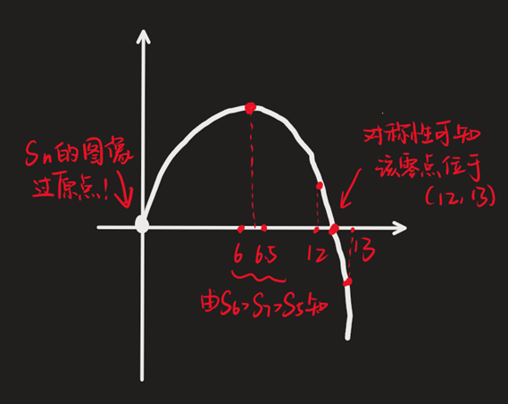

# 等差数列

## 等差数列基础

### 等差数列基本概念

如果一个数列从第二项起，每一项与前一项的差都为一个常数 $d$（difference），则将这个数列称作 **等差数列**，$d$ 称作该数列的 **公差**．

即对于等差数列 $\{a_n\}$，其差分 $\{D_n\}$ 满足

$$
D_n = \begin{cases}
a_1, & n = 1 \\
d, & n \ge 2
\end{cases}
$$

对 $\{D_n\}$ 做前缀和可得

$$
a_n = a_1 + (n - 1)d
$$

该式为 **等差数列的通项公式**．很明显，确定 $a_1$ 和 $d$ 后，等差数列确定，而只确定其中之一则无法确定等差数列．

通项公式变形：

$$
n = \df{a_n - a_1}{d} + 1
$$

可以用来算 **某一项是一个已知等差数列的第几项**，甚至不局限于纯等差数列：

:::info 例题 1.1

$2^3, 2^7, 2^{11}, \ldots, 2^{103}$ 共有多少项？

:::

:::tip 例题 1.1 解答

这虽然是一个等比数列，但是看指数就能知道总共有几项，而指数是等差数列．

项数为 $\df{103 - 3}{4} + 1 = 26$．

等比数列求和公式需要代入项数，所以看到 $2^3 + 2^7 + 2^{11} + \cdots + 2^{103}$，虽然我们暂时还没学习等比数列求和公式，也应 **立刻明确其项数的计算公式**，从而正确的算出它的项数，这是后面做等比数列求和的 **非常重要** 的基础．

同理，等差数列求和公式也要知道项数，如 $52 + 54 + 56 + \cdots + 660$ 的项数是 $\df{660 - 52}{2} + 1 = 305$．

总之，**算等差数列的项数** 是一项 **非常基本的求和基础技能**，后面将不再强调．

:::

对于长度为 $3$ 的等差数列 $a, b, c$，称 $\{b_n\}$ 是 $\{a_n\}$ 和 $\{c_n\}$ 的 **等差中项**．等差中项等价于算术平均值，即

$$
b = \df{a + c}2
$$

或

$$
2b = a + c
$$

可以由 $b - a = c - b$ 简单变形推出．

等差数列的英文是 Arithmetic Progression，简称 AP．Arithmetic 意为「算术的」，正与这里的「算术平均值」对应．

### 有限长度等差数列

这一节讲一个条件处理策略：如果题目给定条件「$a_1, a_2, \ldots, a_k$ 为等差数列」，我们可以将它 **等价** 地转化为：

$$
\begin{aligned}
a_1 + a_3 &= 2a_2 \\
a_2 + a_4 &= 2a_3 \\
& \cdots \\
a_{k - 2} + a_k &= 2a_{k - 1}
\end{aligned}
$$

共 $k - 2$ 个等式．

也即，题目但凡涉及到 **有限个数** 构成 **有限长度的等差数列**，设长度为 $k$，转成 $k - 2$ 个等式在绝大多数情况下是最简单的．

:::info 例题 1.2

已知 $\{a_n\}$，$\{b_n\}$，$\{c_n\}$ 成等差数列，证明 $a^2 - bc$，$b^2 - ac$，$c^2 - ab$ 成等差数列．

:::

:::tip 例题 1.2 解答

条件等价于 $a + c = 2b$．

结论等价于 $a^2 - bc + c^2 - ab = 2(b^2 - ac)$．现在开始证明．

证明等式成立，可以将左侧减去右侧然后证明结果为 $0$．

$$
\begin{aligned}
& \phantom{=} (a^2 - bc) + (c^2 - ab) - 2(b^2 - ac) \\
& = a^2 + c^2 - 2b^2 - bc - ab + 2ac \\
& = (a + c)^2 - b(a + c) - 2b^2 \\
& = (2b)^2 - 2b^2 - 2b^2 \\
& = 0
\end{aligned}
$$

:::

### 等差数列前缀和

$$
\begin{aligned}
2S_n &= (a_1 + a_n) + (a_2 + a_{n - 1}) + \cdots + (a_{n - 1} + a_2) + (a_n + a_1) \\
&= n(a_n + a_1)
\end{aligned}
$$

第二个等号是根据下标守恒定律，每组括号内的系数和为 $2$，下标和为 $n + 1$，因此结果相同．

于是

$$
S_n = \df{n(a_1 + a_n)}2
$$

将 $a_n$ 展开，可得

$$
S_n = na_1 + \df{n(n - 1)}2 d
$$

上式也可以参考下标守恒定律的证明来理解记忆．该式为已知 $a_1$ 与 $d$ 求 $\{S_n\}$ 通项公式的基本公式．

### 等差数列的性质

下设 $\{a_n\}$ 为等差数列．

#### 等差数列性质一

$$
a_n - a_m = (n - m)d
$$

该性质可以直接由通项公式展开推出．上面的变形式

$$
a_n = a_m + (n - m)d
$$

可以用来 **已知等差数列的任意一项与公差，求任一另外项**．

另外一个变形

$$
d = \df{a_n - a_m}{n - m}
$$

可以用来 **已知任意两项求公差**．

#### 等差数列性质二（下标守恒定律）

定义等差数列的若干项相加、相减（可以带系数，不能带次数）形成的式子为「**等差加减式**」，如

$$
a_3 + a_4 + a_5
$$

$$
2a_9 - a_{10}
$$

$$
a_5 - a_6 + a_7 - a_8 + a_9
$$

对于「等差加减式」，我们定义两个属性：

- **系数和**：即所有 $\{a_n\}$ 的 **系数** 之和．上面三个式子的系数和分别为 $3$，$1$，$1$．
- **下标和**：即所有 $\{a_n\}$ 的 **下标与系数的积** 之和．上面三个式子的下标和为 $12$，$8$，$7$．

结论：**对于两个「等差加减式」，如果它们的系数和与下标和均分别相同，则结果一定相同**．笔者将这个结论称作 **下标守恒定律**．

比如我们有

$$
a_3 + a_4 + a_5 = 3a_4
$$

两边系数和均为 $3$，下标和均为 $12$．

$$
2a_9 - a_{10} = a_8
$$

两边系数和均为 $1$，下标和均为 $8$．

$$
a_5 - a_6 + a_7 - a_8 + a_9 = a_7
$$

两边系数和均为 $1$，下标和均为 $7$．

::::danger 下标守恒定律的误用

$$
a_7 = a_3 + a_4
$$

:::note 错因

下标守恒定律必须保证两边系数和相同，上面的左边为 $1$，右边为 $2$，因此不一定成立．

:::

::::

证明：

$$
\begin{aligned}
& \phantom = c_1a_{x_1} + c_2a_{x_2} + \cdots + c_ka_{x_k} \\
& = c_1(a_1 + (x_1 - 1)d) + c_2(a_1 + (x_2 - 1)d) + \cdots + c_k(a_1 + (x_k - 1)d) \\
& = (c_1 + c_2 + \cdots + c_k)a_1 + (c_1x_1 + c_2x_2 + \cdots + c_kx_k - (c_1 + c_2 + \cdots + c_k))d
\end{aligned}
$$

系数和 $c_1 + c_2 + \cdots + c_k$ 与下标和 $c_1x_1 + c_2x_2 + \cdots + c_kx_k$ 确定时，结果确定．

下标守恒定律的推论：同一个等差数列的两个「等差加减式」，如果它们的 **系数和之比** 等于 **下标和之比** 等于 $k$，则它们的 **结果之比** 也为 $k$．

:::info 例题 1.4

等差数列 $\{a_n\}$，已知 $a_3 + a_4 + a_5 + a_6 + a_7 = 25$，求 $a_2 + a_8$ 的值．

:::

:::tip 例题 1.4 解答

两个「等差加减式」的系数和之比为 $5:2$，下标和之比为 $25:10 = 5:2$．

因此结果之比也为 $5:2$，答案为 $10$．

:::

下标守恒定律用来避开 $a_1$ 与 $d$，**直接沟通 $\{a_n\}$ 与 $\{a_n\}$ 的关系**．

#### 等差数列性质三

等差数列 $\{a_n\}$，对任意正整数 $k$，我们写出数列

$$
a_1 + a_2 + \cdots + a_k, a_{k + 1} + a_{k + 2} + \cdots + a_{2k}, a_{2k + 1} + a_{2k + 2} + \cdots + a_{3k}, \ldots
$$

注意到 $a_{i + k} - a_i = kd$，因此上面这个数列是一个公差为 $k^2d$ 的 **等差数列**．

根据区间和为两个前缀和的差，我们还可以写成

$$
S_k, S_{2k} - S_k, S_{3k} - S_{2k}, \ldots
$$

为公差为 $k^2d$ 的 **等差数列**．

这个性质也是在说 $S_k, S_{2k}, S_{3k}, \ldots$ 是一个 **二阶等差数列**（其差分数组是一个等差数列）．

该性质通常适合 **题目中没有出现 $\{a_n\}$，而出现了若干下标均为某个正整数 $k$ 的倍数的 $\{S_n\}$** 时使用．

#### 等差数列性质四

$n$ 为奇数时，根据下标守恒定律有

$$
a_1 + a_n = 2a_{\frac{n + 1} 2}
$$

此时

$$
S_n = na_{\frac {n + 1} 2}
$$

逆公式：

$$
a_n = \df 1 n S_{2n - 1}
$$

这里 $n$ 可以是任意整数，而导出的 $\{S_n\}$ 的下标一定是奇数．

#### 等差数列性质五

$\{\df{S_n}n\}$ 是一个首项为 $a_1$，公差为 $\* \df 1 2 d$（$d$ 为 $\{a_n\}$ 的公差）的 **等差数列**．反过来，$\{\df{S_n}n\}$ 是等差数列也可推出 $\{a_n\}$ 是等差数列．

后面会了解到等差数列的函数形式 $S(n) = An^2 + Bn$，学到那里再回看这条性质就明白了．

## 等差数列题型

### 等差数列信息求解（基本量法）

基本量法：通过将未知量转为 $a_1$ 和 $d$ 的式子，将条件转为若干 $a_1$ 和 $d$ 构成的二元方程组，然后解方程组．

:::info 例题 2.1.1

等差数列 $\{a_n\}$，已知 $a_6 = 9$，$a_3 = 3a_2$，求 $a_1$ 的值．

:::

考虑将所有的 $a_n$ 等价转化为 $a_1 + (n - 1)d$．

:::tip 例题 2.1.1 解答

$$
\begin{cases}
a_1 + 5d = 9 \\
a_1 + 2d = 3(a_1 + d)
\end{cases} \iff
\begin{cases}
a_1 = -1 \\
d = 2
\end{cases}
$$

:::

:::info 例题 2.1.2

设 $\{a_n\}$ 为等差数列，$S_n$ 为前 $n$ 项和，若 $S_6 = 8S_3$，$a_3 - a_5 = 8$，求 $a_{20}$ 的值．

:::

全部转化为 $a_1$ 和 $d$ 暴力计算即可．

:::tip 例题 2.1.2 解答

$$
\begin{cases}
6a_1 + 15d = 8(3a_1 + 3d) \\
-2d = 8
\end{cases} \iff
\begin{cases}
a_1 = 2 \\
d = -4
\end{cases} \implies
a_{20} = -74
$$

这里 $a_3 - a_5 = -2d$ 小用了一下等差数列性质一．

:::

如果只给出了一个条件，无法构成方程组，不能求出 $a_1$ 与 $d$ 的具体值，只能得到它们的关系式，可以考虑 **消元**．

:::info 例题 2.1.3

已知等差数列 $\{a_n\}$，$a_1 \ne 0$，$a_2 = 3a_1$，求 $\df{S_{10}}{S_5}$．

:::

:::tip 例题 2.1.3 解答

$$
a_2 = 3a_1 \iff a_1 + d = 3a_1 \iff d = 2a_1
$$

$$
\df{S_{10}}{S_5} = \df{10a_1 + 45d}{5a_1 + 10d} = \df{10a_1 + 90a_1}{5a_1 + 20a_1} = 4
$$

:::

### 等差数列信息求解（简化计算）

有时也要善用等差数列的性质（尤其是下标守恒定律），等价转化条件．

:::info 例题 2.2.1

等差数列 $\{a_n\}$，已知 $a_2 + a_5 + a_8 + a_{11} = 48$，求 $a_6 + a_7$ 的值．

:::

:::tip 例题 2.2.1 解答

「等差加减式」，系数和之比与下标和之比均为 $2 : 1$，结果之比也为 $2:1$，答案为 $24$．

:::

:::info 例题 2.2.2

在等差数列 $\{a_n\}$ 中，$a_9 = \df 1 2 a_{12} + 3$，求 $S_{11}$．

:::

:::tip 例题 2.2.2 解答

所求 $S_{11} = 11a_6$，只需求 $a_6$．

根据下标守恒定律，有

$$
a_9 - \df 1 2 a_{12} = \df 1 2 a_6
$$

因此 $a_6 = 6$，$S_{11} = 66$．

:::

:::info 例题 2.2.3

已知两个等差数列 $\{a_n\}$，$\{b_n\}$，前缀和分别为 $\{S_n\}$，$\{T_n\}$，已知 $\df{S_n}{T_n} = \df{7n + 2}{n + 3}$，求 $\df{a_7}{b_7}$ 的值．

:::

:::tip 例题 2.2.3 解答

$$
\df{a_7}{b_7} = \df{13a_7}{13b_7} = \df{S_{13}}{T_{13}} = \df{93}{16}
$$

:::

:::info 例题 2.2.4

设 $\{S_n\}$ 是等差数列 $\{a_n\}$ 的前缀和，若 $\df{S_3}{S_6} = \df 1 3$，求 $\df{S_6}{S_{12}}$ 的值．

:::

:::tip 例题 2.2.4 解答

遇到这种 **$\{S_n\}$ 的下标都是某个正整数的几倍** 的，可以考虑使用等差数列性质四．

我们先写出这个等差数列：

$$
S_3, S_6 - S_3, S_9 - S_6, S_{12} - S_9
$$

设 $S_3 = a$，则 $S_6 = 3a$，$S_6 - S_3 = 2a$．上数列为等差数列，因此 $S_9 - S_6 = 3a$，$S_{12} - S_9 = 4a$．

进一步可知 $S_9 = 6a, S_{12} = 10a$．因此 $\df{S_6}{S_{12}} = \df{3a}{10a} = \df 3 {10}$．

:::

### 等差数列的判定

#### 作差成常数判定等差数列

只需证明 $a_{n + 1} - a_n$ 对任意 $n \in \N^\ast$ 为常数即可．证明 $a_n - a_{n - 1}$ 对任意 $n \ge 2, \quad n \in \N^\ast$ 成立也可，看条件给出的是 $a_n$ 与 $a_{n + 1}$ 的关系还是 $a_n$ 与 $a_{n - 1}$ 的关系，灵活选择．

:::info 例题 2.3.1

已知数列 $\{a_n\}$ 满足 $a_1 = 4$，$a_{n + 1} = \df{a_n}{a_n + 1}$，求证：$\{\df 1 {a_n} \}$ 是等差数列．

:::

:::tip 例题 2.3.1 解答

只需证

$$
\df 1 {a_{n + 1}} - \df 1 {a_n} = \text{const.}, \quad n \in \N^\ast
$$

而

$$
\df 1 {a_{n + 1}} - \df 1 {a_n} = \df{a_n + 1}{a_n} - \df 1 {a_n} = \df{a_n}{a_n} = 1
$$

证毕．

:::

:::info 例题 2.3.2

已知数列 $\{a_n\}$ 满足 $a_1 = 1$，$n(a_{n + 1} - a_n) = a_n + n^2 + n, \quad n \in \N^\ast$，求证：$\{\df {a_n} n \}$ 是等差数列．

:::

:::tip 例题 2.3.2 解答

只需证

$$
\df{a_{n + 1}}{n + 1} - \df {a_n} n = \text{const.}, \quad n \in \N^\ast
$$

对条件变形：

$$
\begin{aligned}
n(a_{n + 1} - a_n) &= a_n + n^2 + n \\
na_{n + 1} &= (n + 1)a_n + n(n + 1) \\[1ex]
\df{a_{n + 1}}{n + 1} &= \df{a_n}n + 1 \\[1em]
\df{a_{n + 1}}{n + 1} - \df{a_n}n &= 1
\end{aligned}
$$

证毕．

:::

#### 等差中项判定等差数列

还可以通过证明 $a_n + a_{n + 2} = 2a_{n + 1}$ 对任意 $n \in \N^\ast$ 成立证明等差数列，两者是等价的．**可以在大题中直接使用**．

当然换个写法，$a_{n - 1} + a_{n + 1} = 2a_n$ 对任意 $n \in \N^\ast, n \ge 2$ 成立也一样．

:::info 例题 2.3.3

已知正项数列 $\{a_n\}$ 满足 $2{a_n}^2 = {a_{n - 1}}^2 + {a_{n + 1}}^2$ 对任意 $n \in \N^\ast, n \ge 2$ 成立，$a_1 = 1$，$a_2 = 2$，求 $a_{100}$ 的值．

:::

:::tip 例题 2.3.3 解答

题目给出的条件和等差中项十分类似，但每一项都多了个平方．对于这种数列每一项 **算术结构相同** 的式子，可以考虑构造新数列．

令 $b_n = {a_n}^2$，则有 $2b_n = b_{n - 1} + b_{n + 1}$，因此 $\{b_n\}$ 是等差数列．

而 $b_1 = {a_1}^2 = 1$，$b_2 = {a_2}^2 = 4$，可知 $b_n = 3n - 2$．

由于 $\{a_n\}$ 为正项数列，因此 $a_{100} = \sqrt{b_{100}} = \sqrt{98} = 7 \sqrt 2$．

:::

### 等差数列前缀和最值

等差数列 $\{a_n\}$，前缀和 $\{S_n\}$：

- $a_1 < 0$，$d \le 0$：$\{a_n\}$ **恒负**，$\{S_n\}$ 无 **最小项**，**唯一最大项** 为 $S_1$．
- $a_1 = 0$，$d < 0$：$\{a_n\}$ **除首项外恒负**，$\{S_n\}$ 无 **最小项**，**唯一最大项** 为 $S_1$．
- $a_1 = 0$，$d = 0$：$\{a_n\}$，$\{S_n\}$ 均为 **恒零常数列**．
- $a_1 = 0$，$d > 0$：$\{a_n\}$ **除首项外恒正**，$\{S_n\}$ 无 **最大项**，**唯一最小项** 为 $S_1$．
- $a_1 > 0$，$d \ge 0$：$\{a_n\}$ **恒正**，$\{S_n\}$ 无 **最大项**，**唯一最小项** 为 $S_1$．

上面五种情况都是很平凡的，不常考，考到了也是简单题，直接做即可．

下面两种情况则比较常考，需要着重注意：

- $a_1 < 0$，$d > 0$：$\{a_n\}$ **先负后正**，$\{S_n\}$ 无 **最大项**，且：
	- 设 $k$ 为 $\{a_n\}$ 中最后一个 **负数项**．
	- 如果 $a_{k + 1} > 0$，则 $\{S_n\}$ **唯一最小项** 为 $S_k$．
	- 如果 $a_{k + 1} = 0$，则 $\{S_n\}$ 有 **两个最小项** $S_k$，$S_{k + 1}$．
- $a_1 > 0$，$d < 0$：$\{a_n\}$ **先正后负**，$\{S_n\}$ 无 **最小项**，且：
	- 设 $k$ 为 $\{a_n\}$ 中最后一个 **正数项**．
	- 如果 $a_{k + 1} < 0$，则 $\{S_n\}$ **唯一最大项** 为 $S_k$．
	- 如果 $a_{k + 1} = 0$，则 $\{S_n\}$ 有 **两个最大项** $S_k$，$S_{k + 1}$．

:::info 例题 2.4

已知等差数列 $\{a_n\}$，前缀和 $\{S_n\}$，$a_1 = 9$，$\df {S_9} 9 - \df {S_5} 5 = -4$，求 $\{S_n\}$ 的最大项．

:::

:::tip 例题 2.4 解答

$$
\df{S_9}9 - \df{S_5}5 = \df{9a_5}9 - \df{5a_3}5 = a_5 - a_3 = 2d = -4 \iff d = -2
$$

$a_1 = 9$，$d = -2$，求最后一个正数项：$9 - 2(n - 1) = 11 - 2n > 0$，可知 $n < \df {11}2$，即 $n = 5$ 为最后一个正数项，$S_5$ 为一个最大项．

而 $a_6 = -1 \ne 0$，因此 $S_6$ 不是最大项．综上，$\{S_n\}$ 的最大项为第 $5$ 项．

还有一个方法：直接列方程 $11 - 2n = 0$，不考虑 $n \in \N^\ast$ 地解出 $n$：

- 如果 $n$ 是 **整数**，则第 $n$ 项与第 $n -1$ 项均为 $\{S_n\}$ 的最大项；
- 如果 $n$ 是 **小数**，则只有第 $\lfloor n \rfloor$ 项（$n$ 下取整，去掉小数部分）为 $\{S_n\}$ 的最大项．

:::

### 函数视角看等差数列

$$
a_n = a_1 + (n - 1)d = dn + a_1 - d
$$

因此，

- 等差数列的通项公式一定是 **一次函数**（$d \ne 0$）或 **常函数**（$d = 0$）．
- 一个 **一次函数** 或 **常函数** 恰好对应一个等差数列的通项公式，因为对任意 $An + B$，$A = d$，$B = a_1 - d$ 都恰有一组 $a_1$，$d$ 的解．

$$
S_n = na_1 + \df{n(n - 1)}2 d = \df d 2 \cdot n^2 + (a_1 - \df d 2) \cdot n
$$

- 等差数列前缀和的通项公式一定是 **无常数项的二次函数**（$d \ne 0$）或 **无常数项的一次函数**（$d = 0$），因此，$\{S_n\}$ 在图像上表示为 **过原点的** 一 / 二次函数，即 $S(0) = 0$．在画图时要注意过原点．
- 一个 **无常数项的二 / 一次函数** 恰好对应一个等差数列的前缀和通项公式，因为对任意 $An^2 + Bn$，$A = \df d 2$，$B = a_1 - \df d 2$ 都恰有一组 $a_1$，$d$ 的解．
- $d > 0$ 时，函数开口向上；$d < 0$ 时，函数开口向下．
- $S(n) = An^2 + Bn = n(An + B)$，天然 **可以因式分解**，很有助于做题．

这个函数形式的基本用法是：因为二次项 $\df d 2$ 和一次项 $a_1 - \df d 2$ 都很好记，因此当要求某个等差数列前缀和 $\{S_n\}$ 的通项公式时：

- 选填可用这个直接写出 $S_n$．
- 大题虽然还是要写 $na_1 + \df{n(n - 1)}2d$，但最后的计算结果可以用上面的形式算．

当然，还有更能发挥「函数」特性的用法，比如：

设 $\{S_n\}$ 的 **对称轴横坐标** 为 $n_S$，$\{a_n\}$ 的 **零点** 为 $n_A$，我们有

$$
n_S = -\df{B}{2A} = \df 1 2 - \df{a_1}d
$$

$$
a_1 + (n_A - 1)d = 0 \implies n_A = 1 - \df{a_1}d
$$

可以发现，$\* n_S = n_A - \df 1 2$，即 **$\{S_n\}$ 的对称轴恰好相对 $\{a_n\}$ 的零点左偏 $\* \df 1 2$**，该性质 **非常有助于 $\{S_n\}$ 与 $\{a_n\}$ 的形态互推**．

来看几个例子：

:::info 例题 2.5.1

设等差数列 $\{a_n\}$ 的前缀和 $\{S_n\}$ 满足 $S_6 > S_7 > S_5$，$S_nS_{n + 1} < 0$，求 $n$ 的值．

:::

:::tip 例题 2.5.1 解答

题目没有任何 $\{a_n\}$ 有关的信息，直接将 $\{S_n\}$ 作为一个随便的 **过原点** 一 / 二次函数考虑．

由于 $S_5 < S_6 > S_7$，函数先增后减，因此 $\{S_n\}$ 为一个顶点横坐标位于 $(5, 7)$ 的，开口向下的二次函数．

**开口向下，函数值越大距离对称轴越近，一定要熟悉**．

$S_5 < S_7$，可知对称轴与 $n = 5$ 和 $n = 7$ 中距离后者更近，即对称轴位于 $(6, 7)$．

又根据 $S_6 > S_7$，可知对称轴位于 $(6, 6.5)$．

因为函数存在零点 $n = 0$，根据对称性，另一个零点位于 $(12, 13)$．

示意图如下：

$S_nS_{n + 1}$ 就是在说 $S(n)$ 与 $S(n + 1)$ 异号．观察示意图，很明显可以看出，在 $n$ 为正整数时，当且仅当 $n = 12$ 时 $S(n)$ 与 $S(n + 1)$ 异号，因此本题的答案是 $12$．

:::

:::info 例题 2.5.2

已知等差数列 $\{a_n\}$ 的前缀和 $\{S_n\}$，存在 $m \ne n$ 使得 $S_n = m$ 且 $S_m = n$，则 $S_{m + n} = $（  ）．

- A. $-m$
- B. $-n$
- C. $-(m + n)$
- D. $m + n$

:::

:::tip 例题 2.5.2 解答

设 $S(n) = An^2 + Bn$．则

$$
S_{m + n} = (m + n)[A(m + n) + B]
$$

而条件等价于

$$
\begin{cases}
An^2 + Bn = m \\
Am^2 + Bm = n
\end{cases}
$$

**结构相似的式子，通常考虑相减（尤其这种轮换对称形成的式子）**．

下减上得

$$
A(m - n)(m + n) + B(m - n) = -(m - n)
$$

由于 $m \ne n$，$m - n \ne 0$，因此

$$
A(m + n) + B = -1
$$

于是

$$
S_{m + n} = (m + n)[A(m + n) + B] = -(m + n)
$$

选 C．

:::

:::info 例题 2.5.3

已知等差数列 $\{a_n\}$ 前缀和 $\{S_n\}$，若 $S_{2023} < 0$，$S_{2024} > 0$，下列结论正确的是（  ）【多选】．

- A. $\{a_n\}$ 递增
- B. $|a_{1013}| < |a_{1012}|$
- C. $S_{1012}$ 为 $\{S_n\}$ 的最小项
- D. $S_{1015} > S_{1008}$

:::

:::tip 例题 2.5.3 解答

绘图．

- A. $\{a_n\}$ 递增．显然正确．
- B. $|a_{1013}| < |a_{1012}|$．错误，$1012$ 距离 $\{a_n\}$ 的零点更近，绝对值更小．
- C. $S_{1012}$ 为 $\{S_n\}$ 的最小项．正确，$1012$ 是距离 $\{S_n\}$ 对称轴最近的整点．
- D. $S_{1015} > S_{1008}$．对称轴距离 $1015$ 的距离范围 $(3, 3.5)$，距离 $1008$ 的距离范围 $(3.5, 4)$，$1015$ 距离对称轴更近，函数值更小，错误．

因此选择 AC．

可以看出，这种题只要根据条件将 $\{a_n\}$ 与 $\{S_n\}$ 的图像绘制正确，难度很低．

:::

### 等差数列性质的函数推广

事实上，等差数列的性质一、二、四可以写成函数形式，从而将定义域从正整数推广到所有实数．**推广形式请勿在大题使用**．

下设等差数列 $\{a_n\}$．

#### 性质一函数形式

$$
a(n) - a(m) = (n - m)d
$$

对任意 $n, m \in \* \R$ 均成立．原因明显．

#### 性质二函数形式

**下标守恒定律中，所有下标推广到实数并变成函数自变量，定律仍然成立**．因为当时推下标守恒定律的时候，只用到了 $\{a_n\}$ 的通项，并没有用到 $\{a_n\}$ 的离散性．

这也就意味着你可以写出

$$
a_2 + a_3 > 0 \iff 2a(2.5) > 0 \iff a(2.5) > 0
$$

这种东西．

:::info 例题 2.6

已知 $\{S_n\}$ 为等差数列 $\{a_n\}$ 的前缀和，$S_{15} < S_{10}$，且 $a_1 + a_{14} + a_{15} + a_{19} > 0$，求 $\{S_n\}$ 的最大项．

:::

这种题一般都是通过画图像解决，但在画图像之前，**先用性质理论推出 $d$ 的正负** 比较合适（否则画图像需要分类讨论开口方向，比较麻烦）．

:::tip 例题 2.6 解答

$$
S_{15} < S_{10} \iff a_{11} + a_{12} + a_{13} + a_{14} + a_{15} < 0 \iff a_{13} < 0
$$

$$
a_1 + a_{14} + a_{15} + a_{19} > 0 \iff a(12.25) > 0
$$

可看出 $\{a_n\}$ 的零点位于 $(12.25, 13)$，且单调递减，$d < 0$．

因此，$\{S_n\}$ 开口向下，对称轴位于 $(11.75, 12.5)$，可看出 $12$ 一定是与对称轴最近的整点，因此答案为 $S_{12}$．

:::

#### 性质四函数形式

$$
S(n) = a(\df{n + 1}2)
$$

对任意 $n \in \* \R$ 恒成立．

这一点可能需要重新证明，直接代入 $\{S_n\}$ 与 $\{a_n\}$ 的解析式即可得证．

例子：$S_{16} > 0$ 可以推出 $a(8.5) > 0$．

### 首项与公差相等的等差数列

满足 $a_1 = d$ 的等差数列有以下性质：

- 通项公式 $a_n = nd$．同理，任何 **正比例函数** 作为通项公式恰好对应一个 $a_1 = d$ 的等差数列．
- $a(0) = 0$．
- 对任意数列 $\{a_n\}$，它是 $a_1 = d$ 的等差数列，**等价于** 对任意 $m, n \in \N^\ast$，$a_{m + n} = a_m + a_n$．

:::note 第三条的证明

对任意数列 $\{a_n\}$：

**$\{a_n\}$ 是一个满足 $a_1 = d$ 的等差数列，推出 $a_{m + n} = a_m + a_n$**：

$$
a_{m + n} = (m + n)d = md + nd = a_m + a_n
$$

**$a_{m + n} = a_m + a_n$ 推出 $\{a_n\}$ 是一个满足 $a_1 = d$ 的等差数列**：

对任意 $n \in \N^\ast$，令 $m = 1$，有 $a_{n + 1} = a_1 + a_n$，整理得 $a_{n + 1} - a_n = a_1$．

因此 $\{a_n\}$ 为等差数列，且公差 $d$ 与首项 $a_1$ 相等．

:::
