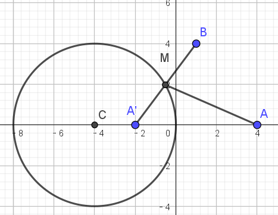
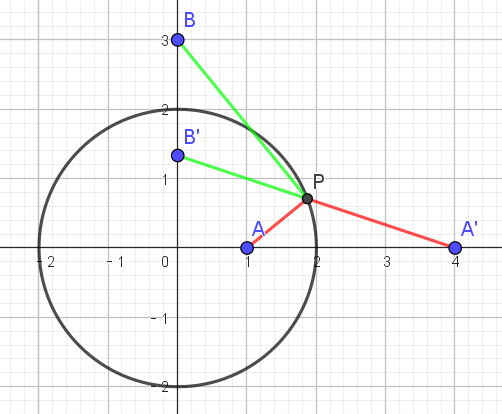

# 圆的方程拓展

import Geogebra from '@site/src/GeoGebra';

## 非圆系方程

### 圆的参数方程

圆心为 $(x_0, y_0)$，半径为 $r$ 的圆，可表示为含参数 $\theta$ 的方程组：

$$
\bcs
x = x_0 + r\cos \theta \\
y = y_0 + r\sin \theta
\ecs
$$

值得注意的是，其形式与直线的参数方程看起来一致（只是字母从 $t$ 变成了 $r$），但有本质的不同：

- 直线方程中 $\theta$ 为 **常量**（代表倾斜角），而 $t$ 为 **参数**．
- 这里 $r$ 为 **常量**（代表直径），而 $\theta$ 为 **参数**．

圆的参数方程相比于标准方程，**从二次变成了一次**，**引入了三角函数**．善用圆的参数方程可能可以达到简便计算的目的．

### 圆的直径式

> 已知坐标的两点 $A$，$B$，求以 $AB$ 为直径的圆的方程．

可以直接刻画为圆心在 $AB$ 中点，且半径为 $\df{|AB|}2$，列标准方程，但有一个更简单的做法——**圆的直径式**：

直径端点分别为 $A(x_1, y_1)$ 和 $B(x_2, y_2)$ 的圆可以表示为

$$
(x - x_1)(x - x_2) + (y - y_1)(y - y_2) = 0
$$

:::note 证明

考虑平面直角坐标系中任意一点 $P(x, y)$．

- 当它与 $A$ 或与 $B$ 重合时，显然 $\overrightarrow{AP} \perp \overrightarrow{BP}$（因为其中一个是零向量）．
- 否则，它在圆上等价于 $\angle APB = \df \pi 2$，即 $\overrightarrow{AP} \perp \overrightarrow{BP}$．
- 可以证明，$P$ 不在圆上时，$\angle APB \ne \df \pi 2$．

因此 $P$ 在圆上等价于 $\overrightarrow{AP} \perp \overrightarrow{BP}$，即

$$
(x - x_1, y - y_1) \cdot (x - x_2, y - y_2) = 0
$$

将数量积展开后，即得目标方程．

:::

### 公共弦所在直线方程

在两圆 $\odot A$，$\odot B$ 恰交于 $P$，$Q$ 两点时，称线段 $PQ$ 为两圆的 **公共弦**．现在研究直线 $PQ$ 的方程．

有结论：将两个圆方程的 **一般式** 形式 **相减**，会得到一个 **一次方程**，这个方程就是两圆的公共弦方程．

:::note 证明

设 $\odot A$ 的一般式为

$$
x^2 + y^2 + D_1x + E_1y + F_1 = 0
$$

$\odot B$ 的一般式为

$$
x^2 + y^2 + D_2x + E_2y + F_2 = 0
$$

两方程相减得

$$
(D_1 - D_2)x + (E_1 - E_2)y + F_1 - F_2 = 0
$$

两圆相交于两点，则圆心不可能重合，因此 $D_1 = D_2$ 与 $E_1 = E_2$ **不可能同时成立**，因此 $D_1 - D_2 \ne 0$ 或 $E_1 - E_2 \ne 0$．得到的方程表示一条直线．

考虑两圆的交点 $P$ 和 $Q$．由于它们各自都 **同时满足两个圆的方程**，因此也一定满足 **两个圆方程相减得到的方程**．即 $P$ 和 $Q$ 在表示的直线上，两点确定一条直线，证毕．

:::

:::info 例题 1.1

求两圆 $x^2 + y^2 - 2x + 10y - 24 = 0$ 与 $x^2 + y^2 + 2x + 2y - 8 = 0$ 的公共弦所在直线方程．

:::

:::tip 例题 1.1 解答

两方程相减得 $-4x + 8y - 16 = 0$，整理得 $x - 2y + 4 = 0$．

:::

::::warning 两圆必须相交

当两圆的交点数量不为 $2$ 时，不存在 **公共弦**，两圆相减得到的方程不再是公共弦．

不过比较值得注意的是，当两圆交点数量为 $1$，即 **相切**（包含内切与外切）时，会得到两个圆在 **切点** 上的一条 **公切线**．

:::note 证明

两圆圆心 $A(-\df{D_1} 2, -\df{E_1} 2)$，$B(-\df{D_2}2, -\df{E_2}2)$，有

$$
\overrightarrow{AB} = (\df{D_1 - D_2}2, \df{E_1 - E_2}2) = \df 1 2 (D_1 - D_2, E_1 - E_2)
$$

考虑得到的直线方程

$$
(D_1 - D_2)x + (E_1 - E_2)y + F_1 - F_2 = 0
$$

其法向量 $(D_1 - D_2, E_1 - E_2)$ 恰好是 $2 \overrightarrow{AB}$，平行于 $\overrightarrow{AB}$．

因此 **直线与圆心连线垂直**．

而先前证明了 **直线一定经过两圆交点**，因此 **直线过切点**．

综合两点即得 **直线为过切点的公切线**，证毕．

:::

注意：上面得到的方程仅能给出 **过两圆切点的公切线**．两圆内切时，公切线确实仅此一条；而两圆外切时，还有两条 **不过两圆切点的公切线**，上面的方程无法给出．

::::

### 切点弦所在直线方程

对于 $\odot C$ 和在该圆外的一点 $P$，从 $P$ 出发可以作 $\odot C$ 的两条切线，从而形成两个切点 $A$ 和 $B$．$AB$ 连接得到的弦称作 **切点弦**，现求解直线 $AB$ 的方程．

一个优于暴力求解，简单的算法如下：

连接 $PC$，作 $PC$ 中点 $M$，不难发现 $P$，$A$，$B$，$C$ 都在以 $M$ 为圆心，$MP$ 为半径的 $\odot M$ 上．从而，$\odot M$ 和 $\odot C$ 的公共弦就是所求的切点弦．算出公共弦直线方程即可．

上面的 $\odot M$ 其实是以线段 $PC$ 为直径作出的圆，因此可以利用直径式快速写出 $\odot M$ 的方程．

<Geogebra id="chord-tangent" filename={require('./assets/equation-extra/chord-tangent.ggb').default} width="420" height="310"/>

:::info 例题 1.2.1

过点 $P(3, 2)$ 作 $\odot C$：$(x - 1)^2 + y^2 = 1$ 的两条切线，切点分别为 $A$，$B$，求直线 $AB$ 的方程．

:::

:::tip 例题 1.2.1 解答

由题可知 $C(1, 0)$，以 $PC$ 为直径作圆

$$
(x - 3)(x - 1) + y(y - 2) = 0
$$

整理得 $x^2 + y^2 - 4x - 2y + 3 = 0$．$\odot C$ 方程整理得 $x^2 + y^2 - 2x = 0$，两方程相减得公共弦所在直线方程 $2x + 2y - 3 = 0$，即所求切点弦所在直线方程．

:::

:::info 例题 1.2.2

已知 $\odot M \colon x^2 + y^2 - 2x - 2y - 2 = 0$，直线 $l \colon 2x + y + 2 = 0$，$P$ 为 $l$ 上的动点，过点 $P$ 向 $\odot M$ 作切线 $PA$，$PB$，$A$、$B$ 为切点，当 $|AB|$ 最小时，求直线 $AB$ 的方程．

:::

:::tip 例题 1.2.2 解答

根据[切点弦](./position.md#切点弦)一节的结论，$|AB|$ 最小对应 $|MP|$ 最小，即 $P$ 应为 $M$ 向 $l$ 作垂线的垂足．

$M(1, 1)$，t 值法计算垂足：$t = \df{2 \times 1 + 1 + 2}{2^2 + 1^2} = 1$，$P = M - t(2, 1) = (-1, 0)$．

$PM$ 直径作圆 $(x - 1)(x + 1) + (y - 1)y = 0$，即 $x^2 + y^2 - y - 1 = 0$．

其与 $\odot M \colon x^2 + y^2 - 2x - 2y - 2 = 0$ 的相交弦所在直线可作差得到，为 $2x + y + 1 = 0$．

该直线即所求切点弦所在直线．

:::

### 阿氏圆

#### 认识阿氏圆

阿氏圆的内容如下：

> 对于两个定点 $A$，$B$ 和一定值 $\lambda > 0$，若动点 $P$ 满足 $\df{|PA|}{|PB|} = \lambda$，则：
>
> - $\lambda = 1$ 时，动点 $P$ 的轨迹为 $AB$ 的 **垂直平分线**．
> - $\lambda \ne 1$ 时，动点 $P$ 的轨迹为 **一个圆**，称作 **阿波罗尼斯圆**，简称 **阿氏圆**．

:::note 证明

$\lambda = 1$ 的情形显然，下讨论 $\lambda \ne 1$．

不失一般性，设 $A(0, 0)$，$B(m, 0)$，动点 $P(x, y)$，则

$$
\df{\sqrt{x^2 + y^2}}{\sqrt{(x - m)^2 + y^2}} = \lambda
$$

整理得

$$
(\lambda^2 - 1)x^2 + (\lambda^2 - 1)y^2 - 2\lambda^2mx + \lambda^2m^2 = 0
$$

$\lambda > 0$ 且 $\lambda \ne 1$ 时，上方程整理得

$$
x^2 + y^2 - \df{2\lambda^2m}{\lambda^2 - 1} x + \df{\lambda^2 m^2}{\lambda^2 - 1} = 0
$$

已经满足了圆的一般式的结构，下面只需要验证 $\Delta$．

$$
\Delta = (\df{2\lambda^2m}{\lambda^2 - 1})^2 - 4 \cdot \df{\lambda^2 m^2}{\lambda^2 - 1}
$$

$$
\bal
\df {(\lambda^2 - 1)^2} 4 \Delta &= (\lambda^2m)^2 - (\lambda^2 m^2)(\lambda^2 - 1) \\
&= (\lambda^2m^2)\lambda^2 - (\lambda^2 m^2)(\lambda^2 - 1) \\
&= \lambda^2m^2 > 0
\eal
$$

$\Delta$ 前的系数 $\df {(\lambda^2 - 1)^2} 4$ 明显恒正，因此 $\Delta > 0$，证毕．

:::

:::info 例题 1.3.1

已知 $A(-2, 0)$，$B(2, 0)$，动点 $P$ 满足 $\df{|PA|}{|PB|} = \sqrt 3$，求点 $P$ 的轨迹与 $x^2 + y^2 = 4$ 相交的弦长．

:::

提示：相交弦长可 **先求相交弦方程**，再利用弦三角，使用 **弦心距** 计算出 **弦长**．

:::tip 例题 1.3.1 解答

动点 $P$ 构成的圆：

$$
\df{(x + 2)^2 + y^2}{(x - 2)^2 + y^2} = 3
$$

整理得

$$
x^2 + y^2 = 8x - 4
$$

与 $x^2 + y^2 = 4$ 作差得 $x = 1$，即相交弦所在直线方程．

$x^2 + y^2 = 4$ 圆心到该弦距离为 $1$，半径为 $2$，半弦长为 $\sqrt 3$，弦长为 $2\sqrt 3$．

:::

对于这种求解阿氏圆的问题，其实 **直接朴素地计算** 就行了，笔者认为记结论没有必要．

#### 阿氏圆的性质

考察阿氏圆 $\odot M$ 与直线 $AB$ 的交点 $C$ 与 $D$，它是 **直线** $AB$ 上的两个满足 $\df{|PA|}{|PB|} = \lambda$ 的点，且阿氏圆以线段 $CD$ 为直径．

> 基于此，求解阿氏圆方程，也可以考虑求出 $C$ 与 $D$ 的坐标，列直径式求解．但有时 $C$ 与 $D$ 坐标的形式并不好，如例题 1.3.1，此时笔者觉得朴素求解更好．

对 $C$ 与 $D$ 作进一步的讨论：

- 一定有一个为在 **线段 $AB$ 上**，其将线段 $AB$ 分为 $\lambda : 1$ 的两部分，称作 **内分点**，令其为 $C$．
- 另一个一定在 **线段 $AB$ 外**，称作 **外分点**，令其为 $D$．
	- $\lambda > 1$ 时，$|DA| > |DB|$，$D$ 在从 $B$ 出发远离 $A$ 方向的射线上．
	- $0 < \lambda < 1$ 时，$|DA| < |DB|$，$D$ 在从 $A$ 出发远离 $B$ 方向的射线上．

综上，**线段 $AB$** 与 **线段 $CD$** 一定 **有交集**，但 **不存在包含关系**．

换个角度去思考，$A$ 与 $B$ 中，也一定一个在线段 $CD$ 上，一个线段 $CD$ 外．

直线 $AB$ 上的点在线段 $CD$ 上等价在圆内，因此 $A$ 与 $B$ 中 一定有一个在阿氏圆内，一定有一个在阿氏圆外．

<Geogebra id="apollonius" filename={require('./assets/equation-extra/apollonius.ggb').default} height="430"/>

重要结论：

$$
|MA| \cdot |MB| = r^2
$$

即 $A$ 与 $B$ 两个点到 **圆心** 距离的 **乘积** 等于 $r^2$，即 $A$ 与 $B$ 在 $\odot M$ 上构成 **反演关系**．

> 几何学中，对于一个圆，在从圆心出发的 **同一射线** 上，到圆心距离为半径平方的两点互称 **反演点**，具有 **反演关系**．

:::note 证明

不妨设 $\lambda > 1$，$0 < \lambda < 1$ 的情况是对称的（只需将 $A$，$B$ 调换，则定义中的 $\lambda$ 取倒数）．

$$
\bal
\df{|CA|}{|CB|} &= \df{|DA|}{|DB|} \\[1em]
\df{|MA| - |MC|}{|MC| - |MB|} &= \df{|MA| + |MD|}{|MB| + |MD|} \\[1em]
\df{|MA| - r}{r - |MB|} &= \df{|MA| + r}{|MB| + r} \\[1em]
|MA| \cdot |MB| &= r^2
\eal
$$

:::

注意到上面的推导在逆方向也成立，即任意直线 $AB$，该直线上任意一点 $M$ 为圆心作圆，与直线 $AB$ 交于 $C$、$D$，只要

$$
|MA| \cdot |MB| = r^2
$$

则

$$
\df{|CA|}{|CB|} = \df{|DA|}{|DB|}
$$

设这个值为 $\lambda$，则 $\df{|PA|}{|PB|} = \lambda$ 导出的阿氏圆就是 $\odot M$．

因此，**一个点 $A$ 和一个圆 $\odot M$** 可以确定 **另一个点 $B$**，使得 $\odot M$ 是 $A$、$B$ 导出的一个 **阿氏圆**．

确定方式是：在射线 $AM$ 上，找到 $A$ 关于 $\odot M$ 的 **反演点** $B$．

#### 构造反演点解决最值问题

这类问题解决的最值问题有以下特征：

- 求动点 $P$ 到定点 $A$，$B$ 的 **带权** 距离和 $m|PA| + n|PB|$ 的 **最值**．
- $P$ 的活动范围是一个 **圆**．

:::info 例题 1.3.2

$A(4, 0)$，$B(1, 4)$，点 $M$ 在 $\odot C \colon (x + 4)^2 + y^2 = 16$ 上活动，求 $|MA| + 2|MB|$ 的最小值．

:::

:::tip 例题 1.3.2 解答

构造 $A$ 关于 $\odot C$ 的反演点 $A'$，根据 $|CA| \cdot |CA'| = r^2$ 不难算出 $A'(-2, 0)$．

此时 $\odot C$ 为 $A$ 与 $A'$ 导出的阿氏圆，注意到其与 $x$ 轴的一个交点为 $O$，

且 $\df{|OA|}{|OA'|} = 2$，因此 $\odot C$ 上任意一点 $M$ 均满足 $\df{|MA|}{|MA'|} = 2$，即 $|MA| = 2|MA'|$．

因此 $|MA| + 2|MB| = 2|MA'| + 2|MB| = 2(|MA'| + |MB|) \ge 2|A'B| = 10$．

:::

从上面的例题可以看出这种问题的思路：

- 将一个定点 $A$ 作 **已知圆** 的 **反演点** $A'$，使得已知圆是这个定点与其反演点的 **阿氏圆**．
- 从而将 $|PA|$ 转化为一定比例的 $|PA'|$，从而将目标式 **不等比例的 $m : n$** 转为 **等比例 $1 : 1$**．
- 最后通过两点之间线段最短，使用两点间距离公式求解最小距离．

:::info 例题 1.3.3

已知 $x^2 + y^2 = 4$，求 $3\sqrt{5 - 2x} + \sqrt{13 - 6y}$ 的最小值．

:::

:::tip 例题 1.3.3 解答

$$
\bal
& \phantom = 3\sqrt{5 - 2x} + \sqrt{13 - 6y}\\
&= 3\sqrt{x^2 + y^2 - 2x + 1} + \sqrt{x^2 + y^2 -6y + 9}\\
&= 3 \sqrt{(x - 1)^2 + y^2} + \sqrt{x^2 + (y - 3)^2}
\eal
$$

即 $P(x, y)$，$A(1, 0)$，$B(0, 3)$，$P$ 在圆 $x^2 + y^2 = 4$ 上，求 $3|PA| + |PB|$ 的最小值．

同时作 $A$ 与 $B$ 关于圆的反演点，则该圆同时为 $A$ 与 $A'$ 导出的阿氏圆与 $B$ 与 $B'$ 导出的阿氏圆．

不难发现 $\df{|PA|}{|PA'|} = \df 1 2$，$\df{|PB|}{|PB'|} = \df 3 2$（观察圆与坐标轴的交点可知）．

因此 $3|PA| + |PB| = \df 3 2 (|PA'| + |PB'|) = 2\sqrt{10}$．

:::

## 圆系方程

> 一个二元方程 $F(x, y) = 0$ 可以表示平面上的曲线，而 $F(x, y) = 0$ 中含有参数时，参数不同，方程导出的曲线就不同，这一簇曲线就叫做 **曲线系**．

下面几节我们就会研究几种比较有价值的 **圆系**，即上面的 $F(x, y) = 0$ 为 **含参圆方程** 的情形．

### 同心圆系方程

参数为 $r$ 的方程

$$
(x - x_0)^2 + (y - y_0)^2 = r^2
$$

可以表示 **圆心为 $(x_0, y_0)$** 的所有圆，是 **一组同心圆**．

### 交点圆系方程

### 共轴圆系方程
