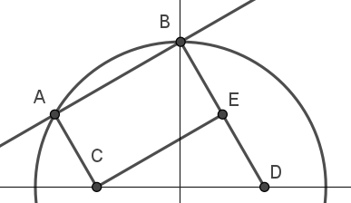
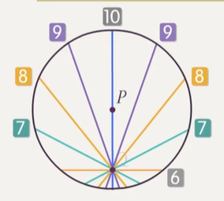

# 圆中的位置关系

import Geogebra from '@site/src/GeoGebra';

## 点与圆的位置关系

### 点与圆的位置关系内容

点 $P$ 和 $\odot A$ 的位置关系有三种：$P$ 在 $\odot A$ 外；$P$ 在 $\odot A$ 内；$P$ 在 $\odot A$ 上．

设 $P$ 到圆心 $A$ 的距离为 $d$，$\odot A$ 的半径为 $r$，则：

- $P$ 在 $\odot A$ 外，当且仅当 $d > r$．
- $P$ 在 $\odot A$ 内，当且仅当 $d < r$．
- $P$ 在 $\odot A$ 上，当且仅当 $d = r$．

### 标准式上快速判断点与圆位置关系

> $\odot A$：$(x - x_A)^2 + (y - y_A)^2 = r^2$．快速判断 $P(x_0, y_0)$ 和 $\odot A$ 的大小关系．

注意到将 $(x_0, y_0)$ 代入上述方程等号左侧得到

$$
(x_0 - x_A)^2 + (y_0 - y_A)^2
$$

不难看出这就是 **$P$ 到圆心 $A$ 的距离** $\* d^2$，而等号右侧为 $r^2$，它们的大小关系可以直接说明 $d$ 与 $r$ 的大小关系：

- $d^2 > r^2$，当且仅当 $d > r$，当且仅当 $P$ 在 $\odot A$ 外．
- $d^2 < r^2$，当且仅当 $d < r$，当且仅当 $P$ 在 $\odot A$ 内．
- $d^2 = r^2$，当且仅当 $d = r$，当且仅当 $P$ 在 $\odot A$ 上．

因此，在标准式中，只需：

- 直接将 **待判断点的坐标** 代入 **方程左侧**．
- 看 **方程左侧的结果与方程右侧的大小关系**，即可确定 **点与圆的位置关系**．

:::info 例题 1.1

判断点 $(1, -3)$ 与圆 $(x - 2)^2 + (y + 1)^2 = 6$ 的位置关系．

:::

:::tip 例题 1.1 解答

$(1 - 2)^2 + (-3 + 1)^2 = 5 < 6$．因此点在圆内．

:::

### 一般式上快速判断点与圆位置关系

$\odot A$：$x^2 + y^2 + Dx + Ey + F = 0$．快速判断 $P(x_0, y_0)$ 和 $\odot A$ 的大小关系．

注意到

$$
x^2 + y^2 + Dx + Ey + F = (x + \df D 2)^2 + (y + \df E 2)^2 - \df{D^2 + E^2 - 4F}{4}
$$

因此对于一般式

$$
x^2 + y^2 + Dx + Ey + F = 0
$$

将 $P(x_0, y_0)$ 代入方程左侧后，左侧的结果为：

$$
\underbrace{(x_0 + \df D 2)^2 + (y_0 + \df E 2)^2}_{\red{d^2}} - \underbrace{\df{D^2 + E^2 - 4F}{4}}_{\red{r^2}}
$$

也即左侧的结果为 $\* d^2 - r^2$，显然其与 $0$ 的大小关系决定 $d$ 与 $r$ 的大小关系：

- **小于** $0$ 时 $d < r$，点在 **圆内**．
- **等于** $0$ 时 $d = r$，点在 **圆上**．
- **大于** $0$ 时 $d > r$，点在 **圆外**．

因此 **一般式** 可以像 **标准式** 一样，将 **点的坐标直接代入方程左侧**，与 **右侧比较**，从而 **判定点的位置**．

:::info 例题 1.2.1

判断点 $(1, 1)$ 与圆 $x^2 + y^2 - 4x - 8y + 15 = 0$ 的位置关系．

:::

:::tip 例题 1.2.1 解答

$1^2 + 1^2 - 4 - 8 + 15 = 5 > 0$．因此点在圆外．

:::

:::info 例题 1.2.2

若过点 $(1, 2)$ 总可以作两条直线与圆 $x^2 + y^2 + kx + 2y + k^2 - 15 = 0$ 相切，求实数 $k$ 的取值范围．

:::

:::tip 例题 1.2.2 解答

首先 **方程要表示圆**（至少需要让题目给出的方程是合法的圆一般式），$\Delta > 0$，即

$$
k^2 + 2^2 - 4(k^2 - 15) > 0
$$

解得 $-\df 8 3 \sqrt 3 < k < \df 8 3 \sqrt 3$．

其次，**过点能作圆的两条切线** 等价于 **点在圆外**，类似地：

- **能恰作一条切线** 等价于 **点在圆上**．
- **至少能作一条切线** 等价于 **点在圆上** 或 **点在圆外**．

这里点在圆外，因此

$$
1^2 + 2^2 + 2k + 2 \times 2 + k^2 - 15 > 0
$$

解得 $k < -3$ 或 $k > 2$．

综合两个不等式的解集，可知 $k \in (-\df 8 3 \sqrt 3, -3) \cup (2, \df 8 3 \sqrt 3)$．

:::

:::info 例题 1.2.3

无论 $a$ 取何值，直线 $ax + a + y + 1 = 0$ 与圆 $x^2 + y^2 - 2x - 2y + b = 0$ 始终相交，求 $b$ 的取值范围．

:::

:::tip 例题 1.2.3 解答

将含参直线拆成交点直线系：

$$
a(x + 1) + y + 1 = 0
$$

即一个恰能取到经过定点 $P(-1, -1)$ 的，除 $x + 1 = 0$ 外所有直线的直线系．

该直线系中所有直线与圆相交，有两种可能：

可能性一：定点 $P$ 在 **圆内**．

此时过 $P$ 的直线一定与圆相交．

可能性二：定点 $P$ 在 **圆上**，且过 $P$ 的切线为 $x + 1 = 0$．

此时，过 $P$ 的所有直线中，除切线以外所有直线与圆相交，只要这个切线是那个恰好取不到的线，则这种情况也成立．

第二种情形是可以排除的：注意到圆心为 $(1, 1)$，与 $P(-1, -1)$ 连线不水平，因此 $P$ 在圆上时，过 $P$ 的切线一定不竖直，不可能为 $x + 1 = 0$．

因此只可能是 $P$ 在圆内，有

$$
(-1)^2 + (-1)^2 - 2 \times (-1) - 2 \times (-1) + b < 0
$$

解得 $b \in (-\infty, -6)$．

:::

:::note 判定一般式是否表示圆的必要性讨论

例题 1.2.2 中，需要特别判断 $\Delta > 0$，但例题 1.2.3 不用．为什么？

对于任意满足下面形式（$\Delta$ 不一定大于 $0$）的方程

$$
x^2 + y^2 + Dx + Ey + F = 0
$$

将待判断点 $P(x_0, y_0)$ 代入方程左侧的式子，得到的结果为

$$
{x_0}^2 + {y_0}^2 + Dx_0 + Ey_0 + F = \underbrace{(x_0 + \df D 2)^2 + (y_0 + \df E 2)^2}_{d^2} - \underbrace{\df \Delta {4}}_{\Delta > 0 时表示 r^2}
$$

例题 1.2.2 中，式子

$$
{x_0}^2 + {y_0}^2 + Dx_0 + Ey_0 + F > 0 \implies d^2 > \df{\Delta} 4
$$

当 $\Delta > 0$ 时，**方程表示圆**，当且仅当 $d^2 > \df{\Delta} 4 = r^2$，表示 **点在圆外**，上式成立．

$\Delta \le 0$ 时，**方程不表示圆**，此时只要 $d$ 与 $\Delta$ 不同时为 $0$，上不等式也成立．

因此，上面的不等式成立 **不一定** 说明 **方程表示圆**，还需要加上 **方程表示圆** 的条件排除不表示圆的情形．

但在例题 1.2.3 中，判定 **点在圆内**，用到的不等式为

$$
{x_0}^2 + {y_0}^2 + Dx_0 + Ey_0 + F > 0 \implies d^2 < \df{\Delta} 4
$$

这个不等式 **自动限制了 $\Delta > 0$**，因此这个不等式成立时，**方程表示的一定是圆**，因此无需再加条件舍去解．

因此，对于 $\Delta$ 含参，不确定正负性的一般式：

- **点在圆外** 需要额外讨论 $\Delta$，舍去非圆情形．
- **点在圆内** 不需要讨论 $\Delta$（当然讨论也可）．
- **点在圆上** 需要讨论 $\Delta$，因为 $d = \Delta = 0$ 时，等式 ${x_0}^2 + {y_0}^2 + Dx_0 + Ey_0 + F = 0$ 成立，但原方程表示的不是圆．

:::

### 点到圆上一动点距离值域

> 已知 $\odot C$ 和一点 $A$，求点 $A$ 到 $\odot C$ 上一动点 $P$ 的距离取值范围．

记号：

- $\odot C$ 半径为 $r$，为 **动点** 与 **圆心** 的距离．
- $|AC| = d$，为 **定点** 与 **圆心** 的距离．
- 所求距离 $|AP| = a$，为 **动点** 与 **定点** 的距离．

结论：$a$ 的值域为

$$
[|d - r|, d + r]
$$

下面只证明 $a$ 的最小值是 $|d - r|$，最大值是 $d + r$，至于为什么 $[|d - r|, d + r]$ 中的每个值都一定能取到，可以感性理解为「$P$ 移动时距离连续变化」，严格的证明没有必要．

#### 最值外取不到

根据两点之间线段最短，我们有：

$$
\begin{cases}
|AP| + |PC| \ge |AC| \\
|AC| + |CP| \ge |AP| \\
|CA| + |AP| \ge |CP|
\end{cases}
$$

即

$$
\begin{cases}
d + r \ge a \\
a + r \ge d \\
a + d \ge r
\end{cases}
$$

这等价于 $\max(d - r, r - d) \le a \le d + r$，即 $|d - r| \le a \le d + r$．

#### 最值可以取到

现证明最小值 $|d - r|$ 和最大值 $d + r$ 均能被取到，并说明取到时的情形．

作直线 $AC$，其一定与圆有两个交点（因为 $C$ 在圆内部），且一个交点 $P_1$ 位于从 $C$ 出发远离 $A$ 一侧的方向，一个交点 $P_2$ 位于从 $C$ 出发靠近 $A$ 一侧的方向．

<Geogebra id="circle-and-dot" filename={require('./assets/position/circle-and-dot.ggb').default} width="450" height="400"/>

不难发现 $P_1$ 取到最大值 $d + r$，$P_2$ 取到最小值 $|d - r|$，证毕．

:::info 例题 1.3

已知点 $M(x, y)$ 在 $\odot C$：$x^2 + y^2 - 4x + 6y + 9 = 0$ 上，求 $x^2 + y^2 + 2x - 2y - 4$ 的取值范围．

:::

:::tip 例题 1.3 解答

根据[隐距离](./equation.md#隐距离)的知识，容易发现所求可以转化为 $(x + 1)^2 + (y - 1)^2 - 6$ 的取值范围，即 $(x, y)$ 到 $(-1, 1)$ 的距离的平方 $-6$ 的取值范围．计算 $(x, y)$ 到 $(-1, 1)$ 的距离取值范围即可．

所给圆配方得 $(x - 2)^2 + (y + 3)^2 = 4$，圆心为 $(2, -3)$，半径为 $2$．

$(-1, 1)$ 与圆心 $(2, -3)$ 的距离为 $5$，圆的半径为 $2$，因此所求距离的取值范围是 $[3, 7]$．

原式取值范围为该距离的平方 $-6$ 的取值范围，即 $[3, 43]$．

:::

## 直线与圆的位置关系

### 直线与圆的位置关系内容

$\odot A$ 和直线 $l$ 的位置关系有三种：$l$ 与 $\odot A$ 相离；$l$ 与 $\odot A$ 相交；$l$ 与 $\odot A$ 相切．

设圆心 $A$ 到 $l$ 的距离为 $d$，$\odot A$ 的半径为 $r$，则：

- $l$ 与 $\odot A$ **相离**，当且仅当 $d > r$，当且仅当 $l$ 与 $\odot A$ **没有交点**．
- $l$ 与 $\odot A$ **相交**，当且仅当 $d < r$，当且仅当 $l$ 与 $\odot A$ **有两个交点**．
- $l$ 与 $\odot A$ **相切**，当且仅当 $d = r$，当且仅当 $l$ 与 $\odot A$ **恰有一个交点**．

判断直线与圆的位置关系有两种角度，对应地，在解析几何中我们也有两套判断方式．

#### 距离法

用点到直线的距离公式算出 $d$，直接和 $r$ 比较，即可得到圆与直线的位置关系．

#### 判别式法

还可以从交点数量的角度判断直线与圆的位置关系．联立直线与圆的方程：

$$
\begin{cases}
Ax + By + C = 0\\
x^2 + y^2 + Dx + Ey + F = 0
\end{cases}
$$

这虽然是一个二元二次方程组，但有一个方程是一次的．

不妨设 $B \ne 0$，此时 $y$ 可以由 $x$ 线性表出；利用这个线性关系将第二个方程的 $y$ 消去，使其变为二元一次方程．

（如果 $B = 0$，则一定有 $A \ne 0$，反过来将 $x$ 用 $y$ 线性表出即可．）

形式化地，当 $B \ne 0$ 时，我们可以将方程等价变形为：

$$
\begin{cases}
y = f_1(x) \\
f_2(x, y) = 0
\end{cases}
$$

然后等价变形为：

$$
\begin{cases}
y = f_1(x) \\
f_2(x, f_1(x)) = 0
\end{cases}
$$

根据第一个方程，一个 $x$ 恰好对应一个 $y$．那么，

$f_2(x, f_1(x)) = 0$ 方程解的个数 $=$ 整个方程组解的个数 $=$ 圆与直线的交点总数．

因此判断 $f_2(x, f_1(x)) = 0$ 方程解的个数即可．

$f_2(x, f_1(x)) = 0$ 是一个二元一次方程，判断其解的个数，我们可以判断 $\Delta$ 的正负性．

- $\Delta = 0$ 时有一个解，对应一个交点，对应相切．
- $\Delta > 0$ 时有两个解，对应两个交点，对应相交．
- $\Delta < 0$ 时有零个解，对应零个交点，对应相离．

:::info 例题 2.1

判断直线 $x - y + 4 = 0$ 与圆 $x^2 + y^2 = 8$ 的位置关系．

:::

:::tip 例题 2.1 解答

联立：

$$
\begin{cases}
x - y + 4 = 0 \\
x^2 + y^2 = 8
\end{cases}
$$

变形为

$$
\begin{cases}
y = x + 4 \\
x^2 + (x + 4)^2 = 8
\end{cases}
$$

该方程组解的个数与 $x^2 + (x + 4)^2 = 8$ 中解的个数相同，整理得 $x^2 + 4x + 4 = 0$．

计算其判别式 $\Delta = 4^2 - 4 \times 4 = 0$，直线与圆相切．

:::

该方法可将直线与圆的交点坐标顺便解出．但这里有一个注意事项．来看下面的错误示范：

:::info 例题 2.1

判断直线 $x - y + 4 = 0$ 与圆 $x^2 + y^2 = 8$ 的位置关系．

:::

:::danger 例题 2.1 错误解答示范

联立：

$$
\begin{cases}
x - y + 4 = 0 \\
x^2 + y^2 = 8
\end{cases}
$$

变形为

$$
\begin{cases}
y = x + 4 \\
x^2 + (x + 4)^2 = 8
\end{cases}
$$

代入消元，第二个方程变形为 $x^2 + 4x + 4 = 0$，解得 $x = -2$．将 $x = -2$ 代入第二个方程后，有 $(-2)^2 + y^2 = 8$，解得 $y = 2$ 或 $y = -2$．

因此，直线与圆有两个交点，直线与圆相交．

:::

上面做法的错误之处在于：

$$
\begin{cases}
y = x + 4 \\
x^2 + (x + 4)^2 = 8
\end{cases}
$$

其等价的结果应为：

$$
\begin{cases}
y = x + 4 \\
x = 2
\end{cases}
$$

利用圆方程解出 $x$ 后，必须重新代入 **直线方程** 才能得到正确的 $y$．

### 直线与圆的位置关系 两种方法比较

**首选距离法**．判别式法与距离法相比，计算量一般更大，**尤其当方程含参时一定选择距离法**．

- 当询问直线和圆的交点坐标时，再考虑联立法．
- 当已知 **含参直线** 与圆 **相切**，求 **切点坐标** 时，**先用距离法** 把 **参数求出**，再 **联立方程** 求坐标．

> 事实上，单纯运用判别式判定交点数几乎不用，因为使用判别式法的情景通常都是要进一步求具体交点坐标．

:::info 例题 2.2

若直线 $3x + 4y + 5 = 0$ 与圆 $(x + a)^2 + (y + 1)^2 = 1$ 恰有一个公共点，求 $a$ 的值．

:::

:::tip 例题 2.2 解答

由题可知圆心为 $(-a, -1)$，半径为 $1$．

圆心到直线的距离为 $1$，即 $\df{|-3a - 4 + 5|}{\sqrt{3^2 + 4^2}} = 1$，解得 $a = -2$ 或 $a = -\df 43$．

:::

### 过一点作圆的切线方程

> 过 **圆外或圆上** 一点 $A$ 作 $\odot C$ 的切线 $l$，求 $l$ 的方程．

先根据 $l$ 过点 $A$ 列出斜率为参数 $k$ 的点斜式方程．

:::caution 特判斜率不存在

这一步需要提前讨论 **直线斜率不存在** 的情形，即要先判断过 $A$ 的 **竖直线** 是否与 $\odot C$ 相切．

:::

然后利用距离法，根据 **圆心 $C$ 到 $l$ 的距离等于 $r$** 列出方程，求出参数 $k$ 的值．

:::info 例题 2.3.1

从 $\odot C \colon (x-1)^2 + (y-1)^2 = 1$ 外一点 $P(2, 3)$ 向圆引切线，求切线方程．

:::

:::tip 例题 2.3.1 解答

$\odot C$ 的圆心为 $(1, 1)$，半径为 $1$，设过 $P$ 的直线 $l$ 为圆的切线．

当 $l$ 不存在斜率时，$l \colon x = 2$，圆心到 $l$ 的距离等于半径，因此 $x = 2$ 是一条切线．

当 $l$ 存在斜率 $k$ 时，设 $l \colon y - 3 = k(x - 2)$，则圆心到 $l$ 的距离等于 $r$．

$l$ 的一般式为 $kx - y - 2k + 3 = 0$，则

$$
\df{|k - 1 - 2k + 3|}{\sqrt{k^2 + 1}} = 1
$$

解得 $k = \df 3 4$，整理可得 $l \colon 3x - 4y + 6 = 0$．

综上，$l$ 的方程为 $x = 2$ 或 $3x - 4y + 6 = 0$．

:::

:::note 善用圆外一点必能引出两条切线

**圆外** 一点向圆必定可以引出两条切线．

因此，在 **填选** 中，对于 **圆外一点** 向圆引切线的题目，可直接考虑设 $k$ 解方程：

- 如果只算出来 **一个解**，说明另一个解是 **竖直线**．
- 如果算出 **两个解**，则 **竖直线** 一定 **不是解**．

在 **大题** 中该讨论还是要讨论，当然可以根据 **必定引出两条切线** 检验自己是否算错．

注意：**圆上一点** 只能引出一条切线，没有上述结论．

:::

#### 圆上一点求切线方程 简便做法

> 过 **圆上** 一点 $A$ 作 $\odot C$ 的切线 $l$，求 $l$ 的方程．

考虑到 **圆上一点的切线与过该点的半径垂直**，$l$ 存在法向量 $\overrightarrow{CA}$．

再根据 $A$ 在 $l$ 上，可直接根据点法式写出 $l$ 的方程．

这个做法比设 $k$ 简单很多，因此 **对于点在圆上的题目请采用这种策略计算切线方程**．

:::info 例题 2.3.2

过点 $P(3, 1)$ 作 $(x - 1)^2 + y^2 = 5$ 的切线，求切线方程．

:::

:::tip 例题 2.3.2 解答

**先判定一下 $P$ 的位置**．$(3 - 1)^2 + 1^2 = 5$，因此 $P$ 在 **圆上**．

圆心 $C(1, 0)$，$\overrightarrow{CP} = (2, 1)$，点法式给出切线方程

$$
2x + y = 2 \times 3 + 1 \times 1 = 7
$$

即 $2x + y - 7 = 0$．

:::

:::note

过一点求切线方程的题目，应 **优先判定点与圆的位置关系**，从而找到最简单的解题策略．

:::

### 圆的弦长公式

> 一直线 $l$ 与 $\odot C$ 交于 $A$，$B$ 两点，求 $|AB|$．

联立 $l$ 与 $\odot C$，求出两个交点的坐标，用两点间距离公式计算是最直接的方案，但 **很繁琐，完全不推荐使用**．

更明智的策略是：

- 计算 **圆心 $\odot C$** 到 **直线 $l$** 的距离 $d$．这个距离即 **圆心到弦的距离**，称作 **弦心距**．
- 设 $\odot C$ 半径为 $r$，则 $\red{2}\sqrt{r^2 - d^2}$ 即为答案．

正确性：基于 **垂径定理** 与 **勾股定理**，可以发现 **半弦长** 为 $\sqrt{r^2 - d^2}$，其二倍即为弦长．

该公式可以将 **难求的弦长** 转化为 **易求的弦心距**．

<Geogebra id="chord-basic" filename={require('./assets/position/chord-basic.ggb').default} width="420" height="390"/>

:::info 例题 2.4.1

求直线 $x - \sqrt 3 y + 2 \sqrt 3 = 0$ 被圆 $x^2 + y^2 = 4$ 截得的弦长．

:::

:::tip 例题 2.4.1 解答

弦心距为 $\df{2 \sqrt 3}{\sqrt{1^2 + \sqrt 3^2}} = \sqrt 3$，圆的半径为 $\sqrt 4 = 2$．

因此半弦长为 $\sqrt{2^2 - \sqrt 3^2} = 1$，弦长为 $2$．

:::

解决弦长问题，核心的几何结构是 **弦心距** 与 **半弦长** 为直角边，**半径** 为斜边的直角三角形，后文称之为「**弦三角**」．弦三角不仅能求弦长，还可以 **处理很多与弦有关的条件**．比如 $\odot C$ 的弦 $AB$ 中，

- $|AB|$（弦长条件）．
- $\angle ACB$（圆心角）．
- $\triangle ACB$ 的面积．
- $\overrightarrow{CA} \cdot \overrightarrow{CB}$（即 $r^2\cos \angle ACB$，重点仍然是圆心角）．

这些条件都要联想到 **弦三角**，从而简化运算．

:::info 例题 2.4.2

已知 $P(1, -1)$ 为圆 $x^2 + y^2 - 6x = 0$ 的弦 $MN$ 的中点，求弦 $MN$ 所在直线方程．

:::

:::tip 例题 2.4.2 解答

设圆心 $C(3, 0)$，根据垂径定理，不难发现 $MN$ 是一条 **经过点 $P$，法向量 $\overrightarrow{PC}$** 的直线．

$\overrightarrow{PC} = (2, 1)$，点法式给出

$$
MN\colon 2x + y = 2 \times 1 + 1 \times (-1) = 1
$$

即 $2x + y - 1 = 0$．

:::

:::info 例题 2.4.3

已知直线 $l \colon mx + y + 3m - \sqrt 3 = 0$ 与圆 $x^2 + y^2 = 12$ 交于 $A$，$B$，过 $A$，$B$ 分别作 $l$ 的垂线与 $x$ 轴交于 $C$，$D$ 两点，若 $|AB| = 2\sqrt 3$，求 $|CD|$ 的值．

:::

:::tip 例题 2.4.3 解答

$|AB| = 2\sqrt 3$ 为弦长，考虑转化为弦心距．

半弦长 $\sqrt 3$，半径 $2 \sqrt 3$，勾股可知弦心距为 $3$．

因此圆心 $(0, 0)$ 到直线 $mx + y + 3m - \sqrt 3 = 0$ 的距离为 $3$，解得 $m = -\df{\sqrt 3} 3$．

因此 $l \colon y = \df{\sqrt 3}3 x + 2\sqrt 3$，画图：

当然，我们可以选择将 $A$，$B$ 的坐标算出，然后作垂线，再求 $C$，$D$ 的坐标，最后计算结果．但是不要忘记：**我们还有通常比解析法更简单的几何法**．

作垂 $CE \perp BD$ 交 $BD$ 于 $E$，则四边形 $ABCE$ 构成矩形，$|CE| = |AB| = 2\sqrt 3$．

而 $l$ 的斜率为 $\df {\sqrt 3} 3$，倾斜角为 $\df \pi 6$，又 $CE \parallel l$，因此 $\angle ECD = \df \pi 6$．

这样以来，$|CD| = \df{|CE|}{\cos \fr \pi 6} = 4$，计算完毕．

:::

### 圆的弦长值域

对于 $\odot C$ 和在 **圆内** 的一点 $P$，经过 $P$ 的无数条弦中：

- 连接 $CP$．
- 弦长 **最大值** 为 **直径**，将 $CP$ 两端延长至与圆相交时，该弦即最长弦．
- 弦长 **最小值** 为 **垂直于 $CP$ 的弦**．

<Geogebra id="chord" filename={require('./assets/position/chord.ggb').default} width="500" height="320"/>

最大值的证明是显然的．最小值的证明，是考虑到半弦长 $l$ 与弦心距 $d$ 满足关系式

$$
d^2 + l^2 = r^2
$$

当 $l$ 最小时，$d$ 应当最大，即 **弦心距最大**．

由于弦过定点 $P$，可知弦心距最大 $|CP|$．上面的动画可以直观看出，任意弦的弦心距 $|CH| \le |CP|$．

:::info 例题 2.5

已知 $\odot P \colon x^2 + (y + 2\sqrt 3)^2 = 25$ 被直线 $x + my + 2 = 0$ 被直线 $x + my + 2 = 0$ 截得的弦长为整数，求满足条件的 $m$ 的数量．

:::

:::tip 例题 2.5 解答

直线拆为交点直线系 $x + 2 + my = 0$，可知过定点 $Q(-2, 0)$ 且取不到 $y = 0$，即 x 轴．

$(-2)^2 + (0 + 2\sqrt 3)^2 < 25$，可知 $Q$ 在圆内，假设直线可以任意转动，根据结论：

- 弦长最大值为直径 $10$．
- 弦长最小值为弦心距等于 $|PQ| = 4$ 时，此时半弦长为 $\sqrt{5^2 - 4^2} = 3$，弦长为 $6$．

根据对称性，弦长为整数的弦应有 $8$ 条：

现在检验取不到的 x 轴是否对应这里的一条弦．弦心距为 $2\sqrt 3$，此时半弦长为 $\sqrt{13}$，不为整数，因此不对应这里的弦．

因此 $8$ 条弦均能取到，而一条弦对应一个参数取值（在[交点直线系](../line/equation.md#交点直线系)已给出证明），答案为 $8$．

:::

### 圆的切线长公式

> $\odot C$ 外一点 $P$ 向 $\odot C$ 引出两条切线 $PM_1$，$PM_2$，切点分别为 $M_1$，$M_2$，求 $|PM_1|$ 与 $|PM_2|$．

可以联立求切点坐标，用两点间距离公式计算，但同理 **很繁琐，完全不推荐使用**．

更好的策略是：

- 切线长定理给出 $|PM_1| = |PM_2|$，这两个一致的长度统一称作 **切线长**．
- 计算 $P$ 到圆心 $\odot C$ 的距离 $d$．
- 设 $\odot C$ 半径为 $r$，则切线长等于 $\sqrt{d^2 - r^2}$．

上面的做法根据 **过切点的半径与切线垂直**，由勾股定理易得．

<Geogebra id="tangent-basic" filename={require('./assets/position/tangent-basic.ggb').default} width="420" height="390"/>

**切线长** 对应的几何结构是 **半径**、**切线长** 为直角边，**点心距** 为斜边的直角三角形，下文称之为「切三角」．与弦长类似，只要遇到 **有关圆的切线长** 的条件，就可以考虑利用切三角转化为 **点心距** 的条件．

:::info 例题 2.6

已知 $\odot M \colon (x+1)^2 + (y-2)^2 = 1$，点 $P$ 在直线 $l \colon y = x - 1$ 上，设半径为 $5$ 的 $\odot N$ 与 $\odot M$ 相离，过点 $P$ 分别作 $\odot M$、$\odot N$ 的切线，切点分别为 $A$、$B$，若对任意点 $P$ 均有 $|PA| = |PB|$，求圆心 $N$ 的坐标．

:::

:::tip 例题 2.6 解答

设 $P(p, p - 1)$，将切线长条件处理为点心距条件：

$$
|PA| = |PB| \iff |PA|^2 = |PB|^2 \iff |PM|^2 - 1^2 = |PN|^2 - 5^2
$$

设 $N(m, n)$，则

$$
(p + 1)^2 + (p - 1 - 2)^2 - 1^2 = (p - m)^2 + (p - 1 - n)^2 - 5^2
$$

该方程应对任意 $p \in \R$ 恒成立，将其整理为 $p$ 为未知元，$m$、$n$ 为参数的方程：

$$
2(m + n - 1)p + 33 - m^2 - n^2 - 2n = 0
$$

因此有

$$
\bcs
2(m + n - 1) = 0 \\
33 - m^2 - n^2 - 2n = 0
\ecs
$$

解得 $\bcs m = 5 \\ n = -4 \ecs$ 或 $\bcs m = -3 \\ n = 4 \ecs$，即 $N_1(5, -4)$，$N_2(-3, 4)$．

根据 $\odot N$、$\odot M$ 相离，$|NM| > 6$，可舍去 $N_2$，$N(5, -4)$．

:::

### 切点弦

> 对于 $\odot C$ 和在该圆外的一点 $P$，从 $P$ 出发可以作 $\odot C$ 的两条切线，从而形成两个切点 $A$ 和 $B$．$AB$ 连接得到的弦称作 **切点弦**．

**切点弦** 综合了 **切线** 与 **弦** 两个元素，就同时涉及到了「弦三角」与「切三角」两个结构．

<Geogebra id="chord-tangent" filename={require('./assets/position/chord-tangent.ggb').default} width="420" height="310"/>

结论：**点心距** $|PC|$ 越大，**切线长** $|PA|$ 越大，**切点弦** $|AB|$ 越长．

:::note 结论证明

$|PC|$ 越大，切线长 $|PA| = \sqrt{|PC|^2 - |AC|^2}$ 越大．

$\alpha \in (0, \df \pi 2)$，此时 $\sin \alpha$ 与 $\alpha$ 正相关，$\cos \alpha$ 与 $\alpha$ 负相关．

$|PC|$ 越大，$\cos \alpha$ 越小，$\sin \alpha$ 越大，$\df{|AM|}{|AC|}$ 越大，$|AM|$ 越大，$|AB|$ 越大．

:::

### 圆上一动点坐标线性加和值域

> 已知圆上一动点 $(x, y)$，求 $mx + ny$ 的值域．

可以转化为 $mx + ny = t$ 何时与已知圆有交点，转化为直线与圆有交点（相交或相切）求参数问题．

:::info 例题 2.7

$x^2 + y^2 - 8x - 6y + 21 = 0$ 上一动点 $P(x_0, y_0)$，求 $2x_0 + y_0$ 的取值范围．

:::

:::tip 例题 2.7 解答

设 $2x + y = m$，问题转为 $m$ 取何值时，直线 $2x + y - m = 0$ 与给定圆存在交点．

配方得 $(x - 4)^2 + (y - 3)^2 = 2^2$，圆心 $(4, 3)$，半径 $2$．

条件等价于圆心到直径的距离小于等于半径，即

$$
\df{|2 \times 4 + 3 - m|}{\sqrt{2^2 + 1^2}} \le 2
$$

解得 $m$ 值域为 $[11 - 2\sqrt 5, 11 + 2\sqrt 5]$，即答案．

:::

## 圆与圆的位置关系

### 圆与圆的位置关系内容

两圆之间的位置关系共有五种：外离；外切；相交；内切；内含．设两圆半径分别为 $r_1$，$r_2$，两圆圆心的距离（圆心距）为 $d$，则：

- $d > r_1 + r_2$ 时，两圆 **外离**．
- $d = r_1 + r_2$ 时，两圆 **外切**．
- $|r_1 - r_2| < d < r_1 + r_2$ 时，两圆 **相交**．
- $d = |r_1 - r_2|$ 时，两圆 **内切**．
- $d < |r_1 - r_2|$ 时，两圆 **内含**．

特别地：

- 当 $d = 0$ 时，两圆互为 **同心圆**（它们的圆心相同）．
- 当 $r_1 = r_2$ 时，两圆没有内含的情形，内切等价于重合．

确定两圆的位置关系，我们要比较 **圆心距** 与 **半径和、半径差** 两个量的大小关系．

### 两圆上两动点距离值域

已知两个圆 $\odot C_1$ 和 $\odot C_2$，$\odot C_1$ 上有一动点 $P_1$，$\odot C_2$ 上有一动点 $P_2$，求 $P_1$ 和 $P_2$ 间距离的取值范围．

设 $\odot C_1$ 半径为 $r_1$，$\odot C_2$ 半径为 $r_2$，圆心距 $|C_1C_2|$ 为 $d$，所求 $|P_1P_2|$ 距离为 $a$．

根据两点之间线段最短，有：

$$
\begin{cases}
|P_1C_1| + |C_1C_2| + |C_2P_2| \ge |P_1P_2| \\
|C_1P_1| + |P_1P_2| + |P_2C_2| \ge |C_1C_2| \\
|P_1P_2| + |P_2C_2| + |C_2C_1| \ge |P_1C_1| \\
|P_2P_1| + |P_1C_1| + |C_1C_2| \ge |P_2C_2|
\end{cases}
$$

即

$$
\begin{cases}
r_1 + d + r_2 \ge a \\
r_1 + a + r_2 \ge d \\
a + r_2 + d \ge r_1 \\
a + r_1 + d \ge r_2
\end{cases}
$$

综合 $a \ge 0$，整理得：

$$
\max(|r_1 - r_2| - d, d - r_1 - r_2, 0) \le a \le r_1 + r_2 + d
$$

现证明最小值 $\max(|r_1 - r_2| - d, d - r_1 - r_2, 0)$ 和最大值 $r_1 + r_2 + d$ 均能被取到，并说明取到时的情形．

<Geogebra id="circles" filename={require('./assets/position/circles.ggb').default} />

左图为两圆 **相离** 时的情形．

- 绿色的 $P_1P_2$ 点对距离取到最大值 $r_1 + r_2 + d$．
- 红色的 $P_1P_2$ 点对距离取到最小值 $\max(|r_1 - r_2| - d, d - r_1 - r_2, 0) = d - r_1 - r_2$．

中图为两圆 **相交 / 内切 / 外切** 时的情形．

- 绿色的 $P_1P_2$ 点对距离取到最大值 $r_1 + r_2 + d$．
- 此时两圆存在交点（紫点），令 $P_1P_2$ 同时落在同一个紫点上，可取到最小值 $\max(|r_1 - r_2| - d, d - r_1 - r_2, 0) = 0$．

右图为两圆 **内含** 时的情形．这里设 $\odot C_1$ 内含 $\odot C_2$．

- 绿色点 $P_1$ 和橙色点 $P_2$ 间距离取到最大值 $r_1 + r_2 + d$．
- 红色点 $P_1$ 和橙色点 $P_2$ 间距离取到最小值 $\max(|r_1 - r_2| - d, d - r_1 - r_2, 0) = r_1 - r_2 - d$．

交换 $\odot C_1$ 和 $\odot C_2$ 便为 $\odot C_2$ 内含 $\odot C_1$ 的情形，此时最小值取到 $r_2 - r_1 - d$．综合考虑最小值为 $|r_1 - r_2| - d$．
