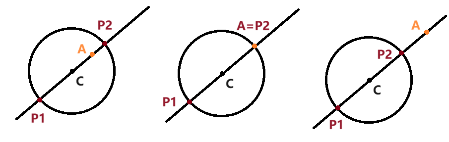

# 圆相关位置关系

import Geogebra from '@site/src/GeoGebra';

## 点与圆的位置关系

### 点与圆的位置关系内容

点 $P$ 和 $\odot A$ 的位置关系有三种：$P$ 在 $\odot A$ 外；$P$ 在 $\odot A$ 内；$P$ 在 $\odot A$ 上．

设 $P$ 到圆心 $A$ 的距离为 $d$，$\odot A$ 的半径为 $r$，则：

- $P$ 在 $\odot A$ 外，当且仅当 $d > r$．
- $P$ 在 $\odot A$ 内，当且仅当 $d < r$．
- $P$ 在 $\odot A$ 上，当且仅当 $d = r$．

### 标准式上快速判断点与圆位置关系

$\odot A$：$(x - x_A)^2 + (y - y_A)^2 = r^2$．快速判断 $P(x_0, y_0)$ 和 $\odot A$ 的大小关系．

我们只需将 $(x_0, y_0)$ 代入上面方程的等号左边部分，就可以得到 $P$ 到圆心 $A$ 的距离的平方 $d^2$．然后，我们将它和方程等号右边的 $r^2$ 进行比较即可：

- $d^2 > r^2$，当且仅当 $d > r$，当且仅当 $P$ 在 $\odot A$ 外．
- $d^2 < r^2$，当且仅当 $d < r$，当且仅当 $P$ 在 $\odot A$ 内．
- $d^2 = r^2$，当且仅当 $d = r$，当且仅当 $P$ 在 $\odot A$ 上．

:::info 例题 1.2

判断点 $(1, -3)$ 与圆 $(x - 2)^2 + (y + 1)^2 = 6$ 的位置关系．

:::

:::tip 例题 1.2 解答

$(1 - 2)^2 + (-3 + 1)^2 = 5 < 6$．因此点在圆内．

:::

### 一般式上快速判断点与圆位置关系

$\odot A$：$x^2 + y^2 + Dx + Ey + F = 0$．快速判断 $P(x_0, y_0)$ 和 $\odot A$ 的大小关系．

根据圆的一般方程的知识，上面的方程可以变形为 $\left(x + \dfrac D 2\right)^2 + \left(y + \dfrac E 2\right)^2 - \dfrac{D^2 + E^2 - 4F}{4} = 0$，所以一般式方程的本质就是 $d^2 - r^2 = 0$，方程左边的部分就是 $d^2 - r^2$．

因此我们可以仍考虑将点的坐标直接代入方程左半部分，算出 $d^2 - r^2$ 的值，然后和 $0$ 比较．$> 0$ 说明在圆外；$= 0$ 说明在圆上；$< 0$ 说明在圆内．

:::info 例题 1.3

判断点 $(1, 1)$ 与圆 $x^2 + y^2 - 4x - 8y + 15 = 0$ 的位置关系．

:::

:::tip 例题 1.3 解答

$1^2 + 1^2 - 4 - 8 + 15 = 5 > 0$．因此点在圆外．

:::

:::warning 平方项系数必须统一为 $1$

对于平方项系数没统一为 $1$ 的情形，即 $Ax^2 + Ay^2 + Dx + Ey + F = 0$，此时方程等号左边表示的是 $A(d^2 - r^2)$．我们如果直接将 $P(x_0, y_0)$ 坐标代入等号左边，得到的值是 $A(d^2 - r^2)$ 的正负．$A < 0$，其正负性和 $d^2 - r^2$ 相反．

这也就意味着在 $A < 0$ 的情形下，我们算出方程左边的值后，和 $0$ 比较大小时不能继承先前的结论（得到的是反的结果）．正确的做法是将方程统一成 $A > 0$（建议直接统一成一般式形式 $A = 1$）再判断．

:::

## 点与圆的位置关系题型

### 点到圆上一动点距离值域

已知 $\odot C$ 和一点 $A$，求点 $A$ 到 $\odot C$ 上一动点 $P$ 的距离取值范围．

设 $\odot C$ 半径为 $r$，$|AC| = d$，所求距离 $|AP| = a$．则 $a$ 的取值范围为 $[|d - r|, d + r]$．

下面仅证明 $a$ 的最小值取到 $|d - r|$，最大值取到 $d + r$，并阐释最值取到时的情形．至于为什么位于这个区间内的每一个距离都能取到，可以感性理解为点 $P$ 在 $\odot C$ 上运动的过程中，$a$ 是连续变化的．严谨证明必要性不大，故这里不给出．

$|CP| = r$，$|AP| = d$，$|AC| = a$．根据两点之间线段最短，我们有：

$$
\begin{cases}
|AP| + |PC| \ge |AC| \\
|AC| + |CP| \ge |AP| \\
|CA| + |AP| \ge |CP|
\end{cases}
$$

即

$$
\begin{cases}
d + r \ge a \\
a + r \ge d \\
a + d \ge r
\end{cases}
$$

这等价于 $\max(d - r, r - d) \le a \le d + r$，即 $|d - r| \le a \le d + r$．现证明最小值 $|d - r|$ 和最大值 $d + r$ 均能被取到，并说明取到时的情形．

作直线 $AC$，其一定与圆有两个交点（因为 $C$ 在圆内部），且一个交点 $P_1$ 位于从 $C$ 出发远离 $A$ 一侧的方向，一个交点 $P_2$ 位于从 $C$ 出发靠近 $A$ 一侧的方向．

不难发现 $P_1$ 取到最大值 $d + r$，$P_2$ 取到最小值 $|d - r|$，证毕．

:::info 例题 2.1

已知点 $M(x, y)$ 在 $\odot C$：$x^2 + y^2 - 4x + 6y + 9 = 0$ 上，求 $x^2 + y^2 + 2x - 2y - 4$ 的取值范围．

:::

:::tip 例题 2.1 解答

根据 [隐距离](./equation.md#隐距离) 的知识，容易发现所求可以转化为 $(x + 1)^2 + (y - 1)^2 - 6$ 的取值范围，即 $(x, y)$ 到 $(-1, 1)$ 的距离的平方 $-6$ 的取值范围．计算 $(x, y)$ 到 $(-1, 1)$ 的距离取值范围即可．

所给圆配方得 $(x - 2)^2 + (y + 3)^2 = 4$，圆心为 $(2, -3)$，半径为 $2$．

$(-1, 1)$ 与圆心 $(2, -3)$ 的距离为 $5$，圆的半径为 $2$，因此所求距离的取值范围是 $[3, 7]$．

原式取值范围为该距离的平方 $-6$ 的取值范围，即 $[3, 43]$．

:::

## 直线与圆的位置关系

### 直线与圆的位置关系内容

$\odot A$ 和直线 $l$ 的位置关系有三种：$l$ 与 $\odot A$ 相离；$l$ 与 $\odot A$ 相交；$l$ 与 $\odot A$ 相切．

设圆心 $A$ 到 $l$ 的距离为 $d$，$\odot A$ 的半径为 $r$，则：

- $l$ 与 $\odot A$ 相离，当且仅当 $d > r$，当且仅当 $l$ 与 $\odot A$ 没有交点．
- $l$ 与 $\odot A$ 相交，当且仅当 $d < r$，当且仅当 $l$ 与 $\odot A$ 有两个交点．
- $l$ 与 $\odot A$ 相切，当且仅当 $d = r$，当且仅当 $l$ 与 $\odot A$ 恰有一个交点．

判断直线与圆的位置关系有两种角度，对应地，在解析几何中我们也有两套判断方式．

### 距离法

我们可以从距离的角度判断直线与圆的位置关系．用点到直线的距离公式算出 $d$，直接和 $r$ 比较即可．

### 判别式法

还可以从交点数量的角度判断直线与圆的位置关系．我们考虑联立两个方程组：

$$
\begin{cases}
Ax + By + C = 0\\
x^2 + y^2 + Dx + Ey + F = 0
\end{cases}
$$

这虽然是一个二元二次方程组，但有一个方程是一次的．令 $B \ne 0$，此时 $y$ 可以由 $x$ 线性表出；然后我们将第二个方程的 $y$ 全都代换为 $x$，于是第二个方程变成一元二次方程．

形式化地，当 $B \ne 0$ 时，我们可以将方程等价变形为：

$$
\begin{cases}
y = f_1(x) \\
f_2(x, y) = 0
\end{cases}
$$

然后等价变形为：

$$
\begin{cases}
y = f_1(x) \\
f_2(x, f(x)) = 0
\end{cases}
$$

根据第一个方程，一个 $x$ 恰好对应一个 $y$．那么，$f_2(x, f(x)) = 0$ 方程解的个数就是整个方程解的个数；整个方程解的个数就是圆与直线的交点总数．因此，我们只需判断 $f_2(x, f(x)) = 0$ 方程解的个数．

$f_2(x, f(x)) = 0$ 是一个二元一次方程，判断其解的个数，我们可以判断 $\Delta$ 的正负性．

- $\Delta = 0$ 时有一个解，对应一个交点，对应相切．
- $\Delta > 0$ 时有两个解，对应两个交点，对应相交．
- $\Delta < 0$ 时有零个解，对应零个交点，对应相离．

:::info 例题 3.3

判断直线 $x - y + 4 = 0$ 与圆 $x^2 + y^2 = 8$ 的位置关系．

:::

:::tip 例题 3.3 解答

联立方程组：

$$
\begin{cases}
x - y + 4 = 0 \\
x^2 + y^2 = 8
\end{cases}
$$

变形为

$$
\begin{cases}
y = x + 4 \\
x^2 + (x + 4)^2 = 8
\end{cases}
$$

该方程解的个数与 $x^2 + (x + 4)^2 = 8$ 中解的个数相同．整理得 $x^2 + 4x + 4 = 0$，计算其判别式 $\Delta = 4^2 - 4 \times 4 = 0$，因此该方程只有一个解，原方程组只有一个解，直线与圆相切．

:::

该方法可将直线与圆的交点坐标顺便解出．但这里有一个注意事项．来看下面的错误示范：

:::info 例题 3.3

判断直线 $x - y + 4 = 0$ 与圆 $x^2 + y^2 = 8$ 的位置关系．

:::

:::danger 例题 3.3 错误解答示范

联立方程组：

$$
\begin{cases}
x - y + 4 = 0 \\
x^2 + y^2 = 8
\end{cases}
$$

变形为

$$
\begin{cases}
y = x + 4 \\
x^2 + (x + 4)^2 = 8
\end{cases}
$$

代入消元，第二个方程变形为 $x^2 + 4x + 4 = 0$，解得 $x = -2$．将 $x = -2$ 代入第二个方程后，有 $(-2)^2 + y^2 = 8$，解得 $y = 2$ 或 $y = -2$．

因此，直线与圆有两个交点，直线与圆相交．

:::

上面做法的错误之处在于：

$$
\begin{cases}
y = x + 4 \\
x^2 + (x + 4)^2 = 8
\end{cases}
$$

其等价的结果应为：

$$
\begin{cases}
y = x + 4 \\
x = 2
\end{cases}
$$

很明显这里 $x = 2$ 的结果应该代入第一个方程算出 $y$，而不应该代入原先的第二个方程．

刚刚的错误示例提醒我们：方程组并不总是利用一个方程求出一个变量后，将这个解随便代入一个原方程求出另一个变量；在绝大多数多元一次方程组我们可以这么做，但二次方程组就不一样了．

在刚刚的问题中，利用圆方程解出 $x$ 后，必须重新代入 **直线方程** 才能得到正确的 $y$．

关于这种问题的更多细节，如「为什么绝大多数多元一次方程组，解出一个元后随便代入一个方程就能解出另一元，但二次方程组就不行了？」这种问题，可以在[方程](../../../algebra/inequality/equation)页面得到解答．

另外，最开始我们限制 $B \ne 0$，那 $B = 0$ 怎么办呢？此时一定有 $A \ne 0$，反过来将 $x$ 用 $y$ 线性表出即可．

### 直线与圆的位置关系 两种方法比较

笔者的推荐是：首选距离法．判别式法与距离法相比计算量一般是更大的，尤其当方程含参时．

当且仅当询问直线和圆的交点坐标时，我们再联立两个方程求交点坐标．

鉴于带着参数操作方程计算量很大，询问含参直线与圆的切点坐标时，通常先用距离法把参数求出来，再联立方程求坐标．

> 事实上，单纯运用判别式判定交点数几乎不用，因为使用判别式法的情景通常都是要进一步求具体交点坐标．

:::info 例题 3.4

若直线 $3x + 4y + 5 = 0$ 与圆 $(x + a)^2 + (y + 1)^2 = 1$ 恰有一个公共点，求 $a$ 的值．

:::

:::tip 例题 3.4 解答

由题可知圆心为 $(-a, -1)$，半径为 $1$．

圆心到直线的距离为 $1$，即 $\dfrac{|-3a - 4 + 5|}{\sqrt{3^2 + 4^2}} = 1$，解得 $a = -2$ 或 $a = -\dfrac 43$．

:::

## 直线与圆的位置关系题型

### 过一点作圆的切线方程

过一点 $A$ 作 $\odot C$ 的切线，求切线方程．

#### 过一点作圆的切线方程 一般做法

先根据切线过点 $A$ 列出斜率为参数 $k$ 的点斜式方程．这一步还是需要提前讨论直线斜率不存在的情形，即要先判断过 $A$ 的竖直线是否与 $\odot C$ 相切．

然后利用距离法，根据 $C$ 到切线的距离等于 $r$ 列出方程，求出参数 $k$ 的值．

## 圆与圆的位置关系

### 圆与圆的位置关系内容

两圆之间的位置关系共有五种：外离；外切；相交；内切；内含．设两圆半径分别为 $r_1$，$r_2$，两圆圆心的距离（圆心距）为 $d$，则：

- $d > r_1 + r_2$ 时，两圆外离．
- $d = r_1 + r_2$ 时，两圆外切．
- $|r_1 - r_2| < d < r_1 + r_2$ 时，两圆相交．
- $d = |r_1 - r_2|$ 时，两圆内切．
- $d < |r_1 - r_2|$ 时，两圆内含．

特别地：

- 当 $d = 0$ 时，两圆互为同心圆（它们的圆心相同）．
- 当 $r_1 = r_2$ 时，两圆没有内含的情形，内切等价于重合．

因此，确定两圆的位置关系，我们要比较弦心距与半径和、半径差两个量的大小关系．

## 圆与圆的位置关系题型

### 两圆上两动点距离值域

已知两个圆 $\odot C_1$ 和 $\odot C_2$，$\odot C_1$ 上有一动点 $P_1$，$\odot C_2$ 上有一动点 $P_2$，求 $P_1$ 和 $P_2$ 间距离的取值范围．

设 $\odot C_1$ 半径为 $r_1$，$\odot C_2$ 半径为 $r_2$，圆心距 $|C_1C_2|$ 为 $d$，所求 $|P_1P_2|$ 距离为 $a$．

根据两点之间线段最短，有：

$$
\begin{cases}
|P_1C_1| + |C_1C_2| + |C_2P_2| \ge |P_1P_2| \\
|C_1P_1| + |P_1P_2| + |P_2C_2| \ge |C_1C_2| \\
|P_1P_2| + |P_2C_2| + |C_2C_1| \ge |P_1C_1| \\
|P_2P_1| + |P_1C_1| + |C_1C_2| \ge |P_2C_2|
\end{cases}
$$

即

$$
\begin{cases}
r_1 + d + r_2 \ge a \\
r_1 + a + r_2 \ge d \\
a + r_2 + d \ge r_1 \\
a + r_1 + d \ge r_2
\end{cases}
$$

综合 $a \ge 0$，整理得：

$$
\max(|r_1 - r_2| - d, d - r_1 - r_2, 0) \le a \le r_1 + r_2 + d
$$

现证明最小值 $\max(|r_1 - r_2| - d, d - r_1 - r_2, 0)$ 和最大值 $r_1 + r_2 + d$ 均能被取到，并说明取到时的情形．

<Geogebra id="6.1" filename={require('./assets/relative-position/6.1.ggb').default} />

左图为两圆相离时的情形．绿色的 $P_1P_2$ 点对距离取到最大值 $r_1 + r_2 + d$，红色的 $P_1P_2$ 点对距离取到最小值 $\max(|r_1 - r_2| - d, d - r_1 - r_2, 0) = d - r_1 - r_2$．

中图为两圆相交 / 内切 / 外切时的情形．绿色的 $P_1P_2$ 点对距离取到最大值 $r_1 + r_2 + d$，而此时两圆存在交点（紫色点），令 $P_1P_2$ 同时落在同一个紫色点上，可取到最小值 $\max(|r_1 - r_2| - d, d - r_1 - r_2, 0) = 0$．

右图为两圆内含时的情形．这里设 $\odot C_1$ 内含 $\odot C_2$．

绿色点 $P_1$ 和橙色点 $P_2$ 间距离取到最大值 $r_1 + r_2 + d$，红色点 $P_1$ 和橙色点 $P_2$ 间距离取到最小值 $\max(|r_1 - r_2| - d, d - r_1 - r_2, 0) = r_1 - r_2 - d$．

考虑交换 $\odot C_1$ 和 $\odot C_2$ 便可考虑到 $\odot C_2$ 内含 $\odot C_1$ 的情形，此时最小值取到 $r_2 - r_1 - d$．综合考虑最小值为 $|r_1 - r_2| - d$．
