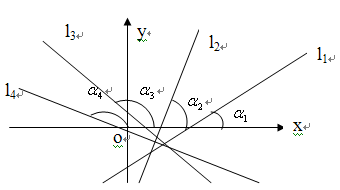
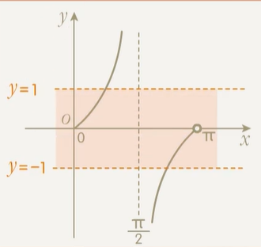
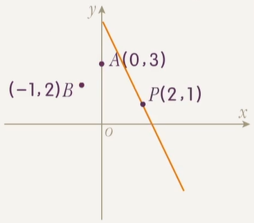
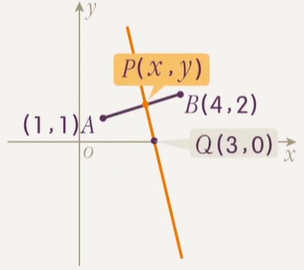

# 量化直线方向的工具

## 斜率、倾斜角、方向向量之间的关系

在向量中我们学习过，一个点和一个 **非零向量** 可以确定一条直线，该向量称作直线的 **方向向量**．

一条直线的方向向量一定不唯一，设 $\bm s$ 是直线 $l$ 的方向向量，则与 $\bm s$ 平行的所有 **非零向量** 都是 $l$ 的方向向量，与 $\bm s$ 不平行的向量或零向量则均不为 $l$ 的方向向量．

**在学习直线这一节时，我们要有意识地将量化直线方向的工具在一起记忆**．上面的方向向量就是我们第一个了解到的量化直线方向的工具，接下来我们再引入两个量化直线方向的工具：斜率和倾斜角．

### 倾斜角的定义

对于一条直线 $l$，它的 **倾斜角** 定义如下：

- 如果 $l$ 和 $x$ 轴相交于一点 $A$，从 $A$ 出发，**沿着 $l$ 的向上方向**，**沿着 $x$ 轴正向** 分别作出两条射线，这两条射线之间的夹角 $\alpha$ 即为 $l$ 的倾斜角．这种情况下，$0 < \alpha < \pi$．
- 否则，$l$ 要么和 $x$ 轴平行，要么和 $x$ 轴重合．此时规定 $l$ 的倾斜角为 $0$．

> 提示：相交只包含两直线交于 **恰好一点** 的情况，即 **重合不是相交**．

因此一条直线 $l$ 的倾斜角 $\alpha$ 的取值范围是 $[0, \pi)$．

下面给出倾斜角的示例图：

上图中的 $\alpha_1$，$\alpha_2$，$\alpha_3$，$\alpha_4$ 分别是 $l_1$，$l_2$，$l_3$，$l_4$ 的倾斜角．

:::warning 倾斜角是唯一的

一条直线的倾斜角只有一个，如 $\alpha_3$ 的补角就不是 $l_3$ 的倾斜角．

倾斜角必须是 $l$ 的 **向上方向** 和 $x$ 轴 **正向** 形成的夹角．

:::

### 方向向量和倾斜角的关系

量化同一方向时，不同的量化方向工具之间应当具有关联．下探究任意直线 $l$ 的方向向量与倾斜角的关系．

取 $l$ 的一个 **纵坐标非负** 的方向向量 $\bm s = (x, y)$．这一定可以做到：任取 $l$ 的一个方向向量，若其纵坐标为负，取该向量的相反向量即可．

设 $x$ 轴正方向单位向量为 $\bm i = (1, 0)$，$l$ 的倾斜角为 $\theta$，根据倾斜角的定义，有

$$
\la \bm s, \bm i  \ra = \theta
$$

根据三角函数的定义，当 $x \ne 0$ 时，

$$
\tan(\la \bm s, \bm i  \ra ) = \df y x
$$

可得

$$
\tan \theta = \df y x
$$

对于 $x = 0$ 的情形，其倾斜角的正切不存在，倾斜角本身等于 $\df \pi 2$，为一条 **竖直线**．

因此，量化同一方向时：

- 对于 **非竖直线**，倾斜角的正切等于任一方向向量的纵坐标与横坐标的比．
- 对于 **竖直线**，倾斜角的正切不存在，任一方向向量横坐标为 $0$．

### 斜率的定义

在直线倾斜角的正切存在，即直线不竖直时，称 **倾斜角的正切** 为斜率．斜率常用小写字母 $k$ 表示，即

$$
k = \tan\alpha
$$

**规定竖直直线斜率不存在**．

:::warning 倾斜角总是存在的

与斜率不同，一条直线的倾斜角总是存在的．

根据斜率的定义，斜率的存在性和倾斜角的正切保持同步，而不和倾斜角保持同步．

:::

斜率与倾斜角的关系是显然的，因此斜率、倾斜角与方向向量三者可互化．

### 再联系直线任意两点的坐标

已知直线上不重合的两点的坐标，根据两点确定一条直线，方向也随之确定了．因此，量化方向的工具与直线上任意不重合两点的坐标应当也有联系．

对于直线 $l$ 上不重合两点 $(x_1, y_1)$ 和 $(x_2, y_2)$，可导出 $l$ 的一个方向向量 $(x, y) = (x_1 - x_2, y_1 - y_2)$．这就建立了方向向量与两点坐标的联系．

因此，对于 **非竖直线**，

$$
k = \df{y_1 - y_2}{x_1 - x_2} = \tan \alpha = \df y x
$$

这个公式总结了三个量化直线方向的工具与两点坐标之间的关系，称作 **斜率公式**．

**直线非竖直** 是斜率公式的重要使用前提．对于不确定是否竖直的直线，使用斜率公式前，应讨论直线是否竖直（斜率是否存在）．

当然，如果题意确定了直线的斜率存在（如题目条件「直线的斜率是 $2$」），就不必讨论了．另外，当题目中说「直线的斜率不为 $0$」这种表述时，也默认题目暗指直线斜率存在．

:::info 例题 1.1

已知 $l$ 经过 $(a, a + 4)$ 和 $(2, 2a + 2)$ 两个不同的点，求 $l$ 的倾斜角 $\alpha$．

:::

本题就是一个需要注意讨论的典型例题，如下：

:::tip 例题 1.1 解答

若 $l$ 的斜率存在，有 $k = \tan\alpha = \df{(2a + 2) - (a + 4)}{2 - a} = \df{a - 2}{2 - a}$（斜率公式）．因此 $k = -1$，$\alpha = \df{3}4 \pi$．

若 $l$ 的斜率不存在，有两点横坐标相同，即 $a = 2$．此时两点纵坐标均为 $6$，即两点重合，与题意不符，舍去．

综上，$\alpha = \df 3 4 \pi$．

:::

### 方向相同的含义

根据 $\alpha \in [0, \pi)$ 可知，任意实数 $k$ 作为斜率恰好有唯一的倾斜角 $\alpha$ 与之对应．

因此，$l_1$，$l_2$ 方向相同，等价于 $\alpha_1 = \alpha_2$，等价于 $k_1 = k_2$ 或斜率同时不存在；等价于 $\overrightarrow{s_1} \parallel \overrightarrow{s_2}$．

### 斜率量化直线方向的直观理解

根据 $k = \tan \alpha$，令 $\alpha$ 从 $0$ 开始逐渐增大，有：

- $\alpha$ 从 $0$ 无限趋近 $\df \pi 2$ 的过程中，$k$ 从 $0$ 增大，无限趋近 $+\infty$，增长速度越来越快．
- $\alpha$ 跨越 $\df \pi 2$ 的时候，$k$ 从 $+\infty$ 突变为 $-\infty$．
- $\alpha$ 从 $\df \pi 2$ 到接近 $\pi$ 的过程中，$k$ 从 $-\infty$ 增大，趋近于 $0$，增长速度越来越慢．

另外，$|k|$ 越大，直线的方向和 $y$ 轴越接近，我们认为这个直线越「陡峭」．

斜率量化直线方向的优势在于：它是一种可以用全体实数量化绝大部分直线方向的工具（只有竖直方向无法量化，当然读者也可以认为斜率不存在也是一种变相量化竖直方向的方式）．

## 量化直线方向的工具题型

### 已知斜率值求倾斜角值

:::info 例题 2.1（建议读者先不看解答自己做）

已知直线 $l$ 的斜率为 $-\tan \df \pi 7$，求 $l$ 的倾斜角．

:::

:::tip 例题 2.1 解答

相当于已知 $\tan \alpha = - \tan \df \pi 7$ 且 $\alpha \in [0, \pi)$，求 $\alpha$．

不难发现 $\alpha = - \df \pi 7 + k \pi, k \in \Z$，且落在 $[0, \pi)$ 的只有一个值 $\df 6 7 \pi$．因此答案是 $\df 6 7 \pi$．

:::

同时，有六个特殊角 $\df \pi 6$，$\df \pi 4$，$\df \pi 3$，$\df{2\pi}{3}$，$\df{3\pi}4$，$\df{5\pi}6$，请读者建立起它们和对应斜率值的映射，分别为 $\df {\sqrt 3} 3$，$1$，$\sqrt 3$，$-\sqrt 3$，$-1$，$-\df{\sqrt 3}3$．

### 倾斜角的范围

:::info 例题 2.2（建议读者先不看解答自己做）

已知两点 $A(-1, -5)$，$B(3, -2)$，且一直线 $l$ 倾斜角为直线 $AB$ 的一半，求 $l$ 的斜率．

:::

:::tip 例题 2.2 解答

设直线 $l$ 的倾斜角为 $\alpha$，则直线 $AB$ 的倾斜角为 $2\alpha$．根据倾斜角和两点坐标的关系，有 $\tan 2\alpha = \df{-5 - (-2)}{-1 - 3} = \df 3 4$，而根据斜率和倾斜角的关系，我们要求的是 $\tan \alpha$．

现在问题变成 $\tan 2\alpha = \df 3 4$ 求 $\tan \alpha$．根据倾斜角的范围，我们有 $\alpha \in [0, \pi)$ 且 $2\alpha \in [0, \pi)$，得 $\alpha \in [0, \df \pi 2)$．

倍角公式展开 $\tan 2\alpha = \df{2 \tan \alpha}{1 - \tan^2\alpha} = \df 3 4$，整理得 $(3\tan\alpha - 1)(\tan \alpha + 3) = 0$，解得 $\tan \alpha = \df 1 3$ 或 $\tan \alpha = -3$．

根据 $\alpha \in [0, \df \pi 2)$，有 $\tan \alpha > 0$，因此 $\tan \alpha = \df 1 3$．因此 $l$ 的斜率是 $\df 1 3$．

:::

### 已知斜率范围求倾斜角范围

:::info 例题 2.3（建议读者先不看解答自己做）

设某直线的斜率 $k$ 满足 $k \in (-1, 1]$，求 $\alpha$ 的取值范围．

:::

:::tip 例题 2.3 解答

本质是已知 $\tan \alpha \in (-1, 1]$ 且 $\alpha \in [0, \pi)$，求 $\alpha$ 的取值范围．

三角函数已知函数值范围求角度范围，做法是先绘制函数图像再划线．绘制 $\tan \alpha$ 在 $[0, \pi)$ 上的图像和 $y = 1$，$y = -1$ 两条线：

不难看出落在内部的 $\alpha$ 的范围应是 $[0, \df \pi 4] \cup (\df 3 4 \pi ,\pi )$．

:::

### 已知倾斜角范围求斜率范围

这个比已知斜率范围求倾斜角范围简单，实质上就是已知角度范围求正切函数的值域．

读者足够熟悉正切函数的话，这种问题应当毫无难度，略过．

### 过定点直线交于线段求斜率范围

:::info 例题 2.5.1

已知 $A(-2, 3)$，$B(1, 1)$，$O$ 为坐标系原点．过 $O$ 的直线 $l$ 与线段 $AB$ 相交，求 $l$ 的斜率取值范围．

:::

这种题目步骤比较固定，如下：

- 下设直线必经点为 $P$（例题 2.5.1 中这个 $P$ 就是坐标系原点 $O$），线段的两个端点分别为 $A$ 和 $B$．
- 分别作出 $PA$，$PB$ 两条直线，并算出两条直线的斜率．
- 判断直线能取的范围是从 $PA$ 逆时针扫到 $PB$ 这个范围，还是能从 $PB$ 逆时针扫到 $PA$ 这个范围（钦定 **逆时针** 旋转是因为逆时针旋转时 $\alpha$ 增大，斜率也在分段增大，不易出错）．

旋转过程中，有两个分段点需要注意：

- 直线 **逆时针** 扫过与 $y$ 轴平行的线（称之为「竖直线」）时，**斜率** 从 $+\infty$ 突变为 $-\infty$，倾斜角不突变．
- 直线 **逆时针** 扫过与 $x$ 轴平行的线（称之为「水平线」）时，**倾斜角** 从趋近 $\pi$ 突变为 $0$，斜率不突变．

如果求斜率范围，注意「竖直线」为分段点；如果求倾斜角范围，注意「水平线」为分段点．

:::tip 例题 2.5.1 解答

根据题目画图．

作出直线 $OA$，$OB$．不难发现 $l$ 能扫过的范围是从 $OB$ 逆时针扫到 $OA$ 这一段，考虑其斜率变化．

计算可得 $k_{OA} = -\df32$，$k_{OB} = 1$．

从 $OB$ 逆时针转到 $OA$，斜率的变化是先从 $1$ 增大到 $+\infty$，经过「竖直线」后突变到 $-\infty$，再增大到 $-\df 3 2$．

综上，斜率的取值范围为 $(-\infty, -\df32] \cup [1, +\infty]$．

:::

:::info 例题 2.5.2

已知 $l$ 过定点 $(2, 1)$，且点 $A(3, 0)$，$B(-1, 2)$ 位于直线 $l$ 的同侧，求 $l$ 的斜率取值范围．

:::

:::tip 例题 2.5.2 解答

根据题目画图．

$A$ 和 $B$ 落在直线 $l$ 的同侧，等价于 $l$ 和线段 ${AB}$ **不相交**，$l$ 的旋转范围是从 $PB$ 逆时针转到 $PA$．

计算斜率 $k_{PA} = -1$，$k_{PB} = -\df 1 3$．

整个过程中，斜率从 $- \df 1 3$ 一直增大到 $+\infty$，转过竖直线后突变为 $-\infty$，再增大到 $-1$．

因此答案是 $(-\infty, -1) \cup (-\df 1 3, +\infty)$（注意这里两个端点不能取，否则一个点落在直线上，不是同侧）．

:::

### 隐斜率

指的是形如 $\df{y_1 - y_2}{x_1 - x_2}$ 的分式可以看成是 $(x_1, y_1)$ 和 $(x_2, y_2)$ 连线的斜率，从而利用数形结合解决问题．

:::info 例题 2.6.1

已知 $A(-3, 0)$，$B(0, -2)$，若点 $P(x, y)$ 在线段 $AB$ 上，求 $\df{y - 2}{x - 1}$ 的取值范围．

:::

:::tip 例题 2.6.1 解答

将所求转化为求 $P$ 和 $(1, 2)$ 连线的斜率范围，则问题变成：过定点 $(1, 2)$ 的直线和线段 $AB$ 相交，求斜率范围．

这就是[过定点直线交于线段求斜率范围](#过定点直线交于线段求斜率范围)问题了，从 $QA$ 逆时针转到 $QB$ 不经过竖直线，因此答案是 $[\df 1 2, 4]$．

:::

:::info 例题 2.6.2

已知 $A(1,1)$，$B(4, 2)$，若点 $P(x, y)$ 在线段 $AB$ 上，求 $\df{y}{3 - x}$ 的取值范围．

:::

:::tip 例题 2.6.2 解答

$\df{y}{3 - x} = -\df{y}{x - 3}$，所求可以转化为 $P$ 和 $Q(3, 0)$ 连线斜率的相反数．

设 $P$ 和 $Q(3, 0)$ 连线为 $l$，则 $l$ 的范围为从 $QB$ 逆时针转到 $QA$，经过竖直线．

从 $QB$ 到竖直线斜率从 $2$ 到 $+\infty$，从竖直线到 $QA$ 斜率从 $-\infty$ 到 $-\df 1 2$，因此斜率范围为 $(-\infty, -\df 1 2] \cup [2, +\infty)$．

答案是斜率范围的相反数，为 $(-\infty, -2] \cup [\df 1 2, +\infty)$．

:::

上面这个例题中，出题人对斜率进行了变形．如果我们直接将 $\df{y}{3 - x}$ 看成斜率，结果是 $(3, y)$ 和 $(x, 0)$ 连线的斜率，这样的信息明显难以使用．题目一般给定的 $(x, y)$ 都是一个现成的动点坐标，所以我们一般将所求式子变形成 $(x, y)$ 和某定点连线的斜率，从而解决问题．

上面出题人的变形仅仅是加了一个相反数．出题人还可以做很多变形，如：

- 倍乘：$\df{3y+3}{x - 2} = \df{3(y + 1)}{(x - 2)} = 3k$．
- 倒数：$\df{2 - x}{y + 1} = - \df{1}{(\fr{y + 1}{x - 2})} = - \df 1 k$（该例中还加了个负号）．

事实上，分子与分母均为含 $x$，$y$ 的 **一次式** 的 **分式** 均可以考虑转成斜率（运用分离常数和取倒数技巧），是一个比较常用的思想，值得注意．

## 直线的位置关系

### 刻画几何条件的意义

「刻画几何条件」，就是将一个陌生的几何条件 $P$ **等价** 为一个容易处理的几何条件 $Q$．

这么做的目的是：

- 当题目的条件中出现几何条件 $P$ 时，我们可以把这个条件直接等价为容易处理的几何条件 $Q$，从而解决题目．
- 当题目的结论是几何条件 $P$ 时，我们可以转而证明几何条件 $Q$．

举例说明．比如后面会学习到「$A$，$B$，$C$ 三点共线」等价为「$AB$ 和 $AC$ 方向相同」．这就是一个几何条件的刻画方式．那么在题目中：

- 如果题目的条件是「$A$，$B$，$C$ 三点共线」，我们可以把这个条件等价为「$AB$ 和 $AC$ 方向相同」，再做题．
- 如果题目要求证明「$A$，$B$，$C$ 三点共线」．我们可以转而去证明「$AB$ 和 $AC$ 方向相同」．

不同的刻画方式可能具有不同的解题效果．在后面的学习中，将会介绍很多常见的几何条件的通常最合适的刻画方式，便于读者做题的效率和正确率兼备．

### 平行、相交、垂直

先给出结论，对于两条可能重合的直线 $l_1$，$l_2$，有如下的等价关系：

|      位置关系       |                     方向向量意义上的等价                     |               倾斜角意义上的等价               | 斜率意义上的等价（要求 ${l_1}$，${l_2}$ 斜率存在） |
| :-----------------: | :----------------------------------------------------------: | :--------------------------------------------: | :----------------------------------------------------------: |
| $l_1 \parallel l_2$ | $\overrightarrow{a_1} \parallel \overrightarrow{a_2}$   且 $l_1$，$l_2$ **不重合** |  $\alpha_1 = \alpha_2$   且 $l_1$，$l_2$ **不重合**  |              $k_1 = k_2$   且 $l_1$，$l_2$ **不重合**              |
| $l_1$ 和 $l_2$ 相交 |    $\overrightarrow{a_1} \nparallel \overrightarrow{a_2}$    |            $\alpha_1 \ne \alpha_2$             |                        $k_1 \ne k_2$                         |
|   $l_1 \perp l_2$   | $\overrightarrow{a_1} \perp \overrightarrow{a_2}$ | $\vert\alpha_1 - \alpha_2\vert = \df \pi 2$ |                        $k_1k_2 = -1$                         |

**同一行的四个条件互相等价**．这些结论都可以直接使用．

:::note 当 $k_1$，$k_2$ 存在时，$l_1 \perp l_2 \iff k_1k_2 = -1$ 的证明

考虑分别提取 $l_1$ 和 $l_2$ 的一个方向向量 $(1, k_1)$ 和 $(1, k_2)$，有 $(1, k_1) \cdot (1, k_2) = 0$，即 $k_1k_2 + 1 = 0$．

:::

下面是几点说明：

- 平行总是等价于方向相同 **且不重合**．这一步「平行的判重」非常重要．
- 两直线垂直时的 $|\alpha_1 - \alpha_2| = \df \pi 2$，只要 $\alpha_1$ 唯一确定，则 $\alpha_2$ 也唯一确定．具体来说，
	- $\alpha_1 \in [0, \df \pi 2)$ 时，$\alpha_2 = \alpha_1 + \df \pi 2$．
	- $\alpha_1 \in [\df \pi 2, \pi)$ 时，$\alpha_2 = \alpha_1 - \df \pi 2$．

### 重合和三点共线

等价刻画「$l_1$ 和 $l_2$ 重合」的两种方式：

- $l_1$ 和 $l_2$ **方向相同** 并且 **经过同一个点**（一个点和一个方向确定一条直线）．
- $l_1$ 的方程和 $l_2$ 的 **方程等价**．

一种等价刻画「$A$，$B$，$C$ 三点共线」的方式是：**直线 $AB$ 和直线 $AC$ 的方向相同**．即 **从三点中的一点出发，向另外两点连线，连线方向相同与三点共线等价**．

证明这个刻画的等价性．如果直线 $AB$ 和直线 $AC$ 方向相同，则又因为它们经过同一点 $B$，直线 $AB$ 和 $AC$ 重合．那么点 $B$ 在直线 $AB$ 上的同时，也一定在直线 $AC$ 上．同时，点 $A$ 和点 $C$ 也在直线 $AC$ 上，因此 $A$，$B$，$C$ 三点共线．

而如果 $A$，$B$，$C$ 三点共线，显然直线 $AB$ 和直线 $AC$ 的方向相同．所以上面的刻画等价．

### 不重合

先前讲到，两直线平行的一种等价刻画方式为：两直线方向相同且证明两直线不重合．两直线不重合如何进一步刻画？

要证明 $l_1$ 和 $l_2$ 不重合：

- 当方程可知，可以证明 $l_1$ 和 $l_2$ **方程不等价**．
- 否则，**可以在两直线上各取一点连线，证明该线的方向不同于两直线中的某一条**．

### 夹角、到角和倾斜角、斜率的关系

两条直线方向向量和夹角的关系，可直接使用向量夹角的知识求解．下面讨论夹角和倾斜角与斜率的关系，并引入一个新概念：到角．

两相交直线的 **夹角（两直线所成角）** 的定义为：两直线所成的两对对顶角中，**较小** 的一对角中，其中一个的大小．

一条直线 $l_1$ 到另一条相交直线 $l_2$ 的 **到角** 的定义为：$l_1$ 沿着与 $l_2$ 的唯一交点 **逆时针旋转** 到第一次与 $l_2$ 重合时的旋转角．将 $l_1$ 称作到角的 **始边**，$l_2$ 称作到角的 **终边**．

对于平行或重合的直线，认为它们不存在夹角和到角．

- $l_1$ 到 $l_2$ 的到角为 **锐角或直角** 时，它就是 $l_1$ 和 $l_2$ 的夹角．
- $l_1$ 到 $l_2$ 的到角为 **钝角** 时，它是 $l_1$ 和 $l_2$ 夹角的 **补角**．
- 到角的范围是 $(0, \pi)$，而夹角的范围是 $(0, \df \pi 2]$．

对于任意一个角 $\alpha$，$\{\beta \in [0, \pi) \mid \beta + k\pi, k \in \Z\}$ 恰有唯一元素 $\beta$，记 $\beta = \alpha \bmod \pi$．

两直线 **到角** 与 **倾斜角** 的关系：$l_1$ 倾斜角为 $\alpha$，$l_1$ 到 $l_2$ 的到角为 $\theta$，则 $l_2$ 倾斜角为 $(\alpha + \theta) \bmod \pi$．

两直线 **夹角** 与 **倾斜角** 的关系：$l_1$ 倾斜角为 $\alpha$，$l_1$ 与 $l_2$ 的夹角为 $\theta$，则 $l_2$ 的倾斜角为 $(\alpha + \theta) \bmod \pi$ 或 $(\alpha - \theta) \bmod \pi$，对应 $l_1$ 到 $l_2$ 的到角分别为 $\theta$ 和 $\pi - \theta$．

上面是两直线到角和夹角和两直线倾斜角之间的关系，现试探究两直线到角和夹角和两直线斜率之间的关系．

当 $l_1$ 到 $l_2$ 的到角为 $\theta$ 时，我们有 $\theta = (\alpha_2 - \alpha_1) \bmod \pi$．当 $\theta \ne \df \pi 2$ 且 $\alpha_1 \ne \df \pi 2$ 且 $\alpha_2 \ne \df \pi 2$ 时，有：

$$
\tan \theta = \tan[(\alpha_2 - \alpha_1) \bmod \pi] = \tan(\alpha_2 - \alpha_1) = \df{\tan \alpha_2 - \tan \alpha_1}{1 + \tan\alpha_1\tan\alpha_2} = \df{k_2 - k_1}{1 + k_1k_2}
$$

也即 $l_1$ 到 $l_2$ 的到角为 $\theta$ 时，$\tan\theta = \df{k_2 - k_1}{1 + k_1k_2}$．这条结论称作 **到角公式**，它给出了一直线到另一直线的到角和两直线斜率的关系．注意分子上是 **终边的斜率减去始边的斜率**，不能反．

当 $l_1$ 和 $l_2$ 的夹角为 $\theta$ 时，$l_1$ 到 $l_2$ 的到角为 $\theta$ 或 $\pi - \theta$．当 $\theta \ne \df \pi 2$ 且 $\alpha_1 \ne \df \pi 2$ 且 $\alpha_2 \ne \df \pi 2$ 时，我们有 $\theta \in (0, \df \pi 2)$，此时 $\tan \theta > 0$，$\tan(\pi - \theta) < 0$．

- 当 $l_1$ 到 $l_2$ 的到角为 $\theta$ 时，有 $\tan \theta = \lv \tan \theta\rv  = \lv \df{k_1 - k_2}{1 + k_1k_2}\rv$．
- 当 $l_1$ 到 $l_2$ 的到角为 $\pi - \theta$ 时，有 $\tan \theta = -\tan(\pi - \theta) = \lv \tan (\pi - \theta)\rv = \lv \df{k_1 - k_2}{1 + k_1k_2} \rv$．

综上 $l_1$ 和 $l_2$ 的夹角为 $\theta$ 时，$\tan \theta = \lv\df{k_1 - k_2}{1 + k_1k_2}\rv$．这条结论称作 **夹角公式**，也即到角公式上套一个绝对值，这时分子相减的顺序不重要．

需要注意的是，**到角公式和夹角公式并不是课本上公式，不要在大题中使用．**

到角公式和夹角公式的使用前提：**两直线斜率均存在且夹角不为直角**．

## 直线中的位置关系题型

### 统一斜率原则

> 给定 $l_1$，$l_2$ 的方向信息（为方向向量、倾斜角、斜率、两点坐标中的一种），求 $l_1$ 与 $l_2$ 的位置关系．

- 如果两直线给出的方向信息为 **同一种**（如均为倾斜角），直接套用[上面讲过的结论](#平行相交垂直)即可．
- 如果 **不是同一种**，将两直线的方向信息都 **统一成斜率** 再做．这就是统一斜率原则．

为什么要选择统一成斜率？因为无论是已知了直线的方向向量，还是倾斜角，还是不重合的两点坐标，算出斜率都是很简单的．如果斜率存在，方向向量直接将坐标比一下即可，倾斜角直接正切一下即可，不重合两点坐标直接代入斜率公式即可．

而倾斜角无论是从斜率，从两点坐标，还是从方向向量，都需要一个「逆正切函数」的过程；而方向向量从倾斜角得到也必须先转成斜率．综上，统一成斜率一般是最简单的．

另外如果两直线给出的方向信息为同一种，但都是两点坐标时，也要统一成斜率做．原因很简单，并没有「直线上两点坐标」和「直线位置关系」之间关系的直接结论．

需要特别注意 **平行的验重** 和 **斜率不存在** 两种容易遗漏的情况．

### 已知直线位置关系求参数

已知直线位置关系求参数，可以沿用上面的策略：**将两直线的方向统一成斜率表示．**

具体来说，我们可以将两直线的斜率表示成带参数的式子，然后再根据已知的直线位置关系列出两个斜率应该满足的式子，从而解出参数 $k$．

注意事项还是平行的验重和斜率公式的使用前提，判断斜率是否存在．

:::info 例题 4.2.1

已知过 $A(m, 1)$，$B(-1, m)$ 两点的直线 $l_1$ 和过 $P(1, 2)$，$Q(-5, 0)$ 两点的直线 $l_2$ 平行，求 $m$ 的值．

:::

:::tip 例题 4.2.1 解答

$l_2$ 存在斜率 $k_2 = \df{2 - 0}{1 - (-5)} = \df 1 3$．因此，$l_1$ 的斜率必须存在且等于 $l_2$ 的斜率，即 $k_1 = \df 1 3$．

$m$ 取什么值都不能使 $A$，$B$ 两点重合．根据斜率公式，有 $\df{1 - m}{m - (-1)} = \df 1 3$，解得 $m = \df 1 2$．

现验证 $m = \df 1 2$ 时 $l_1$ 和 $l_2$ 不重合．因为 $k_{AP} = \df{2 - 1}{1 - \df 1 2} = 2 \ne k_2$，所以 $l_1$ 和 $l_2$ 不重合．

:::

:::info 例题 4.2.2

已知过 $A(m, 1)$，$B(-1, m)$ 两点的直线 $l_1$ 和过 $P(1, 2)$，$Q(-5, 0)$ 两点的直线 $l_2$ 垂直，求 $m$ 的值．

:::

:::tip 例题 4.2.2 解答

$l_2$ 存在斜率 $k_2 = \df{2 - 0}{1 - (-5)} = \df 1 3$．因此，$l_1 \perp l_2$ 等价于 $l_1$ 的斜率存在且 $k_1k_2 = -1$．

$m$ 取什么值都不能使 $A$，$B$ 两点重合．根据斜率公式，有 $k_1 = \df{1 - m}{m - (-1)}$，于是有 $\df{1 - m}{m - (-1)} \cdot \df 1 3 = -1$，解得 $m = -2$．

:::

### 直线呈一定角度

:::info 例题 4.3

若正方形一条对角线所在直线斜率为 $2$，求该正方形两条邻边所在直线的斜率分别是多少．（填空题）

:::

:::tip 例题 4.3 不用夹角公式的解答

正方形两条邻边分别和对角线呈 $\df \pi 4$ 的夹角．设对角线所在直线倾斜角为 $\alpha$，根据 $\tan \alpha = 2$，不难发现有 $\alpha \in (\df \pi 4, \df \pi 2)$，因此两邻边所在直线的倾斜角分别为 $\alpha - \df \pi 4$ 和 $\alpha + \df \pi 4$．

现在要求两邻边所在直线的斜率，即 $\tan(\alpha - \df \pi 4)$ 和 $\tan(\alpha + \df \pi 4)$．以计算 $\tan(\alpha + \df \pi 4)$ 为例，用正切和角展开为 $\df{\tan\alpha + \tan \fr \pi 4}{1 - \tan\alpha\tan\fr \pi 4}$，将 $\tan \alpha = 2$ 代入可得结果为 $-3$．同理可得另外一个结果为 $\df 1 3$．

计算可以更快：注意到正方形两邻边垂直，其所在直线斜率互为负倒数．所以将一个直线的斜率算出来后，另一个直线斜率采负倒数即可．

:::

:::tip 例题 4.3 采用夹角公式的解答

显然所求的两直线以及对角线所在直线斜率存在，且对角线和所求直线夹角不为直角，可以使用夹角公式．

设所求直线斜率为 $k$，则 $k$ 应当满足 $\lv \df{2 - k}{1 + 2k} \rv = 1$，两解分别为 $-3$ 和 $\df 1 3$，就是所求的两直线斜率．

:::
