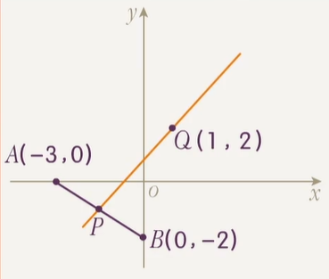

# 量化直线方向的工具

## 斜率、倾斜角、方向向量之间的关系

在向量中我们学习过，一个点和一个 **非零向量** 可以确定一条直线，该向量称作直线的 **方向向量**．

一条直线的方向向量一定不唯一，设 $\vec s$ 是直线 $l$ 的方向向量，则与 $\vec s$ 平行的所有 **非零向量** 都是 $l$ 的方向向量，与 $\vec s$ 不平行的向量或零向量则均不为 $l$ 的方向向量．

**在学习直线这一节时，我们要有意识地将量化直线方向的工具在一起记忆**．上面的方向向量就是我们第一个了解到的量化直线方向的工具，接下来我们再引入两个量化直线方向的工具：斜率和倾斜角．

### 倾斜角的定义

对于一条直线 $l$，它的 **倾斜角** 定义如下：

- 如果 $l$ 和 $x$ 轴相交于一点 $A$，从 $A$ 出发，**沿着 $\boldsymbol l$ 的向上方向**，**沿着 $\boldsymbol x$ 轴正向** 分别作出两条射线，这两条射线之间的夹角 $\alpha$ 即为 $l$ 的倾斜角．这种情况下，$0 < \alpha < \pi$．
- 否则，$l$ 要么和 $x$ 轴平行，要么和 $x$ 轴重合．此时规定 $l$ 的倾斜角为 $0$．

因此一条直线 $l$ 的倾斜角 $\alpha$ 的取值范围是 $[0, \pi)$．

下面给出倾斜角的示例图：

上图中的 $\alpha_1$，$\alpha_2$，$\alpha_3$，$\alpha_4$ 分别是 $l_1$，$l_2$，$l_3$，$l_4$ 的倾斜角．

:::warning 倾斜角是唯一的

一条直线的倾斜角只有一个，如 $\alpha_3$ 的补角就不是 $l_3$ 的倾斜角．

倾斜角必须是 $l$ 的向上方向和 $x$ 轴正向形成的夹角．

:::

### 方向向量和倾斜角的关系

量化同一方向时，不同的量化方向工具之间应当具有关联．下探究任意直线 $l$ 的方向向量与倾斜角的关系．

取 $l$ 的一个 **纵坐标非负** 的方向向量 $\vec s = (x, y)$．这一定可以做到：任取 $l$ 的一个方向向量，若其纵坐标为负，取该向量的相反向量即可．

设 $x$ 轴正方向单位向量为 $\vec i = (1, 0)$，$l$ 的倾斜角为 $\theta$，根据倾斜角的定义，有

$$
\left \langle \vec s, \vec i \right \rangle = \theta
$$

根据三角函数的定义，当 $x \ne 0$ 时，

$$
\tan\left( \left \langle \vec s, \vec i \right \rangle  \right) = \dfrac y x
$$

可得

$$
\tan \theta = \dfrac y x
$$

对于 $x = 0$ 的情形，其倾斜角的正切不存在，倾斜角本身等于 $\dfrac \pi 2$，为一条 **竖直线**．

因此，量化同一方向时：

- 对于 **非竖直线**，倾斜角的正切等于任一方向向量的纵坐标与横坐标的比．
- 对于 **竖直线**，倾斜角的正切不存在，任一方向向量横坐标为 $0$．

### 斜率的定义

在直线倾斜角的正切存在，即直线不竖直时，称 **倾斜角的正切** 为斜率．斜率常用小写字母 $k$ 表示，即

$$
k = \tan\alpha
$$

**规定竖直直线斜率不存在**．

:::warning 倾斜角总是存在的

与斜率不同，一条直线的倾斜角总是存在的．

根据斜率的定义，斜率的存在性和倾斜角的正切保持同步，而不和倾斜角保持同步．

:::

斜率与倾斜角的关系是显然的，因此斜率、倾斜角与方向向量三者可互化．

### 再联系直线任意两点的坐标

两点确定一条直线．已知直线上不重合的两点的坐标，这条直线就会被确定，其方向也就确定了．因此，量化方向的工具与直线上任意不重合两点的坐标应当也有联系．

确实如此．方向向量可以从两个不重合的点坐标运算得到．对于直线 $l$ 上不重合两点 $(x_1, y_1)$ 和 $(x_2, y_2)$，可导出 $l$ 的一个方向向量 $(x, y) = (x_1 - x_2, y_1 - y_2)$．这就建立了方向向量与两点坐标的联系．

因此，对于 **非竖直线**，

$$
k = \dfrac{y_1 - y_2}{x_1 - x_2} = \tan \alpha = \dfrac y x
$$

这个公式总结了三个量化直线方向的工具与两点坐标之间的关系，它存在一个子公式 $k = \dfrac{y_1 - y_2}{x_1 - x_2}$，书上将它称作 **斜率公式**，因此笔者将这个更完整的公式称作「**扩展斜率公式**」．

斜率公式和「扩展斜率公式」要求 **直线非竖直**，这是两个公式的重要使用前提．对于不确定是否竖直的直线，使用（扩展）斜率公式前，应当判断直线是否竖直（斜率是否存在）．

当然，如果题意确定了直线的斜率存在（如题目条件「直线的斜率是 $2$」），就不必讨论了．另外，当题目中说「直线的斜率不为 $0$」这种表述时，也默认题目暗指直线斜率存在．

:::info 例题 1.1

已知 $l$ 经过 $(a, a + 4)$ 和 $(2, 2a + 2)$ 两个不同的点，求 $l$ 的倾斜角 $\alpha$．

:::

本题就是一个需要注意讨论的典型例题，如下：

:::tip 例题 1.1 解答

若 $l$ 的斜率存在，有 $k = \tan\alpha = \dfrac{(2a + 2) - (a + 4)}{2 - a} = \dfrac{a - 2}{2 - a}$（扩展斜率公式）．因此 $k = -1$，$\alpha = \dfrac{3}4 \pi$．

若 $l$ 的斜率不存在，有两点横坐标相同，即 $a = 2$．此时两点纵坐标均为 $6$，即两点重合，与题意不符，舍去．

综上，$\alpha = \dfrac 3 4 \pi$．

:::

### 斜率的唯一性

倾斜角的范围是 $\alpha \in [0, \pi)$，根据 $k = \tan \alpha$ 在 $[0, \pi)$ 上的单调性，可以得出：**任何一个实数 $\boldsymbol k$，都有一个唯一确定的 $\boldsymbol \alpha$ 与其对应**．如：

- $k = 1$ 唯一确定 $\alpha = \dfrac \pi 4$．
- $k = -\sqrt 3$ 唯一确定 $\alpha = \dfrac 2 3 \pi$．
- $k = 0$ 唯一确定 $\alpha = 0$．

上面的结论等价于 **倾斜角相等和斜率相等具有等价性**．也即

$$
k_1 = k_2 \iff \alpha_1 = \alpha_2 \iff s_1 \parallel s_2
$$

不妨定义这种状态为 $l_1$ 与 $l_2$ 的 **方向相同**．方向相同的两条直线，**要么平行**，**要么重合**，绝不相交．

由此可得，一个点和一个方向向量确定一条直线，一个点和一个倾斜角确定一条直线，一个点和一个斜率也能确定一条直线．我们称这三个结论的总和为：**一个点和一个方向确定一条直线．**

### 斜率量化直线方向的直观理解

根据 $k = \tan \alpha$，令 $\alpha$ 从 $0$ 开始逐渐增大，有：

- $\alpha$ 从 $0$ 无限趋近 $\dfrac \pi 2$ 的过程中，$k$ 从 $0$ 增大，无限趋近 $+\infty$，增长速度越来越快．
- $\alpha$ 跨越 $\dfrac \pi 2$ 的时候，$k$ 从 $+\infty$ 突变为 $-\infty$．
- $\alpha$ 从 $\dfrac \pi 2$ 到接近 $\pi$ 的过程中，$k$ 从 $-\infty$ 增大，趋近于 $0$，增长速度越来越慢．

另外，$|k|$ 越大，直线的方向和 $y$ 轴越接近，我们认为这个直线越「陡峭」．

斜率量化直线方向的优势在于：它是一种可以用全体实数量化绝大部分直线方向的工具（只有竖直方向无法量化，当然读者也可以认为斜率不存在也是一种变相量化竖直方向的方式）．

## 量化直线方向的工具题型

### 已知斜率值求倾斜角值

:::info 例题 2.1（建议读者先不看解答自己做）

已知直线 $l$ 的斜率为 $-\tan \dfrac \pi 7$，求 $l$ 的倾斜角．

:::

:::tip 例题 2.1 解答

相当于已知 $\tan \alpha = - \tan \dfrac \pi 7$ 且 $\alpha \in [0, \pi)$，求 $\alpha$．

不难发现 $\alpha = - \dfrac \pi 7 + k \pi, k \in \Z$，且落在 $[0, \pi)$ 的只有一个值 $\dfrac 6 7 \pi$．因此答案是 $\dfrac 6 7 \pi$．

:::

上面这个例题就是一个斜率值转倾斜角值的典型例题，读者应当迅速答对．若没做到，有两方面原因：

- 一是不能反应出 $\alpha = - \dfrac\pi 7 + k \pi, k \in \Z$，说明读者对 $\tan$ 的相关公式和性质还不够熟练，需多加练习．
- 二是没意识到 $\alpha \in [0, \pi)$ 导致算出了一个范围外的解，希望读者多加注意．

同时，有六个特殊角 $\dfrac \pi 6$，$\dfrac \pi 4$，$\dfrac \pi 3$，$\dfrac{2\pi}{3}$，$\dfrac{3\pi}4$，$\dfrac{5\pi}6$，请读者建立起它们和对应斜率值的映射，分别为 $\dfrac {\sqrt 3} 3$，$1$，$\sqrt 3$，$-\sqrt 3$，$-1$，$-\dfrac{\sqrt 3}3$．读者在见到后面六种斜率值时，要意识到它们的倾斜角是应该能直接写出来的．

### 倾斜角的范围

:::info 例题 2.2（建议读者先不看解答自己做）

已知两点 $A(-1, -5)$，$B(3, -2)$，且一直线 $l$ 倾斜角为直线 $AB$ 的一半，求 $l$ 的斜率．

:::

:::tip 例题 2.2 解答

设直线 $l$ 的倾斜角为 $\alpha$，则直线 $AB$ 的倾斜角为 $2\alpha$．根据倾斜角和两点坐标的关系，有 $\tan 2\alpha = \dfrac{-5 - (-2)}{-1 - 3} = \dfrac 3 4$，而根据斜率和倾斜角的关系，我们要求的是 $\tan \alpha$．

现在问题变成 $\tan 2\alpha = \dfrac 3 4$ 求 $\tan \alpha$．根据倾斜角的范围，我们有 $\alpha \in [0, \pi)$ 且 $2\alpha \in [0, \pi)$，得 $\alpha \in \left[0, \dfrac \pi 2\right)$．

倍角公式展开 $\tan 2\alpha = \dfrac{2 \tan \alpha}{1 - \tan^2\alpha} = \dfrac 3 4$，整理得 $(3\tan\alpha - 1)(\tan \alpha + 3) = 0$，解得 $\tan \alpha = \dfrac 1 3$ 或 $\tan \alpha = -3$．

根据 $\alpha \in \left[0, \dfrac \pi 2\right)$，有 $\tan \alpha > 0$，因此 $\tan \alpha = \dfrac 1 3$．因此 $l$ 的斜率是 $\dfrac 1 3$．

:::

这道例题的启示是：不要看到倾斜角就想它是 $[0, \pi)$，所以斜率作为它的正切值，是多少都无所谓，因为在题设的条件下，直线的倾斜角范围可能比 $[0, \pi)$ 要小，这时斜率就取不到全体实数了．

:::note 上面的 $\tan \alpha = -3$ 的解有何意义？

:::

### 已知斜率范围求倾斜角范围

:::info 例题 2.3（建议读者先不看解答自己做）

设某直线的斜率 $k$ 满足 $k \in (-1, 1]$，求 $\alpha$ 的取值范围．

:::

:::tip 例题 2.3 解答

本质是已知 $\tan \alpha \in (-1, 1]$ 且 $\alpha \in [0, \pi)$，求 $\alpha$ 的取值范围．

三角函数已知函数值范围求角度范围，做法是先绘制函数图像再划线．绘制 $\tan \alpha$ 在 $[0, \pi)$ 上的图像和 $y = 1$，$y = -1$ 两条线：

不难看出落在内部的 $\alpha$ 的范围应是 $\left[0, \dfrac \pi 4\right] \cup \left(\dfrac 3 4 \pi ,\pi \right)$．

:::

上面这个例题是斜率范围转倾斜角范围的典型例题．读者应当能看出，这本质就是一个正切函数已知函数值范围求角度范围的题目．但「斜率范围转倾斜角范围」是一种非常常见的操作，读者应当具有足够的熟练度和效率处理这种问题，不必每次都画图．下面给出一种更快的方法：

- 如果所给斜率范围是一段 **只落在负数或者只落在非负数的一个连续段**，那么答案一定是一段．
    - 如斜率范围为 $[1, +\infty)$，则倾斜角范围为 $\left[\dfrac \pi 4, \dfrac \pi 2\right)$．
    - 再如斜率范围为 $(- \sqrt 3, 0)$，则倾斜角范围为 $\left(\dfrac 2 3 \pi, \pi\right)$．
- 如果斜率范围不满足上面的要求，答案一定是多段．此时，将斜率范围拆成若干个负数段和非负数段，且**非负数段在前，负数段在后，对于两个相同类型（同是非负数段 / 负数段）的段，小的在前大的在后**，按照这个顺序分别计算每一段的答案合并即可，这里每一段的答案一定是一段，并且计算出来的倾斜角段一定自动从小到大排好了，这一点也能辅助判断你的计算是否正确．
    - 如斜率范围为 $(-1, 1]$，拆成 $[0, 1]$ 和 $(-1, 0)$ 两段（注意顺序），分别计算出相应的倾斜角段 $\left[0, \dfrac \pi 4\right]$ 和 $\left(\dfrac 3 4 \pi, \pi\right)$，两段合并即可．
    - 再如斜率范围为 $(-\infty, 0] \cup \left[\dfrac{\sqrt 3}3, +\infty\right)$，拆成非负数单点 $0$，非负数段 $\left[\dfrac{\sqrt 3}3, +\infty\right)$ 和负数段 $\left(-\infty, 0\right)$ 共三段（注意顺序），然后分别计算倾斜角段，分别为 $0$，$\left[\dfrac \pi 6, \dfrac \pi 2\right)$ 和 $\left(\dfrac \pi 2, \pi\right)$ 三段，然后合并．答案是 $\{0\} \cup \left[\dfrac \pi 6, \dfrac \pi 2\right) \cup \left(\dfrac \pi 2, \pi\right)$．

### 已知倾斜角范围求斜率范围

这个比已知斜率范围求倾斜角范围简单，实质上就是已知角度范围求正切函数的值域．

读者足够熟悉正切函数的话，这种问题应当毫无难度，略过．

### 过定点直线交于线段求斜率范围

这是一类题目，基本只会在填选出现（高情商的说法叫数形结合，低情商的说法叫没法写过程），直接通过例题学习．

:::info 例题 2.5.1

已知 $A(-2, 3)$，$B(1, 1)$，$O$ 为坐标系原点．过 $O$ 的直线 $l$ 与线段 $AB$ 相交，求 $l$ 的斜率取值范围．

:::

这种题目步骤比较固定，如下：

- 下设直线必经点为 $P$（例题 5 中这个 $P$ 就是坐标系原点 $O$），线段的两个端点分别为 $A$ 和 $B$．
- 分别作出 $PA$，$PB$ 两条直线，并算出两条直线的斜率．
- 判断直线能取的范围是从 $PA$ 逆时针扫到 $PB$ 这个范围，还是能从 $PB$ 逆时针扫到 $PA$ 这个范围（钦定逆时针旋转是因为逆时针旋转时 $\alpha$ 增大，斜率也在分段增大，不易出错）．
- 根据 [斜率量化直线方向的直观理解](#斜率量化直线方向的直观理解) 一节中的知识，判断斜率的取值范围．
- 一般来说，直线扫过与 $y$ 轴平行的线（称之为「竖直线」）时，斜率会突变（在逆时针扫过时，是从 $+\infty$ 突变为 $-\infty$），注意分段．扫过与 $x$ 轴平行的线（称之为「水平线」）时斜率不会突变，但是倾斜角会从一侧突变到另一侧，从而造成倾斜角大小的突变（逆时针扫过时，$\alpha$ 会从趋近于 $\pi$ 突变为 $0$）．

:::tip 例题 2.5.1 解答

根据题目画图．

作出直线 $OA$，$OB$．不难发现 $l$ 能扫过的范围是从 $OB$ 逆时针扫到 $OA$ 这一段，考虑其斜率变化．

计算可得 $k_{OA} = -\dfrac32$，$k_{OB} = 1$．

从 $OB$ 逆时针转到 $OA$，斜率的变化是先从 $1$ 增大到 $+\infty$，经过「竖直线」后突变到 $-\infty$，再增大到 $-\dfrac 3 2$．

综上，斜率的取值范围为 $\left(-\infty, -\dfrac32\right] \cup [1, +\infty]$．

:::

:::info 例题 2.5.2

已知 $l$ 过定点 $(2, 1)$，且点 $A(3, 0)$，$B(-1, 2)$ 位于直线 $l$ 的同侧，求 $l$ 的斜率取值范围．

:::

:::tip 例题 2.5.2 解答

根据题目画图．

**$\boldsymbol A$ 和 $\boldsymbol B$ 落在直线 $\boldsymbol l$ 的同侧，等价于 $\boldsymbol l$ 和线段 $\boldsymbol{AB}$ 不相交．**据此将问题转化．

发现 $l$ 的旋转范围是从 $PB$ 逆时针转到 $PA$．

计算斜率 $k_{PA} = -1$，$k_{PB} = -\dfrac 1 3$．

整个过程中，斜率从 $- \dfrac 1 3$ 一直增大到 $+\infty$，转过竖直线后突变为 $-\infty$，再增大到 $-1$．

因此答案是 $(-\infty, -1) \cup \left(-\dfrac 1 3, +\infty\right)$（注意这里两个端点不能取，否则一个点落在直线上，不是同侧）．

:::

上面这个例题告诉我们这个问题还有一种问法就是两点落在直线的同侧或异侧，总结一下：

- $A$ 和 $B$ 落在 $l$ 同侧，等价于 $l$ 和线段 $AB$ 不相交，此时端点不能取．
- $A$ 和 $B$ 落在 $l$ 异侧，此时端点不能取．等价于 $l$ 和线段 $AB$ 相交且不经过点 $A$ 或点 $B$ 本身．
- $l$ 交于线段 $AB$，此时端点都能取．

### 隐斜率

指的是形如 $\dfrac{y_1 - y_2}{x_1 - x_2}$ 的分式可以看成是 $(x_1, y_1)$ 和 $(x_2, y_2)$ 连线的斜率，从而利用数形结合解决问题．

:::info 例题 2.6.1

已知 $A(-3, 0)$，$B(0, -2)$，若点 $P(x, y)$ 在线段 $AB$ 上，求 $\dfrac{y - 2}{x - 1}$ 的取值范围．

:::

:::tip 例题 2.6.1 解答

将所求转化为求 $P$ 和 $(1, 2)$ 连线的斜率范围，则问题变成：过定点 $(1, 2)$ 的直线和线段 $AB$ 相交，求斜率范围．

这就是 [过定点直线交于线段求斜率范围](#过定点直线交于线段求斜率范围) 问题了，从 $QA$ 逆时针转到 $QB$ 不经过竖直线，因此答案是 $\left[\dfrac 1 2, 4\right]$．

:::

:::info 例题 2.6.2

已知 $A(1,1)$，$B(4, 2)$，若点 $P(x, y)$ 在线段 $AB$ 上，求 $\dfrac{y}{3 - x}$ 的取值范围．

:::

:::tip 例题 2.6.2 解答

$\dfrac{y}{3 - x} = -\dfrac{y}{x - 3}$，所求可以转化为 $P$ 和 $Q(3, 0)$ 连线斜率的相反数．

设 $P$ 和 $Q(3, 0)$ 连线为 $l$，则 $l$ 的范围为从 $QB$ 逆时针转到 $QA$，经过竖直线．

从 $QB$ 到竖直线斜率从 $2$ 到 $+\infty$，从竖直线到 $QA$ 斜率从 $-\infty$ 到 $-\dfrac 1 2$，因此斜率范围为 $\left(-\infty, -\dfrac 1 2\right] \cup [2, +\infty)$．

答案是斜率范围的相反数，为 $(-\infty, -2] \cup \left[\dfrac 1 2, +\infty\right)$．

:::

上面这个例题中，出题人对斜率进行了变形．如果我们直接将 $\dfrac{y}{3 - x}$ 看成斜率，结果是 $(3, y)$ 和 $(x, 0)$ 连线的斜率，这样的信息明显难以使用．题目一般给定的 $(x, y)$ 都是一个现成的动点坐标，所以我们一般将所求式子变形成 $(x, y)$ 和某定点连线的斜率，从而解决问题．

上面出题人的变形仅仅是加了一个相反数．出题人还可以做很多变形，如：

- 倍乘：$\dfrac{3y+3}{x - 2} = \dfrac{3(y + 1)}{(x - 2)} = 3k$．
- 倒数：$\dfrac{2 - x}{y + 1} = - \dfrac{1}{\dfrac{y + 1}{x - 2}} = - \dfrac 1 k$（该例中还加了个负号）．

它们的共同特点是分式的上下都是一次的．事实上，只要一次分式中同时出现 $x$ 和 $y$ 两个元，这个分式都能转成斜率．读者以后看见一次分式，应该意识到它可以往斜率上凑．

当然出题人可能还会给斜率套个平方，让它变成二次的，但这种情况比较少见．

一次分式凑斜率的方法如下：

- 情况一：$\dfrac{ay + b}{cx + d}$，其中 $a \ne 0$ 且 $c \ne 0$．它一定可以表示为 $\dfrac{a}{c} \cdot \dfrac{y + \dfrac b a}{x + \dfrac d c} = \dfrac a c \cdot k$，其中 $k$ 是 $(x, y)$ 和 $\left(-\dfrac b a, -\dfrac d c\right)$ 连线的斜率．
- 情况二：$\dfrac{ax + b}{cy + d}$，其中 $a \ne 0$ 且 $c \ne 0$．取个倒数就能变成情况一．
- 情况三：$\dfrac{ax + by + c}{dy + e}$，其中 $a \ne 0$ 且 $b \ne 0$ 且 $d \ne 0$．考虑到 $\dfrac b d = \dfrac{b\left(y + \dfrac e d\right)}{d\left(y + \dfrac e d\right)} = \dfrac{by + \dfrac{be}d}{dy + e}$，原分式减去 $\dfrac b d$ 之后就能把分子上的 $by$ 消去，变成情况二．最后再把 $\dfrac b d$ 加回来即可．
- 情况四：$\dfrac{ax + by + c}{dx + e}$，其中 $a \ne 0$ 且 $b \ne 0$ 且 $d \ne 0$．同情况三理，将 $\dfrac a d$ 减去后分子的 $ax$ 消掉，变成情况一．
- 情况五：上两项下三项的分式．取个倒数要么变成情况三要么变成情况四．
- 情况六：$\dfrac{ax + by + c}{dx + ey + f}$，其中 $a \ne 0$ 且 $b \ne 0$ 且 $d \ne 0$ 且 $e \ne 0$．减去 $\dfrac a d$ 后分子 $ax$ 消掉，上二下三转为情况五．

上面的方法证明了任何同时出现 $x$ 和 $y$ 两个变元的一次分式都能转成斜率．不过一般出题出个情况一和情况二就差不多了，不会出现后面这么复杂的情况，情况三到六仅供读者感受．

## 直线的位置关系

### 刻画几何条件的意义

先前我们对一条直线方向的刻画方式进行了研究．在后面平面解析几何的学习中，我们开始考虑刻画的几何条件．

「刻画几何条件」，就是将一个陌生的几何条件 $P$ 等价为一个容易处理的几何条件 $Q$．当然，条件 $Q$ 本身可能又是若干个子几何条件进行逻辑与和逻辑或的结果．

这么做的目的是：

- 当题目的条件中出现几何条件 $P$ 时，我们可以把这个条件直接等价为容易处理的几何条件 $Q$，从而解决题目．
- 当题目的结论是几何条件 $P$ 时，我们可以转而证明几何条件 $Q$．

举例说明．比如后面会学习到「$A$，$B$，$C$ 三点共线」等价为「$AB$ 和 $AC$ 方向相同」．这就是一个几何条件的刻画方式．那么在题目中：

- 如果题目的条件是「$A$，$B$，$C$ 三点共线」，我们可以把这个条件等价为「$AB$ 和 $AC$ 方向相同」，再做题．
- 如果题目要求证明「$A$，$B$，$C$ 三点共线」．我们可以转而去证明「$AB$ 和 $AC$ 方向相同」．

不同的刻画方式可能具有不同的解题效果．在后面的学习中，将会介绍很多常见的几何条件的通常最合适的刻画方式，便于读者做题的效率和正确率兼备．

相信读者已经明白刻画几何条件的重要性了．下面作出一些约定：

- 如果条件 $P$ 可以被刻画为条件 $Q$，我们称条件 $Q$ 为条件 $P$ 的一种刻画方式．
- 条件 $P$ 可以被刻画为条件 $Q$，当且仅当 $P \iff Q$．这是验证刻画正确性的方式．

另外，根据逻辑推理原理，我们不仅可以将条件等价变换或者将结论等价变换，还可以弱化条件，或者强化结论．以弱化条件为例，如果题目的条件是 $P$，待证结论为 $R$，我们不仅可以找到一个 $Q \iff P$ 去证明 $Q \implies R$，还可以找到一个 $Q \impliedby P$ 去证明 $Q \implies R$．

所以我们不一定非得找到一个等价的刻画，也可以找到一个弱化刻画或者强化刻画．弱化刻画 $P$ 是找到一个命题 $Q$ 使得 $P \implies Q$，用来刻画条件；强化刻画 $P$ 是找到一个命题 $Q$ 使得 $Q \implies P$，用来刻画结论；而等价刻画 $P$ 就是找到一个命题 $Q$ 使得 $P \iff Q$，既可以刻画条件也可以刻画结论．后面没有特殊说明时说的都是 **等价刻画**．

我们接下来要处理的就是有关两条直线的位置关系和两直线方向的关系的几何条件的等价刻画．

### 平行、相交、垂直

先给出结论，对于两条可能重合的直线 $l_1$，$l_2$，有如下的等价关系：

|      位置关系       |                     方向向量意义上的等价                     |               倾斜角意义上的等价               | 斜率意义上的等价（要求 $\boldsymbol{l_1}$，$\boldsymbol{l_2}$ 斜率存在） |
| :-----------------: | :----------------------------------------------------------: | :--------------------------------------------: | :----------------------------------------------------------: |
| $l_1 \parallel l_2$ | $\overrightarrow{a_1} \parallel \overrightarrow{a_2}$ 且 $l_1$，$l_2$ 不重合 |  $\alpha_1 = \alpha_2$ 且 $l_1$，$l_2$ 不重合  |              $k_1 = k_2$ 且 $l_1$，$l_2$ 不重合              |
| $l_1$ 和 $l_2$ 相交 |    $\overrightarrow{a_1} \nparallel \overrightarrow{a_2}$    |            $\alpha_1 \ne \alpha_2$             |                        $k_1 \ne k_2$                         |
|   $l_1 \perp l_2$   | $\overrightarrow{a_1} \perp \overrightarrow{a_2}$（$\overrightarrow{a_1} \cdot \overrightarrow{a_2} = 0$） | $\vert\alpha_1 - \alpha_2\vert = \dfrac \pi 2$ |                        $k_1k_2 = -1$                         |

上面的表格中，同一行的四个条件互相等价．证明如下（加粗是比较重要的）：

- 平行在方向向量意义上的等价：显然．
- 平行在倾斜角意义上的等价：两条平行线被 $x$ 轴所截，它们的倾斜角为同位角，相等．
- **平行在斜率意义上的等价（需保证斜率存在）**：保证斜率存在时，一个斜率一定和一个倾斜角互相对应，因此倾斜角相等和斜率相等等价．
- 相交的等价相关：两条直线在平面上，不重合且平行的情形就是相交．所以将平行否定，再去掉重合的情形即可．
- 垂直在方向向量意义上的等价：显然．
- 垂直在倾斜角意义上的等价：可以根据几何关系推出．
- **垂直在斜率意义上的等价（保证斜率存在）**：保证斜率存在时，$l_1$ 和 $l_2$ 分别存在方向向量 $(1, k_1)$ 和 $(1, k_2)$，两向量垂直等价于 $(1, k_1) \cdot (1, k_2) = 0$ 等价于 $k_1k_2 = -1$．

下面是几点说明：

- 平行总是等价于方向相同 **且不重合**．**两条可能重合的直线在判定方向相同后，必须再判定它们不重合，才能说它们平行．**这一步「平行的判重」非常重要．
- 两直线垂直时的 $|\alpha_1 - \alpha_2| = \dfrac \pi 2$，只要 $\alpha_1$ 唯一确定，则 $\alpha_2$ 也唯一确定．具体来说，$\alpha_1 \in \left[0, \dfrac \pi 2\right)$ 时，$\alpha_2 = \alpha_1 + \dfrac \pi 2$；$\alpha_1 \in \left[\dfrac \pi 2, \pi\right)$ 时，$\alpha_2 = \alpha_1 - \dfrac \pi 2$．可以理解为 $\alpha_2 = \left(\alpha_1 + \dfrac \pi 2\right) \bmod \pi$．

 取模的含义 

（这个不是课内内容，但对实数取模建议读者了解一下．）

事实上，「取模」和「取余」是两个不同的概念，而 $\bmod$ 代表的是「取模」，C++ 等一些语言中的 `%` 代表的是取余（Python 等一些语言中的 `%` 代表取模）．

取模的定义是：$a \bmod b = a - b \times \left\lfloor\dfrac a b \right\rfloor$．比如，$(-2) \bmod \pi = -2 - \pi \times \left\lfloor \dfrac{-2}\pi\right\rfloor = -2 - \pi \times(-1) = \pi - 2$．

这里不加证明地给出以下定理：

- $a \bmod b \in [0, b)$．
- $a$ 通过若干次加上或减去 $b$ 之后，能得到落在 $[0, b)$ 里的值是唯一的，并且恰好是 $a \bmod b$．

取余和取模类似但有差异：$a$ 对 $b$ 取余的结果是 $a - b \times \operatorname{fix}\left(\dfrac a b\right)$，这里 $\mathrm{fix}(x)$ 的定义是将 $x$ 向 $0$ 取整，即 $x \ge 0$ 时 $\mathrm{fix}(x) = \lfloor x \rfloor$，$x < 0$ 时 $\mathrm{fix}(x) = \lceil x \rceil$．

我们发现，当 $a$ 和 $b$ 符号相同时，$\dfrac a b$ 为正，$\mathrm{fix}$ 的行为和下取整一致，因此 $a$ 对 $b$ 取模和取余的结果相同．而 $a$ 和 $b$ 符号不同时，$\dfrac a b$ 为负，$\mathrm{fix}$ 的行为为上取整，和下取整不同，因此 $a$ 对 $b$ 取模和取余的结果不一定相同．

那么在 C++ 中，如何用 `%` 算出 $a \bmod b$ 的结果？由于 OI 中一般不会遇到 $b <0$ 的情况（除非初赛对着这个考点出题），下面默认 $b >0$．

- 当我们保证 $a$ 的结果 $> 0$ 时，直接使用 `a % b` 即可（此时 $a$ 和 $b$ 同号，取模和取余结果相同）．
- 当不保证 $a$ 的结果 $> 0$ 时，需要使用 `(a % b + b) % b`，以应对 $a < 0$ 的情况．

### 重合和三点共线

一种等价刻画「$l_1$ 和 $l_2$ 重合」的方式是：$l_1$ 和 $l_2$ 方向相同并且经过同一个点．这其实就是一个点和一个方向确定一条直线．

另一种等价刻画「$l_1$ 和 $l_2$ 重合」的方式是：$l_1$ 的方程和 $l_2$ 的方程等价．

一种等价刻画「$A$，$B$，$C$ 三点共线」的方式是：直线 $AB$ 和直线 $AC$ 的方向相同．

下面证明这个刻画的等价性．如果直线 $AB$ 和直线 $AC$ 方向相同，则又因为它们经过同一点 $B$，直线 $AB$ 和 $AC$ 重合．那么点 $B$ 在直线 $AB$ 上的同时，也一定在直线 $AC$ 上．同时，点 $A$ 和点 $C$ 也在直线 $AC$ 上，因此 $A$，$B$，$C$ 三点共线．

而如果 $A$，$B$，$C$ 三点共线，显然直线 $AB$ 和直线 $AC$ 的方向相同．所以上面的刻画等价．

总结：**证明三点共线，只需要证明其中一点与另外两点分别连出的直线方向相同．**

提示：两直线方向相同，有三种刻画方式：斜率相等或同时不存在；倾斜角相等；方向向量平行（注意不是相同）．方向相同的定义已经在 [三种直线方向量化工具的深入理解](#三种直线方向量化工具的深入理解) 给出．

一个经验是：**一般选用斜率相等或同时不存在来刻画条件是最简单的**．

### 不重合

先前讲到，两直线平行的一种等价刻画方式为：两直线方向相同且证明两直线不重合．两直线不重合如何进一步刻画？

通常来讲，最简单的等价刻画 $l_1$ 和 $l_2$ 不重合的方式是，$l_1$ 和 $l_2$ 方程不等价．

然而，如果两直线的方程不可知，我们就需要别的刻画方式了．另外一种等价刻画方式是：$l_1$ 上存在一点 $A$，在 $l_2$ 上存在一点 $B$，直线 $AB$ 和 $l_1$ 的方向不同．这个刻画可以在大题中直接使用．

下面证明这个等价刻画方式的强化性（弱化性省略不证，不重要）．如果 $AB$ 和 $l_1$ 的方向不同，那么 $l_1$ 和 $l_2$ 重合，那么 $A$ 和 $B$ 都在 $l_1$ 上，直线 $AB$ 和 $l_1$ 一定是一条直线，方向一定相同，矛盾，所以 $l_1$ 和 $l_2$ 不重合．

总结：**可以在两直线上各取一点连线，证明该线的方向不同于两直线中的某一条．**

### 夹角、到角和倾斜角、斜率的关系

如果我们想知道两条直线方向向量和夹角的关系，可以直接使用向量夹角的知识求解．下面讨论夹角和倾斜角与斜率的关系，并引入一个新概念：到角．

两相交直线的 **夹角（两直线所成角）**的定义为：两直线所成的两对对顶角中，较小的一对角中的其中一个的大小．

一条直线 $l_1$ 到另一条相交直线 $l_2$ 的 **到角** 的定义为：$l_1$ 沿着与 $l_2$ 的唯一交点 **逆时针旋转** 到第一次与 $l_2$ 重合时的旋转角．将 $l_1$ 称作到角的 **始边**，$l_2$ 称作到角的 **终边**．

对于平行或重合的直线，认为它们不存在夹角和到角．

很明显，$l_1$ 到 $l_2$ 的到角为锐角或直角时，它就是 $l_1$ 和 $l_2$ 的夹角；$l_1$ 到 $l_2$ 的到角为钝角时，它是 $l_1$ 和 $l_2$ 夹角的补角，此时 $l_1$ 和 $l_2$ 的夹角等于 $l_2$ 到 $l_1$ 的到角．到角的范围是 $(0, \pi)$，而夹角的范围是 $\left(0, \dfrac \pi 2\right]$．

如果 $l_1$ 到 $l_2$ 的到角为 $\theta$，且 $l_1$ 的倾斜角为 $\alpha$，则 $l_2$ 的倾斜角为 $(\alpha + \theta) \bmod \pi$．直线逆时针旋转时，倾斜角一直增大到 $\pi$ 之后突变为 $0$，然后继续增大．

两直线呈夹角 $\theta$ 时，如果我们已知其中一直线 $l_1$ 的倾斜角为 $\alpha$，则另一直线 $l_2$ 的倾斜角有两种可能：$(\alpha + \theta) \bmod \pi$ 和 $(\alpha - \theta) \bmod \pi$，对应 $l_1$ 到 $l_2$ 的到角分别为 $\theta$ 和 $\pi - \theta$ 的两种情形．

上面是两直线到角和夹角和两直线倾斜角之间的关系，现试探究两直线到角和夹角和两直线斜率之间的关系．

当 $l_1$ 到 $l_2$ 的到角为 $\theta$ 时，我们有 $\theta = (\alpha_2 - \alpha_1) \bmod \pi$．当 $\theta \ne \dfrac \pi 2$ 且 $\alpha_1 \ne \dfrac \pi 2$ 且 $\alpha_2 \ne \dfrac \pi 2$ 时，有：
$$
\tan \theta = \tan((\alpha_2 - \alpha_1) \bmod \pi) = \tan(\alpha_2 - \alpha_1) = \dfrac{\tan \alpha_2 - \tan \alpha_1}{1 + \tan\alpha_1\tan\alpha_2} = \dfrac{k_2 - k_1}{1 + k_1k_2}
$$
也即 $l_1$ 到 $l_2$ 的到角为 $\theta$ 时，$\tan\theta = \dfrac{k_2 - k_1}{1 + k_1k_2}$．这条结论称作 **到角公式**，它给出了一直线到另一直线的到角和两直线斜率的关系．注意分子上是终边的斜率减去始边的斜率，不能反．

当 $l_1$ 和 $l_2$ 的夹角为 $\theta$ 时，$l_1$ 到 $l_2$ 的到角为 $\theta$ 或 $\pi - \theta$．当 $\theta \ne \dfrac \pi 2$ 且 $\alpha_1 \ne \dfrac \pi 2$ 且 $\alpha_2 \ne \dfrac \pi 2$ 时，我们有 $\theta \in \left(0, \dfrac \pi 2\right)$，此时 $\tan \theta > 0$．

- 当 $l_1$ 到 $l_2$ 的到角为 $\theta$ 时，有 $\tan \theta = \left|\tan \theta\right| = \left|\dfrac{k_1 - k_2}{1 + k_1k_2}\right|$．
- 当 $l_1$ 到 $l_2$ 的到角为 $\pi - \theta$ 时，有 $\tan \theta = -\tan(\pi - \theta) = \left|\tan (\pi - \theta)\right| = \left|\dfrac{k_1 - k_2}{1 + k_1k_2}\right|$．

综上 $l_1$ 和 $l_2$ 的夹角为 $\theta$ 时，$\tan \theta = \left|\dfrac{k_1 - k_2}{1 + k_1k_2}\right|$．这条结论称作 **夹角公式**，也即到角公式上套一个绝对值，这时分子相减的顺序不重要．

需要注意的是，**到角公式和夹角公式并不是课本上公式，不要在大题中使用．**

到角公式和夹角公式的使用前提：**两直线斜率均存在且夹角不为直角**．

## 直线中的位置关系题型

### 求解直线的位置关系

我们知道，刻画直线方向的信息总共有四种，分别是三种刻画直线方向的工具，以及直线上两点坐标这个信息．

**题目让我们求解直线的位置关系时**，会给出两直线的方向信息．当对两直线给出的方向信息是同一种时，比如两条直线都给出斜率，或者都给出方向向量时，我们直接套用 [上面讲过的结论](#平行相交垂直) 即可．

当题目对两条直线给出的方向信息不是同一种，比如一条直线给出倾斜角，另一直线给出两点坐标．这时该如何处理？笔者的建议是：**将两直线所给的方向信息使用扩展斜率公式统一成斜率，再用「斜率」和「直线位置关系」之间的关系做．**

因为无论是已知了直线的方向向量，还是倾斜角，还是不重合的两点坐标，算出斜率都是很简单的．如果斜率存在，方向向量直接将坐标比一下即可，倾斜角直接正切一下即可，不重合两点坐标直接代入斜率公式即可．

而倾斜角无论是从斜率，从两点坐标，还是从方向向量，都需要一个「逆正切函数」的过程；而方向向量从倾斜角得到也必须先转成斜率．综上，统一成斜率一般是最简单的．

另外当题目对两条直线给出的方向信息都是两点坐标时，我们也要统一成斜率做．原因很简单，并没有「直线上两点坐标」和「直线位置关系」之间关系的直接结论．

注意：

- **证明两直线平行，不仅对两直线的方向有限制，还要求两直线不能重合．不要忘记验重．**
- **另外使用扩展斜率公式要注意前提是斜率必须存在**，老生常谈的问题了．

### 已知直线位置关系求参数

已知直线位置关系求参数，可以沿用上面的策略：**将两直线的方向统一成斜率表示．**

具体来说，我们可以将两直线的斜率表示成带参数的式子，然后再根据已知的直线位置关系列出两个斜率应该满足的式子，从而解出参数 $k$．

注意事项还是平行的验重和扩展斜率公式的使用前提，判断斜率是否存在．

:::info 例题 4.2.1

已知过 $A(m, 1)$，$B(-1, m)$ 两点的直线 $l_1$ 和过 $P(1, 2)$，$Q(-5, 0)$ 两点的直线 $l_2$ 平行，求 $m$ 的值．

:::

:::tip 例题 4.2.1 解答

$l_2$ 存在斜率 $k_2 = \dfrac{2 - 0}{1 - (-5)} = \dfrac 1 3$．因此，$l_1$ 的斜率必须存在且等于 $l_2$ 的斜率，即 $k_1 = \dfrac 1 3$．

$m$ 取什么值都不能使 $A$，$B$ 两点重合．根据斜率公式，有 $\dfrac{1 - m}{m - (-1)} = \dfrac 1 3$，解得 $m = \dfrac 1 2$．

现验证 $m = \dfrac 1 2$ 时 $l_1$ 和 $l_2$ 不重合．因为 $k_{AP} = \dfrac{2 - 1}{1 - \dfrac 1 2} = 2 \ne k_2$，所以 $l_1$ 和 $l_2$ 不重合．

:::

:::info 例题 4.2.2

已知过 $A(m, 1)$，$B(-1, m)$ 两点的直线 $l_1$ 和过 $P(1, 2)$，$Q(-5, 0)$ 两点的直线 $l_2$ 垂直，求 $m$ 的值．

:::

:::tip 例题 4.2.2 解答

$l_2$ 存在斜率 $k_2 = \dfrac{2 - 0}{1 - (-5)} = \dfrac 1 3$．因此，$l_1 \perp l_2$ 等价于 $l_1$ 的斜率存在且 $k_1k_2 = -1$．

$m$ 取什么值都不能使 $A$，$B$ 两点重合．根据斜率公式，有 $k_1 = \dfrac{1 - m}{m - (-1)}$，于是有 $\dfrac{1 - m}{m - (-1)} \cdot \dfrac 1 3 = -1$，解得 $m = -2$．

:::

### 直线呈一定角度

:::info 例题 4.3

若正方形一条对角线所在直线斜率为 $2$，求该正方形两条邻边所在直线的斜率分别是多少．（填空题）

:::

:::tip 例题 4.3 不用夹角公式的解答

正方形两条邻边分别和对角线呈 $\dfrac \pi 4$ 的夹角．设对角线所在直线倾斜角为 $\alpha$，根据 $\tan \alpha = 2$，不难发现有 $\alpha \in \left(\dfrac \pi 4, \dfrac \pi 2\right)$，因此两邻边所在直线的倾斜角分别为 $\alpha - \dfrac \pi 4$ 和 $\alpha + \dfrac \pi 4$．

现在要求两邻边所在直线的斜率，即 $\tan\left(\alpha - \dfrac \pi 4\right)$ 和 $\tan\left(\alpha + \dfrac \pi 4\right)$．以计算 $\tan\left(\alpha + \dfrac \pi 4\right)$ 为例，用正切和角展开为 $\dfrac{\tan\alpha + \tan \dfrac \pi 4}{1 - \tan\alpha\tan\dfrac \pi 4}$，将 $\tan \alpha = 2$ 代入可得结果为 $-3$．同理可得另外一个结果为 $\dfrac 1 3$．

计算可以更快：注意到正方形两邻边垂直，其所在直线斜率互为负倒数．所以将一个直线的斜率算出来后，另一个直线斜率采负倒数即可．

:::

:::tip 例题 4.3 采用夹角公式的解答

显然所求的两直线以及对角线所在直线斜率存在，且对角线和所求直线夹角不为直角，可以使用夹角公式．

设所求直线斜率为 $k$，则 $k$ 应当满足 $\left|\dfrac{2 - k}{1 + 2k}\right| = 1$，两解分别为 $-3$ 和 $\dfrac 1 3$，就是所求的两直线斜率．

:::
