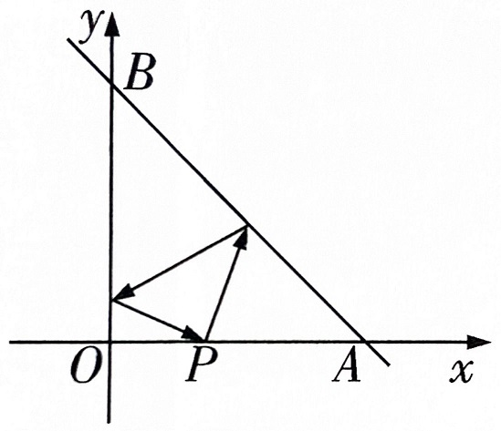
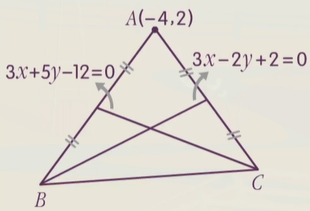

# 两个距离公式

## 公式内容

### 点到直线的距离

对于点 $P(x_0, y_0)$ 和直线 $l$：$Ax + By + C = 0$，我们探究 $P$ 到 $l$ 的距离．

设 $l$ 上任意一点 $Q(x_1, y_1)$，则 $Ax_1 +By_1 + C = 0$．显然，$\overrightarrow{PQ}$ 向 $l$ 的法向量方向的投影的绝对值，即 $\dfrac{\left|\overrightarrow{PQ} \cdot \vec n\right|}{\left|\vec n\right|}$ 就是 $P$ 到 $l$ 的距离．

$\vec n$ 可以取 $(A, B)$，同时 $\overrightarrow{PQ} = (x_1 - x_0, y_1 - y_0)$．

展开得：

$$
\begin{aligned}
&\dfrac{\left|\overrightarrow{PQ} \cdot \vec n\right|}{\left|\vec n\right|} \\
=& \dfrac{\left|(x_1 - x_0, y_1 - y_0) \cdot (A, B)\right|}{\left|(A, B)\right|} \\
=& \dfrac{\left|A(x_1 - x_0) + B(y_1 - y_0)\right|}{\sqrt{A^2 + B^2}} \\
=& \dfrac{\left|Ax_1 + By_1 + C - Ax_0 - By_0 - C\right|}{\sqrt{A^2 + B^2}} \\
=& \dfrac{\left|- Ax_0 - By_0 - C\right|}{\sqrt{A^2 + B^2}} \\
=& \dfrac{\left|Ax_0 + By_0 + C\right|}{\sqrt{A^2 + B^2}}
\end{aligned}
$$

因此，**点 $\boldsymbol{P(x_0, y_0)}$ 到直线 $\boldsymbol l$：$\boldsymbol{Ax + By + C = 0}$ 的距离为 $\boldsymbol{\dfrac{\left|Ax_0 + By_0 + C\right|}{\sqrt{A^2 + B^2}}}$．**该结论可以直接使用．

上面直线 $l$ 采用一般式是因为它是唯一能涵盖所有直线的情况，并且一般式推出的距离公式形式比较优美．遇到用其它形式表示的直线时，将直线方程变形为一般式形式再套用点到直线距离公式即可．如下：

:::info 例题 1.1

求 $(-2, 1)$ 到 $y = \dfrac 1 3 x - 5$ 的距离．

:::

:::tip 例题 1.1 解答

直线方程等价于 $x - 3y - 15 = 0$．距离 $d = \dfrac{|1 \times(-2) - 3 \times 1 - 15|}{\sqrt{1^2 + (-3)^2}} = 2\sqrt{10}$．

:::

当然，足够特殊的直线，如水平横线和竖直线，点到直线距离都只是两个坐标的差，就没必要套用上面的公式了．

### 平行线间距离

对于两条平行线 $l_1$：$Ax + By + C_1= 0$ 和 $l_2$：$Ax + By + C_2 = 0$，这里 $C_1 \ne C_2$，探究它们的距离．

可以在 $l_1$ 上任取一点 $P(x_0, y_0)$，则 $P$ 到 $l_2$ 的距离就是两直线间距离．这里有 $Ax_0 +By_0 + C_1 = 0$．

$P$ 到 $l_2$ 的距离为 $\dfrac{\left|Ax_0 + By_0 + C_2\right|}{\sqrt{A^2 + B^2}} = \dfrac{\left|(Ax_0 + By_0 + C_1) + C_2 - C_1\right|}{\sqrt{A^2 + B^2}} = \dfrac{\left|C_1 - C_2\right|}{\sqrt{A^2 + B^2}}$．

因此，**两条平行线 $\boldsymbol{l_1}$：$\boldsymbol{Ax + By + C_1= 0}$ 和 $\boldsymbol{l_2}$：$\boldsymbol{Ax + By + C_2 = 0}$ 之间的距离为 $\boldsymbol{\dfrac{\left|C_1 - C_2\right|}{\sqrt{A^2 + B^2}}}$．**该结论可以直接使用．

对于 $x$ 和 $y$ 系数不等，但对应成比例的直线，显然它们也平行，将系数统一后代入求解公式即可．下面是一个例子：

:::info 例题 1.2

求 $3x + 4y - 9 = 0$ 和 $6x + 8y +3 = 0$ 的距离．

:::

:::tip 例题 1.2 解答

统一系数为 $6x + 8y - 18 = 0$ 和 $6x + 8y + 3 = 0$．

距离 $d = \dfrac{|-3 - 18|}{\sqrt{6^2 + 8^2}} = \dfrac{21}{10}$．

:::

## 直线综合大题

至此，所有教材上出现过的，有关直线和点几何条件的刻画方式已经全部讲解完毕．但在实际做题时，还会见到许多有关直线和点的陌生的几何条件，此时我们就要设法将它们等价为我们熟悉的，会刻画的几何条件，从而解决问题．

如「$P$ 和 $Q$ 关于直线 $l$ 对称」就是一个陌生的几何条件，但我们可以等价为「$PQ \perp l$」和「$PQ$ 的中点在 $l$ 上」两个几何条件，这两个条件我们都是会刻画的．

本章将会总结一些非常经典的几何条件（如上面提到的对称），并给出这些几何条件通常最简单的刻画方法．这类问题比较常见，请读者熟练掌握．

### 有时可以考虑几何

:::info 例题 2.1

一直线 $l$ 过点 $P(1, 2)$，且与 $M(2, 3)$ 和 $N(4, -5)$ 的距离相等，求 $l$ 的方程．

:::

:::tip 例题 2.1 代数法解答

（$l$ 为已知过一点 + 其它信息形式，列成斜率为参数的点斜式．勿忘分类讨论．）

当 $l$ 斜率不存在时，$l$ 为 $x = 1$，不符要求，舍去．

当 $l$ 斜率存在时，设 $l$ 方程为 $y - 2 = k(x - 1)$．为方便计算距离，变形为一般式形式 $kx - y - k + 2 = 0$．

$l$ 到 $M$ 距离为 $\dfrac{|2k - 3 - k + 2|}{\sqrt{k^2 +1}} = \dfrac{|k - 1|}{\sqrt{k^2 +1}}$，$l$ 到 $N$ 距离为 $\dfrac{|4k + 5 - k + 2|}{\sqrt{k^2 + 1}} = \dfrac{|3k + 7|}{\sqrt{k^2 +1}}$．

两距离相等，即 $\dfrac{|k - 1|}{\sqrt{k^2 +1}} = \dfrac{|3k + 7|}{\sqrt{k^2 +1}}$，解得 $k = -4$ 或 $k = -\dfrac 3 2$．

因此，直线 $l$ 的方程为 $4x + y - 6 = 0$ 或 $3x + 2y - 7 = 0$．

:::

:::tip 例题 2.1 几何法解答

$l$ 到 $M$ 和 $N$ 的距离相等，只有两种情况：$l \parallel MN$，或者 $l$ 经过 $MN$ 中点．

第一种情况可以知道 $l$ 过一点（已知条件的 $(1, 2)$）和斜率（与 $MN$ 平行），点斜式直接求得 $4x + y - 6 = 0$．

第二种情况可以知道 $l$ 过两点（已知条件的 $(1, 2)$ 和 $MN$ 中点），先算斜率再点斜式直接求得 $3x + 2y - 7 = 0$．

:::

可以看到，几何法的计算量明显少于代数，效率更高．但是几何法的两种情况容易漏掉其中一种导致丢解，因此代数法相对更稳定．读者可以根据自己的喜好和实际情况选择适合自己的方法．

### 点到直线的垂足

#### 点到直线的垂足 标准做法

求点 $P(x_0, y_0)$ 到直线 $l$：$Ax + By + C = 0$ 的垂足 $H$ 的坐标．

最简单的做法是：计算出 $l$ 的斜率，从而计算出垂线 $PH$ 的斜率．

根据垂线 $PH$ 的斜率和点 $P$ 的坐标列点斜式，为直线 $PH$ 的方程．与 $l$ 的方程联立即得到 $H$ 的坐标．

:::info 例题 2.2

若点 $P(1, 3)$ 到直线 $l$：$y = -3x - 4$ 的垂足为 $H$，求 $H$ 的坐标．

:::

:::tip 例题 2.2 解答

$l$ 的斜率为 $-3$，则 $PH$ 的斜率为 $\dfrac 1 3$，直线 $PH$ 方程为 $y - 3 = \dfrac 1 3 (x - 1)$．

与 $y = -3x - 4$ 联立解得 $\begin{cases}x = -2 \\ y = 2\end{cases}$．$H$ 的坐标为 $(-2, 2)$．

:::

#### 点到直线的垂足 选填速算技巧

求点 $P(x_0, y_0)$ 到直线 $l$：$Ax + By + C = 0$ 的垂足 $H$ 的坐标．

有结论：$H$ 的坐标就是 $P$ 的坐标减去向量 $t(A, B)$，其中 $t = \dfrac{Ax_0 + By_0 +C}{A^2 + B^2}$．

注意到 $t$ 和点到直线的距离公式很像，但有两个差别：一是分子不再有绝对值；二是分母不再有根号．

 点到直线的垂足 速算技巧证明 

考虑 $\overrightarrow{OH} = \overrightarrow{OP} + \overrightarrow{PH}$．所求的 $H$ 的坐标实际就是 $\overrightarrow{OH}$，$\overrightarrow{OP}$ 也即已知 $P$ 的坐标．我们只需求出 $\overrightarrow{PH}$．

因为 $PH \perp l$，所以 $\overrightarrow{PH}$ 是 $l$ 的一个法向量，且模长应等于 $P$ 到 $l$ 距离，即 $\dfrac{|Ax_0 + By_0 + C|}{\sqrt{A^2 + B^2}}$．

我们取 $l$ 的法向量 $(A, B)$，它的模长为 $\sqrt{A^2 + B^2}$．记 $t = \dfrac{Ax_0 + By_0 +C}{A^2 + B^2}$，则 $t(A, B)$ 的模长与 $P$ 到 $l$ 的距离相同．于是，$t(A, B)$ 就是一个与所求向量 $\overrightarrow{PH}$ 平行且大小相等的向量，因此 $t(A, B)$ 要么是 $\overrightarrow{PH}$ 要么是 $\overrightarrow{HP}$，现确定 $t(A, B)$ 的方向．

设 $H(x_1, y_1)$，我们有：

$$
\begin{aligned}
t(A, B) \cdot \overrightarrow{HP} &= t[(A, B) \cdot \overrightarrow{HP}] \\
& = t[(A, B) \cdot (x_0 - x_1, y_0 - y_1)] \\
& = t[A(x_0 - x_1) + B(y_0 - y_1)] \\
& = t(Ax_0 + By_0 + C - Ax_1 - By_1 - C) \\
& = t(Ax_0 + By_0 + C) \\
& = \dfrac{Ax_0+By_0+C}{A^2 + B^2} \times (Ax_0 + By_0 + C)\\
& = \dfrac{(Ax_0+By_0+C)^2}{A^2 + B^2} > 0
\end{aligned}
$$

这证明了 $t(A, B)$ 和 $\overrightarrow{HP}$ 是同向的，说明 $t(A, B) = \overrightarrow{HP}$．我们构造它的相反向量 $-t(A, B)$，就是 $\overrightarrow{PH}$ 了．

因此 $Q$ 的坐标就是 $P$ 的坐标加上 $-t(A, B)$，即减去 $t(A, B)$．

不要看这个公式复杂，使用起来习惯很快：只需先算出 $t$ 值，然后列式计算即可．根据经验，出题人一般会将对称点坐标设计成一个比较简单的形式，此时 $t$ 的值也一定是比较简单的．

需要注意的是，**技巧只能在选填中使用．**

:::info 例题 2.2

若点 $P(1, 3)$ 到直线 $l$：$y = -3x - 4$ 的垂足为 $H$，求 $H$ 的坐标．

:::

:::tip 例题 2.2 解答（技巧）

将 $l$ 的方程变形为 $3x + y + 4 = 0$，根据 $P(1, 3)$，算出 $t$ 值为 $\dfrac{3 \times 1 + 3 + 4}{3^2 + 1^2} = 1$．

于是垂足坐标为 $(1, 3) - t(3, 1) = (-2, 2)$．

:::

#### 点到直线的垂足 特殊情况 1

求点 $P(x_0, y_0)$ 到 $l$ 的垂足 $H$ 的坐标，**其中 $\boldsymbol l$ 为水平线或竖直线**．

点 $P(x_0, y_0)$ 到直线 $x = x_1$ 的垂足为 $(x_1, y_0)$；到直线 $y = y_1$ 对称的点为 $(x_0, y_1)$．

结论可以直接使用．

#### 点到直线的垂足 特殊情况 2 选填速算技巧

求点 $P(x_P, y_P)$ 到 $l$：$Ax + By + C = 0$ 的垂足坐标，**其中 $\boldsymbol l$ 的斜率为 $\boldsymbol{\pm 1}$，即 $\boldsymbol{|A| = |B|}$．**

参见 [点关于直线对称 特殊情况 2 选填速算技巧](#点关于直线对称-特殊情况-2-选填速算技巧)，这种情况下我们可以快速的计算出 $P$ 的对称点 $P'$．然后，我们算出 $P$ 和 $P'$ 的中点，就是所求垂足的坐标．

### 点关于点对称

接下来几节考虑讨论刻画对称．

点 $P(x, y)$ 与点 $Q$ 关于 $A(x_0, y_0)$ 对称，求 $Q$ 的坐标．

已知等价于 $A$ 是 $PQ$ 的中点．因此，我们有 $Q = (2x_0 - x, 2y_0 - y)$．

### 直线关于点对称

#### 直线关于点对称 标准做法

求 $l_1$：$Ax + By + C = 0$ 关于点 $P(x_0, y_0)$ 对称的直线 $l_2$ 的解析式．

计算量最小的标准做法是：将已知等价于下面两个条件：

- $l_2 \parallel l_1$．
- $l_2$ 经过 $l_1$ 上某个点关于 $P$ 的对称点．

对于第一条，我们可以使用平行直线系，列出 $l_2$ 的方程为 $Ax + By + m =0$（$m \ne C$）．

然后再在 $l_1$ 上随便找一点 $P(x_1, y_1)$，关于 $P$ 对称过去，再令它在 $l_2$ 上，就能解出 $l_2$ 的方程．

:::info 例题 2.4

求 $2x + 3y + 16 = 0$ 关于点 $P(0, 1)$ 对称的直线方程．

:::

:::tip 例题 2.4 解答

对称的直线和原直线平行，设对称的直线为 $2x + 3y + m = 0$．

考虑原直线上任意一点 $(-8, 0)$，关于点 $P(0, 1)$ 对称后的点为 $(8, 2)$．$(8, 2)$ 在 $2x + 3y + m = 0$ 上，解得 $m = -22$．

因此对称后的直线方程为 $2x + 3y - 22 = 0$．

:::

#### 直线关于点对称 选填速算技巧

求 $l_1$：$Ax + By + C = 0$ 关于点 $P(x_0, y_0)$ 对称的直线 $l_2$ 的解析式．下面是一个技巧做法．

第一步：根据平行直线系列出 $l_2$ 的方程：$Ax + By + m = 0$．

第二步：将 $l_1$ 和 $l_2$ 两个方程相加，得到 $Ax + By + C + Ax + By + m = 0$．

第三步：可以证明 $P$ 的坐标满足上面那个方程，即 $Ax_0 + By_0 + C + Ax_0 + By_0 + m = 0$ 成立，可解出 $m$．

上面这个技巧要想证明，只要说明 $P$ 的坐标为什么满足 $Ax + By + C +Ax + By + m = 0$ 这个方程．

也可直接记忆 $m$ 在上面那个方程的解：$-C - 2Ax_0 - 2By_0$．

 直线关于点对称速算技巧证明 

事实上，$l_1$ 和 $l_2$ 关于 $P$ 对称，也等价于 $l_1 \parallel l_2$ 且 $P$ 到 $l_1$ 的距离等于 $P$ 到 $l_2$ 的距离．即

$$
\dfrac{|Ax_0 + By_0 + C|}{\sqrt{A^2 + B^2}} = \dfrac{|Ax_0 + By_0 + m|}{\sqrt{A^2 + B^2}}
$$

于是

$$
|Ax_0 + By_0 + C| = |Ax_0 + By_0 + m|
$$

因为 $m \ne C$，所以左右两个绝对值内部的值不能相等，只能互为相反数，相加为 $0$，证毕．

:::info 例题 2.4

求 $2x + 3y + 16 = 0$ 关于点 $P(0, 1)$ 对称的直线方程．

:::

:::tip 例题 2.4 解答（技巧）

列方程：$2 \times 0 + 3 \times 1 + 16 + 2 \times 0 + 3 \times 1 + m = 0$，直接解出 $m = -22$．

所以直线方程为 $2x + 3y - 22 = 0$．

:::

这个技巧做法不能在大题中直接使用，想用还需要证明一遍，效率反而不如标准做法．不过选填中这个技巧还是快于标准做法的．

### 点关于直线对称

#### 点关于直线对称 标准做法

求点 $P(x_0, y_0)$ 关于 $l$：$Ax + By + C = 0$ 对称的点 $Q$ 的坐标．

计算量最小的标准做法是：将对称条件等价为下面两个条件：

- $PQ \perp l$．
- $PQ$ 的中点在 $l$ 上．

设 $Q$ 的坐标为 $(x_Q, y_Q)$，上面两个条件分别转成两个方程，可以解出 $x_Q$ 和 $y_Q$．

:::info 例题 2.5.1

若点 $P(1, 3)$ 和 $Q$ 关于直线 $y = -3x - 4$ 对称，求 $Q$ 的坐标．

:::

:::tip 例题 2.5.1 解答

设 $Q$ 的坐标为 $(x_Q, y_Q)$．对称等价于：

- $PQ \perp l$．即 $PQ$ 的斜率存在且为 $-3$ 的负倒数 $\dfrac{1}3$．根据斜率公式有 $\dfrac{y_Q - 3}{x_Q - 1} = \dfrac 1 3$．
- $PQ$ 的中点在 $l$ 上．即 $\left(\dfrac{1 + x_Q}2, \dfrac{3 + y_Q}2\right)$ 在 $l$ 上，即 $\dfrac{3 +y_Q}2 = -3 \times \dfrac{1+x_Q}2 - 4$．

联立两个方程解得 $\begin{cases}x_Q = -5 \\ y_Q = 1\end{cases}$，即 $Q(-5, 1)$．

:::

#### 点关于直线对称 选填速算技巧

求点 $P(x_0, y_0)$ 关于 $l$：$Ax + By + C = 0$ 对称的点 $Q$ 的坐标．

有结论：$Q$ 的坐标就是 $P$ 的坐标减去向量 $2t(A, B)$，其中 $t = \dfrac{Ax_0 + By_0 +C}{A^2 + B^2}$．

上面的公式和 [点到直线的垂足](#点到直线的垂足) 中的公式几乎完全一致，只是从减去 $t(A, B)$ 改成了减去 $2t(A, B)$．

原因也类似于垂足的速算技巧：$P - t(A, B)$ 得到垂足 $H$，我们知道 $H$ 是 $PQ$ 的中点，所以从垂足 $H$ 出发再减去 $t(A, B)$ 就得到了 $Q$．因此，$P - 2t(A, B) = Q$．

:::info 例题 2.5.1

若点 $P(1, 3)$ 和 $Q$ 关于直线 $y = -3x - 4$ 对称，求 $Q$ 的坐标．

:::

:::tip 例题 2.5.1 解答（技巧）

将直线变形为一般式方程 $3x + y + 4 = 0$．可算出 $t = \dfrac{3 \times 1 + 3 + 4}{3^2 + 1^2} = 1$．

于是 $Q = P - 2t(3, 1)$，即 $(-5, 1)$．

:::

#### 点关于直线对称 特殊情况 1

求点 $P(x_0, y_0)$ 关于 $l$ 对称的点 $Q$ 的坐标，**其中 $\boldsymbol l$ 为水平线或竖直线**．

点 $P(x_0, y_0)$ 关于直线 $x = x_1$ 对称的点为 $Q(2x_1 - x_0, y_0)$．原因是可以转化为关于点 $(x_1, y_0)$ 对称．

点 $P(x_0, y_0)$ 关于直线 $y = y_1$ 对称的点为 $Q(x_0, 2y_1 - y_0)$．原因是可以转化为关于点 $(x_0, y_1)$ 对称．

结论可以直接使用．

#### 点关于直线对称 特殊情况 2 选填速算技巧

求点 $P(x_P, y_P)$ 关于 $l$：$Ax + By + C = 0$ 对称的点 $Q$ 的坐标，**其中 $\boldsymbol l$ 的斜率为 $\boldsymbol{\pm 1}$，即 $\boldsymbol{|A| = |B|}$．**

在这种条件下有一个结论：设 $Q(x_Q, y_Q)$，则 $(x_P, y_Q)$ 和 $(y_P, x_Q)$ 都满足 $l$ 的方程．

 结论证明 

以 $PQ$ 为对角线作一个正方形，因为 $l$ 的斜率为 $\pm 1$，$PQ$ 的斜率为 $\mp 1$，那么作出的正方形是一个与坐标轴平行，横平竖直的正方形，因此正方形除了 $PQ$ 的另外两个顶点坐标分别为 $(x_P, y_Q)$ 和 $(y_P, x_Q)$．

显然，这两个顶点在正方形除了 $PQ$ 的另外一条对角线上，而这条对角线恰好是 $l$．

这两个点在 $l$ 上，就满足 $l$ 的方程．证毕．

所以我们可以将 $x_P$ 的值代入 $l$ 的方程，求出的 $y$ 值就是 $y_Q$；再将 $y_P$ 的值代入 $l$ 的方程，求出的 $x$ 值就是 $x_Q$．该结论同样不能在大题中直接使用．

:::info 例题 2.5.2

求 $(-2, 3)$ 关于直线 $y - x + 1 = 0$ 的对称点．

:::

:::tip 例题 2.5.2 解答

将 $x = -2$ 代入方程，得到 $y = -3$，为对称点的纵坐标．

将 $y = 3$ 代入方程，得到 $x = 4$，为对称点的横坐标．

因此对称点坐标为 $(4, -3)$．

:::

这个特例下还有两个更特殊的例子：关于 $y = x$ 和 $y = -x$ 对称．

- $(x_0, y_0)$ 关于 $y = x$ 的对称点为 $(y_0, x_0)$．
- $(x_0, y_0)$ 关于 $y = -x$ 的对称点为 $(-y_0, -x_0)$．

### 直线关于直线对称

#### 直线关于直线对称 情况 1：目标直线和对称轴平行

 求 $l_1$：$Ax + By + C_1 = 0$ 关于 $l_2$：$Ax + By + C_2 = 0$ 对称的直线 $l_3$ 的方程，保证 $C_1 \ne C_2$．上面的方程已经保证了 $l_1 \parallel l_2$．

给定的对称关系可以等价为：$l_3$ 与 $l_1$ 平行，且 $l_3$ 到 $l_2$ 的距离等于 $l_1$ 到 $l_2$ 的距离．

注意上面不能等价为与 $l_2$ 平行，因为必须排除 $l_3$ 和 $l_1$ 重合的可能．

设 $l_3$ 方程为 $Ax + By + C_3 = 0$（$C_3 \ne C_1$）．我们有：
$$
\dfrac{|C_3 - C_2|}{\sqrt{A^2 +B^2}} = \dfrac{|C_1 - C_2|}{\sqrt{A^2 +B^2}}
$$
即
$$
|C_3 - C_2| = |C_1 - C_2|
$$
因为 $C_3 \ne C_1$，绝对值内部的值无法相等，只能相反，即
$$
C_3 - C_2 = C_2 - C_1
$$
即 $C_3 = 2C_2 - C_1$．

:::info 例题 2.6.1

求直线 $l_1$：$2x + 3y - 1 = 0$ 关于直线 $l_2$： $4x + 6y + 4 = 0$ 对称的直线 $l_3$ 的方程．

:::

:::tip 例题 2.6.1 解答

$l_2$ 方程变形为 $2x + 3y + 2 = 0$，与 $l_1$ 的 $x$，$y$ 系数统一．设 $l_3$ 方程为 $2x + 3y + m = 0$（$m \ne -1$）．

$l_3$ 到 $l_2$ 的距离等于 $l_1$ 到 $l_2$ 的距离，即 $\dfrac{|m - 2|}{\sqrt{2^2 + 3^2}} = \dfrac{3}{\sqrt{2^2 + 3^2}}$，可得 $|m - 2| = 3$，即 $m = 5$（$-1$ 舍去）．

综上 $l_3$ 的方程为 $2x + 3y + 5 = 0$．

上面的解答按照标准过程的规范书写．在选填中，我们直接按照 $2 \times 2 - (-1) = 5$ 算出 $m$，就能直接写出 $l_3$ 的方程为 $2x + 3y + 5=  0$．

:::

#### 直线关于直线对称 情况 2：目标直线和对称轴相交 标准做法

求 $l_1$：$Ax + By + C = 0$ 关于 $l_2$：$Dx + Ey + F = 0$ 的对称直线 $l_3$ 的方程．这里保证 $l_1 \nparallel l_2$．

计算量最小的标准做法如下：

考虑到 $l_1$ 和 $l_2$ 的交点必在 $l_3$ 上，求出 $l_1$ 和 $l_2$ 的交点，它在 $l_3$ 上．

然后我们再求出 $l_1$ 上任意一个不同于 $l_1$ 和 $l_2$ 交点的点，求它关于 $l_2$ 的对称点，它也在 $l_3$ 上．

确定 $l_3$ 上的两个点后我们就能确定它的方程了．

:::info 例题 2.6.2

求直线 $l_1$：$x + y - 1 = 0$ 关于直线 $l_2$：$3x - y - 3 = 0$ 对称的直线 $l_3$ 的方程．

:::

:::tip 例题 2.6.2

易求得 $l_1$ 和 $l_2$ 的交点为 $(1, 0)$，该点也在 $l_3$ 上．

考虑 $l_1$ 上任意一个不同于 $(1, 0)$ 的点 $(0, 1)$，求出它关于 $l_2$ 的对称点（求解过程省略），为 $\left(\dfrac{12}5, \dfrac 1 5\right)$．

$l_3$ 过 $(1, 0)$ 和 $\left(\dfrac{12}5, \dfrac 1 5\right)$，计算得斜率为 $\dfrac{1}7$，则 $l_2$ 的方程为 $y = \dfrac{1}7(x - 1)$，即 $x - 7y - 1 = 0$．

:::

#### 直线关于直线对称 选填速算技巧

求 $l_1$：$ax + by + c = 0$ 关于 $l_2$：$Ax + By + C = 0$ 的对称直线 $l_3$ 的方程．这里保证 $l_1 \nparallel l_2$．

我们有一个更普遍的结论：设任意曲线 $\Gamma$ 的方程为 $F(x, y) = 0$，其关于 $Ax + By + C = 0$ 对称的曲线 $\Gamma'$ 方程恰为 $F(x - 2tA, y - 2tB) = 0$，其中 $t = \dfrac{Ax + By + C}{A^2 + B^2}$．

证明：容易发现点 $P(x_0, y_0)$ 在 $\Gamma'$ 上等价于其关于 $Ax + By + C = 0$ 的对称点在 $\Gamma$ 上．根据先前的结论，这个对称点即 $(x_0 - 2tA, y_0 - 2tB)$，于是对称点在 $\Gamma$ 上又等价于 $F(x_0 - 2tA, y_0 - 2tB) = 0$．证毕．

现在考虑 $\Gamma$ 为直线 $ax + by + c = 0$ 的情形，我们有其对称后的直线为 $a(x - 2tA) + b(y - 2tB) + c = 0$．整理方程：

$$
\begin{aligned}
a(x - 2tA) + b(y - 2tB) + c &= 0\\
ax - 2Aat + by - 2Bbt + c &= 0 \\
ax + by + c &= (2Aa + 2Bb)t \\
ax + by + c &= (2Aa + 2Bb) \times \dfrac{Ax + By + C}{A^2 + B^2}\\
\dfrac{ax + by + c}{Ax +By + C} &= \dfrac{2Aa + 2Bb}{A^2 + B^2}
\end{aligned}
$$

因此，遇到 $ax + by + c = 0$ 对 $Ax +By + C = 0$ 对称，可以直接写下结果直线的方程 $\dfrac{ax + by + c}{Ax +By + C} = \dfrac{2Aa + 2Bb}{A^2 + B^2}$，然后化简即可．这个做法是比常规做法要快的．

注意区分：小写字母 $a$，$b$，$c$ 代表被对称的直线上的系数；大写 $A$，$B$，$C$ 代表对称轴上的系数．

:::info 例题 2.6.2

求直线 $l_1$：$x + y - 1 = 0$ 关于直线 $l_2$：$3x - y - 3 = 0$ 对称的直线 $l_3$ 的方程．

:::

:::tip 例题 2.6.2 解答（技巧）

直接列出 $l_3$ 的方程为 $\dfrac{x + y - 1}{3x - y - 3} = \dfrac{2 \times 1 \times 3 + 2 \times 1 \times (-1)}{3^2 + (-1)^2} = \dfrac{2}5$，化简得 $x - 7y - 1 = 0$．

:::

上面这个速算技巧并没有用到 $l_1$ 和 $l_2$ 必须相交，但是 $l_1 \parallel l_2$ 的情形计算对称直线本来就相当简单，采用这个速算反而更麻烦．所以我们在 $l_1 \nparallel l_2$ 的选填中才考虑使用此技巧．

### 光线反射问题

考虑这样一个模型：已知从点 $A$ 发出一条激光，经过一条直线 $l$ 的反射，反射光线在点 $B$ 处被吸收．现求解入射点 $C$ 的坐标，以及光线从 $A$ 到 $B$ 走过的路径长度．

上面这个问题，根据解析几何朴素的想法，有一个暴力思路：将 $C$ 的坐标设为 $(x_C,y_C)$，注意到 $C$ 一定在 $l$ 上，因此 $x_C$ 与 $y_C$ 已经存在一个线性关系；然后我们作出线段 $AC$，这就找到了入射光线．为了找到反射光线，我们还需先作出法线 $CD \perp l$，然后再将直线 $AC$ 关于法线对称为直线 $A'C$，再根据 $B$ 在 $A'C$ 上列出 $x_C$ 与 $y_C$ 的另一个线性关系，从而得到 $C$ 的坐标，进而距离暴力计算 $|AC| + |CB|$ 即可．

上面的思路准确而暴力，但有远远更快的做法，我们需要了解．

光的反射具有非常良好的对称性，根据光反射的性质，有 **射线** $CA$ 和 **射线** $CB$ 关于法线对称；由此，我们又能推出 **直线** $AC$ 和 **直线** $CB$ 关于直线 $l$ 对称．进而我们又发现，**线段** $AC$ 关于 $l$ 对称后的 **线段** $A'C$，恰好与 **线段** $CB$ 在同一条直线上．于是我们就有：**设 $\boldsymbol{A'}$ 为 $\boldsymbol A$ 关于 $\boldsymbol l$ 的对称点，则入射点 $\boldsymbol C$ 为 $\boldsymbol{A'B}$ 与 $\boldsymbol l$ 的交点．**这就以一个非常简单的思路直接找到 $C$ 的坐标了．另外，从 $A$ 到 $B$ 经过的路程长度等于 $|A'B|$，只用计算两点之间的距离即可．

上面我们是作了光线的起始点 $A$ 的对称点 $A'$，再将对称点 $A'$ 与终止点 $B$ 连结，与 $l$ 的交点为入射点 $C$．除此之外，我们也可以考虑作光线的终止点 $B$ 的对称点 $B'$，再将对称点 $B'$ 与起始点 $A$ 连结，与 $l$ 的交点仍为入射点 $C$．

无论是哪种情况，本质都是：将光反射形成的两段折线中的其中一条关于平面镜对称，得益于光反射的高度对称性，对称后两条折线恰好成直线．于是本来是「光反射」的问题，可以看作「光从平面镜的一头直着射向另一头」．

> 事实上，刚刚这套思路与初中物理中已知光源，观测点，平面镜的位置，要求绘制光线路径的题目思路是一致的．

:::info 例题 2.7.1

一光线从点 $A(-3, 5)$ 出发射到直线 $3x - 4y + 4 = 0$ 上，反射后经点 $B(2, 15)$，求光线从 $A$ 点反射到 $B$ 点经过的路程．

:::

:::tip 例题 2.7.1 解答

$(-3, 5)$ 关于 $3x - 4y + 4 = 0$，用速算技巧，算出 $t = \dfrac{3 \times (-3) - 4 \times 5 +4}{3^2 + (-4)^2} = -1$，$A'$ 坐标为 $(-3, 5) - 2t(3, -4) = (3, -3)$．随后不难算出 $|A'B| = 5\sqrt{13}$，即为答案．

（我们可以看作是 $A'$ 直接向 $B$ 沿直线设出光线．）

:::

:::info 例题 2.7.2

已知 $A(3, 0)$，$B(0, 3)$，从 $P(1, 0)$ 射出的光线经直线 $AB$ 和直线 $OB$ 先后两次反射后回到点 $P$，求光线经过的路程．

:::

:::tip 例题 2.7.2 解答

作出 $P$ 关于 $AB$ 的对称点 $P_1$ 和关于 $BO$ 的对称点 $P_2$，$|P_1P_2|$ 即为答案．这里两个对称都是特殊情形（一个坐标轴，一个斜率 $\pm 1$），所以对称点坐标都很好求．因此过程不再赘述，$P_1(3, 2)$，$P_2(-1, 0)$，答案为 $2\sqrt 5$．

（我们可以看作是 $P_1$ 直接向 $P_2$ 沿直线设出光线．）

:::

:::info 例题 2.7.3

一束光从 $P(1, 2)$ 出发，经 $x$ 轴反射后，射到线段 $y = -x + b,\  x \in [3, 5]$ 上的点 $M$．

- （1）若 $b = 8$，求反射光线斜率的取值范围．
- （2）若 $b \ge 6$，设光走过的路径长度的最小值为 $S(b)$，求 $S(b)$ 的解析式．

:::

:::::tip 例题 2.7.3 解答

光从 $P(1, 2)$ 经 $x$ 轴反射射到线段上，可以看作光从 $P'(1, -2)$ 直接通过 $x$ 轴射向线段．题目中入射方向是可以任意选取的（只要保证反射光线能射到线段上即可），那么等价看作的结果中，光也同样是可以从任意方向直接发出，只要射到线段上即可，因为上面的等价结果中反射光线不受影响．

（1）等价于过 $(1, -2)$ 的直线过线段 $y = -x + 8, \ x \in [3, 5]$．裸的 [过定点直线交于线段求斜率范围](./direction.md#过定点直线交于线段求斜率范围) 问题，过程不再赘述，答案为 $\left[\dfrac 5 4, \dfrac 7 2\right]$．

（2）

我们先解决一个子问题：

::::info 例题 2.7.3 子问题

已知一点 $P$ 和一线段 $AB$，求 $P$ 和线段 $AB$ 上某一点的距离最小值．

:::tip 例题 2.7.3 子问题解答

作 $PH \perp AB$，显然，如果 $H$ 在线段 $AB$ 上，则 $|PH|$ 就是所求最小值．

如果 $H$ 落在线段 $AB$ 外，则 $PH$ 取不到．如果 $H$ 落在 $A$ 的远离线段 $AB$ 方向的一侧，则距离最小值取在 $|PA|$；如果 $H$ 落在 $B$ 的远离线段 $AB$ 方向的一侧，则距离最小值取在 $|PB|$．

:::

::::

令 $A(3, b - 3)$，$B(5, b - 5)$，现在所求就是 $P'$ 到线段 $AB$ 上某一点的距离最小值．

从 $P'$ 到直线 $AB$ 作垂，$AB$ 斜率 $\pm1$，垂足可以速算．$P'(1, -2)$ 关于 $y = b - x$ 的对称点为 $P''(b + 2, b - 1)$，垂足 $H$ 为 $P'P''$ 的中点 $\left(\dfrac{b + 3}2, \dfrac{b - 3}2\right)$．

- 当 $b \in [6, 7]$ 时，$\dfrac{b + 3}2 \in [3, 5]$，$H$ 在线段 $AB$ 上．距离最小值为 $P'H = \dfrac{\sqrt 2(b + 1)}2$．
- 当 $b \in (7, +\infty)$ 时，$\dfrac{b + 3}2 \in (5, +\infty)$，$H$ 在 $B$ 的偏离线段 $AB$ 的一侧，则距离最小值为 $P'B = \sqrt{b^2 - 6b + 25}$．

综上，最短路程 $S(b) = \begin{cases}\dfrac{\sqrt 2(b + 1)}2  & b \in [6, 7] \\ \sqrt{b^2 - 6b + 25} & b \in (7, +\infty)\end{cases}$．

:::::

### 三角形高线所在直线

对于任意一个三角形 $\triangle PQR$，$QR$ 边上的高线所在直线等价于一条同时满足下面两条条件的直线：

- 该直线与直线 $QR$ 垂直．
- $P$ 在该直线上．

这就是刻画三角形高线所在直线的方法．

:::info 例题 2.8

已知 $\triangle ABC$ 中，$AC$、$AB$ 边上的高所在直线分别为 $2x - 3y + 1 = 0$ 和 $x + y = 0$，顶点 $A(1, 2)$，求 $BC$ 所在直线的方程．

:::

解决三角形问题，第一步是画图辅助理解．请读者不要画坐标系 1:1 还原，为了足够的效率，直接随手画一个三角形，并合理地表示对应的高线、中线和角平分线，就已经足够做题了．下面是一个推荐的画图示例：

题目中的一条高线所在直线可以等价为该直线的两条信息，共可给出四条信息：

- $AC$ 的法向量和 $AC$ 边的高线所在直线的法向量垂直，即 $AC$ 法向量为 $(3, 2)$．
- $B$ 在 $AC$ 边的高线所在直线上．
- $AB$ 的法向量和 $AB$ 边的高线所在直线的法向量垂直，即 $AB$ 法向量为 $(1, -1)$．
- $C$ 在 $AB$ 边的高线所在直线上．

再联系已知的点 $A$ 坐标，就可以考虑解决问题了．首先 $AC$ 和 $AB$ 都已知一点和方向从而可解，$B$ 同时在 $AB$ 和 $AC$ 边上的高线上，点 $B$ 坐标可解，点 $C$ 同理；点 $B$ 和点 $C$ 坐标解出，直线 $BC$ 坐标就可解了．根据这个思路我们作出解答．

:::tip 例题 2.8 解答

$AC$ 与 $2x - 3y + 1 = 0$ 垂直，则其所在直线法向量为 $(3, 2)$．其又过点 $A$，可知 $3 \times 1 + 2 \times 2 + C = 0$，可知 $C = -7$，即 $AC$ 所在直线方程为 $3x + 2y - 7 = 0$．同理可知 $AB$ 所在直线方程为 $x - y + 1 = 0$．

联立 $x - y + 1 = 0$ 和 $2x - 3y + 1 = 0$ 可知 $B(-2, -1)$．联立 $3x + 2y - 7 = 0$ 和 $x + y = 0$ 可知 $C(7, -7)$．

已知两点，可知 $BC$ 解析式为 $2x + 3y + 7 = 0$．

:::

### 三角形中线所在直线

刻画中线所在直线的方法：任意三角形 $\triangle PQR$，边 $QR$ 上的中线所在直线，等价于一条满足同时经过点 $P$ 和 $QR$ 中点的直线．

:::info 例题 2.9

已知 $\triangle ABC$ 中，$AC$、$AB$ 边上的中线所在直线分别为 $3x - 2y + 2 = 0$ 和 $3x + 5y - 12 = 0$，顶点 $A(-4, 2)$，求 $BC$ 所在直线的方程．

:::

画出示意图，还是一样，不用画出坐标系，随便画三角形足够分析．

设 $B(x_B, y_B)$，$C(x_C, y_C)$，从而设出中点．再对每条中线所在直线，等价为中点在中线上和顶点在中线上这两个信息，从而解决问题．

:::tip 例题 2.9 解答

设 $B(x_B, y_B)$，$C(x_C, y_C)$．

$AC$ 中线经过点 $B$ 和 $AC$ 的中点，所以 $\begin{cases}3x_B - 2y_B + 2 = 0 \\ 3\left(\dfrac{x_C - 4}2\right) - 2\left(\dfrac{y_C + 2}2\right) + 2 = 0\end{cases}$．

$AB$ 中线经过点 $C$ 和 $AB$ 的中点，所以 $\begin{cases}3x_C + 5y_C - 12 = 0 \\ 3\left(\dfrac{x_B - 4}2\right) + 5\left(\dfrac{y_B + 2}2\right) - 12 = 0\end{cases}$．

四个未知数，四个方程，可解（而且可以拆成两个二元一次方程组）．

解得 $B(2, 4)$，$C(4, 0)$，可得出 $BC$ 的方程为 $2x + y - 8 = 0$．

:::

### 角平分线所在直线

三角形的角平分线所在直线与高线、中线不太一样：它只与三角形的两条边有关，而与第三条边无关．角平分线所在直线只是两个边的角平分线而已，不必局限于三角形的讨论范围．所以这里直接讨论更一般的角平分线处理策略．

对于 $\angle BAC$，其角平分线所在直线 $l$ 等价于这样一条直线：$AB$ 和 $AC$ 关于该直线对称．

根据对称的知识可以进一步刻画条件为：$AB$ 直线上，一个不是点 $A$ 的点，关于 $l$ 对称后在直线 $AC$ 上．

总结：角平分线的刻画方式是，角的一边上的不为顶点的点关于角平分线所在直线的对称点在角的另一边上．

:::info 例题 2.10

已知 $A(3, 1)$，$B(-1, 2)$，若 $\angle ACB$ 的平分线在直线 $y = x + 1$ 上，求直线 $AC$ 的方程．

:::

:::tip 例题 2.10 解答

$\angle ACB$ 的平分线在直线 $y = x + 1$ 上，等价于 $B$ 关于 $y = x + 1$ 的对称点 $B'$ 在直线 $AC$ 上．对称直线还是斜率为 $\pm 1$ 的特殊直线，所以 $B'$ 坐标可以用技巧计算．我们有 $B'(1, 0)$．

观察到所求的直线 $AC$ 方程其实就是直线 $AB'$ 的方程，两点坐标已知，方程可解．答案为 $x - 2y - 1 = 0$．

:::

### 面积

以前求解平面直角坐标系中任意三点围成的三角形面积还需要割补，现在不再需要了．

考虑任意三角形 $\triangle ABC$ 的面积．可以考虑求解 $|BC|$，再求 $A$ 到直线 $BC$ 的距离 $h$．显然，三角形的面积就是 $\dfrac{|BC| \cdot h}2$．当然，我们也可以换用选取的底和高．

还有任意平行四边形 $ABCD$ 的面积．我们可以任选一组对边，计算这组对边中某条的长度，以及这组对边之间的距离（平行线间距离解决），相乘即可．

:::info 例题 2.11.1

已知直线 $l_1$ 过定点 $M(6, 4)$，且与直线 $l_2$：$y = 4x$ 交于第一象限的点 $A$，与 $x$ 轴正半轴交于点 $B$，求使得 $\triangle OAB$（$O$ 为坐标原点）面积最小时的直线 $l_1$ 的方程．

:::

:::tip 例题 2.11.1 解答

当 $l_1$ 不存在斜率时，$l_1$：$x = 6$，$A(6, 24)$，$B(6, 0)$，$\triangle OAB$ 面积为 $72$．

当 $l_1$ 斜率为 $k$ 时，$l_1$：$y - 4 = k(x - 6)$．可解得 $A\left(\dfrac{4 - 6k}{4 - k}, \dfrac{16 - 24k}{4 - k}\right)$，$B\left(\dfrac{6k - 4}{k}, 0\right)$．

$A$ 位于第一象限，$B$ 位于正半轴，则 $\dfrac{4 - 6k}{4 - k} > 0$ 且 $\dfrac{6k - 4}k > 0$，解得 $k < 0$ 或 $k > 4$．

面积可表示为函数 $\dfrac 1 2 \cdot \dfrac{6k - 4}{k} \cdot \dfrac{16 - 24k}{4 - k}$，化简得 $\dfrac{72k^2 - 96k + 32}{k^2 - 4k}$．定义域为 $k \in (-\infty, 0) \cup (4, +\infty)$．

二次比二次型函数求值域是经典问题了．分离常数得 $72 + 32 \cdot \dfrac{1}{\dfrac{k^2 - 4k}{6k + 1}}$．现要求解该式的最小值，则如果 $\dfrac{k^2 - 4k}{6k + 1}$ 能取到负数，最小值在 $\dfrac{k^2 - 4k}{6k + 1}$ 取到负数中的最大值时取到；如果取不到负数，则最小值在 $\dfrac{k^2 - 4k}{6k + 1}$ 取到最大值时取到．

设 $t = 6k + 1$，$t \in (-\infty, 1) \cup (25, +\infty)$．$\dfrac{k^2 - 4k}{6k + 1} = \dfrac{t^2 - 26t + 25}{36t} = \dfrac{1}{36}\left(t + \dfrac{25}t - 26\right)$．不难发现该式可取负数，且能取到的负数最大值为 $-1$，此时 $t = -5$．因此面积的最小值在 $t = -5$，即 $k = -1$ 时取到，最小值为 $40$．

因此面积取到最小值时，$l_1$ 斜率为 $-1$．根据点斜式有 $y - 4 = -(x - 6)$，整理得 $x + y = 10 = 0$．

:::

上面的题目中三角形仍是底水平高竖直的，求解并不需像本节开头说的那样计算距离．选本题是为了让读者感受这种「距离值域问题」一般会涉及到「二次比二次分式函数的值域问题」．这种问题通常具有较高的计算量，读者对「二次比二次分式函数的值域问题」的处理应当熟练．如果读者还不会处理这种问题，请参见【】．

> TODO：完成函数一章后在这里补上导向「二次比二次分式函数的值域问题」的链接．

下面提供一个计算量小于上面做法的另一种做法．

:::tip 例题 2.11.1 解答 2

我们可以换种方式对所有条件作如下等价变换：$A$ 是一个自由在 $l_2$ 第一象限上移动的动点，$B$ 是一个在 $x$ 轴正半轴的动点．始终有 $A$，$M$，$B$ 始终三点共线．求面积最小值．

设 $A(a, 4a)$，其中 $a > 0$；$B(b, 0)$，其中 $b > 0$．则 $A$，$M$，$B$ 三点共线．可以刻画为直线 $MA$ 和直线 $MB$ 的方向相同．一般选择采用斜率刻画．

当直线 $MA$ 和直线 $MB$ 斜率均不存在，即 $l_1$：$x = 6$ 时，显然面积 $S = 72$．

当它们斜率存在且相同时，$k_{MA} = k_{MB}$，即 $\dfrac{4a - 4}{a - 6} = \dfrac{4}{6 - b}$．不难解出 $b = \dfrac{5a}{a - 1}$．

$b > 0$，所以有 $\dfrac{5a}{a - 1} > 0$，综合 $a > 0$，有 $a > 1$．

面积 $S = \dfrac 1 2 \cdot \dfrac{5a}{a - 1} \cdot 4a = \dfrac{10a^2}{a - 1} = 10\left(a - 1 + \dfrac1{a - 1} + 2\right) \ge 40$，当且仅当 $a - 1 = \dfrac{1}{a - 1}$ 时等号成立，此时 $a = 2$，$A(2, 8)$（注意这里基本不等式用到了 $a - 1 > 0$ 这一条件）．

$A(2, 8)$，$M(6, 4)$，不难解得 $l_1$ 方程为 $x + y - 10 = 0$．

:::

为什么解法 2 比解法 1 的计算量明显少了很多？下面列举两个原因．

- 解法 1 我们从设出 $l_1$ 的含斜率参数的方程出发，考虑其与 $l_2$ 和 $x$ 轴的交点．然而题目对交点的位置是有所限制的，这就导致斜率存在限制，如果想把面积表示为一个自变量为 $l_1$ 斜率的函数，其定义域需计算，且形式复杂．而如果我们直接设 $A$ 的坐标和 $B$ 的坐标，题目所给出的限制不仅可直接转成定义域，而且得到的定义域的形式也更简单．
- 三角形的面积是 $A$ 的纵坐标与 $B$ 的横坐标的积的一半．为计算面积的最小值，自然希望 $A$ 的纵坐标和 $B$ 的横坐标形式均比较简单．「参数表达一个坐标，再用共线条件用这个参数表达另一坐标」，与「用 $l_1$ 的斜率表达两个点的坐标」相比，得到的坐标形式明显简单许多．

上面两个原因分别从「题目给出的条件限制」和「所求内容的表达复杂度」两个方面解释了不同方法复杂度不同的原因，以及如何在做题前就更好地预判哪种方法的计算复杂度更小．做题时，可注意题目中的条件是否能等价为另一种形式，并且在这种形式下具有更简单的计算量．这需要读者有足够的解题经验，并能思维灵活地从多种角度考虑．

下面是一道不横平竖直的不规则图形面积计算的例题．

:::info 例题 2.11.2

四边形 $OABC$ 的四个顶点坐标分别为 $O(0, 0)$，$A(6, 2)$，$B(4, 6)$，$C(2, 6)$，直线 $y = kx$（$\dfrac 1 3 < k < 3$）把四边形 $OABC$ 分成两部分，设 $S(k)$ 表示靠近 $x$ 轴部分的面积，求 $S(k)$ 的解析式．

:::

本题比较裸，只提供答案，供读者参考．

:::tip 例题 2.11.2 解答

$$
S(k) = \begin{cases}
\dfrac{42k - 14}{k + 2}, & k \in \left(\dfrac 1 3, \dfrac 3 2 \right) \\
26 - \dfrac{18}k, & k \in \left[\dfrac 3 2, 3 \right)
\end{cases}
$$

:::
