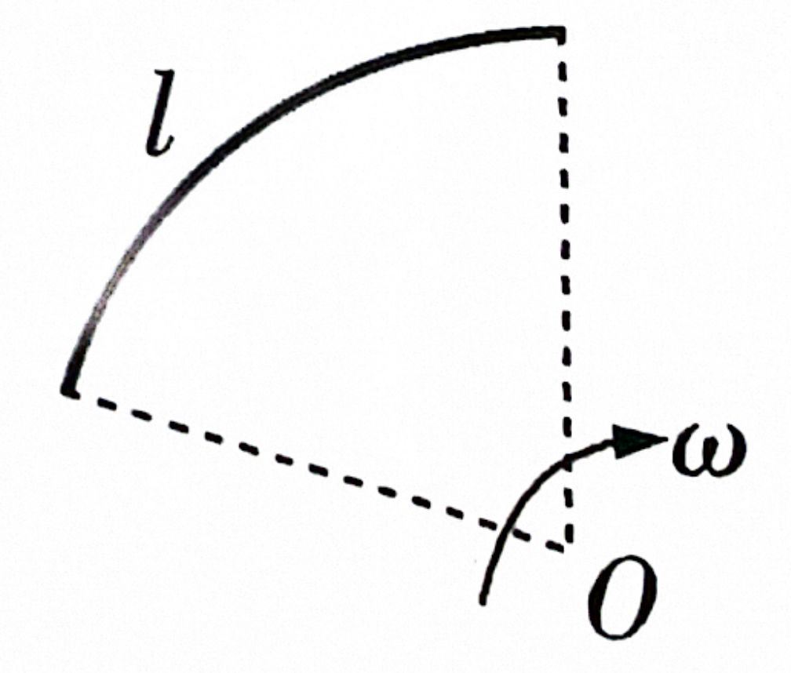
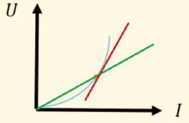

# 电压、电流、电阻

## 电源、电流强度

### 电源的概念

现假设有 $A$，$B$ 两个导体，分别带正、负电荷，它们周围存在电场．在它们之间连接一条导线 $H$．

在连接导线 $H$ 的那一瞬间，在导体 $A$ 形成的电场的作用下，$H$ 距离 $A$ 最近的一部分导线内部有电子移动到导体的表面，在内部建立出了电场；而这样的电场又使得 $H$ 距离 $A$ 相对次近的一部分导线内部有电子移动到表面，建立出电场……于是，电场从导线 $A$ 端出发逐渐向远离 $A$ 的方向建立．$H$ 的 $B$ 侧也同时逐步向远离 $B$ 的方向建立电场，建立的流程向中间汇合，在中间建立完毕．

实际发生的过程远比上面描述的要复杂得多，事实上当我们将导线 $H$ 移近而未接通时，导线内部电荷重新分布的过程就已经开始．读者只需简单了解以下事实：

- 这种电场是由导线内部的部分电荷移向导体表面产生的．大致原理如下图所示．
- 
- 上面是一个原先电量为 $0$ 的导体，现将其左边接上电量为正的导体，右边接上电量为负的导体，则其有部分电荷移到导体表面，且表面的电量分布从左到右递减，如上图所示．表面的这种电量分布使导体内部出现一条平行于导体的向右的电场．
- 整根导线的电场建立结束后的结果为：**电场线从正电荷导体一端与导线平行地通向负电荷导体一端**．
- 同一段导线内的电场可以视作「类匀强电场」，各处场强相同，方向与导线平行．此时我们仍有 $E = \dfrac U d$，$U$ 为 **导线两端的的电势差**，$d$ 为 **导线的长度**．电势差越大，导线越短，电场越强；上面的例子中，导线两端电势差降为 $0$ 时，电场消失，导体和导线整体达成静电平衡．
- 这种电场传递建立的本质是电磁波，建立速度近似 $\pu{3E8 m*s-1}$，即光速．通常情况下，可以认为导线的电场建立是与通电同步，瞬间完成的．
- 当两个导体的电势差发生改变，或者导线的形状、长度发生改变时，电场会随之更新，更新速度和建立速度一致，可以认为瞬间完成．
- 除了超导体和理想导线外，导线内电流的形成必须要依靠导线内部的电场力．

让我们回到最开始的例子．导线建立电场后，导线 $H$ 中的自由电子就会在静电力的作用下沿导线从 $B$ 到 $A$ 作定向运动，我们将 **电子的定向移动** 称作 **电流**．同时，$B$ 上的电子会转移到导线 $H$ 上，导线 $H$ 上的电子又会转移到导体 $A$ 上，这会导致 $B$ 的电势升高，$A$ 的电势降低，从而导线中的电场逐渐减小至消失，电流也逐渐减小至消失，导线 $H$ 中的电流只是瞬间的．

如何让导线 $H$ 中存在持续的电流呢？

倘若在 $A$ 和 $B$ 连接一个装置 $P$，可以在 $B$ 失去电子的过程中，不断地从 $A$ 取走电子补充给 $B$，使 $A$ 和 $B$ 始终带一定数量的正、负电荷，电势差得以始终保持，电流也得以持续．这个装置 $P$ 称作 **电源**，$A$ 和 $B$ 称作电源的两个 **电极**．

事实上，电流可以分为三种：**只由正电荷定向移动形成的**；**只由负电荷定向移动形成的**；**由正电荷和负电荷相向定向移动形成的**（**不可能同向**，因为正电荷只会自发向低电势移动，负电荷只会自发向高电势移动，方向必然相反）．

电流的方向规定为 **正电荷定向移动的方向**（即 **导线内电场的方向**）．这个方向应该恰好为负电荷（电子）定向移动的反方向，即 **电子流方向与电流方向相反**．**沿着电流方向，电势逐渐降低**（超导体或理想导线中电势不变）．

**在金属导体中，电流的形成基本只由负电荷定向移动形成，也即上面的第二种情形**．第一种情形和第三种情形可能出现在电解质溶液上的原电池中．

然而，无论哪种情形，**讨论电路问题时我们经常简化为讨论正电荷沿着电流方向移动**，实际情况可能只是在这个简化的基础上电性改变，方向改变了而已，几乎不会影响我们讨论得到的许多性质（如某个节点的电势 / 电流大小不会因为这个简化而变化）；而好处就在于 **正电荷的移动方向与电流方向相同**，**正电荷从高电势向低电势移动也更符合人的直觉逻辑**．**后面进行这样的简化讨论时不再赘述**．

### 电流强度的概念

上面的电路有一个非常强的性质：尽管电荷始终在运动，但电路稳定后，**任何一个地方在相同时间内流走的电荷总量与另外又来补充的电荷总量始终相等**，电荷的分布是稳定的，从而电场的分布也是稳定的．这种由稳定分布的电荷产生的稳定的电场，叫作 **恒定电场**．

恒定电场中，任何位置的电荷分布和场强不随时间变化，因此它的基本性质与静电场相同，静电场上的一切物理关系在恒定电场中仍然适用．

电流的强弱强度用 **电流强度** 表示，无歧义时简称 **电流**．它的定义是单位时间内通过导体横截面的电荷的总量（即负电荷按正电量贡献计数）．用 $I$ 表示电流，$q$ 表示时间 $t$ 内通过导体横截面的电荷的总量，则有

$$
I = \dfrac q t
$$

国际单位制中，电流的单位是 **安培**，简称 **安**，符号是 $\pu A$．由上述公式可知

$$
\pu{1 C} = \pu{1A * s}
$$

常用电流单位还有毫安（$\pu{mA}$）和微安（$\pu{\mu A}$）．换算关系是：

$$
\begin{aligned}
\pu{1mA} &= \pu{E-3 A} \\
\pu{1\mu A} &= \pu{E-6 A}
\end{aligned}
$$

据此我们还有一些常用的描述电量的单位：$\pu{A * h}$ 和 $\pu{mA * h}$．根据 $\pu{1C} = \pu{1 A * s}$，有如下换算关系：

$$
\begin{aligned}
\pu{1 A * h} &= \pu{3.6E3 C} \\
\pu{1 mA * h} &= \pu{3.6 C}
\end{aligned}
$$

需要注意的是，虽然电流强度经常简称为电流，电流和电流强度还是不一样的．如「电流方向」指的不是「电流强度的方向」，电流强度是标量，没有方向．

选取电流参考方向的意义下，电流强度可以是负值：在电流参考方向与电流实际方向相同的情况下，电流强度为正；电流参考方向与电流实际方向相反的情况下，电流强度为负．在不选定电流参考方向的意义下，电流强度是非负的．

### 恒定电流的概念

在恒定电场的作用下，导体中的自由电荷做定向运动，在运动过程中与导体内不动的粒子不断碰撞，碰撞阻碍了自由电荷的定向运动（这个阻碍作用对应的就是导体的电阻，稍后学习）．

试想，如果没有上面的阻碍作用，电子只受到电场力作用会不断加速，单位时间内通过某一横截面的电荷总量大小会不断增加，体现为电流不断增大．

但有了阻碍作用后，电子加速到一定程度，就会与不动的粒子撞击导致速度骤减，然后又重新加速……于是，大量自由电荷定向运动的平均速率不随时间变化．我们称这样大小、方向都不随时间变化的电流为 **恒定电流**．本页面介绍的全部都是恒定电流．

### 电流的微观解释

通常情况下，金属中的自由电子不断做无规则热运动，它们向任何方向运动的机会都一样．从宏观上看，并没有自由电子的定向移动，因而也没有电流．当导体两端存在电势差，在导体内部建立了电场，导体中的自由电子才会受到静电力的作用．这样，自由电子在导体内除了做无规则热运动外，也会在静电力的作用下定向移动，从而形成电流．

设导体横截面积为 $S$，自由电子数密度为 $n$（单位体积内自由电子数，量纲为长度的负三次幂），自由电子定向移动平均速率为 $v$，则时间 $t$ 内通过横截面的体积为 $Svt$，单位体积电荷总量为 $n e$，于是通过横截面的电荷总量为 $neSvt$．根据 $I = \dfrac Q t$，就可以得到电流与自由电子定向移动平均速率的关系：

$$
I = neSv
$$

导体内自由电子定向移动的平均速率大概在 $\pu{E-5 m*s-1}$（也可采 $\pu{E-4 m*s-1}$） 这个数量级．这个速度很小，一个电子通过一个 $\pu{1m}$ 长的导线需要几个小时．

值得注意的是，电子本身的热运动速率甚至可以达到 $\pu{E5 m*s-1}$ 量级．从微观上来看，电子热运动的效果比定向移动的效果要明显地多；不过从宏观上看，电子整体确实有定向移动的趋势．

三个速度：

- **电场建立速度**：$\approx \mathrm c$，即 $\pu{3E8 m*s-1}$
- 通常情况下，**电子定向移动速度**：$\pu{E-5 m*s-1}$ 量级．
- **电子热运动速率**：$\pu{E5 m*s-1}$ 量级．

:::note 电子运动速度这么低，为什么平常开灯的时候，按下开关的一瞬间灯就亮了呢？

按下开关的一瞬间，导线内部的电场线光速建立好，使导线内部所有电子瞬间开始移动．注意这个过程是导线内所有电子同步开始移动的，虽然导线内开关处的电子移动到导线内灯泡处需要很长时间，但导线内灯泡处已经有电子了，这里的电子瞬间移动，就可以做功使灯泡发光．

:::

## 电源、电流强度题型

### 无电源等效电流题型

**电流既不依赖电路，也不依赖电源，任何电荷定向移动的情形都可以称作电流**．如氢原子电子绕核运动可以等效为环形电流；原电池电解质溶液内离子的定向移动可以等效为电流；令一个摩擦后带上负电的橡胶棒向右运动，也可以等效为一个向左的电流．

:::info 例题 2.1.1

一个 $\ce{H}$ 原子的电子绕核运动可等效为一环形电流．已知电子电量大小 $e$，周期 $T$，绕质子顺时针运动．求电流的方向和电流强度 $I$ 的大小．

:::

这类环形电流模型有点不符合常规的电流：它并不是相当于导线内部处处有电子，而只是一个孤立电子在运动．这会导致一个问题：考虑钦定 $\dfrac T 2$ 这个时间，那么一半的横截面被电子经过，另一半却没有，这真的是恒定电流吗？

与力学不同，电流中电荷的载体电子是一粒一粒的，因此电流通常是在 **统计意义下** 讨论的，并不适用对于极度微小的时间上的讨论．**事实上，对于恒定电流，我们不能保证在两段相等的微小时间内，经过某个节点电荷总量绝对相同**．足够严谨的说法是：在宏观尺度上选取任意两段相等的时间，经过某个节点的电荷总量几乎不变，也即 **「恒定」是一个宏观意义上统计出的结果**．

电子绕核运动速率很快，$T$ 很小．在统计意义上，对宏观尺度的时间计时，那么每个横截面经过电荷总量都近似相等，且与时间成正比，这就说明它是一个恒定电流．

那怎么计算这个恒定电流的大小呢？

在统计意义上每个横截面经过的总电荷总量大小都近似相等，且与时间成正比，那这个比值就是电流大小了！分析一下这个比值，考虑经过宏观时间 $t$ 后，电子应近似做了 $\dfrac t T$ 次圆周运动，那么经过每个横截面的总电荷总量大小为 $\dfrac{t e}T$．除以总时间 $t$ 即可得到电流大小 $\dfrac{e}T$．

或者，可以直接钦定经过时间为 $T$ 的倍数，比如直接钦定为 $T$．那么经过每个横截面的电荷总量就是 $e$，可以直接计算得 $\dfrac{e}T$．这里虽然选用了微小时间，但是它可以保证计算出的结果在统计意义上也正确，因为在统计意义上，一段宏观时间的电子运动就是很多次圆周运动拼起来（一次运动了部分圆周的运动可以忽略），而无论多少次圆周运动拼起来，统计意义上计算出的电流都等于 $\dfrac{e}T$．

因此，对于单电子环形电流问题，取周期 $T$ 计算经过每个横截面的总电荷总量大小即可．

:::tip 例题 2.1.1 解答

电流的方向为电子定向移动方向的反方向，即逆时针方向．

经过时间 $T$ 后，经过任一横截面的电荷总量大小为 $e$．因此，电流大小为 $\dfrac{\mathrm{e}}T$．

:::

:::info 例题 2.1.2

如图所示，一段横截面积为 $S$，长度为 $l$ 的圆弧形橡胶棒，均匀带有负电荷，圆弧的半径为 $R$，橡胶棒单位长度所带电量大小为 $q$，当此棒绕垂直于圆弧平面过圆心的轴顺时针以角速度 $\omega$ 匀速转动时，求由于棒的运动而形成的环形等效电流的方向和电流强度的大小．

:::

考虑圆周运动的周期为 $T = \dfrac{2\pi}{\omega}$，只需要计算在周期 $T$ 内经过横截面的电荷总量，再除以 $T$ 即可．

原题并没有说 $\omega$ 很大（或者 $T$ 很小），不过选取足够长的时间时也确实可以认为经过每个横截面的电荷总量近似相等且与时间成正比，按照出题人的意图行事就好．

:::tip 例题 2.1.2 解答

橡胶棒带负电荷，电流方向与橡胶棒运动方向相反，为逆时针方向．

钦定时间 $T = \dfrac{2\pi}{\omega}$，这段时间内经过一个横截面的电荷总量应该为 $ql$．

因此，电流大小为 $\dfrac{ql}{T} = \dfrac{\omega ql}{2\pi}$．

:::

:::info 例题 2.1.3

在一电解质溶液的两个极板间，时间 $t$ 内，有 $n_1$ 个 $\ce{Na+}$ 从左向右通过，有 $n_2$ 个 $\ce{SO4^{2-}}$ 从右向左通过，求电流的方向和电流强度．

:::

:::tip 例题 2.1.3 解答

电流的方向应为正电荷定向移动方向，即从左向右．

电流的大小为电荷的总量，即负电荷应该按照正电量计入．因此电流强度为 $\dfrac{(n_1 + 2n_2)e}{t}$．

:::

### 电流微观模型题型

:::info 例题 2.2

有一条横截面积 $S$ 的铜导线，通过的电流 $I$．已知铜的密度 $\rho$，摩尔质量 $M$，阿伏伽德罗常数 $N_{\mathrm A}$，电子电量 $e$．假定导线中每个铜原子贡献一个自由电子，求铜导线中自由电子的定向移动速率．

:::

值得一提的是，$N_{\mathrm A}$ 是有单位 $\pu{mol-1}$ 的．

:::tip 例题 2.2 解答

$I = ne S v$ 中，$I$ 和 $e$，$S$ 均已知，$v$ 为待求，因此 $n$ 是中间要求的量．

$\rho$ 为每体积的质量，$M$ 为每摩尔的质量，$N_{\mathrm A}$ 为每摩尔的粒子数．先用 $\rho$ 和 $M$ 拼出每体积的摩尔 $\dfrac{\rho}M$，再乘以每摩尔的粒子数即可得到每体积粒子数 $n = \dfrac{\rho N_{\mathrm A}}{M}$．

因此 $v = \dfrac{I}{\left(\dfrac{\rho N_{\mathrm A}}{M} e S\right)} = \dfrac{IM}{\rho N_{\mathrm A} e S}$．

:::

如果我们代入常见数据 $S = \pu{1 mm2}$，$\rho = \pu{8.9E3 kg * m-3}$，$M = \pu{6.4E-2 kg * mol-1}$，阿伏伽德罗常数 $N_{\mathrm A} = \pu{6.02E23 mol-1}$，$e = \pu{1.6E-19 C}$．则当 $I = \pu{1A}$ 时，可算出 $v \approx \pu{7.5E-5 m*s-1}$，验证了之前所说的电子定向移动速率数量级．

## 电阻

### 电阻的概念

同一个导体，无论电流，电压如何变化，电压与电流之比都是一个常量，其 $U \text{-} I$ 图像为一条过原点的倾斜直线．可以写作

$$
R = \dfrac U I
$$

$R$ 是一个只跟导体本身性质有关而与通过的电流无关的物理量．不同导体的 $U \text{-} I$ 图像的倾斜程度不同，代表不同导体的 $R$ 值不同．

$U$ 相同时，$R$ 的值越大，导体中的电流 $I$ 越小．可以看出它描述了导体对电流的阻碍作用，物理学中称 $R$ 这个量为 **电阻**，单位 **欧姆**，简称 **欧**，符号 $\Omega$．根据定义式，有

$$
\pu{1 \Omega = 1 V * A-1}
$$

$R = \dfrac U I$ 只是电阻定义式，而不是决定式，它的大小与通过的电流和两端的电压都无关系．下面探究电阻的决定因素．

通过上述实验可知：同种材料的导体，其电阻 $R$ 与它的长度 $l$ 成正比，与它的横截面积 $S$ 成反比；导体电阻还与构成它的材料有关．即

$$
R = \rho \dfrac l S
$$

这就是电阻的决定式．

经实验可知同种材料的 $\rho$ 不变，不同种材料的 $\rho$ 一般不同，说明 $\rho$ 表征了材料的某种特性．称 $\rho$ 为这种材料的 **电阻率**．根据 $\rho = \dfrac{RS}l$，其量纲应为 $\pu{\Omega * m}$．

电阻率的大小除了与材料种类有关，还与温度有关：

- 金属的电阻率随温度的升高而增大．
- 绝缘体的电阻率一般随温度升高而减小．
- 合金的电阻率几乎不随温度变化．
- 半导体情况则更为复杂，同一半导体，温度升高电阻可能增大，可能减小，也可能不变．通常来说减小．

温度变化时电阻率变化较为灵敏的导体可用以制作热敏电阻．使用场景：电子体温计．

温度降低时，金属导体电阻率将会减小，一些金属在温度特别低时电阻可以减小到 $0$，称之为 **超导现象**．目前发现的超导体只能在很低温度下保持超导性质．超导体上欧姆定律不成立．

欧姆定律的内容：通过导体的电流与导体两端电压成正比，与导体电阻成反比．

### 微观角度理解电阻

> 在恒定电场的作用下，导体中的自由电荷做定向运动，在运动过程中与导体内不动的粒子不断碰撞，碰撞阻碍了自由电荷的定向运动（这个阻碍作用对应的就是导体的电阻）．
>
> 试想，如果没有上面的阻碍作用，电子只受到电场力作用会不断加速，单位时间内通过某一横截面的电荷总量会不断增加，体现为电流不断增大．

假设现在有一种导体，我们试图用一个物理量 $\rho$ 刻画它对电流的作用，并且这个物理量类似于密度，只和导体的材料和温度有关，与形状无关．

根据 $I = ne Sv$，$e$ 是常量，$S$ 与只与具体形状有关，与导体的材料和温度无关．因此，只需研究 $n$ 和 $v$．

其中 $n$，单位体积内的自由电子数，是一个只与导体的材料和温度有关的因素．而 $v$ 不仅与导体的材料和温度有关，也与导线内部的场强大小有关．

考虑钦定导体内部场强不变，则导体内部电子受到的电场力不变，其定向移动的加速度不变．这时，如果每个电子被撞到的机会很小，那么电子就会有很长的一段时间加速才会被撞到，平均速度大；如果每个电子被撞到的机会很大，电子可能加速很小一段时间就会被撞到，平均速度小．

考虑钦定每个电子被撞到的机会不变．如果内部场强大，导体内电场就强，电子加速度大，在每一段从刚被撞击——加速——再被撞击的一小段过程中，平均速度就越大；反之亦然．

则电子平均定向移动速率 $v$ 是一个与 $E$ 正相关的量．进一步经过试验发现，$v \propto E$，不妨设 $\mu = \dfrac v E$，则 $\mu$ 现在也是一个只与导体的材料和温度有关的量了．

于是 $I = n\mu \cdot e \cdot SE$，其中 $n\mu$ 是一个只与导体的材料和温度有关的量；$e$ 是常量；后面则是与导体的材料和温度无关，而与形状和施加场强有关的量．我们成功地将电流的表达分离成了「只与导体材料温度有关的部分」和「与导体材料温度完全无关的部分」．

不妨设 $\rho = \dfrac{1}{en\mu}$，则 $I = \dfrac{SE}{\rho}$．根据 $E = \dfrac U d$，又有 $I = \dfrac{U}{\rho \dfrac d S}$．于是 $\rho \dfrac d S$ 是一个能完全描述一个具体的导体对电流作用的大小的量，称之为 $R$．

这就是电阻、电流和电压关系的本质．

根据上面的推导我们发现，$\rho$ 不仅刻画了导体内部电子与不动粒子碰撞机会的大小 $\mu$（$\mu$ 越大碰撞机会越小），也蕴含了导体内自由电子的密度 $n$．也即电阻率不仅反应导体材料「阻」的能力，也蕴含了导体材料中「电子密度」这一量．

### 伏安特性曲线和 $U \text{-} I$ 图像

用横坐标表示电压 $U$，纵坐标表示电流 $I$，绘制出的 $I \text{-} U$ 图像称作导体的 **伏安特性曲线**．对于金属导体，温度没有显著变化，电阻几乎不变，伏安特性曲线为一条过原点的倾斜直线．具有这种伏安特性的电学元件称作 **线性元件**．

除金属外，欧姆定律对电解质溶液也适用，但对气态导体和半导体元件并不适用．也就是说，在这些情况下电流与电压不成正比，这类电学元件称作 **非线性元件**．

虽然 **非线性元件** 上欧姆定律不再成立，我们仍然保留 $R = \dfrac U I$ 的定义，即非线性元件上的电阻仍然是电压除以电流．与线性元件不同的地方在于，它的电阻随着经过它的电流而改变．笔者推测，其原因可能是非线性元件的 $n$ 或 $\mu$ 随电流变化而变化．

上面的伏安特性曲线是 $I \text{-} U$ 图像，我们还有 $U \text{-} I$ 图像，两者本质是一种图像．注意 $I \text{-} U$ 图像计算 $R = \dfrac U I$ 的时候不要比反了．

这里有一个常见错误：

红线为图像在橙点上的切线，而绿线为橙点和原点的连线．

橙色点时该导体的电阻经常被误以为是红线的斜率，即 $\dfrac{\mathrm d U}{\mathrm d I}$．然而事实上，该点的电阻应该是 $\dfrac{U}{I}$，即绿线的斜率．

对于线性元件（$U\text{-} I$ 图像为过原点倾斜直线的导体），我们有 $R = \dfrac{\Delta U}{\Delta I}$．即导体两端电压的变化量和通过导体电流的变化量之比也为电阻．显然非线性元件没有此特征，就算 $\Delta I \to 0$ 时，$\dfrac{\Delta U}{\Delta I}$ 和 $R$ 也可能有很大差距．

### 【实验】导体电阻率测量

实验原理：$R = \rho\dfrac l S$，$R = \dfrac U I$．

设 $d$ 为待测电阻丝横截面的直径，我们有 $S = \dfrac{\pi d^2}4$．于是

$$
\rho = \dfrac{RS}l
$$
