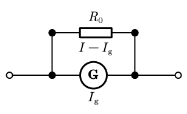
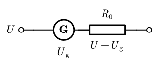

# 电表改装

## 单量程电表基本原理

在初中我们已经学习了电流表和电压表的使用．高中阶段我们将学习这两种表的基本原理．先从单量程开始．

### 表头

**表头** 是可以测量流经它的电流强度，并显示在仪表盘上的电学仪器，用符号 G 表示，电路图中用「圈中加 G」表示．电流强度越大，指针偏转角度越大，示数越大．

表头具有以下特点：

- 表头可以认为是量程很小的电流表——这么说其实有点「爸爸像儿子」式的逻辑，因为后面会学习到：常用量程电流表的本质就是表头．
- 符号上，通常设表头电阻为 $R_{\mathrm g}$，表头量程 $I_{\mathrm g}$，表头两端可施加最大电压为 $U_{\mathrm g}$．这里 $I_{\mathrm g}$ 通常在几毫安左右，$R_{\mathrm g}$ 通常在几十欧到几百欧左右．
- $U_{\mathrm g} = I_{\mathrm g}R_{\mathrm g}$．

:::note 表头可以视作纯电阻电路

虽然表头中存在指针转动的「电动效应」，但是指针转动是电路稳定期干的事情，电路稳定后指针示数应当稳定不动，也就不存在「电动效应」，可以视作纯电阻电路．

利用表头和电阻，我们可以组装出合适量程的电流表和电压表．

### 电流表基本原理

表头的量程通常在几毫安左右，远小于我们需要的 $\pu{0.6A}$ 或 $\pu{3A}$ 的量程，因此不能用作常用量程电流表．

现在假设有一个 **恒流电源**（注意：不同于通常的恒压电源），恒定地输出 $I$ 的电流．若此时 $I \gg I_{\mathrm g}$，如何让流经表头的电流正好为 $I_{\mathrm g}$？

注意到 **并联分流**，因此可以考虑在表头接入恒流电源的基础上，在表头两端 **并联** 一个电阻 $R_0$．

这样一来，$I$ 就会分成两个电流：一个流经表头，电流为 $I_{\mathrm g}$；一个流经 $R_0$，电流为 $I_0 = I - I_{\mathrm g}$．根据并联分流定律可以得出：

$$
R_0 = R_{\mathrm g} \cdot \dfrac{I_{\mathrm g}}{I - I_{\mathrm g}}
$$

$I$ 通常是 $I_{\mathrm g}$ 的几百倍到几千倍，因此 $R_0$ 通常为 $R_{\mathrm g}$ 的几百分之一到几千分之一．$R_{\mathrm g}$ 通常在几十欧到几百欧左右，可以得出 $R_0$ 是很小的．

现在考虑将恒流电源的输出电流调到任意的 $I' \in (0, I]$．此时经过表头的电流 ${I_{\mathrm g}}'$ 有

$$
{I_{\mathrm g}}' = I' \cdot \dfrac{R_0}{R_0 + R_{\mathrm g}}
$$

$I' = I$ 时，上式为

$$
I_{\mathrm g} = I \cdot \dfrac{R_0}{R_0 + R_{\mathrm g}}
$$

对两式作比可得

$$
\dfrac{{I_{\mathrm g}}'}{I_{\mathrm g}} = \dfrac{I'}{I}
$$

因此，**只要表头的指针旋转角与通过电流成正比，那么表头的指针旋转角也与稳流电源的电流成正比**．在表头上均匀标出 $0 \sim I$ 的刻度，我们就制成了一个量程为 $I$ 的电流表，它的内容是 $R_0$ 和表头并联的等效用电器．

设该电流表的电阻是 $R_{\mathrm A}$，有 $R_{\mathrm A} < R_0$，因此 **制成的电流表电阻很小**．

我们将此时的电路整体串联在某个电路的某条待测导线中．因为电阻很小，近似于一根导线串联在导线中，所以电路各处电流和电压的性质基本不变，通过电流表的电流等效稳流电源的供流，因此电流表可以成功测出电流．

不过，有时题目也会考虑 $R_{\mathrm A}$ 对电路中电流的影响，后面我们会看到这样的例子．

### 电压表基本原理

虽然表头是测量电流的，由于 $R_{\mathrm g}$ 是定值，因此表头两端电压与经过表头的电流在数学上成正比，即 ${U_{\mathrm g}}' \propto {I_{\mathrm g}}'$（这里用撇是为了与量程 $I_{\mathrm g}$ 和最大电压 $U_{\mathrm g}$ 区分），因此我们可以根据表头的示数推出表头两端电压的大小．

现在假设有一个 **恒压电源**，恒定地输出 $U$ 的电压．若此时 $U \gg U_{\mathrm g}$，如何让流经表头的电流正好为 $U_{\mathrm g}$？

注意到 **串联分压**，因此可以考虑在表头接入恒压电源的基础上，在表头一侧 **串联** 一个电阻 $R_0$．

这样一来，$U$ 就会分成两部分电压：表头两端电压为 $U_{\mathrm g}$；$R_0$ 两端电压为 $U_0 = U - U_{\mathrm g}$．根据串联分压定律可以得出 $R_0$ 的大小应为

$$
R_0 = R_{\mathrm g} \cdot \dfrac{U - U_{\mathrm g}}{U_{\mathrm g}}
$$

$U$ 通常是 $U_{\mathrm g}$ 的十倍左右，因此 $R_0$ 通常为 $R_{\mathrm g}$ 的十倍左右，可以看出 $R_0$ 较大．

现在考虑将恒压电源的输出电压调到任意的 $U' \in (0, U]$．此时表头两端电压 ${U_{\mathrm g}}'$ 有

$$
{U_{\mathrm g}}' = U' \cdot \dfrac{R_{\mathrm g}}{R_0 + R_{\mathrm g}}
$$

$U' = U$ 时，上式为

$$
U_{\mathrm g} = U \cdot \dfrac{R_{\mathrm g}}{R_0 + R_{\mathrm g}}
$$

对两式作比可得

$$
\dfrac{{U_{\mathrm g}}'}{U_{\mathrm g}} = \dfrac{U'}{U}
$$

因此，**只要表头的指针旋转角与两端电压成正比，那么表头的指针旋转角也与稳压电源的输出电压成正比**．在表头上均匀标出 $0 \sim U$ 的刻度，我们就制成了一个量程为 $U$ 的电压表，它的内容是 $R_0$ 和表头串联的等效用电器．

设该电流表的电阻是 $R_{\mathrm V}$，有 $R_{\mathrm V} > R_0$，因此 **制成的电压表电阻较大**．

我们将此时的电路的两端接在电路任意两点．因为电阻较大，近似于一根中间断开的导线连接了电路的两个点，所以电路各处电流和电压的性质基本不变，电压表两端电压等效于稳压电源供压，于是可以用电压表测量电路中任意两节点的电势差（不一定像初中一样一定非要并联在一个用电器两边）．

有时题目也会考虑 $R_{\mathrm V}$ 对电路中电流的影响，后面我们会看到这样的例子．
