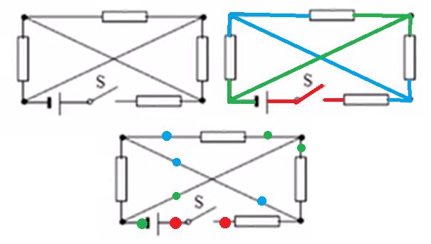
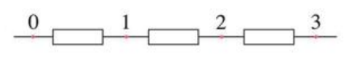
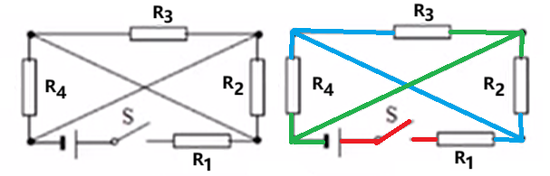
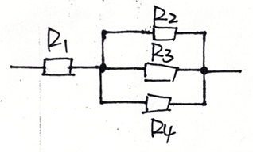
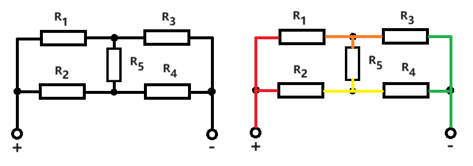
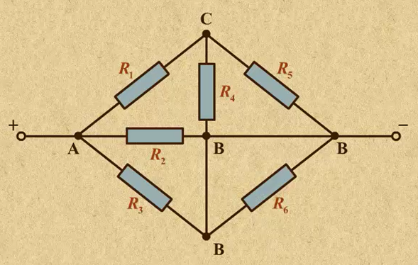
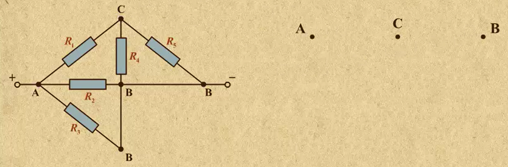
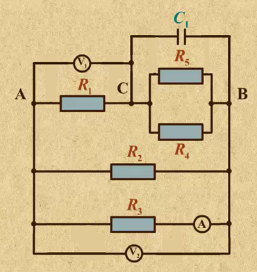

# 部分电路分析基础

## 基尔霍夫定律

### 基尔霍夫电流定律

> **电路稳定后，任何一点在相同时间内流走的电荷总量与另外又来补充的电荷总量始终相等**．即，流入的电流等于流出的电流．

电路的这种非常强的性质称作 **基尔霍夫电流定律**．当电路某一点的电荷总量入不敷出或者入大于出时，根据电荷守恒，整个电路系统不可能稳定，导线内部的电场线总会调整，使得入等于出．

这条定律也被简称为 KCL（Kirchhoff's Current Law）．

### 基尔霍夫电压定律

**电路稳定后，任意时刻，从电路中某一点出发，沿电路任一回路回到该点，各段电压代数和为 $\boldsymbol 0$**．

这一定律称作 **基尔霍夫电压定律**．我们知道沿一个回路运动电势差为 $0$ 是保守场的性质，所以该定律实际是在说 **恒定电流形成的电场和静电场具有相似的性质——它们同为保守场**．

这条定律也被简称为 KVL（Kirchhoff's Voltage Law）.

**基尔霍夫定律** 是基尔霍夫电流定律和基尔霍夫电压定律的总和．

基尔霍夫定律的意义在于其给出了 **电路处于稳定状态的充要条件**，使我们可以避免研究电路电场建立，电路稳定这一难以研究的过程．高中只会研究电路处于稳定状态的情形，因此 **基尔霍夫定律** 会成为高中阶段的一个 **不加证明，不言自明** 的定律，高中阶段学习到的基本上一切关于稳定电路的电学关系，追其根本都来自于基尔霍夫的定律，因为 **基尔霍夫定律是最基本的可以完整刻画电路处于稳定状态时的所有性质的定律**．

## 串并联基本性质

基尔霍夫定律与欧姆定律配合基本可以解决所有可解的电学分析问题．然而，这背后的计算量往往是较为巨大的，在考场上使用基尔霍夫定律的成本很高．

因此，本文会基于基尔霍夫定律给出 **串并联电流电压定律**，该定律是比基尔霍夫定律适用范围更小，更弱化的版本，但形式简单，是高中做电路分析的重要基础．

### 理想导线的基本性质

理想导线的定义是 **电阻为 $\boldsymbol 0$ 的导线**．电路图中的导线默认为理想导线．

为方便，本文定义两个概念——「**导线条**」、「**导线段**」：

- 电路中导线上两点属于同一个「**导线条**」，当且仅当这两点可以在不经过 **节点** 的情况下连通．
- 电路中导线上两点属于同一个「**导线段**」，当且仅当这两点可以在不经过 **用电器** 的情况下连通．

**节点** 的定义是 **三条及以上导线相交的点**．**节点在电路图中必须加粗表示**．

下面是一个示例：

- 左图为原电路图．
- 中图为对同一个「**导线条**」染成一种颜色后的电路图．该电路图共有 $6$ 个「**导线条**」．
- 右图为对同一个「**导线段**」染成一种颜色后的电路图．该电路图共有 $3$ 个「**导线段**」．

我们有结论：

- 同一个「**导线条**」内 **电流强度** 处处相等，且 **电流方向顺着「导线条」的同一方向**．
- 同一个「**导线段**」内 **电势** 处处相等．

我们分开来证明．

对于同一个「**导线条**」，因为「导线条」不经过节点，意味着「导线条」一定是「**一字形**」的；如果「导线条」内部电流不处处相等，势必会存在一点，其流入电荷与流出电荷无法平衡，**违背了基尔霍夫电流定律**．因此，同一个「导线条」内电流处处相等．电流方向必须顺着「导线条」的同一方向也是基于基尔霍夫电流定律．

对于同一个「**导线段**」，因为「导线段」不经过任何用电器，即 **内部处处无电阻**．这也就意味着，内部的电荷移动不需要静电力维持即可保持匀速的运动，从而保证恒定的电流（至于电子是怎么从原先的静止加速到一定速度，则是电路稳定期做的事情，与我们现在的讨论无关）．这也就意味着同一个「导线段」内 **处处无电场**，即 **处处等电势**．

「导线条」和「导线段」并没有必然联系．两个点可以同时在同一「导线条」和同一「导线段」中；也可以在同一「导线条」而在不同「导线段」中；也可以在同一「导线段」而在不同「导线条」中；也可以在不同「导线条」和不同「导线段」中．这四种情况都可以在上面的例子中找到．

值得一提，在同一「导线条」且在同一「导线段」的两点满足电流相等，电势也相等．

### 用电器两端电势基本性质

- 当用电器 **有电流经过** 时，用电器两端存在电流方向的压降，即电流从用电器 $a$ 端流向 $b$ 端时，$\varphi_a > \varphi_b$．
- 当用电器 **无电流经过** 时，用电器两端电势相等．

### 串联基本性质

串联的定义是：**若干用电器仅用一根「导线条」连接**．示例：

根据「导线条」的性质，**串联电路中电流强度处处相等**．同时，**串联电路中每一点的电流方向一定顺着导线的相同方向**．

记 $\varphi_0$，$\varphi_1$，$\varphi_2$，$\varphi_3$ 为 $0$，$1$，$2$，$3$ 各点的电势．如果我们钦定 $\varphi_0 > \varphi_3$，可知电路中的电流一定均向右．因此可推得 $\varphi_0 > \varphi_1 > \varphi_2 > \varphi_3$．

也即，**串联电路两端电势大小关系已知，则可得电路中每个点的电流方向和每个用电器两端的电势大小关系**．

同时，再设 $U_{01}$，$U_{12}$，$U_{23}$，$U_{03}$ 分别表示 $0$ 与 $1$、$1$ 与 $2$、$2$ 与 $3$、$0$ 与 $3$ 之间的电势差（电压），则：

$$
\begin{aligned}
U_{01} = \varphi_0 - \varphi_1 \\
U_{12} = \varphi_1 - \varphi_2 \\
U_{23} = \varphi_2 - \varphi_3 \\
U_{03} = \varphi_0 - \varphi_3
\end{aligned}
$$

于是

$$
U_{03} = U_{01} + U_{12} + U_{23}
$$

因此，**串联电路两端的总电压等于各部分电路两端电压之和**．

上面的结论配合欧姆定律可以得到：

- **串联电路中，用电器两端电压之比等于用电器电阻之比**．$U_1 : U_2 : \ldots : U_n : U = R_1 : R_2 : \ldots : R_n : (R_1 + R_2 + \ldots + R_n)$．
- **串联电路的总等效电阻为各电阻之和**． $R = R_1 + R_2 + \ldots + R_n$．

这两条结论初中已经给出了推导，且难度不高，在此省略证明．

值得注意的是，上面两个结论的推导用到了欧姆定律，因此 **两个结论只适用于纯电阻电路**．

### 并联基本性质

并联的定义是：**两个「导线段」分别连接若干个用电器的两端**，且 **每个用电器两端连接不同的「导线段」**．

下图中三个用电器就是并联的：

同一「导线段」电势处处相等，因此每个用电器两端的电势差相等，均为两个「导线段」的电势之差．因此，**并联电路的总电压与各支路电压相同**．

同时，根据基尔霍夫电流定律，同一点一定有流入的电流等于流出的电流．因此，**并联电路的总电流等于各支路电流之和**．

上面的结论配合欧姆定律可以得到：

- **并联电路中，通过用电器电流之比等于电阻的反比**．$I_1 : I_2 : \ldots : I_n = \dfrac{1}{R_1} : \dfrac{1}{R_2} : \ldots : \dfrac{1}{R_n}$．
	- 需要注意的是，$\boldsymbol{\dfrac{1}{R_1} : \dfrac{1}{R_2} : \ldots : \dfrac{1}{R_n} \ne R_n : R_{n - 1} : \ldots : R_1}$．两边只在 $n = 2$ 时相等，$n > 2$ 时不一定相等，如 $1 : 2 : 3 = 6 : 3 : 2$ 而不是 $3 : 2 : 1$．
- **并联电路的总等效电阻的倒数为各电阻倒数之和**． $\dfrac 1 R = \dfrac{1}{R_1} + \dfrac{1}{R_2} + \ldots + \dfrac{1}{R_n}$．
	- $n = 2$ 时，等效电阻的结论等价于 $R = \dfrac{R_1R_2}{R_1 + R_2}$．可以记忆为「鸡（积）在河（和）上飞」．
	- $n = 3$ 时结论等价于 $R = \dfrac{R_1R_2R_3}{R_1R_2 + R_1R_3 + R_2R_3}$．
	- 对于所有 $n$，等效电阻的公式：**分子为所有电阻之积**；而 **分母为缺某项电阻的剩余所有电阻之积的轮换和**．
- $n = 2$ 时，设总电流为 $I$，则 $\dfrac{I_1}{I} = \dfrac{R_2}{R_1 + R_2}$；$\dfrac{I_2}{I} = \dfrac{R_1}{R_1 + R_2}$．即 $n = 2$ 时，**支路电流与总电流之比等于另一支路电阻与电阻之和之比**．

值得注意的是，上面三个结论的推导用到了欧姆定律，因此 **三个结论只适用于纯电阻电路**．

## 部分电路分析

**部分电路**：**不构成环路**，且 **不含电源** 的一个电路．这样的电路上有接线柱，电压手动加在某两个接线柱之间，这一部分电路形成电流．与此对应的是 **完全电路**，完全电路 **构成环路** 且 **含电源**．

其实两种电路的分析并没有什么区别，而且部分电路的分析通常是比完全电路简单的，因为它避免了对电源内阻的分析．初中给定的一般都是完全电路，高中则要开始适应部分电路了．

### 混联电路处理方式

混联电路是串联和并联结合的电路——串联电路的等效电阻可能作为另一个并联电路的一部分；并联电路的等效电阻可能作为串联电路的一部分．

处理方式就是将最小单元的串联电路和并联电路等效为一个电阻，再将这个电阻放在另一个串并联系统中继续等效……下面是一个例子：

上电路图中，最小的串并联单位是 $R_2$ 与 $R_3$ 的串联．我们将它等效为一个电阻 $R'$ 后，最小的串并联单位变成 $R_1$ 与 $R'$ 的并联；将它再次等效为电阻 $R''$ 后，整个电路就变成了 $R''$ 和 $R_0$ 的串联．

如果 $R_0 = \pu{3 \Omega}$，$R_1 = \pu{3 \Omega}$，$R_2 = \pu{1 \Omega}$，$R_3 = \pu{5 \Omega}$，整个电路加压 $U = \pu{15V}$，$R_3$ 两端电压是多少？

我们先对出现的所有等效电阻求值．$R' = R_2 + R_3 = \pu{6 \Omega}$，$R'' = \dfrac{R_1R'}{R_1 + R'} = \pu{2 \Omega}$．

然后再用串并联电路的规律分析 $R_3$ 的分压．$R''$ 的分压

$$
U_{R''} = U \cdot \dfrac{R''}{R'' + R_0} = \pu{6V}
$$

$R'$ 两端的电压与 $R''$ 相同，$U_{R'} = U_{R''} = \pu{6V}$．

于是 $R_3$ 的分压

$$
U_{R_3} = U_{R'} \cdot \dfrac{R_3}{R_2 + R_3} = \pu{5V}
$$

这就是答案．

因此，混联电路的基本处理策略就是一步一步将最小的串并联单元等效，计算电流或电压时，根据串并联定律计算分流或分压，只不过这里代入的电阻可能是等效电阻．

### 电路的其它连接方式

电路并不是只有串联，并联和混联．考虑下面这个电路图：

这个电路图中，**任意两个电阻之间都不是串联或者并联关系**．比如：

- $R_1$ 和 $R_3$ 不是串联，因为 $R_1$ 与 $R_3$ 之间经过节点，不在同一个「导线条」．
- $R_1$ 和 $R_2$ 不是并联，因为两电阻虽然左端属于同一个「导线段」，但右端经过用电器，不属于同一个「导线段」．

因此，**这个电路图无法套用串并联的规则来分析，只能用欧姆定律和基尔霍夫定律来分析**．高中阶段如果出现这样无法套用串并联规则分析的题目，一定会将信息设计成利用基尔霍夫定律解决时足够简单，可以直接顺推，而不用像通常用基尔霍夫定律解决电路题那样必须列很多方程才能求解，否则就是超纲了．

比如，该电路图中流经 $R_5$ 的电流走向不能确定，知道五个电阻的电阻值后方可确定，但需要用到基尔霍夫定律并解方程，高中阶段不会出．

不过，读者是不是有一种「感觉」——上面 $R_1$，$R_2$，$R_3$，$R_4$ 上的电流走向均为从左到右？这种感觉是正确的，不过需要一个结论：

对于单一电源的电路，**正极** 连接的这一「**导线段**」树状地连接了电源的正极和若干个用电器．在这个「导线段」中：

- 正电荷 **唯一的入口** 在该「导线段」与 **电源正极** 的连接处．
- 该「导线段」和 **其它用电器** 的连接处均为正电荷的 **出口**．
- 该「导线段」在电路全部「导线段」中，电势取到 **最大值**．

对于 **负极**，我们有对称的结论：

- 正电荷 **唯一的出口** 在该「导线段」与 **电源负极** 的连接处．
- 该「导线段」和 **其它用电器** 的连接处均为正电荷的 **入口**．
- 该「导线段」在电路全部「导线段」中，电势取到 **最小值**．

将这个电路图进行分段染色，则我们一定有 $\varphi_1$ 为四个电势中的最大；$\varphi_4$ 为四个电势中的最小．$R_1$，$R_2$，$R_3$，$R_4$ 处的电流走向均是从左到右，正是来源于此．而我们无法确定 $\varphi_2$ 和 $\varphi_3$ 的大小关系，因而无法确定 $R_5$ 处电流的走向．

### 用电器被短路

下面是一个用电器被短路的例子：

上面的电路图中总共有三个「导线段」．设红线电势 $\varphi_1$，绿线电势 $\varphi_2$，黄线电势 $\varphi_3$．

观察到这里 $R_2$ 与 $R_3$ 两端是同一个「导线段」，电势相等，而 $R_2$ 和 $R_3$ 是 **串联** 在一起的，因此如果 $R_2$ 与 $R_3$ 有电流通过，方向一定相同，无论从左向右还是从右向左，根据[串联基本性质](#串联基本性质)，都有 $\varphi_2 < \varphi_3 < \varphi_2$，而这显然是矛盾的．因此，$R_2$ 与 $R_3$ 一定没有电流流过．

注意到这里没有电流不意味着 $\varphi_3 = 0$ 而是 $\varphi_3 = \varphi_2$，因为这里没有电流意味着被导线并联的整个部分为等势体．

当然，这里 $R_2$ 和 $R_3$ 就算不串联，而是并联在一起，同样还是被短路的——此时两个用电器都满足两端电势相等，因此都不可能有电流流过．更一般地，**对于电路中的某部分，如果与这一部分连接的所有导线均等电势**，那么 **这部分电路会全部被导线短路**，成为一个 **电势处处与并联它的导线相等的等势体**，**电流处处为零**．如果你愿意，上面中间的黄线也可以画成绿线，因为它们的电势相同．

注意这里的要求：与这一部分连接的 **所有** 导线等电势后才能被认为是短路；单纯的两条导线等电势并不是短路的有效推理．下面是一个例子：

$R_2$ 与 $R_3$ 这一部分电路中存在三个连接：一条红色导线两条绿色导线（这两条绿色导线为一段）．绿色导线电势相等，然而与红色导线电势不等，因此 $R_2$ 与 $R_3$ 并没有被短路．这里电流从红色导线流入，分流从两条绿色导线流出．

### 用电器不参与回路

还有一种情形是 **用电器不参与回路**．

如图所示的电路中，假设 $a$，$b$ 分别接入电源的正负极，则电流只会依次流过 $R_1$，$R_5$ 和 $R_2$，不会流过 $R_3$ 和 $R_4$，因为这两个电阻不参与回路，电流流过去无法流回．

对于没有电流流过的用电器，其两端电势相等．因此，此时 $c$ 与 $d$ 的电势差 $U_{cd}$ 为 $R_5$ 的压降．

### 电表与电容器的处理

**电流表**：

- 电阻 **非常小**，应近似为 **导线**（**理想电流表** 电阻为 $0$，等价于导线）．
- 电流表 **串联** 在电路中，测量其接入的「**导线条**」的电流．
- 电流表可以在其所在的同一个「**导线条**」内 **自由移动**，而不改变其测量的电流本质．

**电压表**：

- 电阻 **非常大**，应近似为 **断路**（**理想电压表** 电阻为 $+\infty$，等价于断路）．
- 高中提升了对电路的认识后，电压表已经可以不并联在某个用电器或某些用电器的两端；电压表的两端可以接在电路中的 **任意两点**，而电压表的示数就是这两点所在的「**导线段**」的 **电势差**．
- 电压表接在电路的两个点中，每个点都可以在该点所在的「**导线段**」中 **自由移动**，而不改变电压表测量的电压本质．

**平行板电容器**：

- 应视作和 **理想电压表** 类似的结构，等价于 **断路**（不考虑空气的导电性）．
- **电路稳定后，电容器携带的电量也稳定不变**，电容器的电量 $Q$ 与电容器接在电路中的两点电压 $U$ 满足关系

$$
C = \dfrac Q U
$$

- 平行板电容器连接在电路中的两个点也可以分别在各自所在的「**导线段**」内自由移动，而不改变电容器的电压和电量．

关于电容器的更多信息，可以在静电场页面找到（TODO: 加上链接）．

### 复杂形态混联电路简化

对于复杂形态混联电路，比较常用的方法是 **节点电势排列法**．下面给出一个例子，依此讲解该方法的步骤．

第零步：初始电路图．

**第一步**：将电表、电容器与串联的电阻直接等效（为控制难度，高中阶段复杂电路图一般不会配合非理想的电表）．

**第二步**：分析电路图中所有 **节点** 的电势，将 **等电势** 的节点（同一个「导线段」中的节点）用 **同一个字母** 标出；**不同电势** 的节点（分属不同导线的节点）用 **不同字母** 标出．

对电路图中节点标上电势后，我们也能非常直观地看出某一部分导线处于什么电势．

**第三步**：删去短路用电器．

这里与 $R_6$ 连接的所有导线等电势，被短路，可以删去．

**第四步 - 第一操作**：排列电势大小．

排列电势大小的几个依据：

- 正极电势为全局最大值．
- 负极电势为全局最小值．
- 设串联电路 $A - B - C - D$，若 $\varphi_A < \varphi_D$，则 $\varphi_A < \varphi_B < \varphi_C < \varphi_D$．

如果三个依据没有准确排列出电势大小，说明电路非混联，高中几乎不会考查非混联复杂电路的简化，因此不必担心．

在这个例子中，正极电势 $\varphi_A$ 为全局最大值，负极电势 $\varphi_B$ 为全局最小值，因此有

$$
\varphi_A > \varphi_C > \varphi_B
$$

**第四步 - 第二操作**：在纸上从左到右，按照电势 **从高到低** 的顺序排列字母，作为绘制原电路图的简化电路图的基础．

这里就是在纸上将 $A$，$C$，$B$ 依次写出．

**第五步**：将每个电阻安插在简化电路图中．一个电阻原先两端的电势字母是什么，在新电路图中就将对应的两个字母用一段新导线连接，导线上串联该电阻．

如 $R_1$ 两端为 $A$ 和 $C$，在新图中将 $A$ 和 $C$ 连接，中间安插 $R_1$．对每个电阻进行类似操作．

**第六步**：将电表重新加入．

**电压表与电容器** 可以直接按照电阻的方式，按照其两边的字母，在等效电路图中加一根新导线连接这两个字母，并将对应电压表或电容器安插在这根新导线中．如果某个电压表或电容器两边字母相同，说明被短路，忽略即可．

**电流表** 在安插时需要注意「**导线条**」的对应关系，需先找到该电流表所在的「导线条」在等效电路图中的对应「导线条」，再将电流表安在这个「导线条」中．

:::note 如果对应「导线条」被等效删去了怎么办？

注意到刚刚在等效的时候是按照「**导线段**」等效的，这里可能会将原电流表对应的「**导线条**」删去了．出现这种情况，需要通过等效变换把这个「**导线条**」变回来．

比如从正极出发的一根导线 $P$ 分支为三个「**导线条**」$A$，$B$，$C$，每个「导线条」上均有电阻；然后 $A$ 和 $B$ 并联为「导线条」 $D$，导线 $D$ 上有一个电流表 $\mathrm A$；$D$ 和 $C$ 并联为「导线条」$E$，$E$ 连到负极中．

整个电路可以等效为三个电阻直接并联在 $+$ 和 $-$ 两个点中，等效电路图只剩下 $A$，$B$，$C$ 三个「导线条」，$D$，$E$，$P$ 全部被等效至消失，于是在 $D$ 上的电流表 $\mathrm A$ 在新电路图中找不到对应了．

其实这也不难，我们可以新建一个辅助点 $D$，将：

- $A$，$B$ 接在 $+$ 和 $D$ 中．
- 导线 $D$ 接在 $D$ 和 $-$ 中．
- 导线 $C$ 仍然直接接在 $+$ 和 $-$ 中．

这里新建出的辅助点 $\varphi_D = \varphi_-$，目的仅仅是为了表示出「导线条」 $D$，从而让电流表 $\mathrm A$ 在新电路图中找到对应．

:::

先前的例子的最终等效结果如下：

为了美观，$R_4$ 和 $R_5$ 两侧稍微做了一些等效变换．
