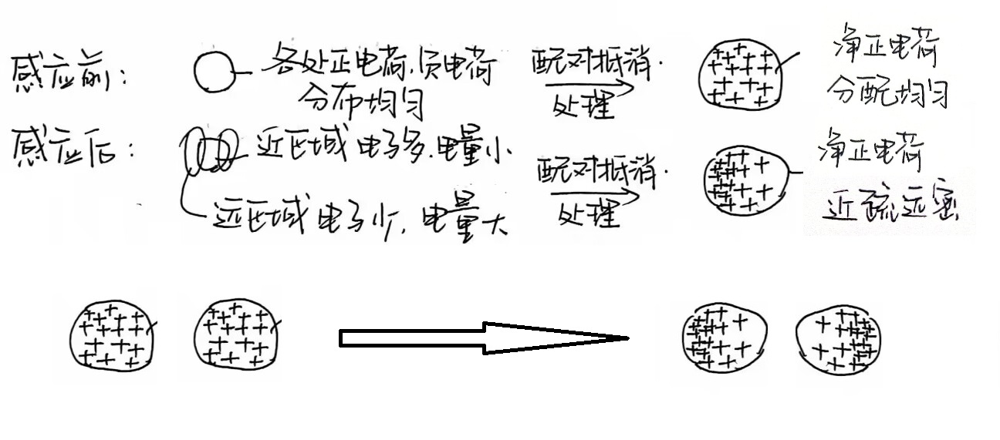

# 电荷

## 概念引入

### 电荷与电量的概念

**电荷** 是一种假想的物质，分为 **正电荷** 和 **负电荷** 两种．高中阶段可以认为正电荷仅存在于质子的内部，负电荷仅存在于电子的内部（不考虑反物质与夸克）．质子与电子这种携带电荷的粒子称作 **载流子**，电荷作为一种假想物质，无法脱离载流子单独存在．

或许读者会把「一个电荷」想象成「一个粒子」，认为一个电子中含有「一个负电荷」．不过，物理学家没有把电荷想象成粒子，而是把它假想成一种抽象的物质，所以它不应该用「一个」这种量词量化；就像宏观来看水并不以粒子形式存在，所以我们不应该用「一个水」这种表达．

物理学家专门用一个物理量量化电荷，这个物理量称作 **电荷量**，简称 **电量**，无歧义时有时也简称电荷，用 $Q$ 或 $q$ 表示．它的单位是 **库仑**，简称库，符号是 $\pu{C}$．库伦并不是七个基本单位之一，它可以由电流这个基本单位导出，在后面引入电流时我们会看到这一点．

正电荷的电量为正值，负电荷的电量为负值，一个物体的电量就是其内部所有载流子——质子和电子的电量的代数和．我们称一个物体的 **电性** 就是它电量的正负性：电量为正时，物体带正电；电量为负时，物体带负电；电量为 $0$ 时，物体不带电，或者说不显电性．

注意到物体不带电不等价于物体中没有正电荷和负电荷，只是说正电荷的电量和负电荷的电量正好可以抵消为 $0$．

一个质子和一个电子所带的电量的绝对值相同，人们将这个值叫作 **元电荷**，用 $e$ 来表示．$\pu{1 C}$ 的定义是元电荷 $e$ 的 $\dfrac{1}{\pu{1.602176634E-19}}$ 倍，即 $e$ 的值为

$$
e = \pu{1.602176634E-19C}
$$

至于为什么是这样一个复杂的数字，有关历史上对这安培和库伦这两个单位的定义，这里不展开．

在化学中我们之前说一个 $\ce{H+}$ 带一个单位正电荷，那么现在我们就知道了「一个单位正电荷」具体是多少了，它恰好是 $e = \pu{1.6E-19C}$．我们也终于知道了化学中的双线桥上，$+2e$，$-4e$ 这种表达是什么意思了．

库仑是一个比较大的单位．一把梳子和衣袖摩擦后所带电量不到百万分之一库仑；天空中发生闪电之前，巨大的云层中积累的电量可达几百库仑．

:::caution 电量的表达

在题目中，有时会将 **电量的绝对值** 表达为「电量」．

例如，题目想表达「一个物体含有 $\pu{-2.0E-6C}$ 的电量」，可能会说「这个物体带负电，且电量为 $\pu{2.0E-6C}$」．题目中的「电量」表达的是实际的电量还是电量的绝对值，需要视具体情况而定，比如「$q_1 < q_2$」这种表达很可能实际指的是 $|q_1| < |q_2|$．

鉴于有把电量表达为电量的绝对值的情况存在，阐释负电量时直接说「电量为 $\pu{-2.0E-6C}$」不会产生歧义，而阐释正电量时直接说「电量为 $\pu{2.0E-6C}$」可能存在歧义．因此我们经常在阐述正电量时在值的前面加一个正号，代表电性为正，如「小球的电量为 $q = \pu{+2.0E-6C}$」．

题目有时还会说「小球 $A$ 的电量为 $+q$，小球 $B$ 的电量为 $-2q$」这种表达，**我们默认 $\boldsymbol q$ 是一个 $\boldsymbol{> 0}$ 的电量参数**．即我们默认球 $A$ 带正电，球 $B$ 带负电．

:::

微观粒子的电量和质量之比，称作这种微观粒子的 **比荷**．电子的比荷为 $\pu{1.76E11 C * kg-1}$．

### 电荷的基本性质

#### 正电荷与负电荷

电荷有两种类型——正电荷与负电荷，它们的作用相互抵消：如果某一处同时存在 $+q$ 和 $-q$，则在力学效果上考虑，这一处与没有电荷存在完全一致．

#### 电荷守恒定律

**电荷既不会产生，也不会消灭，只能从一个物体转移到另一个物体，或从物体的一部分转移到另一部分，转移过程中，电荷的总量保持不变**．这个结论叫做 **全电荷守恒定律**．

:::note[「电荷的总量」的含义]

**电荷的总量** 与 **电量（电荷量）** 是两个不同的概念．

电荷的总量计算时会忽略负电荷所带符号，即电荷的总量表示的是【所有正电荷的电量和】与【所有负电荷的电量和的相反数】的和．比如，我们认为一个 $\ce{Li+}$ 的电量为 $3e - 2e = e$，电荷的总量为 $3e + 2e = 5e$．

:::

近代物理实验发现，带电粒子也可以产生或湮没．如一个高能光子在一定条件下可以产生一个正电子（反物质中的内容）和负电子；一对正、负电子可以同时湮没，转化为光子．因此全电荷守恒定律有更普遍的表述：**一个与外界没有电荷交换的系统，电荷的代数和保持不变**（即电量保持不变）．

全电荷守恒定律的第一种表述已经适用于经典物理，在经典物理中是应当被肯定的．

全电荷守恒定律没有否定一个电荷在哈尔滨消失，同时在北京出现的情形（即认为这个电荷「瞬移」了），然而我们知道这也不会发生．一个电荷的运动必须沿着某条连续的路径，这条结论称之为 **局域电荷守恒定律**．局域电荷守恒定律可以认为是电荷守恒定律的加强版．

在高中阶段，**电荷守恒定律** 指的是全电荷守恒定律．

#### 电量量子化

考虑到电荷必须依赖载流子存在，而高中阶段的一个载流子的电量绝对值为 $e$，因此任何物体的电量都是 $e$ 的整数倍，**电量不是一个可以连续变化的量**．甚至因为 $\pu{1C}$ 不是 $e$ 的整数倍，因此没有物体的电量是 $\pu{1C}$．

这种量子化并不会影响电动力学中的任何结论．

## 库仑定律

### 电动力学基本问题

当两个实际带电体之间的距离比它们自身的大小大得多，以致于带电体的形状、大小和电量分布状况对它们之间的作用力的影响可以忽略时，这样的带电体可以看作带电的点，称作 **点电荷**．点电荷所带电量与其所代表的物体电量相同．

在电磁理论中，我们希望解决的基本问题是：给定一些点电荷 $q_1$，$q_2$，$q_3$，……（称它们为 **场源电荷**），它们施加给另外一个电荷 $Q$（称为 **试探电荷**）的力是什么？场源电荷的位置（作为时间的函数）给定，而试探电荷的轨迹待求．

**电磁场的叠加原理** 给出，**任意两个电荷之间的相互作用不受其它电荷存在的影响**．这样以来，计算作用在 $Q$ 上的力 $\vec F$，可以计算每个场源电荷 $q_i$ 对 $Q$ 的作用力 $\overrightarrow{F_i}$，然后将所有的作用力合成为 $\vec F = \sum \overrightarrow{F_i}$．于是，问题规约为：求解 **单个场源电荷** $q$ 作用在 **试探电荷** $Q$ 上的力．

尽管这个问题看起来简单明了，作为电磁学的开始，我们还是首先考虑一种特殊情况——**静电学**．在这种情况下，**所有的场源电荷都相对于观测者静止**，此时试探电荷的这种受力称作 **静电力**．

### 库仑定律的内容

设一个 **静止** 场源电荷 $q$ 距试探电荷 $Q$ 的距离为 $r$，则 $q$ 作用在 $Q$ 上的静电力 $F$ 由 **库仑定律** 给出：

$$
\vec F = k\dfrac{qQ}{r^2} \cdot \hat{\vec r}
$$

这里 $\hat{\vec r}$ 为从点 $q$ 指向点 $Q$ 的 **单位方向向量**．

库仑定律的文字表述是：一个 **静止** 点电荷 $q$ 对另一个电荷 $Q$ 的静电力 $F$，与它们 **电量的乘积** 成 **正比**，与它们 **距离的二次方** 成 **反比**，作用力的方向在它们的连线上，且当 $Q$ 与 $q$ **电性相同**（$qQ > 0$）时，$F$ 的方向表现为被 $q$ **排斥**；$Q$ 与 $q$ **电性相反**（$qQ < 0$）时，$F$ 的方向表现为被 $q$ **吸引**．

库伦定律的其它版本：

$$
F = k\dfrac{|q| \cdot |Q|}{r^2}
$$

上面这个式子中的 $F$ 代表 $\left|\vec F\right|$．

$$
F = k\dfrac{qQ}{r^2}
$$

上面这个式子中的 $F$ 可正可负，$F$ 的绝对值代表静电力的大小，$F$ 的正负代表 $Q$ 所受力的方向为被 $Q$ 排斥还是吸引．

库仑定律中的 $k$ 称作 **静电力常量**，其大小与电荷之间的介质有关．在真空中，

$$
k = \pu{9.0E9 N * m2 * C-2}
$$

就像牛顿三大定律已经构成了牛顿力学的物理基础，功与能只是在其之上发展的工具；**库仑定律** 和 **电磁场叠加原理** 也已经构成了 **静电学** 的全部物理基础，余下的内容则均已经是阐明基本规律的数学方法．

库仑定律的适用条件共有两条：**场源电荷静止**、**场源带电体与试探带电体均为点电荷**．下面我们分别谈谈两点．

### 库仑定律的适用范围

#### 库仑定律要求场源电荷静止

库仑定律不适用于 **场源电荷相对于运动** 的情形，但适用于 **场源电荷静止、试探电荷运动 / 静止** 的情形．这里的运动与静止，指的都是相对于 **观测者** 静止．

在两个点电荷 $q_1$ 与 $q_2$ **均静止** 的情形下，任何一方都可以作为场源电荷（而对方作为试探电荷），得到两个电荷受到的静电力的大小均为 $k\dfrac{|q_1| \cdot |q_2|}{r^2}$．

然而，只要两个点电荷运动的速度不近于光速，那么实际的静电力与库仑定律算出的静电力的差别非常小．**读者在高中考试中可以放心大胆地使用库仑定律计算任意两个点电荷之间的静电力**，关于静止能否使用库仑定律的问题只需要在判定正误的选项中注意即可．

读者读到这里可能会有一些疑问：两个电荷之间的受力难道还与观测者有关吗？请读者先保留这个疑问，我们会在第十章《磁学》中给出这个问题的答案．

#### 库仑定律要求点电荷

当两带电体之间的距离相对于两带电体的半径（考虑近似成球体）很大时，我们才能将两带电体看作点电荷，比如氢原子中，质子的半径在 $\pu{E-15 m}$ 这个数量级（电子更小），而质子和电子的距离在 $\pu{10^{-11} m}$ 这个数量级．差了 $10^4$ 的数量级，所以质子和电子可以看作点电荷，从而用库仑定律计算它们之间的库仑力．而如果两个带电球体之间的距离仅仅是两个球体半径的几倍左右，这显然就不能看作点电荷了．
	- 也即，设两带电体距离为 $r$，两带电体半径分别为 $R$，必须有 $r \gg R$．
	- **一般情况下微观粒子的大小都远远小于彼此之间的距离，因此微观粒子在计算静电力时一般都可以看做点电荷**．

正因如此，$r \to 0$ 时，静电力趋于无穷大这种说法是错误的，因为 $r \to 0$ 时已经不属于经典物理的范畴，两带电体也不再能看成点电荷，此时库仑定律已不再适用．

不能看作点电荷的两个物体，理论上也能暴力计算静电力．比如两个带电的半径为 $\pu{2cm}$ 的球体，中心相距 $\pu{10 cm}$，这两个球体不能看作点电荷；然而我们可以把两个球体分别拆分成几万块，这样每一块都很小，相比于 $\pu{10 cm}$ 左右的距离，已经可以看作点电荷．

假设第一个球拆解成 $n$ 块，第二个球拆解成 $m$ 块，则在第一个球中选一块，第二个球中选一块，总共有 $nm$ 种选法．对每一种选法计算该选法中两块之间产生的静电力，那么计算出的 $nm$ 个静电力的合力就是两个球之间的总静电力．

显然这种方法理论非常正确，但实操可能性很低．不过，它至少告诉我们这样一个事实：两球体之间相距过近时，两球内部的 **电量分布** 会影响静电力的大小，因为这会影响拆出的块的电量．

### 静电力和万有引力的比较

万有引力定律的大小表达式是 $F = G\dfrac{m_1m_2}{r^2}$．可以看出库仑定律和万有引力定律很像，静电力与万有引力都遵循 **平方反比律**．

在国际单位制中，不带单位的纯数字意义下，$G \ll k$；对于微观带电粒子之间，$m \ll q$．可见，微观粒子之间的万有引力远小于库仑力，可以且应当将万有引力忽略．

星球之间，或者物体与星球之间，反而是忽略静电力，计算万有引力，因为这种情况下是 $m \gg q$，静电力相比于万有引力可以忽略不计．

### 质量和电量的比较

在牛顿力学中，质量是物体的基本属性，而引入电学后，我们又引入了电量这个基本属性．接下来我们分析质量和电量的若干异同点：

- 电量和质量都是物体的基本属性．两种造成宏观力学现象的力分别是万有引力和电磁力，而它们正分别与物体的质量和电量息息相关．
- 电量和质量都存在守恒定律．与外界没有任何交换的孤立系统，电量守恒（后面学习），质量——能量守恒．
- 质量具有非负性，万有引力总能让两者彼此吸引；电量可正可负，静电力能让它们吸引或排斥．后面我们会学到静电屏蔽，正是这一点使得静电力可以屏蔽，而引力却不可以．
- 质量具有相对论效应，电量无．爱因斯坦的狭义相对论给出 $m = \dfrac{m_0}{\sqrt{1 - \dfrac{v^2}{c^2}}}$，式中 $m_0$ 和 $m$ 分别是物体的静止质量和速度为 $v$ 时的质量，即质量的大小随速度变化．这种变化在速度 $v$ 与 $c$ 可相比拟时十分显著．于此不同，一切带电体的电量 $q$ 不因运动而变化，即 $q$ 是一个相对论不变量，无相对论效应．

### 库仑扭秤实验

这方面的内容可以看教科书，写的已经很详细了．

## 三种起电方式

首先我们明确若干事实：

- 绝缘体是内部所有电荷都无法自由移动的物体，因为电荷的介质——质子和电子都很难在绝缘体自由移动．
- 导体是内部部分电荷可以自由移动的物体．例如，金属中原子的 **部分外层电子**（价电子）可以脱离原子核的束缚，在金属中自由移动，这些电子叫作 **自由电子**；失去自由电子的原子成为带正电的离子（原子实），它们在金属内部排列起来，只在自己的平衡位置附近振动而不移动．
- 综上我们可以看出，**固体导体内部只有负电荷能动．**事实上，正电荷一般不会相对于它所在的固体发生运动，这是因为在原子结构上，电子的移动显然比质子更加自由．

这里部分读者可能有疑问：初中明明有讲，规定正电荷移动的方向为电流的方向，这里为什么说只有负电荷能动？事实上这是一个历史遗留误区（历史上认为是正电荷在移动）．读者可以理解为正电荷虽然没有移动，但相对于负电荷移动了，也即实际上是正电荷相对于负电荷移动的方向为电流的方向．

另外，虽然固体导体内部有自由电子在自由移动，但在任意时刻，不带电的固体导体中的任意一部分中，正电荷和负电荷的含量应该一致，从而让这一部分导体不带电．正电荷和负电荷在不带电固体导体中都会始终均匀分布．

### 摩擦起电

**摩擦起电** 是发生于 **绝缘体之间**（或者绝缘体与导体之间）的，本质是因为不同物体对电子的束缚能力不同，在两不同物体摩擦时，对电子束缚能力弱的物体表面上的电子就会转移到对电子束缚能力强的物体上．

如丝绸摩擦过的玻璃棒带正电，同时丝绸带上负电．这是因为丝绸束缚电子的能力强于玻璃棒，使得玻璃棒上的电子转移到丝绸上．再如毛皮摩擦过的橡胶棒带负电，同时毛皮带上正电，是因为橡胶棒束缚电子的能力强于毛皮．

注意到这里只有电子在动，正电荷始终不动．后面两种起电方式也是如此．

另外，绝缘体上的摩擦起电都是一个绝缘体表面的电子转移到另一个绝缘体表面上．绝缘体的颗粒不允许电子自由移动，所以电子转移到另一个绝缘体表面上之后也只能在那里卡住不动，不能自由移动．

### 接触起电

**接触起电** 发生于 **导体之间**．导体中的电子移动自由度比绝缘体高，因此当两个带电量为 $q_1$ 和 $q_2$ 的 **完全相同的导体球体** 接触后，两导体的带电量都会变为 $\dfrac{q_1 + q_2}2$．这是因为导体中的电子可以自由移动，两导体接触之后在静电力的作用下，原先电荷量较小的物体上的电子会不停转移到电荷量较大的物体上，直到两物体电荷量相同．

如 $+4q$ 和 $-2q$ 的两个完全相同的金属球接触时，$-2q$ 物体上的电子会不停转移到 $+4q$ 的物体上，直到两物体电荷量都变成 $q$．

注意：**不是完全相同的导体球，电量不一定平分．**

### 感应起电

**感应起电** 发生在 **带电体对不与其接触的导体的作用**．

如图所示，在左侧放一个带正电的物体，则枕型导体上的部分自由电子会从原先的自由运动变成定向运动到左表面．这会使得左边带上负电，右边电子数量少于质子数量，带上正电．

本质就是：由于外界电荷对导体中电子的作用使得导体中的电荷重新分布，电子从 $A$ 处向 $B$ 处运动，会使得 $A$ 处电量增加，$B$ 处电量减少．

根据这个原理，在导体的 $A$ 侧（对应另一侧为 $B$ 侧）附近放一个正电荷，则导体会从电量均匀分布变成 $A$ 侧电量低，$B$ 侧电量高；在 $A$ 侧附近放一个负电荷，则导体变成 $A$ 侧电量高，$B$ 侧电量低．

注意到 **带电体能吸起不绝缘的轻小物体** 就是这个道理：虽然不绝缘的轻小物体不带电，但是它可以被感应起电，使得靠近带电体的一侧感应出与带电体电性相反的电荷，距离带电体较近的电性相反电荷受到的吸引力大于距离较远的电性相同电荷受到的排斥力，从而使得轻小物体被吸起．至于 **带电体也能吸起绝缘轻小物体**，原因就比较复杂，感兴趣的可以自行查阅网络（关键词：电子极化）．

### 电荷守恒定律

观察三种起电方式，我们发现这里 **电荷既不会产生，也不会消灭，只能从一个物体转移到另一个物体，或从物体的一部分转移到另一部分，转移过程中，电荷的总量保持不变**．这个结论叫做电荷守恒定律．

请读者注意，这里电荷的总量含义和电量不同，含义的差别已在本文开头处解释．

近代物理实验发现，带电粒子也可以产生或湮没．如一个高能光子在一定条件下可以产生一个正电子（反物质中的内容）和负电子；一对正、负电子可以同时湮没，转化为光子．所以电荷守恒定律有更普遍的表述：**一个与外界没有电荷交换的系统，电荷的代数和保持不变**．

第一条结论已经适用于经典物理了．

## 电荷相关知识题型

### 不能看作点电荷的库仑定律

当两个带电金属球因为距离过近不能视作点电荷时，设 $r$ 为两个带电金属球的中心间距，我们可以比较它们之间的静电力与 $k\dfrac{|q_1| \cdot |q_2|}{r^2}$ 的大小．

事实上，如果两个带电金属球上的电量均匀分布，那么电量为 $Q$ 的金属球对球外任意一点产生的静电力，等价于电量为 $Q$ 的位于原金属球的中心的点电荷对该点产生的静电力（之后讲电场会总结到）；同时一个均匀带电量为 $Q$ 的金属球受到的静电力也等于位于中心的电量为 $Q$ 的点电荷受到的静电力．因此，假设两个带电金属球上的电量仍然均匀分布，那么两金属球之间的静电力大小就是 $k\dfrac{|q_1| \cdot |q_2|}{r^2}$．

然而事实上，两个带电金属球靠的太近时会发生感应起电，从而使得两金属球的内部电荷重新分布，使得电量分布不均匀，静电力也会有所改变．

下面对两个球分析时，对每个球定义：靠近对方的地方「近区域」，远离对方的称之为「远区域」．

考虑三种情形：

#### 两金属球均带正电

两金属球会感应起电，对方是正电荷，所以两个球感应的结果都是近区域电量小，远区域电量大．**这里不考虑近区域电量降到 $\boldsymbol 0$ 以下，即我们认为近区域虽然电量小但仍然是正电．注意实际情况可能不是如此，但如果题目考了默认这样即可．**

相距非常近的一个正元电荷和负元电荷，受到的来自对方的静电力应该非常近似方向相反，大小相等，作用效果可以抵消．所以，我们可以把感应起电前和感应起电后，将每个负元电荷和旁边的一个相距非常近的正元电荷抵消掉，观察剩余的净正元电荷，然后分析所有净正元电荷之间作用力的变化即可．

如下：

因为根据库仑定律 $k\dfrac{|q_1| \cdot |q_2|}{r^2}$，近区域 $r$ 小，对静电力贡献大，远区域 $r$ 小，对静电力贡献小．

可以看到，两个球内部的净正电荷整体往远离对方的方向偏移．这样以来分属于两个球的每一对净正元电荷之间的距离都变远了，对静电力的贡献变小了，因此两个带正电的金属球相距较近时，实际的斥力大小小于 $k\dfrac{|q_1| \cdot |q_2|}{r^2}$．

#### 两金属球均带负电

和上面那种情况完全同理，只不过两个球剩下的都是净负电荷，并且也是净负电荷的分布也是近区域疏松远区域密集，同理可以得到实际的斥力大小小于 $k\dfrac{|q_1| \cdot |q_2|}{r^2}$．

#### 两金属球一正一负

这种情况下，带正电的金属球的净正电荷和带负电的金属球的净负电荷都会分布成近区域密集远区域疏松，这时分属于两球的每一对净元电荷之间的距离变小，对静电力的贡献变大，这时实际的引力大小大于 $k\dfrac{|q_1| \cdot |q_2|}{r^2}$．

总结：

- 两球带同种电荷时，实际斥力小于 $k\dfrac{|q_1| \cdot |q_2|}{r^2}$．
- 两球带异种电荷时，实际引力大于 $k\dfrac{|q_1| \cdot |q_2|}{r^2}$．

:::info[4.1 例题]

两个形状，大小完全相同的金属球，设半径为 $R$．一个电量为 $+4q$，一个电量为 $-2q$，它们球心的距离为 $r = 4R$，静电力大小为 $F_1$．现将两球接触后，再放回原位置，此时静电力大小为 $F_2$．试求 $\dfrac{F_1}{F_2}$ 与 $8$ 的大小关系．

:::

:::tip[4.1 例题解答]

本题不满足 $r \gg R$，不能看作点电荷．因此，两个初始带异种电荷的球受到的实际引力大小，大于 $\dfrac{8kq^2}{r^2}$．

两球接触后发生接触起电，两球电量均变为 $q$．放回原位置后依然不能看作点电荷，所以实际斥力大小小于 $\dfrac{kq^2}{r^2}$．

$F_1 > \dfrac{8kq^2}{r^2}$，$F_2 < \dfrac{kq^2}{r^2}$，所以有 $\dfrac{F_1}{F_2} > 8$．

:::

### 三点电荷平衡问题

三点电荷平衡问题是这样的：现有三个点电荷，不对这三个点电荷施加外力（即每个点电荷都只受到另外两个点电荷的静电力）．现要求每个点电荷均受力平衡，这三个点电荷需要满足什么条件？

首先，如果三点电荷不在同一直线上，则三点电荷不可能平衡．考虑不在点电荷 $a$ 和点电荷 $b$ 连线上的另一点电荷 $c$，显然点电荷 $c$ 受到的来自于点电荷 $a$ 和点电荷 $b$ 的静电力不在同一直线上，则点电荷 $c$ 不可能平衡．

因此，三点电荷平衡，必有 **三点共线**．

其次，设三点电荷在直线上依次为 $a$，$b$，$c$，则必有 $a$ 和 $c$ 电性相同，并且 $b$ 与 $a$ 电性相反．即，三个点电荷的电性只能分别是正、负、正，或负、正、负．

首先，如果 $a$ 和 $c$ 电性相反，则 $b$ 受到的两个静电力方向相同，不可能平衡．其次，如果 $b$ 与 $a$ 电性相同，则 $c$ 受到的两个静电力方向相同，也不可能平衡．

因此，三点电荷平衡，必有 **两同夹异**．

保证三点共线和两同夹异后，我们已经能保证三点电荷中的任一受到另两点电荷的静电力恰好同一直线且方向相反了，现在我们只需让每个点电荷受到的两个静电力大小相等．

让静电力大小相等，有定量关系：**取三个点电荷中的任二，电量分别为 $\boldsymbol{q_1}$ 和 $\boldsymbol{q_2}$，它们到第三个点电荷的距离分别为 $\boldsymbol{r_1}$，$\boldsymbol{r_2}$，则 $\boldsymbol{\dfrac{|q_1|}{|q_2|} = \dfrac{{r_1}^2}{{r_2}^2}}$，即电量绝对值比等于距离比的平方．**考虑第三个点电荷，设它的电量为 $q_3$，它受到电荷 $1$ 和电荷 $2$ 的静电力平衡，有 $k\dfrac{|q_1q_3|}{{r_1}^2} = k\dfrac{|q_2q_3|}{{r_2}^2}$，化简就是上面的结论．为简化表述，在应用这个定量结论时，我们称「第三个点电荷」为「中心点电荷」．以三个点电荷分别作中心点电荷列式，我们可以得到三个关系式．

设三个点电荷在直线上依次为 $a$，$b$，$c$，取 $b$ 为中心电荷．可得点电荷 $b$ 距离 $a$ 和 $c$ 中 **电量绝对值** 更小的那个更近，电量绝对值更大的那个更远．这条结论叫做 **近小远大**，是一个定性结论．

若取 $a$ 为中心电荷，因为 $b$ 到 $a$ 的距离一定比 $c$ 到 $a$ 的近，从而可以得到 $|q_b| < |q_c|$．取 $c$ 为中心电荷则得到 $|q_b| < |q_a|$．因此，$|q_b| < |q_a|$ 且 $|q_b| < |q_c|$，这条结论叫做 **两大夹小**，也是一个定性结论．

三点电荷平衡问题中，定性的问题一般有三种：**判断点电荷电性**，**定性比较点电荷电量的绝对值**，**判断点电荷的相对位置（或者说点电荷在直线上的顺序）**，采用上面讲的三点共线，两同夹异，两大夹小，近小远大等结论可以辅助快速判断．

而对于定量问题，如 **求解三点电荷电量的具体值**，**计算三点电荷的具体精确位置（即求解点电荷间的距离）**，我们则需要用到电量绝对值比等于距离比的平方这条定量结论．关于这条结论，三个点电荷分别以其作为中心点电荷能导出三个式子，我们应该使用那个已知量最多的式子进行列式，以更方便地求出未知量．

注意到定量结论只能推出电量的绝对值的具体值，电性还要结合之前的定性结论判断．

:::info[4.2 例题]

如图所示，两个带点轻质小球在光滑水平面上，已知 $B$ 小球电量为 $+Q$，$C$ 小球电量为 $-4Q$，$B$ 和 $C$ 两球相距 $L$．现将一个带电小球 $A$ 放在水平面上，使得三个球都处于平衡状态，请问 $A$ 应该处于什么位置？电量是多少？

:::

:::tip[4.2 例题解答]

根据三点共线，有 $A$ 在 $BC$ 这条直线上．

根据两同夹异和两大夹小，判断出 $A$ 应该在 $B$ 的左侧，并且 $A$ 电性为负．现求解 $A$ 的具体位置与其电量．

设 $A$ 与 $B$ 的距离为 $x$，以 $A$ 为中心点电荷，根据距离比等于电量绝对值比的开方，有 $\dfrac{x}{x + L} = \dfrac{1}{2}$，即 $x = L$．

以 $B$ 为中心电荷，电量绝对值比等于距离比的平方，即 $1 : 1$，得 $A$ 的电量绝对值为 $4Q$．结合 $A$ 电性为负，可得 $A$ 电量为 $-4Q$．

综上，$A$ 在直线 $BC$ 上，在 $B$ 左侧距离为 $L$ 处，电量为 $-4Q$．

:::

### 三点电荷共加速度问题

三个点电荷在一条直线上，一外力 $F$ 作用在一个点电荷上，除此之外三个点电荷只受静电力不受其它力；三个点电荷的加速度始终相等且不变，速度始终相等，间距始终不变．

**注意这种问题不再有上面三点电荷平衡问题的那些结论**．不过三个点电荷加速度相同且不变，根据系统牛二显然有 $F = (m_1 + m_2 + m_3)a$．其它信息再用最朴素的方法受力分析即可．

:::info[4.3 例题]

如图所示，现有三个质量均为 $m$ 的带电小球 $A$，$B$，$C$ 在光滑水平面上，其中 $A$ 小球电量为 $+10q$，$B$ 小球电量为 $+q$．$A$ 与 $B$ 的间距等于 $B$ 与 $C$ 的间距，设为 $L$．现对 $C$ 施加一水平向右的外力 $F$，让三个小球一起向右匀加速运动．

求：

- $C$ 小球的电性．
- $C$ 小球的电量．
- $F$ 的大小．

:::

:::tip[4.3 例题解答]

（1）$A$ 受 $B$ 向左的静电力，合外力向右，显然 $C$ 必给 $A$ 向右的静电力，$A$ 带正电，则 $C$ 带负电．

（2、3）设 $C$ 的电量绝对值为 $Q$．对 $A$，$B$ 和三个球构成的系统分别受力分析，有：
$$
\begin{cases} k\dfrac{10Qq}{(2L)^2} - k\dfrac{10q^2}{L^2} = ma \\
k\dfrac{Qq}{L^2} + k\dfrac{10q^2}{L^2} = ma \\
F = 3ma
\end{cases}
$$
解得 $Q = \dfrac{40}3 q$，$F = \dfrac{70kq^2}{L^2}$．因此 $C$ 小球的电量为 $-\dfrac{40}{3}q$，$F$ 的大小为 $\dfrac{70kq^2}{L^2}$．

:::
