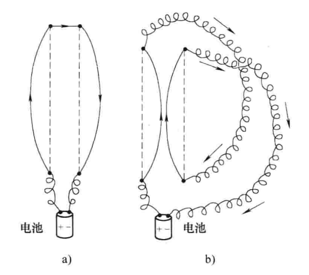

# 磁学基础

## 磁效应引入

还记得在第八章《静电学》提到的电动力学基本问题吗？它的内容是：

> 给定一些点电荷 $q_1$，$q_2$，$q_3$，……（称它们为 **场源电荷**），它们施加给另外一个电荷 $Q$（称为 **试探电荷**）的力是什么？场源电荷的位置（作为时间的函数）给定，而试探电荷的轨迹待求．

在静电学中，我们手动加入了规约条件：所有的场源电荷都静止．本章就要开始解决场源电荷运动时的情形了．

我们知道，电荷可以激发电场，从而对另一在电场中的电荷有力的作用，这一力称作 **电场力**，与场源电荷电场力的大小由 **库仑定律** 给出．静止的电荷只能激发电场，但运动的电荷除了能激发电场外，还可以激发 **磁场**．所有的磁现象都归因于 **电荷的运动**（请读者先忘记永磁体，如磁铁，指南针这些物件，我们会在最后尝试浅谈它的原理）．

刚才的所有静止与运动指的都是在 **观测者参考系** 意义下的．场源电荷的运动与否与观测者有关，因此场源电荷激发出的电场与磁场确实与观测者有关．对于同一个场源电荷，相对于它运动的参考系上，电场与磁场同时存在；相对于它静止的参考系上，则只存在电场．而且两种情况下的电场是不同的，后者激发出的电场称作 **静电场**，就是我们在第八章讨论的内容．

这个现象更好的解释应该是：场源电荷激发出的场是电磁场一整个整体，它并不改变．而电场与磁场作为两个力学效果不同的场，则是对电磁场这个整体「盲人摸象」的产物．在参考系变换的情况下，「摸象」的角度不同，从而电场与磁场之间可以互相变换．关于参考系的更多问题我们会在后面给出，现在先钦定参考系为 **实验室系 / 地面系**．

来看一则实验：

两根导线挂在天花板上，相距几厘米．通上电流后，左图中两根导线中电流方向相反（称之为 **反平行电流**）、右图中两根导线中电流方向相同（称之为 **平行电流**）．可以看到有现象：

- **反平行电流** 互相 **排斥**．
- **平行电流** 互相 **吸引**．

怎么解释这个排斥力与吸引力？

首先，导线整体呈电中性，因此这个力不可能是静电力，而且放一个静止的试探电荷这些导线附近，也没有力对它有作用．这个排斥力与吸引力正是我们首次遇到的 **磁力**．该磁力的成因正是导线内电子的移动．

这个实验阐述了一个事实：**通电导线周围存在磁场**．下面我们来探讨一下磁场．

磁场是比电场更容易探测的，我们只需要一个小磁针（指南针）．小磁针是如何工作的与我们的话题无关（在高中物理也不能得到良好的解释），我们只需知道：小磁针在磁场中静止后，$\mathrm N$ 极所指方向规定为该点磁场的方向．通常情况下，小磁针的 $\mathrm N$ 指向地球的地磁北极，是对地球磁场的反映．但在实验室中，典型的磁场可能比地磁场强几百倍，指南针确定的是这个磁场的方向．
