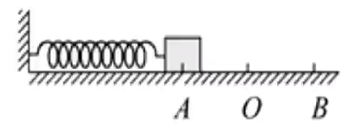
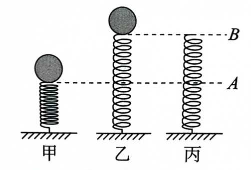

# 简谐运动

## 弹簧振子中的运动学变量

### 水平弹簧振子

观察下面这个模型：

设弹簧处于原长时，端点处于 $O$ 点．用外力将物体移动到 $A$ 点后撤去外力，设地面绝对光滑，则物体会在 $AB$ 两点间永不停歇地往返移动．

这个运动模型称作 **弹簧振子**，弹簧上挂载的物体称作 **振子**；物体所受合外力为 $0$ 的位置称作 **平衡位置**；物体所受弹力为 $0$ 的点为 **弹簧原长点**．在水平弹簧振子模型中，物体所受的合外力就是弹力，因此平衡位置与弹簧原长点为同一位置 $O$．

一个约定俗成：以 **平衡位置** 为原点，向右为 $x$ 轴正方向建立一维坐标系，则物体处于 $P$ 点时，称 $\overrightarrow{OP}$ 为物体此时的 **位移**，是一个矢量．

**位移**、**速度** 与 **加速度** 均采用矢量的「有符号表达」，即用一个有符号标量同时代表对应矢量的方向和大小．

值得指出的是，**比较位移、速度、加速度大小时比的是绝对值**．如 $\pu{-3m}$ 应视作比 $\pu{-5m}$ 小，比 $\pu{2m}$ 大．

接下来请读者尝试填下面这个表（非常建议读者尝试自己填写一下这 24 个空，然后再和下面的答案对，不要直接看答案）：

|           | $\boldsymbol x$ 变大 / 变小？ | $\boldsymbol a$ 变大 / 变小？ | $\boldsymbol v$ 变大 / 变小？ | $\boldsymbol x$ 正负？ | $\boldsymbol a$ 正负？ | $\boldsymbol v$ 正负？ |
| :-------: | :---------------------------: | :---------------------------: | :---------------------------: | :--------------------: | :--------------------: | :--------------------: |
| $A \to O$ |                               |                               |                               |                        |                        |                        |
| $O \to B$ |                               |                               |                               |                        |                        |                        |
| $B \to O$ |                               |                               |                               |                        |                        |                        |
| $O \to A$ |                               |                               |                               |                        |                        |                        |

下面是答案．

|           | $\boldsymbol x$ 变大 / 变小？ | $\boldsymbol a$ 变大 / 变小？ | $\boldsymbol v$ 变大 / 变小？ | $\boldsymbol x$ 正负？ | $\boldsymbol a$ 正负？ | $\boldsymbol v$ 正负？ |
| :-------: | :---------------------------: | :---------------------------: | :---------------------------: | :--------------------: | :--------------------: | :--------------------: |
| $A \to O$ |            $\darr$            |            $\darr$            |            $\uarr$            |          $-$           |          $+$           |          $+$           |
| $O \to B$ |            $\uarr$            |            $\uarr$            |            $\darr$            |          $+$           |          $-$           |          $-$           |
| $B \to O$ |            $\darr$            |            $\darr$            |            $\uarr$            |          $+$           |          $-$           |          $-$           |
| $O \to A$ |            $\uarr$            |            $\uarr$            |            $\darr$            |          $-$           |          $+$           |          $+$           |

为了更直观的理解，这里给出六个物理量的实际意义：

- $x$ 的大小：**小球与平衡位置的距离**．变大等价于小球远离平衡位置，变小等价于小球接近平衡位置．
- $v$ 的大小：字面意思．
- $a$ 的大小：字面意思．小球加速度与小球所受外力大小成正比．
- $x$ 的正负：**小球相对于平衡位置的方向**．为正说明小球在平衡位置的右侧，为负说明小球在平衡位置的左侧．
- $v$ 的正负：**小球移动的方向**．为正说明小球向右移动，为负说明小球向左移动．
- $a$ 的正负：字面意思．**与小球所受合外力的方向相同**．

我们有如下性质：

- $a$ 的正负不决定 $v$ 的变大变小，$v$ 的正负并不决定 $x$ 的变大与变小．这是因为比较位移、速度、加速度大小时，比的是绝对值（如果比较的是原值的话，这些性质理应成立）．
- $x$、$a$ 成正相关，总具有 **相同** 的 **变化趋势**．
- $v$ 与上面两个变量总具有 **相反** 的 **变化趋势**．
- $x$ 与 $a$ 总是拥有 **相反** 的 **符号**．

后三条性质可以总结三句话：

- 物体所受 $F_合$ **始终指向平衡位置**（体现为 $x$ 与 $a$ 始终异号）．
- 物体 **远离** 平衡位置（$x$ 变大）时，加速度必 **变大**（$a$ 变大）、物体必 **减速**（$v$ 变小）．
- 物体 **接近** 平衡位置（$x$ 变小）时，加速度必 **变小**（$a$ 变小）、物体必 **加速**（$v$ 变大）．

### 非水平弹簧振子

考虑将上面的水平面做一定倾斜，或者直接将整个系统竖立（此时可撤去小球的支撑面），如：

将物体从平衡位置向下压至点 $B$ 后释放，不计任何阻力，则小球将永不停息地在 $AB$ 间往复移动．

我们仍然将物体所受合外力为 $0$ 的位置 $O$ 称作 **平衡位置**，物体所受弹力为 $0$ 的点 $O'$ 称作 **弹簧原长点**．与水平弹簧振子不同的是，此时物体所受的合外力包括弹力与重力两个力，于是 $O$ 与 $O'$ 不再重合，$O'$ 应该在 $O$ 的上方，因为点 $O$ 处弹簧仍然存在向上的弹力．

如果我们以 **平衡位置** $O$ 为原点（注意不是 $O'$）建立一维坐标系，定义向上为正方向，向下为负方向，同理可以定义出振子的 **位移**．

### 两个弹簧振子的共同点

这三条性质在两个弹簧振子中均成立：

- 物体所受 $F_合$ **始终指向平衡位置**（体现为 $x$ 与 $a$ 始终异号）．
- 物体 **远离** 平衡位置（$x$ 变大）时，受力必 **变大**（$F_合$ 变大）、加速度必 **变大**（$a$ 变大）、物体必 **减速**（$v$ 变小）．
- 物体 **接近** 平衡位置（$x$ 变小）时，受力必 **变小**（$F_合$ 变小）、加速度必 **变小**（$a$ 变小）、物体必 **加速**（$v$ 变大）．

也即：

- **关于方向**，$a$ 与 $x$ 一定异号（方向相反）．$v$ 与它们的正负没有必然联系．
- **关于变化趋势**，$a$，$x$ 一定是一个趋势，$v$ 一定是另一个趋势．

记住这个结论有助于做选择时更快得到答案，它们的背后原因已经在上面解释．

$a$，$v$ 的最值点：

- $A$、$B$ 处：速度 $v$ 取到最小值 $0$；加速度 $a$ 取到最大值.
- $O$ 处：速度 $v$ 取到最大值；加速度 $a$ 取到最小值 $0$．

再考虑 $F_合$，$E_{\mathrm k}$，$E_{\mathrm p总}$，$E_{\mathrm p弹}$：

- $F_合$ 的变化趋势、最值点与 $a$ 一致．
- $E_{\mathrm k}$ 的变化趋势、最值点与 $v$ 一致．
- $E_{\mathrm p总}$ 的变化趋势、最值点与 $v$ 相反（最值点相反的含义是：$v$ 的最大值点为 $E_{\mathrm p总}$ 的最小值点，$v$ 的最小值点同理）．
- 水平弹簧振子中，$E_{\mathrm p弹} = E_{\mathrm p总}$．
- 竖直弹簧振子中，$E_{\mathrm p弹}$ 与其它物理量无必然联系．
- $E_{\mathrm p弹}$ 取到最小值 $0$ 的点为 $O'$．
- $E_{\mathrm p弹}$ 取到最大值的点在 $B$．注意，竖直弹簧振子中，点 $A$ 处弹性势能取不到最大值（想一想为什么？）．

:::info[例题 1.1]

（多选）如图所示，一小球在弹簧上方 $B$ 点由静止释放，初始时 $B$ 点位置弹簧处于原长状态，小球下落的最低点记为 $A$ 点，此后小球在 $AB$ 之间做往复运动．关于小球的运动分析，下列说法错误的是：

- A. 弹簧处于原长时，小球的速度最大
- B. 小球从 $B$ 到 $A$ 的运动过程中，弹簧做功为 $0$
- C. 小球的速度增大时，加速度一定减小
- D. 小球向平衡位置移动时，弹性势能一定减小

:::

:::tip[例题 1.1 解答]

此题中，$B = O'$，而 $O$ 点没有画出，它应当在 $AB$ 的中点（至于为什么恰好是中点，学到后面会有答案）．

**在竖直弹簧振子中，对 $\boldsymbol O$ 与 $\boldsymbol{O'}$ 的区分是必要的**．

**A**. $O' = B$ 是速度最小值为 $0$ 的点，速度最大值点应为 $O$．A 错误．

**B**. 点 $A$ 与点 $B$ 的弹性势能不等．两个角度：

- $A$ 到 $B$ 弹簧从压缩状态到原长，弹性势能减小为 $0$，弹性势能一定做正功．
- $A$ 到 $B$ 是一个弹性势能转化为重力势能的过程（端点动能均为 $0$，不变）．

因此弹簧做功不可能为 $0$，B 错误．

**C**. $v$ 与 $a$ 变化趋势一定相反．C 正确．

**D**. 竖直弹簧振子中，$x$ 与 $E_{\mathrm p}$ 无必然联系．事实上，从 $O'$ 向 $O$ 的过程中，小球向平衡位置移动，弹性势能增大．D 错误．

**故选 ABD**．

如果将题目改为水平弹簧振子，则四个选项均正确．

:::

:::info[例题 1.2]

如图所示，在光滑地面上，一弹簧左端固定在墙壁上，右端连接一个物体，点 $O$ 为弹簧为原长时物体的位置．现对物体施加一外力，压缩弹簧，使物体在 $A$ 点保持平衡，现撤去外力，物体在 $AB$ 之间做往复运动．关于物体运动的分析，下列说法正确的是：

- A. 物体的位移方向总指向平衡位置
- B. 加速度方向总与位移方向相反
- C. 位移方向总与速度方向相反
- D. 速度方向总与位移方向相同

:::

:::tip[例题 1.2 解答]

**A**. 物体的位移方向应该总是背离平衡位置．A 错误．

**B**. $a$ 与 $x$ 符号相反．B 正确．

**C、D**. $v$ 的符号与其它物理量不构成必然联系．C、D 均错误．

**故选 B**．

:::
