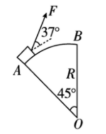
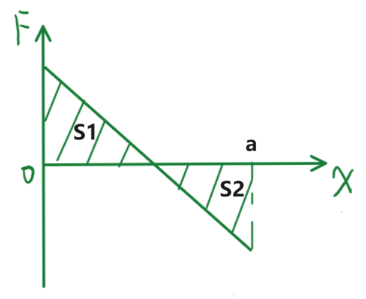
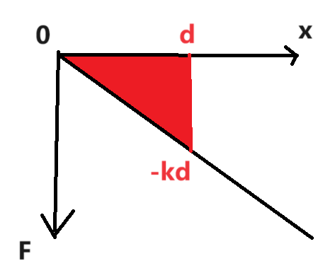
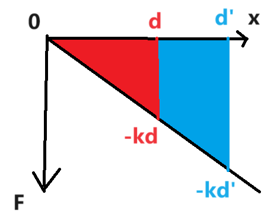
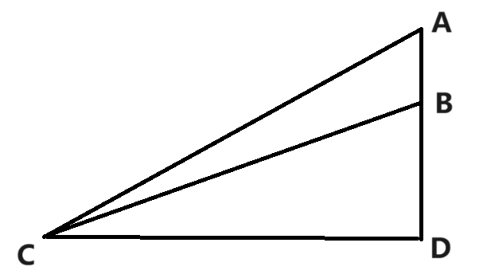
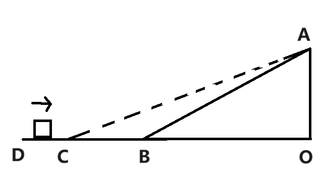
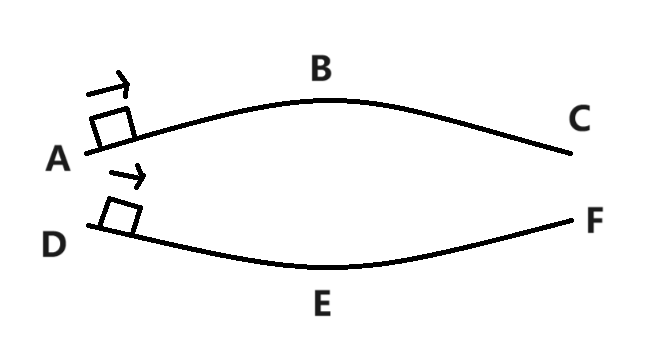
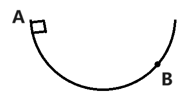

# 功

## 功基础

### 功的定义

我们作出如下定义：设一段时间内，一个恒力（**大小、方向均不变**）的 $F$ 作用在物体上，同时物体产生了位移 $x$．则我们称这个力对物体做功 $W$．其值为

$$
W = \vec F \cdot \vec x
$$

设 $\theta = \left \langle \vec F, \vec x \right \rangle$，则我们有

$$
W = Fx\cos \theta
$$

显然 $W$ 是一个可正可负的标量，单位 $\pu{N \cdot m}$，重定义为焦耳，符号 $\pu{J}$．

当 $F$ 是变力时，其做功的大小可以积分计算．我们将整个路径划分为无数个微小位移，于是经过每个微小位移时可以认为力不变．每段微小位移上的做功就是力与这段微小位移的乘积，整个过程的功就是所有微小位移的做功总和（积分）．即：

$$
W = \int_L \vec F \cdot \mathrm d \vec x
$$

$L$ 为物体的运动路径．**注意我们此时划分的对象应该是物体运动的具体路径，而不是总位移**．

关于这个积分的更多信息

这里的 $\vec F$ 相当于一个以物体位置矢量作为自变量的一元函数 $\vec F(\vec r)$，即认为在 $\vec r$ 这个位置上，力为 $\vec F(\vec r)$．然后我们对这个一元函数做第二类曲线积分．关于更多信息可以自行查阅有关资料．

如果你完全看不懂上面这段话问题也不大，只需明晰这个公式的意义就是将整个路径拆分成若干段微小位移，计算每一段的功求和．只不过当分的足够微小时求和变成了积分．

当然，高中一般不会让你算积分，求变力做功时，有一些特殊情形可使得积分简化为简单的形式，后面讲解．

总之，功刻画了力对物体的作用效果在空间上的累积．

### 功的正负

首先分析 $W$ 的正负情况．根据 $W = Fx\cos \theta$，显然有以下结论：

- $F = 0$ 时，$W = 0$．
- $x = 0$ 时，$W = 0$．
- 否则，$W$ 的符号与 $\cos \theta$ 保持一致，也即：
	- $0 \le \theta < \dfrac \pi 2$ 时，$W > 0$．
	- $\theta = \dfrac \pi 2$ 时，$W = 0$．
	- $\dfrac \pi 2 < \theta \le \pi$ 时，$W < 0$．

也就是当力与位移呈锐角时，力做正功；力与位移呈钝角时，力做负功；力与位移呈直角时，力不做功．

:::info 例题 1

现有一物体，用 $\pu{5N}$ 的力 $F$ 推动它在粗糙水平面上运动了 $\pu{2m}$，其受到 $\pu{3N}$ 的摩擦力 $f$，同时它还受到重力 $G$ 和支持力 $N$．求 $F$、$f$、$G$、$N$ 四个力分别对物体的做功大小．

:::

:::tip 例题 1 解答

- $F$ 对它做功 $\pu{5N} \cdot \pu{2m} = \pu{10J}$．这里 $\cos \theta = 1$．
- $f$ 对它做功 $-\pu{3N} \cdot {2m} = \pu{-6J}$．这里 $\cos \theta = -1$，体现为负号．
- $G$ 和 $N$ 的方向都与位移方向垂直，不做功．这里 $\cos \theta = 0$，体现为不做功．

:::

特别地：

- 当某个力 $F$ 对物体做功 $W_F$ 为负数时，有时会表述为「物体克服 $F$ 做功 $-W_F$」，比如「物体克服摩擦力做功 $\pu{100J}$」，意思是「摩擦力对物体做功 $\pu{-100J}$」．
- 比较两个功的大小时，默认比较的是两个功的绝对值大小．即我们认为 $\pu{-5J} > \pu{-3J}$，$\pu{-5J} > \pu{3J}$．

### 合力做功与分力做功的关系

这里我们以恒力做功为例，变力做功可以微分，每一段按照恒力做功研究．

考虑一个物体共受到 $k$ 个力 $F_1$，$F_2$，……，$F_k$ 的作用，产生了位移 $x$，设 $k$ 个力分别做功 $W_1$，$W_2$，……，$W_k$．现将这些力合成为一个力 $F$ 后重新考虑这个过程，设其做功为 $W$．则我们有 $W = W_1 + W_2 + \ldots + W_k$．原因是：

$$
\begin{aligned}
W &= \vec F \cdot \vec x \\
&= \left(\vec F_1 + \vec F_2 + \ldots + \vec F_k\right) \cdot \vec x \\
&= \vec F_1 \cdot \vec x + \vec F_2 \cdot \vec x + \ldots + \vec F_k \cdot \vec x \\
&= W_1 + W_2 + \ldots + W_k
\end{aligned}
$$

因此，多个力对物体做功之和等于它们的合力对物体做相同的位移时的做功．

### 力在物体运动方向上的正交分解时分力做功

力在物体运动方向上的正交分解，会形成一个与运动方向平行的分力 $F_{\parallel}$ 和与运动方向垂直的分力 $F_{\perp}$．

设原先力做功为 $W$，则分力 $F_{\parallel}$ 做功 $W$，$F_{\perp}$ 做功 $0$．因此，一个力对物体的做功就等价于这个力沿着物体运动方向上的分力做功．

### 功与参考系

因为参考系的选取会影响位移的大小，因此参考系的选取可能会影响功的大小．

比如以 $\pu{100 m/s}$ 的速度匀速运行的火车上，一个人正在以 $\pu{1N}$ 的力 $F$ 匀速推动箱子，箱子运动速度相对于火车为 $\pu{1m/s}$，相对于地面为 $\pu{101m/s}$．

那么在 $\pu{1s}$ 的时间内，火车参考系上，$F$ 做功 $\pu{1J}$；地面参考系上，$F$ 做功 $\pu{101J}$．

### 一对平衡力做功之和

**一对平衡力做功之和恒为 $\boldsymbol 0$**．因为分力做功之和等于合力做功，而平衡力的合力恒为 $0$．

这说明两个与参考系都有关的力，其做功之和可能与参考系无关．

### 一对相互作用力做功之和

考虑两个物体 $A$ 和 $B$，$A$ 受到 $F_A$，$B$ 受到 $F_B$，$F_A$ 和 $F_B$ 是一对相互作用力．那么虽然 $F_A$ 和 $F_B$ 可能是变力，但由于他们时刻相等，可以考虑微分，设两个物体经过微小的位移，此时可以认为它们为大小不变的恒力．

根据相互作用力的关系，显然有

$$
\overrightarrow{F_A} = -\overrightarrow{F_B}
$$

设 $A$ 经过微小位移 $\mathrm d \overrightarrow{x_A}$，$B$ 经过微小位移 $\mathrm d \overrightarrow{x_B}$，则两力做功之和为

$$
\overrightarrow{F_A} \cdot \mathrm d \overrightarrow{x_A} + \overrightarrow{F_B} \cdot \mathrm d \overrightarrow{x_B} = \overrightarrow{F_A} \cdot \mathrm d \left(\overrightarrow{x_A} - \overrightarrow{x_B}\right)
$$

设 $A$ 相对于 $B$ 的运动路径是 $L$，对上式进行第二类曲线积分可得

$$
W_A + W_B = \int_L \overrightarrow{F_A} \cdot \mathrm d l
$$

即一对相互作用力做功之和，只与力和 $A$ 相对 $B$ 运动的路径有关．注意到 $A$ 相对 $B$ 运动的路径是与选取的参考系无关的，因此 **一对相互作用力做功之和与参考系无关**．这又是一个非常特殊，经典且重要的一个做功与参考系无关的特例——两个与参考系都有关的力，其做功之和可能与参考系无关．

上式也相当于令 $B$ 为参考系的特殊情形，此时由于 $B$ 静止，$F_B$ 不做功，这对相互作用力的做功之和就是 $F_A$ 的做功．这提示我们计算一对相互作用力做功之和，可以考虑换系，以其中一个物体为参考系，则要计算的和简化为一个功．

:::warning 一对相互作用力做功之和不为零

一对相互作用力之和为零，但一对相互作用力做功之和不是．

根据上面的结论，我们可以很方便地构造一对相互作用力做功之和为正；为零；为负的情形．

- 两个磁铁相互吸引，手动令两个磁铁相互靠近，则以一个磁铁为参考系，另一个磁铁的磁力与运动方向同向，这对磁力做功之和为正．
- 两个磁铁相互吸引，手动令两个磁铁相互远离，则以一个磁铁为参考系，另一个磁铁的磁力与运动方向反向，这对磁力做功之和为负．
- 两个磁铁相互吸引，令两磁铁静止，相互作用力做功之和为零．

因此，$A$ 对 $B$ 做功 $W$，则 $B$ 对 $A$ 做功 $-W$ 这种说法是 **完全错误** 的．

:::

有两个结论：

- 一对静摩擦力做功之和为零．原因：以其中一个物体为参考系，另一个物体没有运动，因此做功之和为零．
- 一对动摩擦做功之和为负．原因：以其中一个物体为参考系，另一个物体的运动方向与它受到的摩擦力相反，因此做功之和为负．

另外，当我们对系统受力分析时，系统的内力一定是完整的几对相互作用力．因此，**系统内力之和为零，系统内力做功之和在不同参考系下相同，但不一定为零**．

## 常见力做功计算

最基础的（如例 1.1 的）就省略不讲了．

### 恒力做功的力向位移计算

该方法最常见于计算 **重力** 做功．

设物体在恒力 $F$ 的作用下位移了 $x$，则 $W = \vec F \cdot \vec x$．

根据点乘的定义，设 $l$ 为 $\vec x$ 在 $\vec F$ 上的投影大小（注意投影可正可负），则 $W = Fl$．我们定义 $l$ 为物体的「力向位移」．这里「力向位移」不算矢量，算一个有正有负的标量．

如果知道物体的「力向位移」，我们能直接计算出恒力做功的大小，而无需知道具体的位移情况．

:::info 例题 2.1

1. 一个质量为 $m$ 的物体从斜坡顶端滑到斜坡底端，斜坡高为 $h$，求重力做功．
2. 一个质量为 $m$ 的物体从斜坡底端提升到斜坡顶端，斜坡高为 $h$，求重力做功．

:::

:::tip 例题 2.1 解答

（1）力向位移为 $h$，重力做功 $m\mathrm gh$．

（2）力向位移为 $-h$，重力做功 $-m\mathrm gh$．

:::

注意这里的「力向位移」是笔者为方便表述起的名字，非官方表述，答题中请勿使用．事实上，大题中你只需要写出功的表达式即可（如上面第一问重力做功 $m\mathrm gh$ 可以直接写）．

### 支持力

后面研究的都是各种变力做功的计算，实质是

$$
W = \int_L \vec F \cdot \mathrm d \vec x
$$

这个积分在各种特殊情况下的简化．

通常情况来讲，**支持力与物体运动方向始终垂直**．因此积分的结果是 $0$，即 **支持力通常不做功**．

:::warning 支持力可以做功

考虑一辆水平向右匀速运动的火车，火车内有一从左向右下降的斜面，斜面上有一滑块，滑块沿斜面下落，斜面静止不动．

整个过程中，滑块受到斜面的支持力是否对斜块做功？

- 以车厢为参考系，则不做功．
- 如果以地面为参考系，支持力是做功的．此时支持力和物体相对于地面的位移并不垂直．

:::

### 力与运动方向夹角恒定且大小恒定

该方法最常见于计算 **滑动摩擦** 做功．

对于变力做功公式

$$
W = \int_L \vec F \cdot \mathrm d \vec x
$$

如果一个力 $F$ 始终与运动方向夹角不变，设为 $\theta$，相当于 $\cos \theta$ 能作为常量从积分中提出．

$$
W = \cos \theta \int_L F \cdot \mathrm d l
$$

如果力的大小也恒定，说明 $F$ 也能作为常量提出：

$$
W = F \cos \theta \int_L \mathrm d l = F \cos \theta L
$$

也就是说，当力 $F$ 的大小恒定，方向与运动方向夹角为定值 $\theta$ 时，设物体运动了路径长度 $L$（注意不是位移大小），则该力做功 $W = F \cos \theta L$．相当于把整个路径拆成若干段位移分析．

一个非常常见的例子是滑动摩擦力．下面是一个例子：

:::info 例题 2.2

一个物体在粗糙水平面上受到滑动摩擦力为 $f = \pu{1N}$．设该物体在该水平面上先向右滑动 $\pu{3m}$，再向左滑动 $\pu{2m}$，求 $f$ 对物体的做功．

:::

:::tip 例题 2.2 解答

物体运动的路径长度为 $L = \pu{2m} + \pu{3m} = \pu{5m}$，$f$ 始终与运动方向呈夹角 $\pi$．

因此 $f$ 做功 $-fL = \pu{-5J}$．

:::

:::warning

注意这里的滑动摩擦力并不是一个恒力（其方向发生了一次水平向左到水平向右的突变），因此不能用恒力做功公式，代入位移 $\pu{1m}$，然后直接采用公式 $Fx\cos\theta$ 计算．

这里应该是力大小不变，且始终与运动方向呈 $\pi$ 夹角的情形，即目前讨论的情况．因此，应该代入计算的是路径长度 $\pu{5m}$．

:::

:::info 例题 2.3

如图所示，一质量 $m = \pu{2 kg}$ 的物体从半径为 $R = \pu{5 m}$ 的圆弧轨道 $A$ 端，在拉力 $F$ 作用下沿圆弧缓慢运动到 $B$ 端（圆弧 $AB$ 在竖直平面内）．$F$ 大小不变，始终为 $\pu{15N}$，方向始终与物体所在点的切线呈 $37^\circ$ 角；圆弧所对圆心角为 $45 ^\circ$，$BO$ 边为竖直方向，求这一过程中 $F$ 做的功．（$\mathrm g = \pu{10 m * s-2}$，$\cos 37 ^\circ = 0.8$）

:::

:::tip 例题 2.3 解答

做功 $W = FL \cos 37^\circ = F\left( \dfrac \pi 4 R\right) \cos 37^\circ = \pu{47.1 J}$．

:::

### 力——位移图像

还有一种变力做功问题：给定 $F \text{-} x$ 图像，求做功．

首先我们要明晰 $F \text{-} x$ 图像的意义：$F$ 是什么，$x$ 是什么？

这类问题中物体的运动限制在一维，物体的坐标就是 $x$．为了方便，不妨称物体位置坐标轴的正向为右侧，反向为左侧．

同时还有一个变力 $F$，其只能有左右两种方向（即必须与物体可运动的方向共线）．我们定义：当 $F$ 的方向向右时，$F = \left|\vec F\right|$，$F$ 的方向向左时，$F = -\left|\vec F\right|$（即类似速度里的 $v \text{-} t$ 图，采用向量的「正负记法」，而非「模长记法」）．

然后，题目会规定这个变力 $F$ 的值（现在这个值可以通过绝对值表 $F$ 的大小，也可以通过正负表 $F$ 的方向了）是一个只与物体坐标 $x$ 有关的量，也即 $F$ 是 $x$ 的函数．题目会将这个函数关系用 $F \text{-} x$ 图像给出．这就是 $F \text{-} x$ 图像的含义了．

明晰了这类问题通常给出的条件——$F \text{-} x$ 图像的意义，我们就要研究问题是什么了．其实很简单：根据这个图像计算当物体从位置 $x_1$ 向右移动到 $x_2$ 时，$F$ 做的总功是多少．比如，下图中从 $x_1 = 0$ 到 $x_2 = a$ 的 $F$ 的做功．

根据变力做功公式

$$
W = \int_L \vec F \cdot \mathrm d \vec x
$$

因为 $F$ 无论与 $x$ 同向异向，$F$ 相比于 $\left|\vec F\right|$ 本身多出的那个符号就恰好表达了 $\cos \theta$，所以可以将 $\cos \theta$ 撇掉．于是在这里可以简化为

$$
W = \int_0^a F \mathrm d x
$$

这其实就是一个定积分，结果就是 $x = 0$ 和 $x = a$ 所夹着的，这个函数图像与 $x$ 轴所夹的有向面积总大小．所谓有向面积，就是 $x$ 轴上面的部分按正面积计算，$x$ 轴下面的部分按负面积计算．

也即

$$
W = \int_0^a F \mathrm d x = S_1 - S_2
$$

通常来讲会将 $F(x)$ 函数设计成折线，即若干个一次分段函数的拼接，因为这样面积就可以转化为一些三角形和一些长方形的面积计算问题了．

:::info 例题 2.4

用铁锤将一铁钉击入木块，设木块对铁钉的阻力与铁钉进入木块的深度成正比，即 $f = kx$，其中 $x$ 为铁钉进入木块的深度．设铁锤击打第一次后，铁钉进入木块的深度为 $d$．求：

1. 铁锤对铁钉做功的大小．
2. 若铁锤对铁钉每次做功都相等，求击打第二次时，铁钉与第一次打击后相比又深入了多少．

注：对于尚未学习动能定理的读者，这里用到了动能定理的一个结论：一个物体原先静止，经过一些力做功后仍静止，则这些力的做功总和为 $0$．即，钉子初始静止，铁锤击打第一次后直到钉子静止为止，铁锤对其做功与阻力对其做功恰为相反数．第二次同理．

:::

:::tip 例题 2.4 解答

相当于 $f\text{-}x$ 图像问题．绘出图像．

（1）钉子从位置 $0$ 到位置 $d$ 的过程中，$f$ 做功应该为有向面积，即为图中红色面积的相反数．计算可知 $W_f = -\dfrac{kd^2}{2}$．则铁锤对铁钉做功大小应为 $W = -W_f = \dfrac{kd^2}{2}$．

（2）

钉子从位置 $d$ 开始接着被做 $W$ 的功，则其 $W_f$ 应该接着做 $-\dfrac{kd^2}{2}$ 的功．

令第二次铁钉的深度为 $d'$，绘图：

可知红色面积与蓝色面积相等．

根据三角形相似，有

$$
\dfrac{d^2}{{d'}^2} = \dfrac{S_红}{S_红 + S_蓝} = \dfrac 1 2
$$

可知 $d' = \sqrt 2 d$．

因此铁钉可以继续进入的深度应为 $d' - d = (\sqrt 2 - 1)d$．

:::

### 斜面上的滑动摩擦等效

设一斜面粗糙程度为 $\mu$，倾斜角为 $\theta$，斜长为 $L$．现一质量为 $m$ 的物体从顶端由静止下滑，且 $\mu < \tan \theta$，于是物体受到滑动摩擦力 $f$ 做的功大小为

$$
W = -\mu m \mathrm g \cos \theta L
$$

设斜面的水平宽为 $x$，不难发现 $L\cos \theta = x$．于是上式可以改写为

$$
W = -\mu m \mathrm g x
$$

即「物体在粗糙斜面上做一次完整运动时，滑动摩擦力的做功」可以转化为「该物体在粗糙程度相同的，长度等于斜面水平宽的水平面上运动时，滑动摩擦力的做功」．

注意这里必须保证 $f = \mu m\mathrm g \cos \theta$，使用这个结论时请确定：

- 物体受到的摩擦力为滑动摩擦力．
- 物体受到斜面的支持力 $N = m\mathrm g \cos \theta$，即除了重力外其余任何外力在垂直斜面方向上的分力的合力应该为 $0$．

:::info 例题 2.5

如图所示，质量相同的物体分别自斜面 $AC$ 和 $BC$ 的顶端由静止开始下滑，物体与两斜面间的动摩擦因数相同，物体滑至斜面底部 $C$ 点时，滑行过程中克服摩擦力所做的功分别为 $W_A$ 和 $W_B$，试判断 $W_A$ 和 $W_B$ 的大小关系．

:::

:::tip 例题 2.5 解答

物体两次下滑时，质量相同，斜面动摩擦因数相同，因此所受动摩擦均为 $\mu m \mathrm g \cos \theta$，也即 $\mu m \mathrm g |CD|$，因此两次克服摩擦力做功相同，$W_A = W_B$．

:::

:::info 例题 2.6

如图所示，$DO$ 是水平面，$AB$ 是斜面，物体从 $D$ 点带一定初速度地出发，沿 $DBA$ 滑动到顶点 $A$ 时，摩擦力做功 $W_1$；将斜面改为 $AC$，让物体从 $D$ 点出发沿 $DCA$ 滑动到 $A$ 点，摩擦力做功 $W_2$．若物体与接触面之间的动摩擦因数处处相同且不为零，比较 $W_1$ 和 $W_2$．

:::

:::tip 例题 2.6

根据斜面等效为水平面的思想，不难看出两次的摩擦做功都等于 $\mu m \mathrm g |OD|$，即 $W_1 = W_2$．

:::

### 圆周运动上的滑动摩擦

这类问题通常是让质量相同的物体，在粗糙程度相同，长度相同，半径相同的曲面上滑行两次，只受重力，摩擦力作用，比较滑动摩擦做功的大小．

首先根据滑动摩擦做功公式和滑动摩擦力的公式，我们有

$$
W = -\int_L f \cdot \mathrm d L = -\mu\int_L N \cdot \mathrm d L
$$

由于滑动摩擦力与运动方向夹角为常量 $\pi$，摩擦因数为常量 $\mu$，两次摩擦力做功都可以将这两个常量提出积分．

又因为 $L$ 相同，那么两次做功的大小关系，只与「两次物体运动了相同的路径长度时，两个物体所受的支持力大小关系」有关．根据圆周运动的知识，我们有

$$
\begin{cases}
N - G_{\perp} = m\dfrac{v^2}R \implies N > G_\perp & 向心力方向为支持力方向（物体在下凹桥上运动） \\[2.5ex]
G_{\perp} - N = m\dfrac{v^2}R \implies N < G_\perp & 向心力方向为支持力反向（物体在上凸桥上运动）
\end{cases}
$$

这里 $G_\perp$ 为物体所受重力在运动方向的垂直方向的分力．

因此，两次 $N$ 的大小关系重点是看向心力的方向和 $v$（$G_\perp$ 一般会设计为两次物体运动相同路径长度时相同）．

来看两道分别考察这两点的例题．

:::info 例题 2.7

如图所示，上凸桥 $ABC$ 和下凹桥 $DEF$ 轨道半径，粗糙程度，长度均相同．一小物体前后两次经两桥面到 $C$ 和 $F$，问两次摩擦力做功大小关系．

:::

:::tip 例题 2.7 解答

两物体经过相同长度路径时，物体运动方向上下对称，于是重力在垂直运动方向上的分力方向左右对称，再加上重力相等，可以导出两个分力相同．

而经过上凸桥时，每时每刻都有 $N_上 < G_\perp$；经过下凹桥时，每时每刻都有 $N_下 > G_\perp$．因此每时每刻都有 $N_下 > N_上$，于是经过下拱桥时摩擦力做功更多．

:::

:::info 例题 2.8

如图所示，一物体以 $\pu{3m/s}$ 的初速度从曲面 $A$ 点下滑到第一次运动到 $B$ 点，摩擦力做功为 $W_1$；该物体再次以 $\pu{2m/s}$ 的初速度由 $A$ 点下滑到第一次运动到 $B$ 点，摩擦力做功为 $W_2$，试比较 $W_1$ 和 $W_2$．

:::

:::tip 例题 2.8 解答

根据 $N - G_{\perp} = m\dfrac{v^2}R$，两物体经过相同长度路径时，$G_\perp$，$m$，$R$ 均相同，而第一次的 $v$ 总是比第二次多，根据 $N = G_\perp + m \dfrac{v^2}R$，第一次的支持力总是比第二次多，所以第一次的滑动摩擦总是比第二次大，因此，$W_1 > W_2$．

:::

### 链条和流体做功

待更新……
